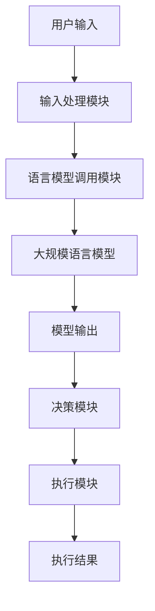

                 


# 大规模语言模型在AI Agent中的微调技巧

> 关键词：大规模语言模型，AI Agent，微调技巧，深度学习，自然语言处理，强化学习

> 摘要：本文将详细探讨大规模语言模型在AI Agent中的微调技巧，从理论到实践，系统地分析如何优化和调整大规模语言模型以提升AI Agent的性能和智能水平。文章将涵盖背景介绍、核心概念、算法原理、系统架构、项目实战、最佳实践等多方面内容，帮助读者全面理解和掌握大规模语言模型在AI Agent中的应用技巧。

---

## 第一部分：大规模语言模型与AI Agent背景介绍

### 第1章：大规模语言模型与AI Agent概述

#### 1.1 大规模语言模型的定义与特点

大规模语言模型（Large Language Models, LLMs）是基于深度学习技术构建的自然语言处理模型，具有以下特点：
- **大规模**：通常包含数亿甚至更多的参数，能够捕捉复杂的语言模式。
- **通用性**：可以在多种任务和领域上进行适应和微调。
- **上下文理解**：能够理解上下文关系，生成连贯且合理的文本。

#### 1.2 AI Agent的定义与应用场景

AI Agent（人工智能代理）是一种智能体，能够感知环境、执行任务并做出决策。其应用场景包括：
- **智能助手**：如虚拟助手、客服机器人。
- **自动化系统**：如工业自动化、智能家居。
- **游戏AI**：如自动驾驶、智能游戏代理。

#### 1.3 大规模语言模型在AI Agent中的作用

大规模语言模型为AI Agent提供了强大的自然语言理解和生成能力，使其能够：
- 更好地理解用户需求。
- 生成更自然的对话回应。
- 提供更精准的任务执行建议。

---

### 第2章：大规模语言模型与AI Agent的核心概念

#### 2.1 大规模语言模型的原理

大规模语言模型通过预训练技术（如Transformer架构）学习海量文本数据，形成对语言的深度理解。其核心原理包括：
- **自注意力机制**：通过注意力机制捕捉文本中的长距离依赖关系。
- **参数优化**：通过反向传播算法优化模型参数，最小化预测误差。

#### 2.2 AI Agent的工作原理

AI Agent通过感知环境、分析任务、执行操作并反馈结果来完成目标。其工作流程如下：
1. **感知环境**：通过传感器或接口获取环境信息。
2. **分析任务**：利用自然语言处理能力理解任务需求。
3. **决策与执行**：基于分析结果制定行动计划并执行。
4. **反馈与优化**：根据执行结果调整策略，提升性能。

#### 2.3 大规模语言模型与AI Agent的关系

大规模语言模型作为AI Agent的核心模块，负责语言理解和生成，而AI Agent则为大规模语言模型提供任务目标和应用场景。两者结合，能够实现更智能、更高效的交互与决策。

---

## 第二部分：大规模语言模型与AI Agent的核心概念与联系

### 第3章：大规模语言模型与AI Agent的关系

#### 3.1 大规模语言模型作为AI Agent的核心模块

大规模语言模型为AI Agent提供了强大的语言理解和生成能力，使其能够：
- 理解用户的输入指令。
- 生成符合语境的回应。
- 分析和处理复杂语言任务。

#### 3.2 大规模语言模型如何提升AI Agent的智能水平

通过微调和优化大规模语言模型，AI Agent可以：
- 更准确地理解用户需求。
- 提供更个性化的服务。
- 快速适应不同场景和任务。

#### 3.3 大规模语言模型在AI Agent中的优势

- **通用性**：适用于多种任务和场景。
- **高效性**：能够快速理解和生成语言。
- **可扩展性**：支持大规模数据和复杂任务。

---

### 第4章：大规模语言模型与AI Agent的核心概念

#### 4.1 大规模语言模型的数学模型

大规模语言模型通常基于Transformer架构，其核心数学模型包括：
- **自注意力机制**：
  $$\text{Attention}(Q, K, V) = \text{softmax}\left(\frac{QK^T}{\sqrt{d_k}}\right)V$$
- **前馈网络**：通过多层感知机（MLP）进行非线性变换。

#### 4.2 AI Agent的系统架构

AI Agent的系统架构通常包括：
- **感知模块**：负责获取环境信息。
- **决策模块**：负责分析任务并制定行动计划。
- **执行模块**：负责执行操作并反馈结果。

---

### 第5章：大规模语言模型与AI Agent的关系

#### 5.1 大规模语言模型在AI Agent中的应用

- **智能对话**：通过大规模语言模型生成自然语言对话。
- **任务执行**：利用语言理解能力完成特定任务。
- **知识推理**：基于上下文进行逻辑推理和知识问答。

#### 5.2 大规模语言模型对AI Agent的提升

- **语言理解能力**：通过预训练和微调，提升模型对复杂语言模式的理解能力。
- **任务适应能力**：通过领域微调，使模型更好地适应特定任务需求。

---

## 第三部分：大规模语言模型在AI Agent中的算法原理

### 第6章：大规模语言模型的微调方法

#### 6.1 全参数微调

全参数微调（Fine-tuning）是将大规模语言模型的所有参数进行重新训练，以适应特定任务。其流程如下：
1. **数据预处理**：对数据进行清洗、标注和格式化。
2. **模型训练**：使用特定任务数据微调模型参数。
3. **评估与优化**：通过验证集评估模型性能，调整超参数。

#### 6.2 参数高效微调

参数高效微调（Parameter-Efficient Fine-tuning）是一种更高效的微调方法，仅对部分参数进行调整。常用技术包括：
- **Adapter**：在模型中插入适配器模块，仅调整适配器参数。
- **Prompt**：通过设计特定提示（prompt）引导模型生成所需输出。

---

## 第四部分：大规模语言模型在AI Agent中的系统架构

### 第7章：系统架构设计

#### 7.1 系统功能设计

AI Agent的系统功能模块包括：
- **输入处理模块**：接收用户输入并解析需求。
- **语言模型调用模块**：调用大规模语言模型进行理解和生成。
- **决策模块**：基于模型输出制定行动计划。
- **执行模块**：根据决策执行操作并反馈结果。

#### 7.2 系统架构图



---

## 第五部分：大规模语言模型在AI Agent中的项目实战

### 第8章：项目实战

#### 8.1 环境安装

安装必要的依赖库：
```bash
pip install transformers torch
```

#### 8.2 核心代码实现

```python
from transformers import AutoTokenizer, AutoModelForCausalLM
import torch

# 加载预训练模型
model_name = "gpt2-large"
tokenizer = AutoTokenizer.from_pretrained(model_name)
model = AutoModelForCausalLM.from_pretrained(model_name)

# 微调模型
def train_model(train_dataset, model, tokenizer):
    model.train()
    optimizer = torch.optim.Adam(model.parameters(), lr=1e-5)
    for epoch in range(num_epochs):
        for batch in train_loader:
            inputs = tokenizer(batch['text'], return_tensors='pt')
            outputs = model(**inputs)
            loss = outputs.loss
            loss.backward()
            optimizer.step()
            model.zero_grad()
```

#### 8.3 案例分析

通过实际案例分析，展示如何利用大规模语言模型优化AI Agent的性能。例如，在智能客服场景中，通过微调模型提高意图识别准确率。

---

## 第六部分：大规模语言模型在AI Agent中的最佳实践

### 第9章：最佳实践

#### 9.1 数据预处理技巧

- **数据清洗**：去除噪声数据，确保数据质量。
- **数据增强**：通过数据增强技术扩展数据集。
- **领域适应**：根据任务需求进行领域特定的预处理。

#### 9.2 模型调优技巧

- **学习率调整**：使用学习率衰减策略。
- **批量大小调整**：根据硬件资源调整批量大小。
- **模型剪枝**：通过剪枝技术减少模型参数，提升效率。

---

## 第七部分：总结与展望

### 第10章：总结与展望

#### 10.1 总结

本文系统地探讨了大规模语言模型在AI Agent中的微调技巧，从理论到实践，全面分析了如何优化和调整大规模语言模型以提升AI Agent的性能和智能水平。

#### 10.2 展望

未来，随着AI技术的不断发展，大规模语言模型在AI Agent中的应用将更加广泛和深入。研究者们将致力于开发更高效、更智能的语言模型，以应对更复杂的任务和场景。

---

## 作者信息

作者：AI天才研究院/AI Genius Institute & 禅与计算机程序设计艺术 /Zen And The Art of Computer Programming

---

以上是文章的完整内容，希望对您有所帮助！

