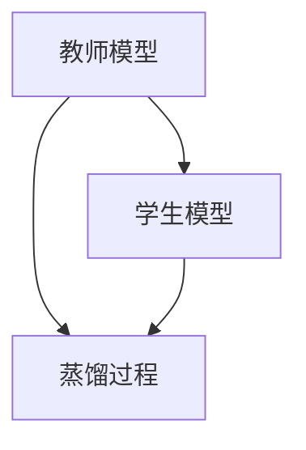
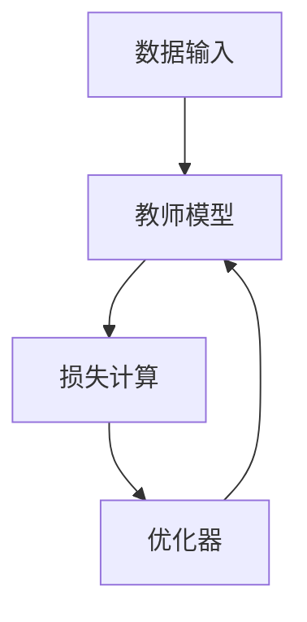
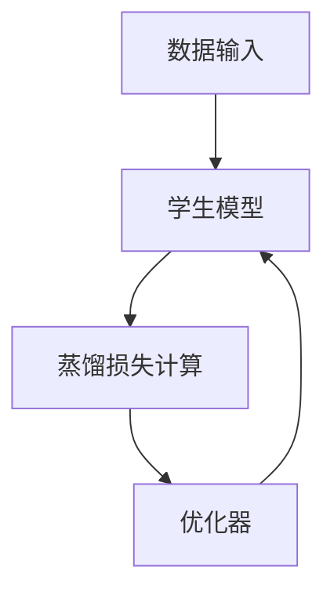
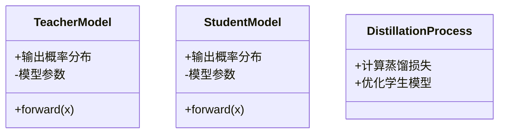
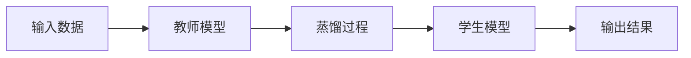
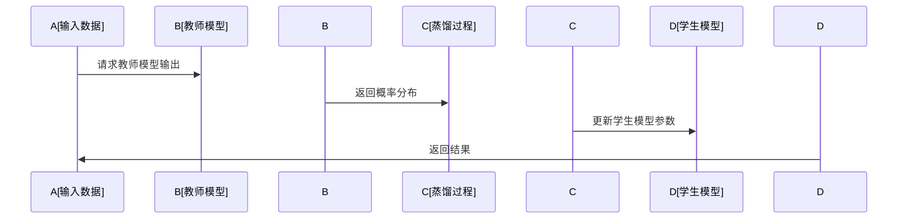

                 


# 大规模语言模型在AI Agent中的蒸馏技术

## 关键词：大规模语言模型，AI Agent，蒸馏技术，知识迁移，模型压缩

## 摘要：  
随着AI Agent技术的快速发展，大规模语言模型的应用场景越来越广泛。然而，这些模型通常需要大量的计算资源和存储空间，限制了它们在资源受限环境中的应用。蒸馏技术作为一种有效的知识迁移方法，能够在保持模型性能的同时，显著减少模型的大小和计算成本。本文将从背景、原理、算法实现、系统设计到项目实战，全面探讨大规模语言模型在AI Agent中的蒸馏技术，帮助读者深入理解其核心思想和应用场景。

---

## 第1章 背景介绍

### 1.1 问题背景与描述
#### 1.1.1 大规模语言模型的发展现状
- 当前，大规模语言模型（如GPT、BERT等）在自然语言处理领域取得了显著进展。
- 但这些模型通常参数量巨大，导致计算资源消耗高，难以在边缘设备和移动端等资源受限的环境中部署。

#### 1.1.2 AI Agent的应用需求与挑战
- AI Agent需要实时响应、快速决策，对计算资源的需求较高。
- 但在资源受限的场景下，如何高效运行大规模语言模型成为关键挑战。

#### 1.1.3 蒸馏技术的提出与意义
- 蒸馏技术通过将大模型的知识迁移到小模型，解决了大模型部署的资源问题。
- 蒸馏技术的核心思想是通过教师模型（大模型）指导学生模型（小模型）学习，实现知识的有效传递。

### 1.2 蒸馏技术的核心概念
#### 1.2.1 知识蒸馏的定义
- 知识蒸馏：将教师模型的决策过程（如概率分布）迁移到学生模型，使学生模型能够模仿教师模型的行为。

#### 1.2.2 蒸馏技术的目标与作用
- 目标：减少模型的参数量和计算成本，同时保持或接近原始模型的性能。
- 作用：提高模型的部署效率，降低计算资源需求。

#### 1.2.3 蒸馏技术的边界与外延
- 边界：仅关注知识的传递，不涉及模型结构的改变。
- 外延：结合模型剪枝、量化等技术，进一步优化模型的轻量化。

### 1.3 蒸馏技术的核心要素
#### 1.3.1 教师模型与学生模型的定义
- 教师模型：已训练好的大模型，作为知识的来源。
- 学生模型：需要学习的小模型，通过蒸馏技术获取教师模型的知识。

#### 1.3.2 蒸馏过程中的关键因素
- 温度参数：调整概率分布的软化程度，影响蒸馏的效果。
- 损失函数：衡量学生模型输出与教师模型输出的差异。

#### 1.3.3 蒸馏技术的实现步骤
1. 训练教师模型。
2. 设定学生模型的结构。
3. 使用蒸馏损失函数优化学生模型。

### 1.4 蒸馏技术与其他模型压缩技术的对比
#### 1.4.1 知识蒸馏与模型剪枝的对比
- 知识蒸馏：关注概率分布的传递，保持模型的决策能力。
- 模型剪枝：通过删除冗余的参数或层来减少模型大小。

#### 1.4.2 知识蒸馏与模型量化的关系
- 模型量化：降低模型参数的精度，减少存储空间。
- 知识蒸馏：保持模型性能的同时，减少模型的计算需求。

#### 1.4.3 蒸馏技术的优缺点分析
- 优点：保持模型性能，减少计算成本。
- 缺点：需要教师模型的支持，可能在某些场景下性能略逊于原模型。

### 1.5 本章小结
- 介绍了蒸馏技术的背景和意义。
- 概述了蒸馏技术的核心概念和实现步骤。

---

## 第2章 蒸馏技术的核心概念与联系

### 2.1 蒸馏技术的原理
#### 2.1.1 知识蒸馏的基本原理
- 教师模型输出概率分布，学生模型通过优化损失函数，使得输出概率分布接近教师模型。

#### 2.1.2 蒸馏过程中的信息传递机制
- 通过损失函数将教师模型的知识传递给学生模型。

#### 2.1.3 蒸馏技术的核心算法框架
- 损失函数：$L_{\text{distill}} = -\sum_{i=1}^n P_i \log Q_i$，其中$P_i$是教师模型的输出概率，$Q_i$是学生模型的输出概率。

### 2.2 核心概念对比表
| 技术 | 定义 | 优缺点 | 应用场景 |
|------|------|--------|----------|
| 知识蒸馏 | 将教师模型的概率分布迁移到学生模型 | 优点：保持性能，减少计算成本；缺点：依赖教师模型 | AI Agent的轻量化部署 |
| 模型剪枝 | 删除模型中的冗余参数或层 | 优点：减少计算量；缺点：可能影响模型性能 | 边缘设备部署 |
| 模型量化 | 降低模型参数的精度 | 优点：减少存储空间；缺点：可能影响模型精度 | 高效推理场景 |

### 2.3 ER实体关系图


### 2.4 本章小结
- 分析了蒸馏技术的核心概念和实现原理。
- 通过对比表和ER图展示了蒸馏技术与其他模型压缩技术的关系。

---

## 第3章 蒸馏技术的算法原理

### 3.1 蒸馏技术的数学模型
#### 3.1.1 教师模型的输出概率分布
$$ P(y|x) = \text{softmax}(f_T(x)) $$
其中，$f_T(x)$是教师模型的输出。

#### 3.1.2 学生模型的输出概率分布
$$ Q(y|x) = \text{softmax}(f_S(x)) $$
其中，$f_S(x)$是学生模型的输出。

#### 3.1.3 蒸馏损失函数
$$ L_{\text{distill}} = -\sum_{i=1}^n P_i \log Q_i $$

### 3.2 蒸馏过程的详细步骤
#### 3.2.1 教师模型的训练


#### 3.2.2 学生模型的训练


#### 3.2.3 蒸馏过程中的温度调整
- 温度参数$\tau$：用于软化教师模型的概率分布。
$$ P_i = \text{softmax}(\frac{f_T(x)}{\tau}) $$
- 温度越大，概率分布越软化，学生模型的学习更平滑。

### 3.3 蒸馏技术的实现代码
```python
import torch
import torch.nn as nn
import torch.optim as optim

class TeacherModel(nn.Module):
    def __init__(self):
        super().__init__()
        self.fc = nn.Linear(10, 5)

    def forward(self, x):
        return torch.softmax(self.fc(x), dim=1)

class StudentModel(nn.Module):
    def __init__(self):
        super().__init__()
        self.fc = nn.Linear(10, 5)

    def forward(self, x):
        return torch.softmax(self.fc(x), dim=1)

def distillation_loss(output_student, output_teacher, temperature):
    log_p = output_student / temperature
    p = torch.exp(log_p)
    log_q = output_teacher.log_softmax(dim=1)
    loss = -torch.mean(torch.sum(p * log_q, dim=1))
    return loss

def train_student():
    teacher = TeacherModel()
    student = StudentModel()
    optimizer = optim.Adam(student.parameters(), lr=0.001)
    temperature = 2.0
    for epoch in range(100):
        optimizer.zero_grad()
        inputs = ...  # 输入数据
        output_teacher = teacher(inputs)
        output_student = student(inputs)
        loss = distillation_loss(output_student, output_teacher, temperature)
        loss.backward()
        optimizer.step()

```

### 3.4 本章小结
- 推导了蒸馏技术的数学模型。
- 详细讲解了蒸馏技术的实现步骤，并通过代码展示了具体实现。

---

## 第4章 系统分析与架构设计

### 4.1 项目背景介绍
- 在AI Agent中，蒸馏技术用于将大规模语言模型的知识迁移到轻量级模型中，以满足边缘计算和实时响应的需求。

### 4.2 系统功能设计
#### 4.2.1 领域模型设计


#### 4.2.2 系统架构设计


#### 4.2.3 接口设计
- 教师模型接口：提供概率分布输出。
- 学生模型接口：接收输入，输出概率分布。
- 蒸馏过程接口：计算损失函数，优化学生模型。

#### 4.2.4 交互流程图


### 4.3 本章小结
- 分析了系统的功能设计和架构设计。
- 通过类图和流程图展示了系统的核心组件和交互过程。

---

## 第5章 项目实战

### 5.1 环境安装与配置
```bash
pip install torch
pip install mermaid
```

### 5.2 系统核心实现
#### 5.2.1 教师模型实现
```python
class TeacherModel(nn.Module):
    def __init__(self):
        super().__init__()
        self.fc = nn.Linear(10, 5)

    def forward(self, x):
        return torch.softmax(self.fc(x), dim=1)
```

#### 5.2.2 学生模型实现
```python
class StudentModel(nn.Module):
    def __init__(self):
        super().__init__()
        self.fc = nn.Linear(10, 5)

    def forward(self, x):
        return torch.softmax(self.fc(x), dim=1)
```

#### 5.2.3 蒸馏过程实现
```python
def distillation_loss(output_student, output_teacher, temperature):
    log_p = output_student / temperature
    p = torch.exp(log_p)
    log_q = output_teacher.log_softmax(dim=1)
    loss = -torch.mean(torch.sum(p * log_q, dim=1))
    return loss
```

### 5.3 代码应用解读与分析
- 通过具体代码展示了蒸馏技术的实现过程。
- 分析了代码的各个部分，包括模型定义、损失函数计算和优化过程。

### 5.4 实际案例分析
- 使用具体的输入数据，展示了蒸馏技术在AI Agent中的实际应用。

### 5.5 项目小结
- 总结了项目实现的关键步骤和注意事项。

---

## 第6章 总结与展望

### 6.1 内容总结
- 本文全面介绍了大规模语言模型在AI Agent中的蒸馏技术。
- 从背景、原理、算法实现到项目实战，详细讲解了蒸馏技术的核心思想和应用。

### 6.2 挑战与未来趋势
- 挑战：如何在复杂场景下保持蒸馏技术的性能和效率。
- 未来趋势：结合其他模型压缩技术，进一步优化模型的轻量化。

### 6.3 最佳实践 Tips
- 合理选择蒸馏参数，如温度和损失函数。
- 在实际应用中，结合模型剪枝和量化技术，进一步优化模型。

### 6.4 本章小结
- 总结了全文的核心内容。
- 展望了蒸馏技术的未来发展方向。

---

## 作者：AI天才研究院/AI Genius Institute & 禅与计算机程序设计艺术 /Zen And The Art of Computer Programming

---

以上是《大规模语言模型在AI Agent中的蒸馏技术》的完整目录大纲，涵盖了从基础到应用的各个方面，确保内容详实且逻辑清晰。

