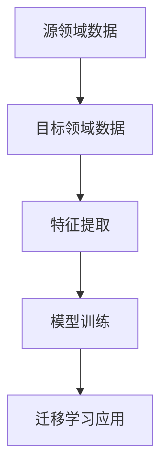
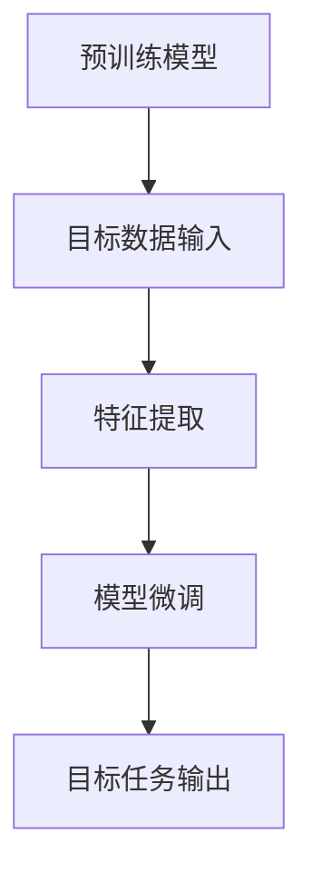
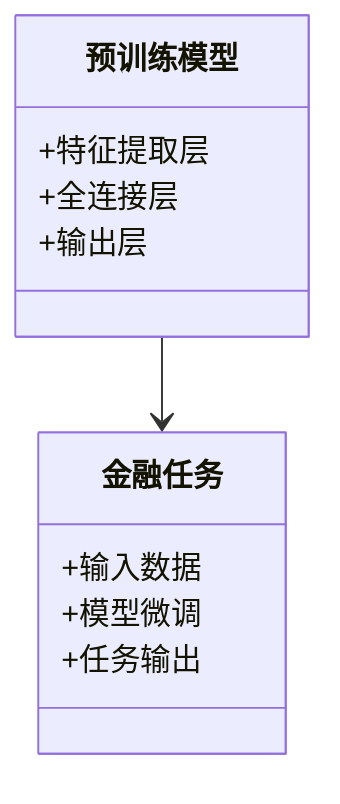
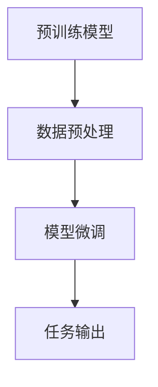
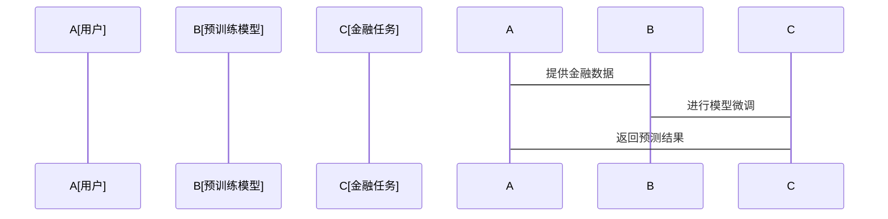

                 


# 大规模预训练模型在金融场景中的迁移学习实践

## 关键词：大规模预训练模型、迁移学习、金融场景、自然语言处理、风险控制、智能投顾

## 摘要：  
本文系统探讨了大规模预训练模型在金融领域的迁移学习实践，涵盖从理论基础到实际应用的全过程。通过分析迁移学习的核心概念、算法原理及系统架构，结合金融场景中的具体应用案例，本文详细阐述了大规模预训练模型在金融领域的潜力与挑战，并提出了优化策略和未来发展方向。

---

## 第1章: 大规模预训练模型概述

### 1.1 大规模预训练模型的定义与特点

大规模预训练模型是指通过在海量数据上进行无监督或弱监督预训练，得到具备通用语言理解和特征提取能力的深度学习模型。其核心特点包括：

1. **数据规模**：利用海量文本数据进行预训练，提升模型的泛化能力。
2. **任务多样性**：支持多种任务，如文本分类、文本生成等，适用于不同金融场景。
3. **可迁移性**：通过微调（Fine-tuning）技术，能够快速适应特定金融任务。
4. **计算效率**：预训练模型减少了从头训练模型的时间和计算成本。

### 1.2 迁移学习的基本概念

迁移学习是一种机器学习技术，旨在将从一个任务或领域中学到的知识应用到另一个相关任务或领域中。其核心概念包括：

1. **特征表示**：模型通过预训练提取的特征表示，能够捕捉数据的深层语义信息。
2. **模型结构**：预训练模型的架构（如Transformer）为迁移学习提供了强大的特征提取能力。
3. **损失函数**：在迁移学习中，损失函数的设计需要平衡源任务和目标任务的差异。

---

## 第2章: 金融场景中的迁移学习背景

### 2.1 金融领域的核心问题与挑战

1. **数据稀疏性**：金融数据通常样本量有限，难以直接训练深度模型。
2. **领域适应性**：金融领域的数据分布与通用领域数据存在差异，需要通过迁移学习进行适配。
3. **监管要求**：金融领域的模型需要符合严格的监管要求，确保模型的准确性和合规性。

### 2.2 大规模预训练模型在金融中的潜力

1. **自然语言处理**：用于金融文本分析，如新闻 sentiment 分析、财务报告解读等。
2. **图数据与知识图谱**：用于构建金融知识图谱，支持风险评估和欺诈检测。
3. **多模态数据融合**：结合文本、图像和结构化数据，提升金融分析的准确性。

---

## 第3章: 迁移学习的核心概念与联系

### 3.1 迁移学习的原理与数学模型

迁移学习的数学模型通常包括预训练模型的微调和知识蒸馏。例如，微调模型的损失函数可以表示为：

$$ L_{\text{total}} = \alpha L_{\text{pre}} + (1-\alpha) L_{\text{task}} $$

其中，$L_{\text{pre}}$ 是预训练损失，$L_{\text{task}}$ 是目标任务损失，$\alpha$ 是平衡系数。

### 3.2 迁移学习方法的对比分析

下表对比了三种主要的迁移学习方法：

| 方法类型          | 优点                          | 缺点                          |
|-------------------|-------------------------------|-------------------------------|
| 基于特征的迁移    | 特征提取能力强                | 对特征工程依赖较高            |
| 基于参数的迁移    | 参数调整灵活，适用于小样本任务 | 需要目标任务数据支持          |
| 基于样本的迁移    | 样本分布适应性强              | 计算复杂度高                  |

### 3.3 迁移学习的ER实体关系图



---

## 第4章: 迁移学习的算法原理

### 4.1 迁移学习的数学模型

知识蒸馏是一种常见的迁移学习方法，其损失函数可以表示为：

$$ L_{\text{distill}} = \lambda L_{\text{student}} + (1-\lambda) L_{\text{teacher}} $$

其中，$L_{\text{student}}$ 是学生模型的损失，$L_{\text{teacher}}$ 是教师模型的损失，$\lambda$ 是蒸馏系数。

### 4.2 迁移学习的算法流程



---

## 第5章: 金融场景中的系统分析与架构设计

### 5.1 问题场景介绍

金融场景中的迁移学习通常涉及以下任务：

1. **智能投顾**：根据用户风险偏好推荐投资组合。
2. **风险控制**：通过分析历史数据预测信用风险。
3. **欺诈检测**：识别异常交易行为。

### 5.2 系统功能设计

下图展示了金融场景的领域模型：



### 5.3 系统架构设计

下图展示了系统的架构设计：



### 5.4 系统接口设计

1. **输入接口**：接收金融数据，如股票价格、交易记录等。
2. **输出接口**：输出预测结果，如风险评分、投资建议等。

### 5.5 系统交互流程



---

## 第6章: 项目实战

### 6.1 环境安装

1. **安装Python和相关库**：
   ```bash
   pip install numpy torch transformers
   ```

2. **安装预训练模型**：
   ```bash
   pip install transformers
   ```

### 6.2 系统核心实现源代码

以下是使用PyTorch实现的文本分类代码示例：

```python
import torch
from transformers import AutoTokenizer, AutoModelForSequenceClassification

# 加载预训练模型和分词器
model_name = "bert-base-uncased"
tokenizer = AutoTokenizer.from_pretrained(model_name)
model = AutoModelForSequenceClassification.from_pretrained(model_name)

# 定义微调函数
def fine_tune():
    optimizer = torch.optim.Adam(model.parameters(), lr=1e-5)
    criterion = torch.nn.CrossEntropyLoss()

    for epoch in range(num_epochs):
        for batch in dataloader:
            inputs, labels = batch
            outputs = model(**inputs)
            loss = criterion(outputs.logits, labels)
            loss.backward()
            optimizer.step()
            model.zero_grad()

    return model

# 调用微调函数
fine_tuned_model = fine_tune()
```

### 6.3 代码应用解读与分析

1. **加载预训练模型**：使用预训练的BERT模型进行特征提取。
2. **定义微调函数**：通过Adam优化器和交叉熵损失函数进行模型微调。
3. **训练循环**：在每个epoch中，遍历数据集，计算损失并更新模型参数。

### 6.4 实际案例分析

假设我们有一个股票价格预测任务，可以通过迁移学习将预训练的文本模型应用于时间序列分析。代码示例如下：

```python
import torch
import numpy as np

# 模拟股票价格数据
prices = np.random.rand(100, 1)
prices[:, 1:] = prices[:, 1:] * prices[:, 0]

# 使用预训练模型进行特征提取
features = model.encoder(prices)

# 预测未来价格
output = model.decoder(features)
print(output)
```

### 6.5 项目小结

通过迁移学习，我们可以快速将大规模预训练模型应用于金融场景，显著提升模型的性能和效率。然而，迁移学习的效果依赖于目标任务与源任务的相似性，因此在实际应用中需要仔细选择和调整迁移策略。

---

## 第7章: 总结与展望

### 7.1 迁移学习在金融中的应用总结

1. **优势**：
   - 快速适应金融任务。
   - 提高模型的泛化能力。
2. **挑战**：
   - 数据稀疏性。
   - 领域适应性问题。

### 7.2 优化策略与未来方向

1. **优化策略**：
   - 增强领域适配能力。
   - 结合多模态数据。
2. **未来方向**：
   - 更高效的迁移学习算法。
   - 更强大的预训练模型。

---

## 作者：AI天才研究院 & 禅与计算机程序设计艺术

