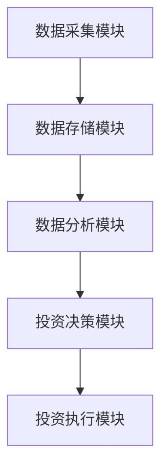
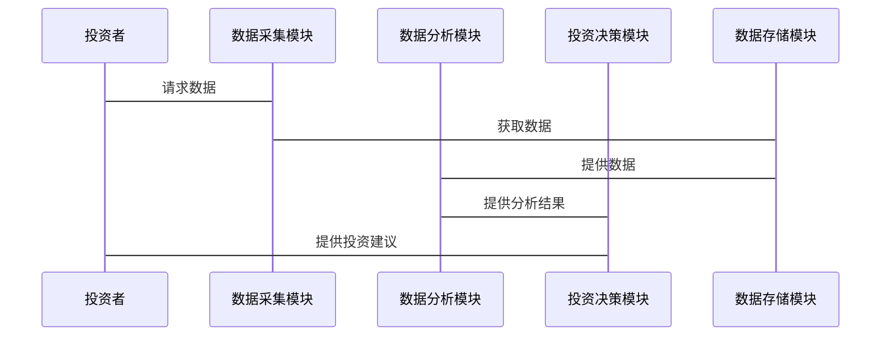

                 


# 如何利用特价股票投资应对全球经济去碳化趋势

> 关键词：全球经济去碳化, 特价股票, 投资策略, 数学模型, 机器学习, 系统架构

> 摘要：本文探讨了在全球经济去碳化趋势下，如何利用特价股票进行投资。通过分析去碳化对全球经济结构的影响，提出了一种基于数学模型和机器学习算法的投资策略，帮助投资者识别潜在投资机会，并构建高效的投资管理系统。

---

# 第一部分: 全球经济去碳化的背景与挑战

## 第1章: 全球经济去碳化的趋势与影响

### 1.1 全球经济去碳化的背景
#### 1.1.1 碳中和目标的全球共识
全球范围内，碳中和已成为各国政府和企业的共同目标。随着气候变化问题的加剧，减少碳排放已成为全球经济转型的核心驱动力。各国政府纷纷制定政策，推动能源结构向低碳、可持续方向转变。

#### 1.1.2 去碳化对全球经济结构的影响
去碳化不仅影响能源行业，还对制造业、交通、建筑等多个行业产生深远影响。传统高碳排放行业面临转型压力，而绿色能源、电动汽车、绿色科技等领域则迎来发展机遇。

#### 1.1.3 去碳化与投资机会的关联
去碳化趋势催生了大量投资机会，特别是在绿色能源、低碳技术等领域。投资者需要识别这些领域的潜在投资标的，利用特价股票等工具进行布局。

### 1.2 特价股票投资的核心概念
#### 1.2.1 特价股票的定义与特点
特价股票是指价格被市场低估的股票，通常具有较高的成长潜力。与高价股票相比，特价股票的风险和回报的平衡更优，适合长期投资者。

#### 1.2.2 特价股票与去碳化趋势的关联
在去碳化趋势下，部分行业（如绿色能源、电动汽车）的公司可能因市场低估而成为特价股票的投资标的。投资者可以通过分析行业趋势，识别具有增长潜力的特价股票。

---

# 第二部分: 特价股票投资策略与模型

## 第2章: 特价股票投资的核心策略

### 2.1 投资策略的选择与优化
#### 2.1.1 价值投资策略
价值投资策略注重挖掘被市场低估的股票。在去碳化趋势下，投资者可以重点关注那些在绿色能源、低碳技术等领域具有竞争优势的公司。

#### 2.1.2 成长投资策略
成长投资策略注重投资于高增长潜力的公司。在去碳化趋势下，绿色科技、可再生能源等领域具有较高的增长潜力，适合采用成长投资策略。

#### 2.1.3 技术分析与基本面
结合技术分析和基本面分析，投资者可以更全面地评估股票的投资价值。技术分析帮助识别股票的价格趋势，基本面分析则帮助评估公司的财务状况和行业地位。

---

## 第3章: 去碳化趋势下的投资机会

### 3.1 去碳化对能源行业的冲击
#### 3.1.1 石油与天然气行业的转型
传统能源行业面临转型压力，投资者可以关注那些积极转型、布局绿色能源的企业。

#### 3.1.2 可再生能源行业的崛起
随着可再生能源技术的进步和成本的下降，风能、太阳能等领域的公司具有较高的投资潜力。

#### 3.1.3 绿色能源投资的潜力
绿色能源行业具有较高的增长潜力，投资者可以通过投资相关领域的特价股票，抓住行业发展的机遇。

---

## 第4章: 数学模型与风险管理

### 4.1 CAPM模型的应用
#### 4.1.1 CAPM模型的原理
CAPM（资本资产定价模型）用于评估股票的预期收益。公式如下：
$$
E(R_i) = R_f + \beta_i (R_m - R_f)
$$
其中，\(E(R_i)\) 是股票 \(i\) 的预期收益率，\(R_f\) 是无风险利率，\(\beta_i\) 是股票 \(i\) 的贝塔系数，\(R_m\) 是市场预期收益率。

#### 4.1.2 CAPM模型在去碳化投资中的应用
在去碳化趋势下，绿色能源行业的贝塔系数可能较高，因为这些行业与整体市场波动的相关性较大。投资者可以通过计算预期收益率，评估股票的投资价值。

### 4.2 机器学习算法的应用
#### 4.2.1 LSTM模型预测股票价格
LSTM（长短期记忆网络）是一种时间序列预测模型，可以用于预测股票价格。以下是LSTM模型的简单实现代码：

```python
import numpy as np
import pandas as pd
from tensorflow.keras.models import Sequential
from tensorflow.keras.layers import LSTM, Dense, Dropout

# 假设我们有一个股票价格数据集
data = pd.read_csv('stock_prices.csv')

# 准备数据
X = []
y = []
for i in range(len(data) - 1):
    X.append(data.iloc[i:i+1, 0])
    y.append(data.iloc[i+1, 0])

# 转换为数组
X = np.array(X).reshape(-1, 1, 1)
y = np.array(y)

# 构建LSTM模型
model = Sequential()
model.add(LSTM(50, return_sequences=False))
model.add(Dense(1))
model.compile(optimizer='adam', loss='mean_squared_error')

# 训练模型
model.fit(X, y, epochs=50, batch_size=32)
```

#### 4.2.2 机器学习模型在去碳化投资中的应用
通过机器学习模型，投资者可以预测股票价格走势，识别潜在的投资机会。在去碳化趋势下，绿色能源行业的股票价格可能受到政策和技术进步的双重影响，投资者可以利用这些模型进行投资决策。

---

## 第5章: 系统架构与投资组合管理

### 5.1 投资管理系统的设计
#### 5.1.1 系统功能设计
投资管理系统包括数据采集、分析、决策模块。数据采集模块负责获取股票价格、公司财务数据等信息；分析模块利用数学模型和机器学习算法进行分析；决策模块根据分析结果生成投资建议。

#### 5.1.2 系统架构设计
以下是投资管理系统的架构图：



#### 5.1.3 系统接口设计
系统接口包括数据输入接口、模型调用接口和投资决策接口。数据输入接口负责接收股票价格等数据，模型调用接口负责调用数学模型和机器学习算法，投资决策接口负责生成投资建议。

#### 5.1.4 系统交互设计
以下是系统交互流程图：



---

## 第6章: 项目实战与案例分析

### 6.1 环境安装与工具准备
#### 6.1.1 安装Python和相关库
投资者需要安装Python编程语言以及以下库：
- pandas
- numpy
- tensorflow
- matplotlib

#### 6.1.2 安装股票数据分析工具
投资者可以使用Yahoo Finance API或其他股票数据分析工具获取股票数据。

### 6.2 核心代码实现
#### 6.2.1 数据采集与预处理
以下是数据采集与预处理的代码：

```python
import pandas as pd
import numpy as np

# 从Yahoo Finance获取数据
data = pd.read_csv('stock_prices.csv')

# 数据预处理
data['Date'] = pd.to_datetime(data['Date'])
data.set_index('Date', inplace=True)
data = data[['Close']]
data = data.astype('float32')
data = data.resample('D').mean()
data = data.dropna()
```

#### 6.2.2 LSTM模型实现
以下是LSTM模型的实现代码：

```python
from tensorflow.keras.models import Sequential
from tensorflow.keras.layers import LSTM, Dense, Dropout

model = Sequential()
model.add(LSTM(50, return_sequences=False))
model.add(Dense(1))
model.compile(optimizer='adam', loss='mean_squared_error')

# 训练模型
model.fit(X, y, epochs=50, batch_size=32)
```

#### 6.2.3 模型预测与结果解读
以下是模型预测结果的解读：

```python
# 预测股票价格
predicted_prices = model.predict(X)
# 可视化结果
plt.plot(y, label='实际价格')
plt.plot(predicted_prices, label='预测价格')
plt.legend()
plt.show()
```

### 6.3 案例分析
#### 6.3.1 投资标的筛选
投资者可以筛选出在绿色能源、低碳技术等领域具有竞争优势的公司。

#### 6.3.2 投资组合构建
投资者可以将部分资金投入到绿色能源行业的特价股票中，分散投资风险。

#### 6.3.3 投资效果分析
投资者可以通过分析投资组合的收益率和波动性，评估投资策略的有效性。

---

## 第7章: 最佳实践与未来展望

### 7.1 投资策略总结
在去碳化趋势下，投资者可以通过以下策略实现财富增值：
1. 识别具有高增长潜力的绿色能源公司。
2. 利用数学模型和机器学习算法进行股票价格预测。
3. 构建多元化投资组合，分散投资风险。

### 7.2 注意事项
投资者在进行股票投资时，需要注意以下事项：
1. 风险管理：设定止损点，避免过度杠杆。
2. 信息获取：及时获取行业动态和政策变化。
3. 长期投资：避免短期波动影响投资决策。

### 7.3 拓展阅读
以下是推荐阅读资料：
- 《投资学》（书籍）
- 《机器学习在金融中的应用》（论文）
- 《绿色能源投资指南》（报告）

### 7.4 未来展望
随着去碳化趋势的深入，绿色能源、低碳技术等领域将继续保持增长潜力。投资者可以通过技术创新和政策变化，抓住投资机会。

---

作者：AI天才研究院/AI Genius Institute & 禅与计算机程序设计艺术/Zen And The Art of Computer Programming

