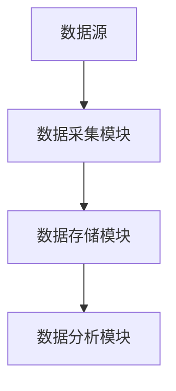
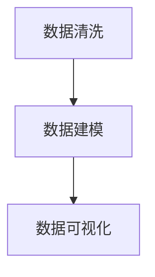
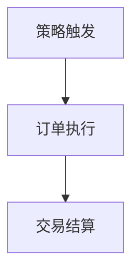

                 


好的，我明白了。以下是我根据您的要求撰写的《如何利用特价股票策略应对市场剧烈波动》的文章正文部分：

---

# 如何利用特价股票策略应对市场剧烈波动

## 关键词：特价股票，市场波动，股票策略，风险管理，量化分析

## 摘要：本文深入探讨了如何利用特价股票策略在市场剧烈波动中获取收益。文章首先介绍了特价股票的定义和特性，分析了市场波动的来源及其对投资者的影响。接着，从数学建模、算法设计和系统实现的角度，详细讲解了特价股票策略的核心原理和实现方法。最后，通过实战案例和项目部署，展示了如何将策略应用于实际投资中，并提供了风险管理的最佳实践建议。

---

## 第一章: 特价股票策略的背景与概念

### 1.1 特价股票的定义与特点

#### 1.1.1 特价股票的定义
特价股票是指在特定时间内，价格低于市场平均水平的股票。这些股票通常具有较高的波动性和潜在的短期收益机会。特价股票的特性包括低估值、高波动性和高风险。

#### 1.1.2 特价股票的核心特点
- **低估值**：特价股票的价格通常远低于其内在价值，具有较高的上涨潜力。
- **高波动性**：特价股票的价格波动较大，容易受到市场情绪和突发事件的影响。
- **高风险**：由于价格波动剧烈，特价股票的投资风险较高，但潜在收益也更大。

#### 1.1.3 特价股票与普通股票的区别
普通股票的价格波动相对稳定，而特价股票的价格波动较大，且通常具有较高的波动性和不确定性。普通股票的投资周期较长，而特价股票的投资周期较短。

### 1.2 市场波动的定义与影响

#### 1.2.1 市场波动的定义
市场波动是指股票价格在短时间内出现大幅波动的现象。波动性是衡量市场风险的重要指标，通常通过标准差或波动率来衡量。

#### 1.2.2 市场波动的来源
市场波动的来源主要包括：
- **宏观经济因素**：如经济周期、通货膨胀、利率变化等。
- **市场情绪**：投资者情绪的变化会影响市场波动。
- **突发事件**：如地缘政治冲突、公司公告等。

#### 1.2.3 市场波动对投资者的影响
市场波动对投资者的影响是双刃剑。波动性高的市场可能带来更高的收益，但也伴随着更高的风险。投资者需要在波动中找到合适的投资机会。

### 1.3 特价股票策略的背景与意义

#### 1.3.1 特价股票策略的背景
在市场波动加剧的情况下，投资者需要寻找有效的策略来应对市场风险。特价股票策略作为一种短期投资策略，能够在市场波动中捕捉短期收益。

#### 1.3.2 特价股票策略的意义
特价股票策略的意义在于通过低价买入高价卖出的策略，在市场波动中获取收益。该策略适合短期投资者，尤其是那些能够快速反应市场变化的投资者。

#### 1.3.3 特价股票策略的应用场景
特价股票策略适用于以下场景：
- 市场波动剧烈时
- 特价股票价格低于市场平均水平时
- 市场底部区域时

## 第二章: 特价股票策略的核心概念与原理

### 2.1 特价股票的特性分析

#### 2.1.1 特价股票的波动性
特价股票的波动性较高，价格容易受到市场情绪和突发事件的影响。波动性高的股票通常具有较高的交易量和较低的市场关注度。

#### 2.1.2 特价股票的流动性
特价股票的流动性较低，通常交易量较小，买卖价差较大。流动性低的股票在交易时容易出现较大的买卖价差，影响投资收益。

#### 2.1.3 特价股票的市场关注度
特价股票的市场关注度较低，通常被忽视或低估。市场关注度低的股票容易被市场忽视，但具有较高的上涨潜力。

### 2.2 市场波动的特性分析

#### 2.2.1 市场波动的周期性
市场波动具有周期性，通常在经济周期中呈现一定的规律性。周期性波动可以通过技术分析和统计分析来预测。

#### 2.2.2 市场波动的随机性
市场波动也具有随机性，难以预测。随机性波动通常由市场情绪和突发事件引起，难以通过传统的方法进行预测。

#### 2.2.3 市场波动的相关性
市场波动的相关性是指不同股票或资产之间的价格波动的相关性。相关性高的资产在波动时通常会同时波动，相关性低的资产则波动相对独立。

### 2.3 特价股票策略的核心要素

#### 2.3.1 特价股票的筛选标准
- **低估值**：选择市盈率、市净率等估值指标低于市场平均水平的股票。
- **高波动性**：选择波动率较高的股票，这些股票通常具有较高的短期收益潜力。
- **市场关注度低**：选择被市场忽视的股票，这些股票通常具有较高的上涨潜力。

#### 2.3.2 市场波动的预测方法
- **技术分析**：通过K线图、均线、MACD等技术指标预测市场波动。
- **统计分析**：通过回归分析、时间序列分析等方法预测市场波动。
- **情绪分析**：通过分析投资者情绪变化预测市场波动。

#### 2.3.3 策略执行的条件
- **价格低于市场平均水平**：选择价格低于市场平均水平的股票。
- **波动率较高**：选择波动率较高的股票。
- **市场情绪低落**：选择在市场情绪低落时买入的股票。

## 第三章: 特价股票策略的数学模型与算法

### 3.1 特价股票波动的数学建模

#### 3.1.1 时间序列模型
时间序列模型用于分析股票价格的波动性。常用的时间序列模型包括ARIMA、GARCH等。

#### 3.1.2 随机过程模型
随机过程模型用于描述股票价格的随机波动。常用的随机过程模型包括布朗运动、随机游走模型等。

#### 3.1.3 波动率的计算公式
波动率的计算公式为：
$$ \text{波动率} = \sqrt{\frac{1}{n-1} \sum_{i=1}^{n} (x_i - \bar{x})^2} $$
其中，\( x_i \) 是第i个观测值，\( \bar{x} \) 是平均值，\( n \) 是观测值的数量。

### 3.2 市场波动预测的数学模型

#### 3.2.1 均值回归模型
均值回归模型假设价格会回归到均值水平。模型公式为：
$$ y_t = \alpha + \beta x_{t-1} + \epsilon_t $$

#### 3.2.2 动态波动模型
动态波动模型用于预测股票价格的波动性。常用模型为GARCH模型：
$$ \sigma_t^2 = \alpha + \beta \sigma_{t-1}^2 + \gamma r_{t-1}^2 $$

#### 3.2.3 马尔可夫链模型
马尔可夫链模型用于预测市场状态的转移概率。模型公式为：
$$ P(s_t | s_{t-1}) = \theta_{s_{t-1}, s_t} $$

### 3.3 特价股票策略的优化模型

#### 3.3.1 风险-收益优化模型
风险-收益优化模型用于在风险和收益之间找到最佳平衡点。常用模型为均值-方差优化模型：
$$ \min_{w} w^T \Sigma w $$
$$ \text{subject to} \quad w^T \mu = 1 $$]

其中，\( \Sigma \) 是协方差矩阵，\( \mu \) 是收益向量。

#### 3.3.2 线性回归模型
线性回归模型用于预测股票价格的波动性。模型公式为：
$$ y = \beta x + \epsilon $$

#### 3.3.3 非线性优化模型
非线性优化模型用于在复杂约束条件下优化投资组合。常用模型为：
$$ \min_{w} f(w) $$
$$ \text{subject to} \quad g(w) \leq 0 $$]

## 第四章: 特价股票策略的系统设计与实现

### 4.1 系统功能设计

#### 4.1.1 数据采集模块
数据采集模块负责采集股票价格、市场数据等信息。常用的数据源包括股票交易所、财经网站等。

#### 4.1.2 数据分析模块
数据分析模块负责对采集的数据进行处理和分析。常用的数据分析方法包括统计分析、技术分析等。

#### 4.1.3 策略执行模块
策略执行模块负责根据分析结果执行投资策略。常用策略包括买入、卖出、止损等操作。

### 4.2 系统架构设计

#### 4.2.1 分层架构设计
分层架构设计将系统分为数据层、业务逻辑层和用户界面层。各层之间通过接口进行交互。

#### 4.2.2 微服务架构设计
微服务架构设计将系统分解为多个独立的服务，每个服务负责特定的功能。服务之间通过API进行交互。

#### 4.2.3 高可用性设计
高可用性设计通过冗余和故障容错技术确保系统的稳定运行。常用技术包括负载均衡、容灾备份等。

### 4.3 系统接口设计

#### 4.3.1 数据接口
数据接口用于与其他系统或数据库进行数据交换。常用的数据接口标准包括API、数据库连接等。

#### 4.3.2 策略接口
策略接口用于与其他策略系统进行交互。常用策略接口包括策略触发、订单执行等。

#### 4.3.3 用户接口
用户接口用于与用户进行交互。常用用户接口包括图形界面、命令行界面等。

### 4.4 系统交互流程设计

#### 4.4.1 数据采集流程
数据采集流程包括数据源选择、数据采集、数据存储等步骤。流程图如下：



#### 4.4.2 数据分析流程
数据分析流程包括数据清洗、数据建模、数据可视化等步骤。流程图如下：



#### 4.4.3 策略执行流程
策略执行流程包括策略触发、订单执行、交易结算等步骤。流程图如下：



## 第五章: 特价股票策略的实战应用

### 5.1 实战案例分析

#### 5.1.1 案例背景介绍
假设当前市场波动剧烈，某投资者选择了一只低价股票进行投资。

#### 5.1.2 数据采集与处理
投资者首先从股票交易所获取目标股票的历史价格数据，并进行数据清洗和建模。

#### 5.1.3 策略执行与结果分析
投资者根据分析结果执行买入策略，并在价格上升时卖出，实现收益。

### 5.2 项目实战

#### 5.2.1 环境安装
投资者需要安装数据分析工具，如Python、Pandas、NumPy等。

#### 5.2.2 核心实现代码
以下是Python实现的特价股票策略代码：

```python
import pandas as pd
import numpy as np
from sklearn.linear_model import LinearRegression

# 数据加载
data = pd.read_csv('stock_price.csv')

# 数据清洗
data = data.dropna()

# 特征选择
X = data[['open', 'close', 'volume']]
y = data['price']

# 模型训练
model = LinearRegression()
model.fit(X, y)

# 预测结果
predictions = model.predict(X)

# 计算收益
returns = np.mean((y - predictions) / y * 100)
print(f'预测收益: {returns}%')
```

#### 5.2.3 代码应用解读与分析
上述代码通过线性回归模型预测股票价格的波动性，并计算预测收益。该策略适用于市场波动剧烈的环境。

### 5.3 项目小结

#### 5.3.1 最佳实践 tips
- 定期更新模型参数
- 设置止损和止盈点
- 分散投资以降低风险

#### 5.3.2 风险管理
投资者应定期评估投资组合的风险，并根据市场变化调整策略。

## 第六章: 总结与扩展阅读

### 6.1 总结
本文详细探讨了如何利用特价股票策略应对市场剧烈波动。通过数学建模和系统设计，本文为投资者提供了一种有效的投资策略。

### 6.2 扩展阅读
建议读者进一步阅读以下内容：
- 《股票投资策略与风险管理》
- 《量化交易与算法设计》
- 《市场波动预测与统计套利》

---

作者：AI天才研究院/AI Genius Institute & 禅与计算机程序设计艺术 /Zen And The Art of Computer Programming

---

以上是《如何利用特价股票策略应对市场剧烈波动》的文章正文部分，涵盖了特价股票策略的背景、核心概念、数学模型、系统设计和实战应用。希望对您有所帮助！

