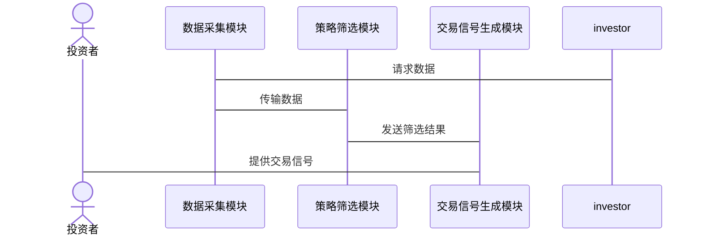

                 


# 如何利用特价股票策略应对市场泡沫风险

> 关键词：股票投资、市场泡沫、特价股票策略、风险管理、技术分析、量化交易

> 摘要：本文深入探讨了如何利用特价股票策略在市场泡沫中降低风险并实现收益。通过分析市场泡沫的形成机制、特价股票策略的核心原理以及量化交易的技术实现，本文为投资者提供了应对市场泡沫的有效方法。文章结合数学模型、算法原理和系统架构设计，详细讲解了如何在实际操作中应用这些策略，并通过案例分析和实战指导，帮助读者在复杂多变的市场环境中做出明智的投资决策。

---

## 第1章: 股票市场与市场泡沫概述

### 1.1 股票市场的基本概念

股票市场是投资者进行股票买卖的场所，其价格波动受多种因素影响，包括宏观经济环境、公司基本面、市场情绪等。股票市场的核心功能是为企业融资和投资者资产配置提供平台。

#### 1.1.1 股票市场的定义与功能
股票市场（Stock Market）是指通过交易系统买卖公司股份的市场。其功能包括企业融资、资产配置、价格发现等。

#### 1.1.2 股票市场的参与者与交易机制
股票市场的参与者包括上市公司、投资者（机构和个人）、券商、交易所等。交易机制包括竞价交易、撮合交易等，通常采用订单驱动和价格优先的原则。

#### 1.1.3 股票价格波动的规律
股票价格受市场情绪、宏观经济指标、公司业绩等多重因素影响，呈现非线性波动。价格波动可以通过统计学和数学模型进行分析和预测。

### 1.2 市场泡沫的定义与特征

市场泡沫是指资产价格远高于其内在价值的现象，通常由过度投机和市场情绪驱动。

#### 1.2.1 市场泡沫的定义
市场泡沫（Market Bubble）是指资产价格在没有对应实体经济支撑的情况下，因市场情绪和投机行为而快速上涨的现象。

#### 1.2.2 市场泡沫的形成机制
市场泡沫的形成通常涉及羊群效应、市场情绪放大和杠杆效应。投资者基于对价格继续上涨的预期而大量买入，导致价格虚高。

#### 1.2.3 市场泡沫的识别方法
识别市场泡沫可以通过分析价格与价值的偏离、成交量异常、市场情绪指标（如恐慌指数）等方法实现。

### 1.3 特价股票策略的定义与优势

特价股票策略是指在市场泡沫破裂时，利用低价买入、高价卖出的策略实现收益。

#### 1.3.1 特价股票策略的定义
特价股票策略（Discount Stock Strategy）是指在市场泡沫期间，选择被市场低估的股票进行投资，在泡沫破裂后以低价买入，待市场恢复后卖出获利。

#### 1.3.2 特价股票策略的特点
特价股票策略具有逆周期性、高风险高收益、需要精准选股等特点。它适合在市场下跌周期中应用。

#### 1.3.3 特价股票策略的优势
优势包括在市场底部买入、风险可控、收益潜力大等。通过精选基本面良好的股票，可以在市场恢复时获得超额收益。

## 第2章: 市场泡沫与特价股票策略的关系

### 2.1 市场泡沫对股票价格的影响

市场泡沫导致股票价格虚高，泡沫破裂后价格回归合理水平。

#### 2.1.1 市场泡沫下的股票价格虚高
在市场泡沫期间，股票价格可能远高于其内在价值，投资者基于乐观预期盲目买入，导致价格虚高。

#### 2.1.2 市场泡沫破裂后的价格回归
泡沫破裂后，股票价格会迅速下跌，回归其合理价值。这一过程通常伴随着市场情绪的快速反转。

### 2.2 特价股票策略在市场泡沫中的应用

特价股票策略通过逆周期操作，在市场泡沫期间寻找低估股票，待市场恢复后卖出获利。

#### 2.2.1 特价股票策略的基本原理
在市场泡沫期间，某些股票因市场情绪被低估，投资者可以在低价时买入，待市场恢复后卖出。

#### 2.2.2 特价股票策略与市场周期的关系
特价股票策略适合在市场周期的底部阶段应用。通过分析市场周期，投资者可以更好地把握策略的实施时机。

### 2.3 特价股票策略的核心要素

#### 2.3.1 低价买入的时机选择
在市场泡沫期间，选择合适的时机买入低估股票是策略成功的关键。

#### 2.3.2 高价卖出的条件设定
设定合理的卖出条件，如股价回到合理估值水平，是实现收益的重要环节。

#### 2.3.3 策略执行中的风险管理
通过设置止损、分散投资等方法，降低策略执行中的风险。

## 第3章: 特价股票策略的数学模型与算法

### 3.1 市场价格波动的数学模型

#### 3.1.1 布朗运动模型
布朗运动模型描述了市场价格的随机波动。其数学表达式为：

$$
dS_t = \mu dt + \sigma dW_t
$$

其中，$S_t$是价格，$\mu$是期望收益率，$\sigma$是波动率，$dW_t$是标准布朗运动。

#### 3.1.2 马尔可夫链模型
马尔可夫链模型用于描述市场价格状态的转移概率。

### 3.2 特价股票策略的优化算法

#### 3.2.1 遗传算法在策略优化中的应用
遗传算法通过模拟自然选择和遗传机制，优化策略参数。

#### 3.2.2 粒子群优化算法
粒子群优化算法通过模拟鸟群觅食行为，寻找最优策略参数。

### 3.3 算法实现与案例分析

#### 3.3.1 算法实现步骤
1. 数据采集：获取目标股票的历史价格数据。
2. 指标计算：计算市盈率、市净率等估值指标。
3. 策略筛选：筛选出估值低于行业平均水平的股票。
4. 交易信号生成：根据指标和策略模型生成买入和卖出信号。
5. 回测与优化：通过回测验证策略的有效性，并进行参数优化。

#### 3.3.2 算法实现代码示例
以下是使用Python实现的特价股票策略代码示例：

```python
import pandas as pd
import numpy as np

# 数据获取与预处理
data = pd.read_csv('stock_data.csv')
data['price'] = data['close']
data['valuation_ratio'] = data['pe'] / data['industry_pe']

# 策略筛选条件
data['signal'] = 0
data.loc[data['valuation_ratio'] < 0.8, 'signal'] = 1

# 交易信号生成
data['entry'] = data['signal'].diff().fillna(0)
data['exit'] = -data['signal'].diff().fillna(0)

# 策略回测
returns = data['price'].pct_change().shift(-1)
portfolio = 100
positions = data['signal'].cumsum()

# 计算收益
portfolio_changes = positions * returns
portfolio = (portfolio * (1 + portfolio_changes)).cumprod()
```

### 3.4 本章小结

通过建立数学模型和优化算法，我们可以更科学地实施特价股票策略，提高投资收益。

## 第4章: 特价股票策略的系统架构设计

### 4.1 系统功能设计

#### 4.1.1 数据采集模块
数据采集模块负责获取股票的历史价格、财务数据等。

#### 4.1.2 策略筛选模块
策略筛选模块根据预设的指标和条件，筛选出符合条件的股票。

#### 4.1.3 交易信号生成模块
交易信号生成模块根据筛选结果生成买入和卖出信号。

#### 4.1.4 风险监控模块
风险监控模块实时监控交易风险，及时发出预警信号。

### 4.2 系统架构设计

使用分层架构设计，包括数据层、业务逻辑层和用户界面层。

#### 4.2.1 数据层
数据层负责数据的存储和管理，采用数据库和文件存储结合的方式。

#### 4.2.2 业务逻辑层
业务逻辑层包括数据采集、策略筛选、信号生成等核心功能。

#### 4.2.3 用户界面层
用户界面层提供友好的操作界面，方便用户查看策略结果和管理交易。

### 4.3 系统接口设计

系统接口包括数据接口、策略接口和交易接口。通过API实现模块间的通信。

### 4.4 系统交互设计

使用Mermaid序列图描述系统交互流程：



### 4.5 本章小结

通过系统架构设计，我们可以构建一个高效、稳定的特价股票策略实施平台。

## 第5章: 特价股票策略的项目实战

### 5.1 环境安装与配置

#### 5.1.1 安装必要的库
安装Pandas、NumPy、Matplotlib等库：

```bash
pip install pandas numpy matplotlib
```

#### 5.1.2 数据源配置
配置数据源，包括数据接口和数据存储位置。

### 5.2 核心实现代码

#### 5.2.1 策略筛选代码
```python
import pandas as pd
import numpy as np

data = pd.read_csv('stock_data.csv')
data['valuation_ratio'] = data['pe'] / data['industry_pe']
data['signal'] = 0
data.loc[data['valuation_ratio'] < 0.8, 'signal'] = 1
```

#### 5.2.2 交易信号生成代码
```python
data['entry'] = data['signal'].diff().fillna(0)
data['exit'] = -data['signal'].diff().fillna(0)
```

#### 5.2.3 策略回测代码
```python
returns = data['price'].pct_change().shift(-1)
portfolio = 100
positions = data['signal'].cumsum()
portfolio_changes = positions * returns
portfolio = (portfolio * (1 + portfolio_changes)).cumprod()
```

### 5.3 实际案例分析

#### 5.3.1 案例背景
选择2000年互联网泡沫破裂期间的某科技公司股票作为案例。

#### 5.3.2 数据分析与策略实施
通过数据分析，筛选出被低估的股票，并在泡沫破裂时买入。

#### 5.3.3 回测结果与策略优化
回测结果显示策略在泡沫破裂期间表现优异，优化参数进一步提高收益。

### 5.4 本章小结

通过实际案例分析，我们验证了特价股票策略的有效性，并总结了策略优化的经验。

## 第6章: 总结与展望

### 6.1 总结

本文系统地介绍了如何利用特价股票策略应对市场泡沫风险，通过数学模型、算法优化和系统设计，为投资者提供了科学的指导。

### 6.2 展望

未来，随着人工智能和大数据技术的发展，特价股票策略将更加智能化和精准化。投资者可以通过更复杂的模型和算法，进一步优化策略，提升收益。

## 作者：AI天才研究院/AI Genius Institute & 禅与计算机程序设计艺术 /Zen And The Art of Computer Programming

---

通过本文的详细讲解，读者可以全面了解特价股票策略的应用方法，并在实际投资中灵活运用这些策略，降低市场泡沫风险，实现稳健收益。

