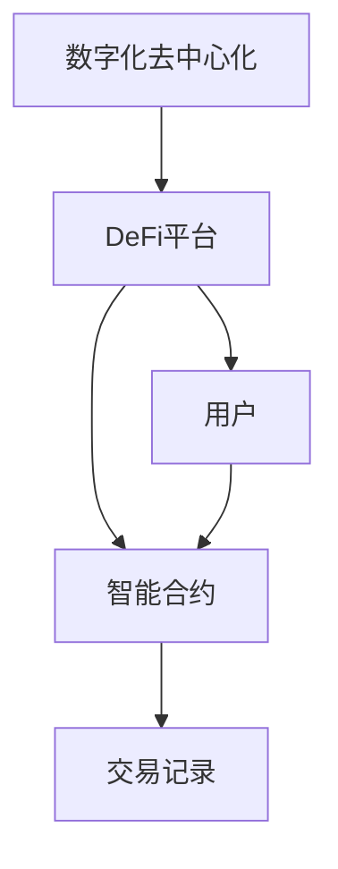
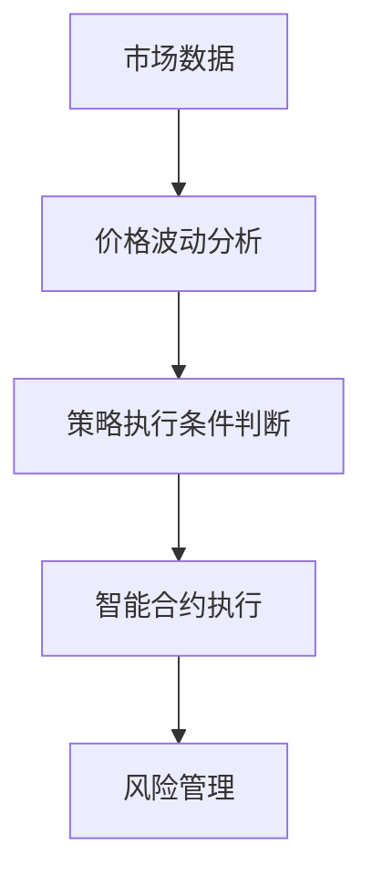
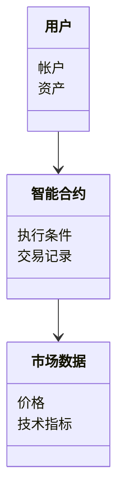
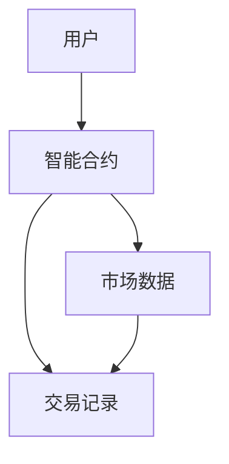
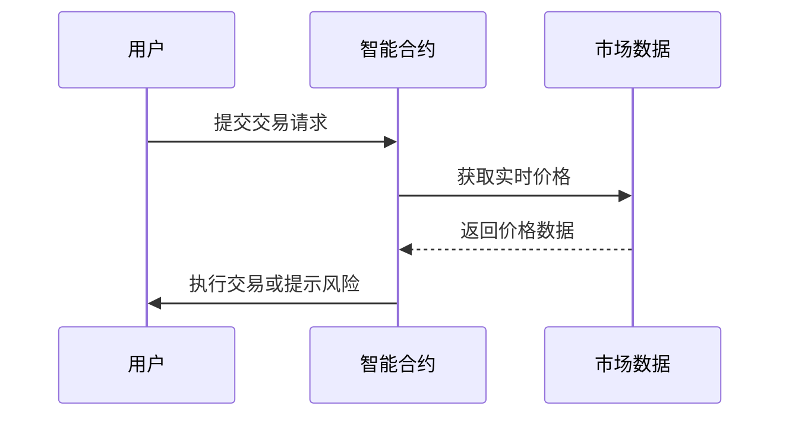

                 


# 如何利用特价股票策略应对数字化去中心化风险

> 关键词：数字化去中心化风险，特价股票策略，DeFi，风险管理，系统架构

> 摘要：随着数字化和去中心化的快速发展，金融领域面临的风险也在不断增加。本文将探讨如何利用特价股票策略来应对数字化去中心化带来的风险。通过分析核心概念、算法原理、系统架构和项目实战，本文提供了一种创新的解决方案，帮助读者理解如何在数字化时代有效管理金融风险。

---

## 第一部分: 背景介绍

### 第1章: 数字化去中心化风险的背景与挑战

#### 1.1 问题背景
##### 1.1.1 数字化时代的金融创新
数字化技术的快速发展推动了金融领域的创新，特别是在区块链技术和去中心化金融（DeFi）领域的崛起。DeFi通过智能合约和分布式账本技术，实现了无需传统金融机构参与的金融服务。然而，这种去中心化模式也带来了新的风险。

##### 1.1.2 去中心化金融（DeFi）的兴起
DeFi通过智能合约和区块链技术，提供了去中心化的借贷、交易和支付服务。其优势在于透明性和去信任化，但同时也面临流动性不足、价格波动大和智能合约漏洞等风险。

##### 1.1.3 特价股票策略的定义与特点
特价股票策略是指在特定条件下，以低于市场价购买股票的策略。这种策略通常利用市场波动和短期价格变化来获取利润。在DeFi中，特价股票策略可以通过智能合约自动执行，从而实现去中心化的风险管理。

#### 1.2 问题描述
##### 1.2.1 数字化去中心化的定义
数字化去中心化是指将传统金融体系中的中心化机构（如银行、交易所）的功能通过数字化技术去中心化，利用区块链等技术实现去中心化的金融服务。

##### 1.2.2 去中心化金融（DeFi）的核心机制
DeFi的核心机制包括智能合约、代币发行、去中心化交易所和借贷平台。这些机制通过区块链技术实现金融服务的自动化和去中心化。

##### 1.2.3 特价股票策略在DeFi中的应用
在DeFi中，特价股票策略通常通过智能合约自动执行，利用市场波动在特定条件下购买股票或代币，以实现利润最大化。

#### 1.3 问题解决
##### 1.3.1 特价股票策略的核心作用
特价股票策略通过在特定市场条件下购买股票，能够在价格波动中获利。在DeFi中，这种策略可以自动化执行，从而提高效率并降低人工干预的风险。

##### 1.3.2 通过特价股票策略降低风险的具体方法
利用特价股票策略，投资者可以在市场下跌时以低价买入股票，在价格上涨时卖出，从而实现套利和风险管理。

##### 1.3.3 去中心化与中心化之间的平衡
DeFi的去中心化优势在于降低了单点故障风险，但同时也面临治理和监管的挑战。特价股票策略可以通过平衡去中心化和中心化机制，优化风险管理。

#### 1.4 边界与外延
##### 1.4.1 数字化去中心化风险的边界
数字化去中心化风险主要集中在智能合约漏洞、市场波动和流动性不足等方面。

##### 1.4.2 特价股票策略的应用范围
特价股票策略适用于股票市场、加密货币市场和其他金融衍生品市场。在DeFi中，其应用主要集中在去中心化交易所和借贷平台。

##### 1.4.3 与传统金融风险管理的对比
传统金融风险管理依赖于中心化机构和人工干预，而DeFi中的风险管理通过智能合约和自动化策略实现，具有更高的透明性和效率。

#### 1.5 概念结构与核心要素组成
##### 1.5.1 数字化去中心化风险的构成要素
- 市场波动风险
- 智能合约漏洞
- 流动性风险

##### 1.5.2 特价股票策略的核心要素
- 市场价格波动
- 智能合约执行条件
- 投资策略自动化

##### 1.5.3 两者之间的关系
数字化去中心化风险为特价股票策略提供了应用场景，而特价股票策略则为DeFi的风险管理提供了新的工具和方法。

---

## 第二部分: 核心概念与联系

### 第2章: 数字化去中心化与特价股票策略的核心概念

#### 2.1 核心概念原理
##### 2.1.1 数字化去中心化的原理
数字化去中心化通过区块链技术实现了数据的分布式存储和去信任化交易。其核心在于通过智能合约和分布式账本实现金融服务的自动化。

##### 2.1.2 特价股票策略的原理
特价股票策略通过市场分析和自动化交易，在特定条件下购买股票或代币。其核心在于利用价格波动和市场机会实现收益最大化。

##### 2.1.3 两者的关联性分析
两者的关系在于，数字化去中心化为特价股票策略提供了技术基础和应用场景，而特价股票策略则为DeFi的风险管理提供了新的工具和方法。

#### 2.2 概念属性特征对比
| 特征 | 数字化去中心化 | 特价股票策略 |
|------|----------------|---------------|
| 技术基础 | 区块链、智能合约 | 市场分析、自动化交易 |
| 核心目标 | 去中心化金融服务 | 利用价格波动获利 |
| 风险 | 智能合约漏洞、流动性风险 | 市场波动风险、策略执行风险 |

#### 2.3 ER实体关系图架构


---

## 第三部分: 算法原理讲解

### 第3章: 特价股票策略的算法原理

#### 3.1 算法原理
特价股票策略的核心在于通过算法分析市场数据，识别价格波动的机会，并通过智能合约自动执行交易。以下是算法的详细步骤：

1. **市场数据采集**：实时采集股票价格和市场数据。
2. **价格波动分析**：利用技术指标（如RSI、MACD）识别市场波动。
3. **策略执行条件判断**：根据预设条件（如价格低于某个阈值）触发交易。
4. **智能合约执行**：通过智能合约自动执行买入或卖出操作。
5. **风险管理**：通过止损和止盈机制控制风险。

#### 3.2 算法实现


#### 3.3 数学模型与公式
以下是特价股票策略的核心数学模型：

$$ \text{买入条件} = \text{价格} < \text{阈值} $$

$$ \text{卖出条件} = \text{价格} > \text{阈值} \times (1 + \text{收益比例}) $$

其中，阈值和收益比例是根据市场情况和风险偏好设定的参数。

---

## 第四部分: 系统分析与架构设计

### 第4章: 系统架构设计

#### 4.1 问题场景介绍
在DeFi中，投资者需要一个去中心化的平台，能够自动执行特价股票策略并管理风险。

#### 4.2 系统功能设计
##### 4.2.1 领域模型


##### 4.2.2 系统架构


#### 4.3 接口与交互设计
##### 4.3.1 接口设计
- 用户接口：提交交易请求
- 智能合约接口：接收市场数据和交易指令
- 市场数据接口：提供实时价格和指标

##### 4.3.2 交互设计


---

## 第五部分: 项目实战

### 第5章: 实践项目

#### 5.1 环境安装
需要安装以下工具：
- 区块链开发环境（如Solidity）
- 去中心化交易所接口
- 数据分析工具（如Python）

#### 5.2 核心代码实现
以下是Python实现的特价股票策略代码：

```python
def price_condition(current_price, threshold):
    return current_price < threshold

def execute_trade(condition, account):
    if condition:
        account.buy_stock()
    else:
        account.sell_stock()

# 示例使用
market_data = get_market_data()
threshold = 100  # 示例阈值
condition = price_condition(market_data['price'], threshold)
execute_trade(condition, account)
```

#### 5.3 案例分析
假设市场数据如下：
- 当前价格：95
- 阈值：100

策略将执行买入操作。当价格上升至110时，策略将执行卖出操作，实现获利。

#### 5.4 项目小结
通过实践项目，我们可以看到特价股票策略在DeFi中的应用潜力。然而，实际应用中需要考虑市场波动、智能合约漏洞和流动性风险等因素。

---

## 第六部分: 最佳实践

### 第6章: 小结与注意事项

#### 6.1 小结
本文详细探讨了如何利用特价股票策略应对数字化去中心化风险。通过分析核心概念、算法原理和系统架构，我们提出了一种创新的解决方案，为DeFi的风险管理提供了新的思路。

#### 6.2 注意事项
- 特价股票策略需要结合市场情况和风险偏好进行调整。
- 智能合约的漏洞可能导致重大损失，需加强代码审计和测试。
- DeFi市场的波动性和不确定性要求投资者具备较高的风险意识和市场敏感性。

#### 6.3 拓展阅读
- 加入DeFi社区，参与智能合约的开发和优化。
- 关注市场动态，了解最新的金融创新和技术趋势。

---

## 作者

作者：AI天才研究院/AI Genius Institute & 禅与计算机程序设计艺术 /Zen And The Art of Computer Programming

---

通过本文的详细分析和实践，读者可以深入理解如何利用特价股票策略应对数字化去中心化风险。希望本文的内容能够为DeFi领域的风险管理提供新的思路和方法。

