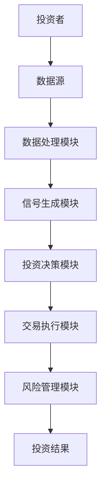
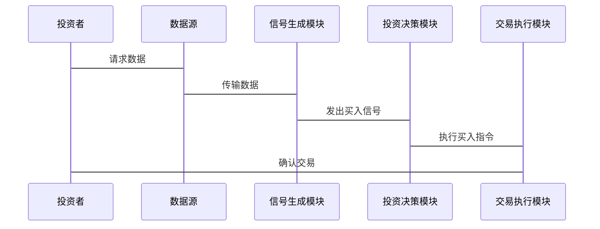

                 


# 如何利用特价股票策略应对经济衰退

> 关键词：经济衰退、特价股票、投资策略、风险管理、股票市场

> 摘要：本文详细探讨了如何利用特价股票策略在经济衰退期间进行投资，通过分析市场周期、估值指标和风险管理等多方面内容，为投资者提供实用的策略和建议。

---

## 第一部分：经济衰退与特价股票策略基础

### 第1章：经济衰退与特价股票概述

#### 1.1 经济衰退的定义与特征
经济衰退是指经济活动显著下降的时期，通常表现为GDP连续几个季度负增长、失业率上升和企业盈利能力下降。经济衰退的原因多种多样，包括全球经济波动、金融危机、政策失误等。

#### 1.2 特价股票的定义与特点
特价股票指的是在市场中价格远低于其内在价值的股票。这些股票通常来自基本面良好但暂时被市场低估的公司。特价股票的特点包括低市盈率、低市净率和较高的股息收益率。

#### 1.3 特价股票在经济衰退中的作用
在经济衰退期间，特价股票往往被市场忽视，导致其价格被严重低估。此时买入特价股票，可以在经济复苏时获得超额收益。此外，特价股票通常具有较高的安全边际，能够有效降低投资风险。

---

### 第2章：特价股票策略的核心概念

#### 2.1 特价股票策略的背景
经济衰退期间，市场情绪往往悲观，投资者倾向于抛售股票，导致股价大幅下跌。然而，这为精明的投资者提供了以低价买入优质股票的机会。

#### 2.2 特价股票策略的基本原理
特价股票策略基于价值投资理念，寻找那些市场价格低于内在价值的股票。投资者需要分析公司的财务状况、行业地位和未来发展前景，以确定其股票是否被低估。

#### 2.3 特价股票策略的关键要素
- **市场周期分析**：识别经济衰退周期，确定市场底部。
- **股票基本面评估**：分析公司的盈利能力、资产负债情况和成长潜力。
- **投资组合优化**：合理配置资产，分散投资风险。

---

### 第3章：特价股票策略的数学模型与公式

#### 3.1 特价股票估值模型
以下是几种常用的股票估值指标：

- **市盈率（P/E）公式**：
  $$ \text{P/E} = \frac{\text{股价}}{\text{每股收益}} $$
  该指标用于衡量股票的相对估值，P/E越低，可能意味着股票越便宜。

- **市净率（P/B）公式**：
  $$ \text{P/B} = \frac{\text{股价}}{\text{每股净资产}} $$
  该指标适用于评估资产密集型行业的公司，P/B低于1通常被认为是低估的信号。

- **股息率公式**：
  $$ \text{股息率} = \frac{\text{每股股息}}{\text{股价}} \times 100\% $$
  高股息率的股票在经济衰退期间可以为投资者提供稳定的现金流。

#### 3.2 投资组合优化模型
- **马科维茨投资组合理论**：
  $$ \text{风险} = \sqrt{w^T \Sigma w} $$
  其中，\( w \) 是投资组合的权重向量，\( \Sigma \) 是资产之间的协方差矩阵。该公式用于计算投资组合的风险。

- **特价股票权重分配公式**：
  $$ w_i = \frac{P_i}{\sum P_j} $$
  其中，\( P_i \) 是第 \( i \) 只股票的价格，\( \sum P_j \) 是所有股票的总价格。该公式用于确定投资组合中每只股票的权重。

#### 3.3 风险评估与控制公式
- **风险调整后收益公式**：
  $$ R_a = R - \beta \times \text{Market Risk} $$
  该公式用于计算调整后的投资收益，其中 \( \beta \) 是股票的贝塔系数，反映了股票相对于市场的波动性。

---

## 第二部分：特价股票策略的系统分析与架构设计

### 第4章：系统分析与架构设计

#### 4.1 问题场景介绍
在经济衰退期间，投资者需要一个系统化的策略来识别和选择被低估的股票，同时控制投资风险。

#### 4.2 系统功能设计
- **数据收集模块**：收集股票的市场数据、财务数据和行业分析报告。
- **信号生成模块**：根据估值指标和市场趋势生成买入信号。
- **风险控制模块**：实时监控投资组合的风险，制定止损策略。

#### 4.3 系统架构设计
以下是系统架构的Mermaid图：



#### 4.4 系统接口设计
- **数据接口**：与金融数据供应商（如 Bloomberg、Yahoo Finance）对接，获取实时数据。
- **交易接口**：与 brokerage platforms 对接，执行买入或卖出指令。

#### 4.5 系统交互设计
以下是系统交互的Mermaid序列图：



---

## 第三部分：项目实战与案例分析

### 第5章：项目实战

#### 5.1 环境安装
要实施特价股票策略，投资者需要安装以下工具：
- 数据分析工具：Python、Pandas、NumPy
- 交易执行工具：Interactive Brokers、Robinhood
- 数据可视化工具：Matplotlib、Seaborn

#### 5.2 核心实现源代码
以下是使用Python实现的特价股票筛选代码：

```python
import pandas as pd
import numpy as np

# 假设我们有一个包含股票数据的DataFrame df
# df.columns = ['stock', 'pe', 'pb', 'dividend_yield']

# 筛选条件：pe < 15，pb < 1，dividend_yield > 3%
selected_stocks = df[(df['pe'] < 15) & (df['pb'] < 1) & (df['dividend_yield'] > 0.03)]

print(selected_stocks)
```

#### 5.3 案例分析
以2008年金融危机为例，投资者在市场底部买入一只市盈率低于10、市净率低于0.5的银行股。在经济复苏期间，该股票股价上涨了3倍，为投资者带来了丰厚的回报。

---

## 第四部分：总结与展望

### 第6章：总结与展望

#### 6.1 总结
本文详细探讨了如何利用特价股票策略在经济衰退期间进行投资。通过分析市场周期、估值指标和风险管理，投资者可以在市场底部抓住投资机会，实现超额收益。

#### 6.2 展望
随着人工智能和大数据技术的发展，未来可以通过算法交易和量化分析进一步优化特价股票策略。投资者可以利用机器学习模型预测市场趋势，提高投资决策的准确性。

---

## 第五部分：附录

### 附录A：常用指标与术语解释
- **市盈率（P/E）**：股价除以每股收益。
- **市净率（P/B）**：股价除以每股净资产。
- **股息率**：每股股息除以股价。

### 附录B：推荐阅读书籍
1. 《The Intelligent Investor》 by Benjamin Graham
2. 《The Warren Buffett Way》 by Robert G. Peters

---

## 作者：AI天才研究院/AI Genius Institute & 禅与计算机程序设计艺术 /Zen And The Art of Computer Programming

---

感谢您的耐心阅读！希望本文能为您提供有价值的投资策略和实践指导。

