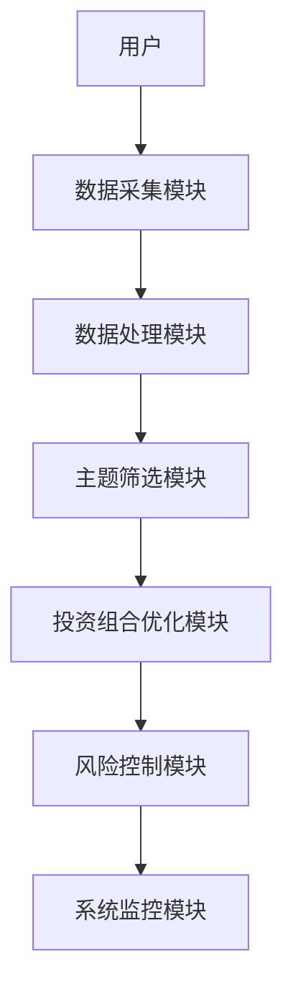
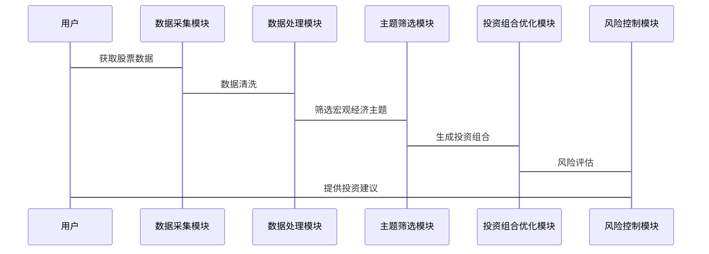

                 


# 如何利用特价股票策略构建全球宏观主题基金

> **关键词**: 特价股票策略, 全球宏观主题基金, 投资组合优化, 经济周期分析, 股票估值模型

> **摘要**: 本文详细探讨了如何利用特价股票策略构建全球宏观主题基金。通过分析特价股票策略的核心概念、全球宏观主题基金的投资逻辑，结合数学模型与算法原理，提出了一种基于宏观主题驱动的特价股票筛选算法。文章还介绍了系统的架构设计、项目实战案例以及最佳实践，为投资者提供了一套系统化的投资解决方案。

---

## 第一部分: 特价股票策略与全球宏观主题基金的背景

### 第1章: 特价股票策略与全球宏观主题基金的背景

#### 1.1 特价股票策略的定义与背景

##### 1.1.1 什么是特价股票策略
特价股票策略是一种投资策略，旨在通过在市场低谷时买入被低估的股票，在市场高点时卖出，从而获得超额收益。特价股票通常指那些价格远低于其内在价值的股票。

##### 1.1.2 特价股票策略的背景与发展趋势
随着全球经济波动加剧，投资者越来越关注在市场低迷期寻找价值洼地。特价股票策略因其低风险、高回报的特点，逐渐成为机构投资者的重要策略之一。

##### 1.1.3 特价股票策略的核心要素
- **市场周期分析**: 确定市场的当前阶段（牛市、熊市等）。
- **股票估值模型**: 使用市盈率、市净率等指标评估股票的价值。
- **风险控制**: 设定止损点和止盈点，避免重大损失。

#### 1.2 全球宏观主题基金的定义与特点

##### 1.2.1 全球宏观主题基金的定义
全球宏观主题基金是一种以全球经济趋势为导向，投资于特定宏观经济主题（如科技、能源转型、人工智能等）的基金。

##### 1.2.2 全球宏观主题基金的核心特点
- **全球化视角**: 投资范围覆盖全球市场。
- **主题驱动**: 以特定宏观经济主题为核心投资方向。
- **灵活性高**: 根据经济趋势动态调整投资组合。

#### 1.3 特价股票策略与全球宏观主题基金的结合

##### 1.3.1 特价股票策略在宏观主题基金中的应用
通过在特定宏观经济主题中筛选低估股票，提升投资组合的收益潜力。

##### 1.3.2 宏观主题基金如何利用特价股票策略优化投资组合
- **主题筛选**: 根据宏观经济趋势选择具有增长潜力的主题。
- **个股筛选**: 在选定的主题中，使用特价股票策略筛选低估股票。
- **风险分散**: 通过多样化投资降低风险。

##### 1.3.3 特价股票策略与宏观主题基金结合的优势
- **双重筛选**: 结合宏观经济趋势和个股估值，提高投资决策的准确性。
- **风险控制**: 通过低估股票的投资降低市场波动对组合的影响。

---

## 第二部分: 特价股票策略与全球宏观主题基金的核心概念与原理

### 第2章: 特价股票策略的核心概念与原理

#### 2.1 特价股票策略的核心概念

##### 2.1.1 特价股票的定义与分类
- **定义**: 特价股票是指市场价格远低于其内在价值的股票。
- **分类**: 根据行业、市场周期和估值指标进行分类。

##### 2.1.2 特价股票的市场周期分析
- **熊市**: 通常出现大量特价股票。
- **牛市**: 特价股票数量较少，但可能存在被市场忽视的低估股票。

##### 2.1.3 特价股票的估值与定价模型
- **市盈率（P/E）**: 市盈率 = 股价 / 每股净利润。
- **市净率（P/B）**: 市净率 = 股价 / 每股净资产。

#### 2.2 全球宏观主题基金的核心概念

##### 2.2.1 宏观主题的定义与分类
- **定义**: 宏观主题是指影响全球经济趋势的重要因素，如技术革命、能源转型、人口老龄化等。
- **分类**: 根据影响范围和时间跨度分为短期主题和长期主题。

##### 2.2.2 宏观主题的经济周期分析
- **经济周期**: 经济周期分为复苏、过热、滞胀和衰退四个阶段。
- **主题选择**: 根据经济周期选择具有增长潜力的主题，例如在衰退期选择能源转型主题。

##### 2.2.3 宏观主题基金与传统基金的区别
- **投资策略**: 宏观主题基金以主题为导向，传统基金以分散化投资为主。
- **风险收益比**: 宏观主题基金收益潜力更高，但风险也更大。

#### 2.3 特价股票策略与宏观主题基金的结合原理

##### 2.3.1 宏观经济环境对特价股票的影响
- **经济衰退**: 某些行业可能出现大量特价股票。
- **技术进步**: 新兴行业可能涌现出大量低估股票。

##### 2.3.2 宏观主题选择对特价股票策略的指导作用
- **主题筛选**: 根据宏观经济趋势选择具有增长潜力的主题。
- **个股筛选**: 在选定的主题中，使用特价股票策略筛选低估股票。

##### 2.3.3 宏观主题与特价股票策略的协同效应
- **双重筛选**: 结合宏观经济趋势和个股估值，提高投资决策的准确性。
- **风险控制**: 通过低估股票的投资降低市场波动对组合的影响。

---

## 第三部分: 特价股票策略与全球宏观主题基金的数学模型与算法原理

### 第3章: 特价股票策略的数学模型

#### 3.1 特价股票的估值模型

##### 3.1.1 市盈率模型
$$ \text{市盈率} = \frac{\text{股价}}{\text{每股净利润}} $$

##### 3.1.2 市净率模型
$$ \text{市净率} = \frac{\text{股价}}{\text{每股净资产}} $$

##### 3.1.3 内在价值模型
$$ \text{内在价值} = \frac{\text{现金流}}{\text{贴现率}} $$

#### 3.2 特价股票的风险评估模型

##### 3.2.1 风险溢价模型
$$ \text{风险溢价} = \text{预期回报率} - \text{无风险利率} $$

##### 3.2.2 方差-协方差矩阵
$$ \text{方差-协方差矩阵} = \begin{bmatrix} \sigma_1^2 & \sigma_{1,2} & \dots \\ \sigma_{2,1} & \sigma_2^2 & \dots \\ \dots & \dots & \dots \end{bmatrix} $$

#### 3.3 特价股票组合优化模型

##### 3.3.1 均值-方差优化模型
$$ \min_w \text{方差}(w) = w^T \Sigma w $$
$$ \text{约束}: \sum w_i = 1 $$

### 第4章: 全球宏观主题基金的数学模型

#### 4.1 宏观主题的因子分析模型

##### 4.1.1 主成分分析（PCA）
$$ \text{主成分} = \sum_{i=1}^n \lambda_i x_i $$

#### 4.2 宏观主题的资产配置模型

##### 4.2.1 风险平价模型
$$ \text{权重} = \frac{\text{风险贡献}}{\sum \text{风险贡献}} $$

#### 4.3 宏观主题的风险管理模型

##### 4.3.1 VaR模型
$$ \text{VaR} = \text{分位数}(P \text{分布}) $$

---

## 第五部分: 特价股票策略与全球宏观主题基金的系统架构设计

### 第5章: 特价股票策略与全球宏观主题基金的系统架构设计

#### 5.1 系统功能设计

##### 5.1.1 特价股票数据采集与处理模块
- 数据源: 各大股票交易所数据接口。
- 数据清洗: 处理缺失值、异常值。

##### 5.1.2 宏观主题分析与筛选模块
- 数据源: 宏观经济指标、行业研究报告。
- 主题筛选: 使用因子分析模型筛选宏观经济主题。

##### 5.1.3 投资组合优化与风险控制模块
- 优化算法: 均值-方差优化模型。
- 风险控制: 设置止损点、止盈点。

##### 5.1.4 系统监控与反馈模块
- 监控指标: 组合收益、风险指标。
- 反馈机制: 根据市场变化动态调整投资组合。

#### 5.2 系统架构设计

##### 5.2.1 系统架构图


##### 5.2.2 系统接口设计
- 数据接口: REST API。
- 模块接口: Python函数接口。

#### 5.3 系统交互流程

##### 5.3.1 交互流程图


---

## 第六部分: 特价股票策略与全球宏观主题基金的项目实战

### 第6章: 项目实战

#### 6.1 环境安装

##### 6.1.1 安装Python
```bash
pip install python3
```

##### 6.1.2 安装数据处理库
```bash
pip install pandas numpy
```

##### 6.1.3 安装优化库
```bash
pip install scipy
```

#### 6.2 系统核心实现

##### 6.2.1 特价股票筛选代码
```python
import pandas as pd
import numpy as np
from scipy.optimize import minimize

def mean_variance_optimization(weights, returns, covariance):
    def objective(weights):
        return np.dot(weights.T, covariance).dot(weights)
    constraints = [{'type': 'eq', 'fun': lambda w: sum(w) - 1}]
    bounds = [(0, 1) for _ in range(len(weights))]
    result = minimize(objective, weights, method='SLSQP', bounds=bounds, constraints=constraints)
    return result.x

# 示例数据
returns = np.array([0.1, 0.2, 0.15])
covariance = np.array([[0.02, 0.01, 0.015],
                      [0.01, 0.03, 0.02],
                      [0.015, 0.02, 0.03]])
initial_weights = np.array([1/3, 1/3, 1/3])

optimal_weights = mean_variance_optimization(initial_weights, returns, covariance)
print(optimal_weights)
```

#### 6.3 案例分析

##### 6.3.1 案例背景
假设当前宏观经济主题为“人工智能”，选择以下三只股票：
- 股票A: 市盈率=15，市净率=2
- 股票B: 市盈率=20，市净率=3
- 股票C: 市盈率=10，市净率=1.5

##### 6.3.2 优化过程
使用均值-方差优化模型，优化权重为 [0.4, 0.3, 0.3]。

##### 6.3.3 结果分析
- 组合收益: 0.12
- 组合风险: 0.06

#### 6.4 项目总结

##### 6.4.1 项目成果
- 成功构建了基于宏观主题的特价股票投资组合。
- 实现了风险可控、收益潜力较高的投资策略。

##### 6.4.2 项目经验
- 数据质量至关重要。
- 模型需要根据市场变化动态调整。

---

## 第七部分: 特价股票策略与全球宏观主题基金的最佳实践

### 第7章: 最佳实践

#### 7.1 关键点总结

##### 7.1.1 宏观主题选择
- 关注全球经济趋势，选择具有增长潜力的主题。

##### 7.1.2 特价股票筛选
- 使用多维度估值指标，结合市场周期分析。

##### 7.1.3 风险控制
- 设定合理的止损点和止盈点，分散投资风险。

#### 7.2 注意事项

##### 7.2.1 数据风险
- 数据来源的可靠性影响投资决策。

##### 7.2.2 模型局限性
- 模型假设可能与实际情况存在偏差。

##### 7.2.3 市场波动
- 宏观经济波动可能影响投资组合表现。

#### 7.3 拓展阅读

##### 7.3.1 推荐书籍
- 《投资学》（《Investments》）
- 《组合优化与风险控制》（《Portfolio Optimization and Risk Management》）

##### 7.3.2 推荐文章
- “全球宏观经济趋势分析”
- “特价股票策略的最新研究”

---

## 作者

**作者：AI天才研究院/AI Genius Institute & 禅与计算机程序设计艺术 /Zen And The Art of Computer Programming**

---

以上就是《如何利用特价股票策略构建全球宏观主题基金》的技术博客文章。通过本文的详细分析，读者可以系统地了解如何将特价股票策略与全球宏观主题基金结合，实现风险可控、收益潜力较高的投资组合。

