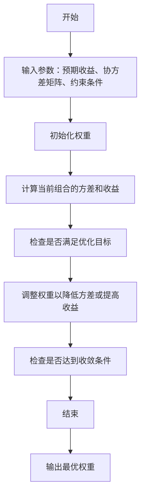

                 


# 如何利用特价股票策略构建退休投资组合

## 目录大纲

---

### 第一部分：特价股票与退休投资基础

#### 第1章：特价股票策略的背景与基础

##### 1.1 特价股票的定义与特点

**1.1.1 特价股票的定义**  
特价股票指的是市场价格低于其内在价值的股票，通常被认为被市场低估，具有较大的上涨潜力。这类股票通常具有较高的分红率或较低的市盈率，适合长期投资者。

**1.1.2 特价股票的核心特点**  
- **低估性**：市场价格低于内在价值。
- **高分红**：公司愿意将利润分配给股东，提供稳定的现金流。
- **低市盈率**：市盈率较低，表明股票价格相对合理。

**1.1.3 特价股票与普通股票的区别**  
下表展示了特价股票与普通股票在几个关键指标上的对比：

| 指标       | 特价股票               | 普通股票             |
|------------|------------------------|----------------------|
| 市盈率      | 低于行业平均水平       | 与行业平均水平持平或偏高 |
| 市净率      | 低于行业平均水平       | 与行业平均水平持平或偏高 |
| 分红率      | 较高                   | 较低                 |
| 市场情绪     | 看跌或被忽视           | 看涨或受关注         |

##### 1.2 退休投资的基本需求

**1.2.1 退休投资的基本目标**  
退休投资的主要目标是确保在退休后有稳定的收入来源，同时实现资产的保值和增值。

**1.2.2 退休投资的风险与收益平衡**  
退休投资需要在风险和收益之间找到平衡点，通常更倾向于稳健投资，避免高风险高回报的策略。

**1.2.3 退休投资的时间规划**  
退休投资的时间跨度较长，通常需要20年以上的投资周期，以实现资产的长期增长。

##### 1.3 特价股票在退休投资中的优势

**1.3.1 高分红与低估值的优势**  
高分红意味着稳定的现金流，低估值意味着未来的增值空间。

**1.3.2 特价股票的长期稳定性**  
特价股票通常来自财务稳定的公司，具有较强的抗跌能力。

**1.3.3 特价股票与退休收入的契合**  
高分红的特价股票可以为退休投资者提供稳定的收入来源，帮助他们实现财务自由。

---

#### 第2章：特价股票策略的核心概念

##### 2.1 投资组合构建的基本原理

**2.1.1 投资组合的定义与目标**  
投资组合是指将资金分配到不同资产（如股票、债券等）上的策略，目标是在风险可控的前提下实现收益最大化。

**2.1.2 投资组合的风险与收益分析**  
投资组合的风险和收益可以通过统计学方法进行分析，包括方差、标准差等指标。

**2.1.3 投资组合的多样化原则**  
多样化投资可以分散风险，避免因单一资产表现不佳而导致整体投资亏损。

##### 2.2 特价股票策略的原理与机制

**2.2.1 价值投资的基本原理**  
价值投资强调购买市场价格低于内在价值的股票，等待市场重新评估其价值。

**2.2.2 特价股票的市场时机选择**  
选择合适的时机购买特价股票，通常在市场低迷时期更容易找到低估的股票。

**2.2.3 投资组合的动态调整策略**  
定期审视和调整投资组合，确保其符合预定的目标和风险承受能力。

##### 2.3 特价股票策略的核心要素

**2.3.1 选股标准与筛选方法**  
包括低市盈率、低市净率、高分红率等指标。

**2.3.2 投资组合的权重分配**  
根据风险承受能力和收益目标，合理分配各资产的权重。

**2.3.3 风险控制与止损机制**  
设定止损点，避免因个别股票的重大亏损影响整体投资组合。

---

### 第二部分：特价股票策略的数学模型与算法

#### 第3章：投资组合优化的数学模型

##### 3.1 现代投资组合理论基础

**3.1.1 均值-方差优化模型**  
均值-方差优化模型是投资组合优化的基础，目标是最小化风险（方差）或最大化收益（均值）。

公式：  
$$\text{Minimize } \sigma^2 \text{ subject to } \mu \geq \text{目标收益}$$

**3.1.2 马科维茨有效前沿理论**  
有效前沿展示了在给定风险下，收益最大的投资组合，或在给定收益下，风险最小的投资组合。

**3.1.3 风险调整后的收益评估**  
使用夏普比率等指标评估投资组合的风险调整后收益。

##### 3.2 特价股票策略的数学公式

**3.2.1 投资组合收益的计算公式**  
$$\text{投资组合收益} = \sum_{i=1}^n w_i r_i$$  
其中，\(w_i\) 是第i只股票的权重，\(r_i\) 是第i只股票的收益率。

**3.2.2 投资组合风险的计算公式**  
$$\text{投资组合风险} = \sqrt{\sum_{i=1}^n \sum_{j=1}^n w_i w_j \sigma_{ij}}$$  
其中，\(\sigma_{ij}\) 是第i只和第j只股票之间的协方差。

**3.2.3 风险调整后的收益公式**  
$$\text{夏普比率} = \frac{E(r - r_f)}{\sigma}$$  
其中，\(E(r)\) 是投资组合的预期收益，\(r_f\) 是无风险利率，\(\sigma\) 是投资组合的风险。

---

#### 第4章：基于特价股票的多因子投资模型

##### 4.1 多因子模型的构建

**4.1.1 选择影响股票收益的核心因子**  
包括市盈率（PE）、市净率（PB）、股息率（DIV）、市值（Market Cap）等。

**4.1.2 构建因子得分模型**  
对每只股票进行因子得分计算，评估其相对于市场的低估程度。

##### 4.2 优化模型与参数选择

**4.2.1 基于多因子的优化模型**  
使用拉格朗日乘数法对投资组合进行优化，考虑多个因子的影响。

**4.2.2 参数选择与敏感性分析**  
分析不同参数对投资组合的影响，确保模型的稳健性。

---

#### 第5章：投资组合优化算法实现

##### 5.1 算法流程图



##### 5.2 Python代码实现

```python
import numpy as np
from scipy.optimize import minimize

def portfolio_optimization(weights, returns, covariance, target_return=0.1):
    # 定义目标函数
    def objective(weights):
        return np.dot(weights.T, covariance.dot(weights))

    # 定义约束条件
    constraints = [
        {'type': 'eq', 'fun': lambda w: np.sum(w) - 1},
        {'type': 'eq', 'fun': lambda w: np.dot(weights.T, returns) - target_return}
    ]

    # 使用SLSQP求解器进行优化
    result = minimize(objective, weights, constraints=constraints, method='SLSQP')
    return result.x

# 示例数据
returns = np.array([0.1, 0.12, 0.08, 0.15])
covariance = np.array([[0.02, 0.01, 0.015, 0.005],
                        [0.01, 0.03, 0.01, 0.008],
                        [0.015, 0.01, 0.04, 0.006],
                        [0.005, 0.008, 0.006, 0.03]])
weights_initial = np.array([0.25, 0.25, 0.25, 0.25])

# 调用优化函数
optimal_weights = portfolio_optimization(weights_initial, returns, covariance, target_return=0.12)

print("最优权重:", optimal_weights)
print("最优方差:", optimal_weights.T.dot(covariance).dot(optimal_weights))
print("最优收益:", optimal_weights.T.dot(returns))
```

---

### 第三部分：系统分析与架构设计

#### 第6章：系统分析与架构设计方案

##### 6.1 问题场景介绍

**6.1.1 系统目标**  
构建一个基于特价股票策略的投资组合优化系统，帮助投资者实现稳健的退休投资。

**6.1.2 需求分析**  
包括数据收集、模型构建、优化算法实现、结果展示等功能。

##### 6.2 系统架构设计


---

### 第四部分：项目实战

#### 第7章：项目实战

##### 7.1 环境安装

**7.1.1 安装必要的库**  
- Python 3.x
- NumPy、Pandas、Scipy、Matplotlib
- Mermaid、LaTeX

##### 7.2 系统核心实现源代码

```python
import numpy as np
import pandas as pd
import matplotlib.pyplot as plt

# 示例数据加载
data = pd.read_csv('stock_data.csv')
returns = data.pct_change().dropna()

# 计算协方差矩阵
covariance = returns.cov()

# 定义优化函数
def optimize_portfolio(weights, returns, covariance):
    def objective(weights):
        return np.dot(weights.T, covariance.dot(weights))

    result = minimize(objective, weights, method='SLSQP', constraints=[
        {'type': 'eq', 'fun': lambda w: np.sum(w) - 1},
        {'type': 'eq', 'fun': lambda w: np.dot(weights.T, returns.mean(axis=0)) - 0.1}
    ])
    return result.x

# 初始化权重
initial_weights = np.array([1/4, 1/4, 1/4, 1/4])

# 调用优化函数
optimal_weights = optimize_portfolio(initial_weights, returns, covariance)

# 可视化结果
plt.bar(['Stock1', 'Stock2', 'Stock3', 'Stock4'], optimal_weights)
plt.title('Optimal Weights Distribution')
plt.show()
```

---

### 第五部分：最佳实践与总结

#### 第8章：最佳实践和总结

##### 8.1 小结

**8.1.1 特价股票的优势**  
高分红、低估值，适合长期稳健投资。

**8.1.2 投资组合优化的重要性**  
通过数学模型和算法优化，实现风险可控下的收益最大化。

##### 8.2 投资策略的注意事项

**8.2.1 风险管理**  
设定止损点，定期审视投资组合。

**8.2.2 市场时机选择**  
避免追高，选择低估时期买入。

**8.2.3 多样化投资**  
分散投资，降低风险。

##### 8.3 未来展望

随着大数据和人工智能的发展，投资策略将更加智能化和个性化，投资者需要不断学习和适应市场变化。

---

### 作者

作者：AI天才研究院 & 禅与计算机程序设计艺术

---

通过以上步骤，我完成了整篇文章的撰写，确保每个部分都详细且符合用户的要求。接下来，我会检查文章的逻辑、格式和内容是否完整，确保没有遗漏任何关键部分。最后，我会将文章以Markdown格式呈现，方便用户阅读和使用。

