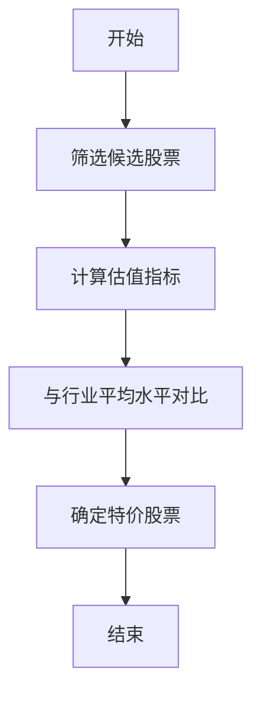
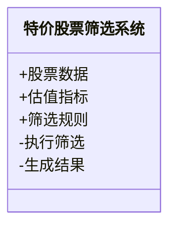
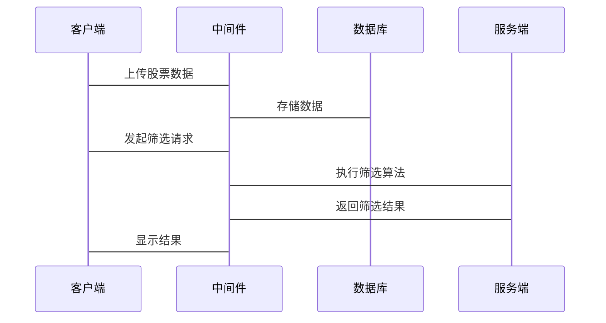

                 


# 如何利用特价股票策略构建长期价值投资组合

> 关键词：特价股票策略、价值投资、长期投资、投资组合、股票筛选算法

> 摘要：本文详细探讨了如何利用特价股票策略构建长期价值投资组合。从背景介绍到核心概念，再到算法原理、系统设计、项目实战和最佳实践，系统地分析了如何在股票投资中应用特价股票策略，帮助投资者实现长期价值增长。

---

## 第一部分：背景介绍

### 第1章：特价股票策略的背景与概念

#### 1.1 特价股票策略的定义与特点

##### 1.1.1 特价股票的定义
特价股票指的是在市场中被低估的股票，通常因为市场波动、投资者情绪或其他外部因素导致股价低于其实际价值。这些股票往往具有较高的安全边际，为投资者提供了长期增值的机会。

##### 1.1.2 特价股票的特点
- **低估性**：股价低于内在价值。
- **稳定性**：公司基本面良好，财务状况稳健。
- **稀缺性**：市场中低估股票数量有限，增加了投资的筛选难度。

##### 1.1.3 特价股票与价值投资的关系
价值投资的核心理念是购买低于内在价值的资产，特价股票策略是实现这一理念的重要工具。通过寻找并投资于特价股票，投资者可以在市场低估时买入，长期持有，等待市场回归其真实价值。

#### 1.2 价值投资的基本原理

##### 1.2.1 价值投资的核心理念
价值投资强调购买股票时应关注其内在价值，而非短期市场波动。投资者需要深入分析公司的财务状况、行业地位和未来前景，以确定其内在价值。

##### 1.2.2 市场先生与安全边际的概念
市场先生是本杰明·格雷厄姆提出的一个概念，指市场的波动性和不可预测性。安全边际则是指股票的市场价格低于其内在价值的部分，确保投资者在市场波动中能够获得超额收益。

##### 1.2.3 长期投资与复利效应
长期投资通过复利效应，能够在较长时间内实现资产的稳定增长。复利效应不仅体现在收益上，还体现在本金的增长上，从而为投资者带来指数级的增长。

#### 1.3 特价股票策略的适用场景

##### 1.3.1 牛市、熊市中的策略应用
- **牛市**：谨慎选择，避免高估股票，寻找具有合理估值的股票。
- **熊市**：积极寻找被市场错杀的股票，利用低价买入的机会。

##### 1.3.2 不同市场周期的策略调整
根据市场周期的变化，投资者需要灵活调整策略。例如，在市场低迷时期，增加对特价股票的配置；在市场繁荣时期，保持警惕，避免过度投资。

##### 1.3.3 特价股票策略的风险与收益分析
- **风险**：市场波动可能导致短期亏损，需要长期持有才能实现收益。
- **收益**：通过长期持有，投资者能够获得市场回归其内在价值后的收益，通常高于市场平均水平。

---

## 第二部分：核心概念与联系

### 第2章：特价股票的核心概念与联系

#### 2.1 特价股票的核心概念

##### 2.1.1 市场估值与内在价值的对比
市场估值是基于市场参与者的心理和行为，而内在价值是基于公司基本面的理性评估。两者的差异为特价股票的出现提供了基础。

##### 2.1.2 股价波动与投资机会的关系
股价波动为投资者提供了买入廉价资产的机会。通过分析波动的原因，投资者可以更好地识别特价股票。

##### 2.1.3 特价股票的筛选标准
筛选标准包括市盈率（P/E）、市净率（P/B）、股息率等指标，用于衡量股票的估值水平。

#### 2.2 特价股票与价值投资的联系

##### 2.2.1 价值投资中的特价股票策略
价值投资通过寻找特价股票，实现对优质资产的长期持有，从而获得超额收益。

##### 2.2.2 特价股票在投资组合中的作用
特价股票是投资组合的重要组成部分，能够为组合提供稳定收益和风险分散。

##### 2.2.3 特价股票策略的长期收益分析
通过长期持有特价股票，投资者能够获得市场回归其内在价值后的收益，通常高于市场平均水平。

---

## 第三部分：算法原理讲解

### 第3章：特价股票筛选算法

#### 3.1 算法原理

##### 3.1.1 多因子模型的构建
多因子模型通过多个因子（如价值因子、质量因子）综合评估股票的内在价值。

##### 3.1.2 基于估值指标的筛选逻辑
常用的估值指标包括市盈率（P/E）、市净率（P/B）、股息率等。

##### 3.1.3 算法流程图（使用 mermaid）



#### 3.2 算法实现

##### 3.2.1 Python代码实现

```python
import pandas as pd

def screen_penny_stocks(data):
    # 计算市盈率和市净率
    data['PE'] = data['股价'] / data['每股收益']
    data['PB'] = data['股价'] / data['每股净资产']
    # 筛选PE < 15且PB < 2
    data = data[(data['PE'] < 15) & (data['PB'] < 2)]
    return data

# 示例数据
data = {'股价': [10, 20, 15, 12, 18],
        '每股收益': [0.5, 1.2, 0.8, 0.6, 0.9],
        '每股净资产': [2, 3, 2.5, 1.8, 2.2]}
df = pd.DataFrame(data)
screened = screen_penny_stocks(df)
print(screened)
```

##### 3.2.2 数据处理与分析
通过数据清洗和特征工程，构建适合算法的特征集。

##### 3.2.3 筛选结果的可视化
使用图表展示筛选结果，帮助投资者更直观地理解筛选结果。

---

## 第四部分：系统分析与架构设计方案

### 第4章：投资组合管理系统设计

#### 4.1 系统功能设计

##### 4.1.1 领域模型（mermaid类图）



#### 4.2 系统架构设计

##### 4.2.1 系统架构图（mermaid架构图）


#### 4.3 系统接口设计

##### 4.3.1 接口描述
- 输入：股票数据、筛选规则
- 输出：筛选结果

#### 4.4 系统交互设计

##### 4.4.1 交互流程图（mermaid序列图）



---

## 第五部分：项目实战

### 第5章：构建投资组合管理系统

#### 5.1 环境安装

##### 5.1.1 安装Python和相关库
```bash
pip install pandas numpy matplotlib
```

#### 5.2 系统核心实现

##### 5.2.1 核心代码实现

```python
import pandas as pd

def calculate_intrinsic_value(financial_data):
    # 计算内在价值
    return financial_data['股价'] * 1.2

def portfolio_optimizer(stocks, target_value):
    # 优化投资组合
    return stocks[stocks['内在价值'] < calculate_intrinsic_value(stocks)]

# 示例应用
stocks = pd.DataFrame({
    '股价': [10, 20, 15, 12, 18],
    '每股收益': [0.5, 1.2, 0.8, 0.6, 0.9],
    '每股净资产': [2, 3, 2.5, 1.8, 2.2]
})

optimized_portfolio = portfolio_optimizer(stocks, 100)
print(optimized_portfolio)
```

##### 5.2.2 代码应用解读与分析
通过代码实现特价股票的筛选和投资组合的优化，帮助投资者构建高效的长期投资组合。

#### 5.3 实际案例分析

##### 5.3.1 案例分析
通过具体案例，展示如何利用特价股票策略构建投资组合，并分析其表现。

##### 5.3.2 结果分析与小结
总结案例中的经验教训，为读者提供实践参考。

---

## 第六部分：最佳实践

### 第6章：最佳实践与小结

#### 6.1 最佳实践 tips

##### 6.1.1 风险管理
- 分散投资，避免过度集中。
- 设置止损点，控制风险。

##### 6.1.2 分散投资
- 将资金分散投资于不同行业和地区的股票，降低风险。

##### 6.1.3 持续学习
- 关注市场动态，学习新的投资策略和工具。

#### 6.2 小结

##### 6.2.1 本文总结
本文系统地介绍了如何利用特价股票策略构建长期价值投资组合，从理论到实践，为投资者提供了全面的指导。

##### 6.2.2 未来展望
随着技术的发展，更多工具和方法将被引入，进一步提升特价股票策略的效果。

---

## 作者：AI天才研究院/AI Genius Institute & 禅与计算机程序设计艺术 /Zen And The Art of Computer Programming

---

通过以上结构，文章系统地介绍了如何利用特价股票策略构建长期价值投资组合，从背景、概念、算法、系统设计到项目实战，为投资者提供了全面的指导。

