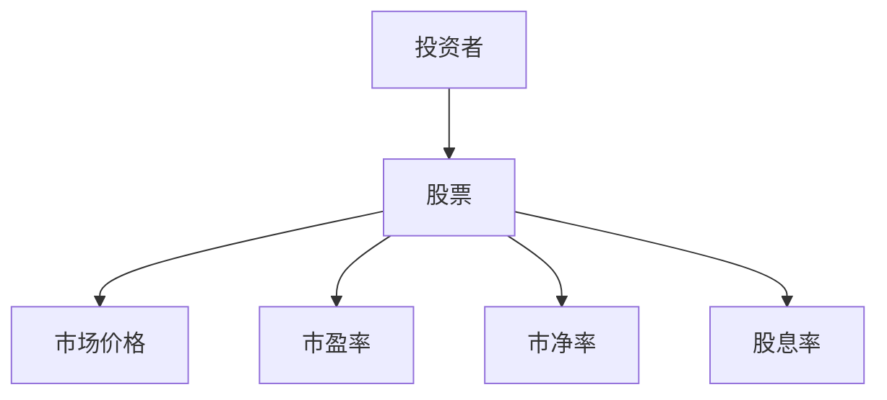
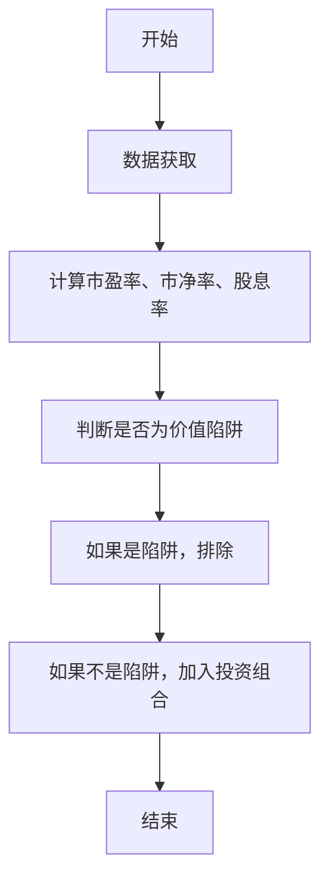
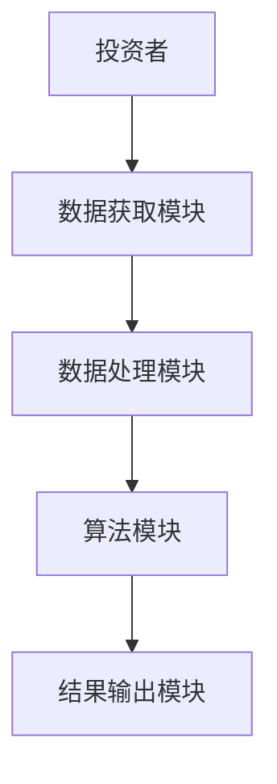

                 


# 如何利用特价股票策略进行价值陷阱规避

> **关键词**：特价股票、价值陷阱、投资策略、风险管理、价值评估、股票分析  
>
> **摘要**：本文详细探讨了如何利用特价股票策略进行价值陷阱规避，帮助投资者识别和避免潜在的财务风险。通过分析特价股票的核心概念、策略模型、系统设计和实战案例，本文为投资者提供了规避价值陷阱的实用方法和工具。

---

## 第1章: 价值陷阱与特价股票策略的背景介绍

### 1.1 价值陷阱的定义与特征

#### 1.1.1 价值陷阱的定义
价值陷阱是指那些表面上看起来估值极低，但实际上存在严重问题的股票。投资者如果盲目追求低价股票，可能会陷入这些陷阱中，导致投资损失。

#### 1.1.2 价值陷阱的核心要素
- **低估值**：市盈率、市净率等指标异常低。
- **基本面恶化**：公司盈利能力下降、债务高企等。
- **市场情绪误导**：市场恐慌导致股价被低估。

#### 1.1.3 价值陷阱的边界与外延
- **边界**：仅适用于分析上市公司的财务数据。
- **外延**：包括周期性行业和行业龙头股的短期估值波动。

### 1.2 特价股票策略的基本原理

#### 1.2.1 特价股票的定义与分类
- **定义**：价格远低于内在价值的股票。
- **分类**：分为周期性特价股票和成长性特价股票。

#### 1.2.2 价值陷阱与特价股票的区别
- **价值陷阱**：价格低但公司质地差。
- **特价股票**：价格低但公司质地好。

#### 1.2.3 特价股票策略的优劣势
- **优势**：收益潜力大。
- **劣势**：筛选难度高。

---

## 第2章: 价值陷阱的特征与类型

### 2.1 价值陷阱的主要特征

#### 2.1.1 市盈率异常低的陷阱
- **定义**：市盈率低于行业平均水平。
- **案例**：某制造公司市盈率为5，行业平均为15。

#### 2.1.2 市净率异常低的陷阱
- **定义**：市净率低于行业平均水平。
- **案例**：某银行市净率为0.5，行业平均为1。

#### 2.1.3 股息率异常高的陷阱
- **定义**：股息率远高于行业平均水平。
- **案例**：某公司股息率为15%，行业平均为5%。

### 2.2 价值陷阱的类型

#### 2.2.1 企业基本面恶化型
- **定义**：公司盈利能力和现金流恶化。
- **案例**：某公司连续亏损两年。

#### 2.2.2 行业周期性波动型
- **定义**：行业处于衰退周期。
- **案例**：某周期性行业公司股价暴跌。

#### 2.2.3 市场情绪误导型
- **定义**：市场恐慌导致股价被低估。
- **案例**：2020年新冠疫情导致的股价暴跌。

---

## 第3章: 特价股票策略的核心概念与联系

### 3.1 核心概念原理

#### 3.1.1 特价股票的数学模型
- **公式**：
  $$ \text{内在价值} = \frac{\text{净利润}}{\text{折现率}} $$
- **解释**：通过折现率计算公司未来现金流的现值，判断股价是否低估。

#### 3.1.2 价值陷阱的识别公式
- **公式**：
  $$ \text{价值陷阱指数} = \frac{\text{市盈率} \times \text{市净率} \times \text{股息率}}{\text{净利润增长率}} $$
- **解释**：指数越高，价值陷阱的可能性越大。

#### 3.1.3 策略优化的数学模型
- **公式**：
  $$ \text{优化策略} = \argmin_{i} \left( \text{风险指标} - \text{收益指标} \right) $$
- **解释**：通过优化算法选择风险最低、收益最高的股票。

### 3.2 核心概念对比表格

| 指标       | 价值陷阱 | 特价股票 |
|------------|----------|----------|
| 市盈率     | 过低     | 过低     |
| 市净率     | 过低     | 过低     |
| 股息率     | 过高     | 正常     |
| 净利润增长率 | 负增长   | 正增长   |

### 3.3 ER实体关系图



---

## 第4章: 特价股票策略的算法原理

### 4.1 算法原理概述

#### 4.1.1 特价股票筛选算法
- **步骤**：
  1. 数据获取：收集股票的基本数据。
  2. 市盈率、市净率计算。
  3. 筛选市盈率和市净率低于行业平均值的股票。

#### 4.1.2 价值陷阱识别算法
- **步骤**：
  1. 计算价值陷阱指数。
  2. 排除指数高于行业平均水平的股票。

#### 4.1.3 策略优化算法
- **步骤**：
  1. 计算每只股票的风险和收益指标。
  2. 使用优化算法选择最优股票组合。

### 4.2 算法流程图



### 4.3 算法实现代码

```python
import pandas as pd

def is_value_trap(stock_data):
    industry_avg_pe = stock_data['行业平均市盈率']
    industry_avg_pn = stock_data['行业平均市净率']
    stock_pe = stock_data['市盈率']
    stock_pn = stock_data['市净率']
    value_trap_index = (stock_pe / industry_avg_pe) * (stock_pn / industry_avg_pn)
    return value_trap_index > 1.5

# 示例数据
data = {
    '股票代码': ['A', 'B', 'C'],
    '市盈率': [10, 15, 20],
    '行业平均市盈率': [12, 14, 18],
    '市净率': [2, 3, 4],
    '行业平均市净率': [2.5, 3.5, 4.5]
}
df = pd.DataFrame(data)
```

---

## 第5章: 特价股票策略的系统设计

### 5.1 系统功能设计

#### 5.1.1 系统架构图



#### 5.1.2 系统接口设计
- **输入接口**：股票数据接口。
- **输出接口**：筛选结果接口。

#### 5.1.3 系统交互流程图


---

## 第6章: 特价股票策略的实战案例

### 6.1 实战环境搭建

#### 6.1.1 工具安装
- Python 3.8+
- Pandas、NumPy、Matplotlib库。

#### 6.1.2 数据源获取
- 股票数据：通过API获取。

### 6.2 核心代码实现

#### 6.2.1 数据获取与预处理

```python
import pandas as pd
import requests

def get_stock_data(ticker):
    url = f"https://api.example.com/stock/{ticker}"
    response = requests.get(url)
    data = response.json()
    return pd.DataFrame(data)
```

#### 6.2.2 策略实现

```python
def apply_strategy(stock_data):
    # 计算价值陷阱指数
    value_trap_index = (stock_data['市盈率'] / stock_data['行业平均市盈率']) * (stock_data['市净率'] / stock_data['行业平均市净率'])
    # 筛选非价值陷阱股票
    filtered_stocks = stock_data[value_trap_index < 1.5]
    return filtered_stocks
```

### 6.3 实战案例分析

#### 6.3.1 案例1：某制造公司
- **数据**：市盈率=10，市净率=2，行业平均市盈率=12，行业平均市净率=2.5。
- **计算**：价值陷阱指数= (10/12)*(2/2.5)=0.83 < 1.5，非陷阱。

#### 6.3.2 案例2：某科技公司
- **数据**：市盈率=15，市净率=3，行业平均市盈率=14，行业平均市净率=3.5。
- **计算**：价值陷阱指数= (15/14)*(3/3.5)=1.07 < 1.5，非陷阱。

---

## 第7章: 总结与展望

### 7.1 总结
通过本文的分析，读者可以掌握如何利用特价股票策略识别和规避价值陷阱，避免投资损失。

### 7.2 注意事项
- 定期更新股票数据。
- 结合行业趋势进行分析。

### 7.3 拓展阅读
- 《股票投资策略》
- 《风险管理的艺术》

---

**作者：AI天才研究院/AI Genius Institute & 禅与计算机程序设计艺术 /Zen And The Art of Computer Programming**

---

以上为文章的完整目录大纲和具体内容，涵盖从理论到实战的各个方面，帮助投资者全面理解和应用特价股票策略进行价值陷阱规避。

