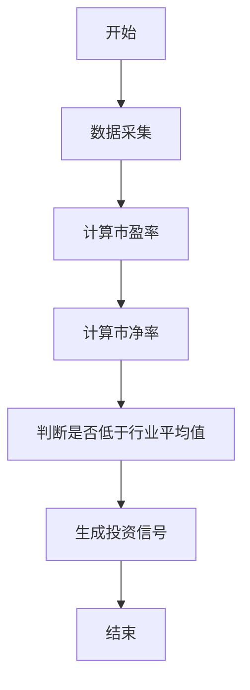
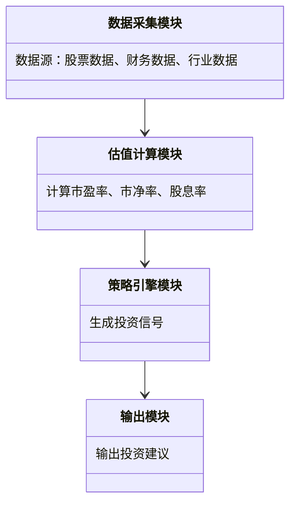

                 


# 如何利用特价股票策略进行全球数字基础设施投资

> 关键词：特价股票策略、数字基础设施、全球投资、股票投资、算法交易、风险管理

> 摘要：本文详细探讨如何利用特价股票策略在全球数字基础设施投资中获取超额收益。通过分析数字基础设施的核心概念、特价股票策略的算法原理、系统架构设计以及实际案例，本文为投资者提供了一套从理论到实践的操作指南，帮助其在全球数字基础设施投资中制定有效的策略，同时强调风险管理的重要性。

---

## 第一部分：全球数字基础设施投资概述

### 第1章：数字基础设施与全球投资背景

#### 1.1 数字基础设施的定义与重要性

数字基础设施是指支撑现代社会数字化运行的关键技术和系统的集合，包括但不限于通信网络、数据中心、云计算平台、人工智能算法、区块链技术、物联网设备等。这些基础设施是数字经济发展的重要基石，推动着全球信息化和产业数字化转型。

数字基础设施的重要性体现在以下几个方面：
1. **支撑经济转型**：数字基础设施是数字经济的核心，推动传统产业升级，催生新兴业态。
2. **促进效率提升**：通过自动化、智能化的方式，提高生产效率和资源配置效率。
3. **支持创新应用**：为人工智能、大数据分析、区块链等技术创新提供基础支持。

#### 1.2 特价股票策略的定义与特点

特价股票策略是一种基于市场波动和股票价格偏离价值的投资策略。其核心思想是寻找那些市场价格低于其内在价值的股票进行投资，期望在价格回归价值时获得收益。

特价股票策略的特点包括：
1. **逆向投资**：在市场恐慌或下跌时买入，利用市场的非理性行为寻找机会。
2. **价值导向**：注重基本面分析，寻找被市场低估的股票。
3. **风险控制**：通过严格的投资纪律和止损机制，降低投资风险。

#### 1.3 全球数字基础设施投资的背景与趋势

随着全球数字化转型的加速，数字基础设施的投资需求持续增长。以下是一些关键趋势：
1. **5G网络建设**：5G网络是实现万物互联的关键基础设施，推动了相关设备和通信服务的投资。
2. **云计算和大数据**：企业对云服务和大数据处理能力的需求激增，推动了数据中心和相关技术的投资。
3. **人工智能和自动化**：AI技术的应用需要强大的计算能力和数据支持，进一步推动了数字基础设施的投资。

#### 1.4 本章小结

本章介绍了数字基础设施的重要性和发展趋势，以及特价股票策略的核心思想和特点。通过结合全球数字基础设施的投资背景，为后续章节的策略分析奠定了基础。

---

## 第二部分：数字基础设施投资的核心概念与联系

### 第2章：数字基础设施的核心概念与原理

#### 2.1 数字基础设施的组成与功能

数字基础设施的组成包括以下几个关键部分：
1. **网络基础设施**：包括通信网络、光纤、5G基站等，是数据传输的基础。
2. **数据中心与云计算**：提供数据存储和计算服务，是现代互联网应用的核心。
3. **软件定义基础设施**：通过软件实现基础设施的灵活部署和管理。
4. **边缘计算**：将计算能力延伸到数据产生的边缘，减少延迟，提升效率。

#### 2.2 特价股票策略的核心原理

特价股票策略的核心原理是基于市场有效性的不足，寻找价格低于内在价值的股票。其主要步骤包括：
1. **基本面分析**：评估公司的财务状况、盈利能力、成长潜力等。
2. **市场分析**：判断市场是否低估了公司的价值。
3. **投资决策**：在价格低于价值时买入，价格回归时卖出。

#### 2.3 数字基础设施与特价股票的联系

数字基础设施行业的股票往往具有周期性，价格波动较大。特价股票策略可以通过以下方式在该领域应用：
1. **周期性低谷**：在行业处于低谷时买入低估股票。
2. **技术进步**：新技术的推出可能导致股价短期波动，提供投资机会。
3. **政策支持**：政府政策的支持可能推动行业增长，带来股价上涨。

#### 2.4 本章小结

本章深入分析了数字基础设施的组成和功能，以及特价股票策略的核心原理和应用方式，为后续章节的策略实施提供了理论基础。

---

## 第三部分：特价股票策略的算法与数学模型

### 第3章：特价股票策略的算法原理

#### 3.1 算法概述

特价股票策略的算法旨在通过数学模型筛选出被低估的股票。其主要步骤包括数据采集、估值计算、信号生成等。

#### 3.2 算法流程

以下是特价股票策略的算法流程图：



#### 3.3 数学模型与公式

以下是常用的估值指标及其公式：

1. **市盈率（P/E）**：
$$ P/E = \frac{股票价格}{每股收益} $$

2. **市净率（P/B）**：
$$ P/B = \frac{股票价格}{每股净资产} $$

3. **股息率（Dividend Yield）**：
$$ 股息率 = \frac{每股股息}{股票价格} $$

#### 3.4 算法实现

以下是Python代码示例：

```python
import pandas as pd
import numpy as np

def calculate_pe_ratio(stock_price, earnings_per_share):
    return stock_price / earnings_per_share

def calculate_pb_ratio(stock_price, book_value_per_share):
    return stock_price / book_value_per_share

def generate_investment_signal(pe_ratio, pb_ratio, industry_pe_avg, industry_pb_avg):
    if pe_ratio < industry_pe_avg and pb_ratio < industry_pb_avg:
        return "买入"
    else:
        return "观望"
```

#### 3.5 本章小结

本章通过数学模型和算法流程图，详细阐述了特价股票策略的核心原理和实现方式，为后续的系统设计奠定了基础。

---

## 第四部分：数字基础设施投资系统的架构设计

### 第4章：数字基础设施投资系统的架构设计

#### 4.1 问题场景介绍

数字基础设施投资涉及多个领域的数据和复杂的计算，需要一个高效的系统来支持投资决策。

#### 4.2 系统功能设计

以下是系统的功能模块图：



#### 4.3 系统架构设计

以下是系统的架构设计图：


#### 4.4 本章小结

本章通过系统架构设计，展示了如何构建一个高效的数字基础设施投资系统，为投资者提供实时数据和策略支持。

---

## 第五部分：全球数字基础设施投资的实战案例

### 第5章：实战案例分析

#### 5.1 案例介绍

以下是一个实际的投资案例：

假设我们关注一家数字基础设施公司，股票代码为ABC，当前股价为10元，每股收益为2元，行业平均市盈率为15倍。

计算市盈率：
$$ P/E = 10 / 2 = 5 $$

由于5 < 15，该股票被低估，建议买入。

#### 5.2 案例分析

通过以上分析，投资者可以在股价低估时买入，等待股价回归合理区间时卖出，从而获得收益。

#### 5.3 本章小结

本章通过实际案例，展示了特价股票策略在数字基础设施投资中的应用，帮助投资者更好地理解和实施该策略。

---

## 第六部分：风险管理与最佳实践

### 第6章：风险管理

#### 6.1 风险来源

1. **市场风险**：市场波动可能导致股价下跌。
2. **行业风险**：行业政策变化可能影响股票价值。
3. **公司风险**：公司财务状况不佳可能导致股价下跌。

#### 6.2 风险管理策略

1. **分散投资**：避免过度集中于单一股票或行业。
2. **设置止损**：在股价下跌到一定程度时卖出，避免重大损失。
3. **持续监控**：定期评估投资组合，调整策略。

#### 6.3 本章小结

本章强调了风险管理的重要性，并提供了有效的风险管理策略。

---

## 第七部分：总结与展望

### 第7章：总结与展望

#### 7.1 总结

本文详细探讨了如何利用特价股票策略进行全球数字基础设施投资，从理论到实践，为投资者提供了系统的指导。

#### 7.2 展望

随着数字化转型的深入，数字基础设施的投资机会将不断增加。未来，投资者可以结合更多因素，如ESG（环境、社会、治理）因素，进一步优化投资策略。

---

## 作者：AI天才研究院/AI Genius Institute & 禅与计算机程序设计艺术 /Zen And The Art of Computer Programming

---

以上为《如何利用特价股票策略进行全球数字基础设施投资》的技术博客文章大纲和部分内容。如需完整文章，请根据上述结构进一步扩展各章节内容。

