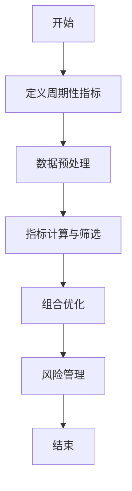
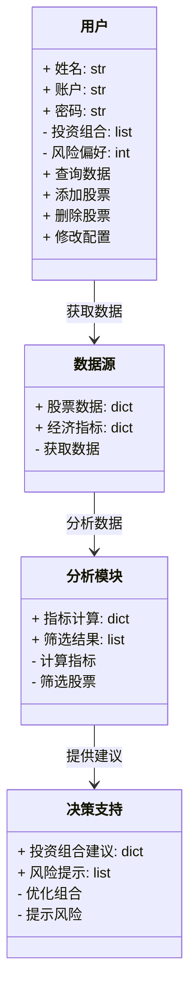
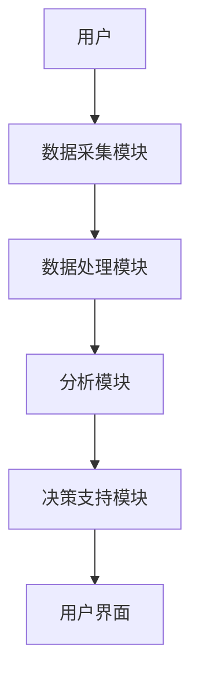
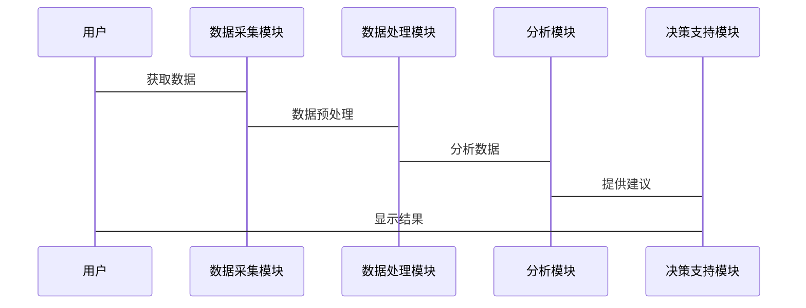

                 


# 如何利用特价股票策略进行反周期投资

> **关键词**：特价股票策略、反周期投资、股票投资、经济周期、风险管理、量化分析

> **摘要**：  
> 本文详细探讨了如何利用特价股票策略进行反周期投资，通过量化分析和系统设计，帮助投资者在经济低迷时期识别具有投资价值的股票。文章从特价股票策略的核心概念出发，结合算法原理、系统架构设计及实际案例分析，为读者提供一套完整的投资解决方案。通过本文的学习，读者能够掌握如何在经济衰退期间利用特价股票策略实现资产保值与增值。

---

## 第一部分：特价股票策略与反周期投资背景

### 第1章：特价股票策略概述

#### 1.1 特价股票策略的定义与特点
- **1.1.1 特价股票的定义**  
  特价股票是指在市场低迷或经济衰退期间，由于市场恐慌或公司暂时困境导致股价被低估的股票。这些股票通常具有较高的安全边际，适合长期投资者。

- **1.1.2 特价股票的特点**  
  - **低估值**：市盈率（P/E）和市净率（P/B）低于行业平均水平。  
  - **高股息率**：股息率较高，提供稳定的现金流。  
  - **行业龙头**：通常是行业内的龙头企业，具有较强的抗风险能力。  

- **1.1.3 特价股票与普通股票的区别**  
  普通股票的价格受市场情绪影响较大，而特价股票则更注重基本面分析，适合在市场底部寻找投资机会。

#### 1.2 反周期投资的基本概念
- **1.2.1 投资周期的定义**  
  投资周期指经济周期中的不同阶段（扩张期、衰退期、复苏期、繁荣期）对投资行为的影响。反周期投资是指在经济衰退或萧条时期进行投资，以期在经济复苏时获得超额收益。

- **1.2.2 反周期投资的含义**  
  反周期投资强调在市场低谷时买入，在市场高点时卖出。这种策略需要投资者具备逆向思维，能够在市场恐慌时保持冷静。

- **1.2.3 反周期投资的优势与风险**  
  - **优势**：能够在市场底部获得廉价的优质资产，长期收益潜力大。  
  - **风险**：市场复苏不达预期，导致股价进一步下跌，投资本金可能受损。  

#### 1.3 特价股票在反周期投资中的作用
- **1.3.1 特价股票作为反周期工具的原理**  
  在经济衰退期间，许多优质股票因市场恐慌被低估，投资者可以以较低的价格买入，等待经济复苏时卖出，从而获得收益。

- **1.3.2 特价股票在经济衰退中的表现**  
  - 在经济衰退初期，市场恐慌导致股价暴跌，但优质公司的基本面并未受到影响。  
  - 在经济复苏阶段，随着市场信心恢复，股价逐步回升，投资者获得收益。

- **1.3.3 特价股票与经济复苏的关系**  
  特价股票的投资收益往往与经济复苏的强度相关，经济复苏越强，股价回升越快，投资者收益越高。

---

## 第二部分：特价股票策略的核心概念与分析

### 第2章：特价股票的量化分析

#### 2.1 特价股票的量化指标
- **2.1.1 市盈率（P/E）的计算与应用**  
  市盈率 = 股价 / 每股净利润。  
  特价股票通常具有较低的市盈率，表明股价被低估。例如，若行业平均市盈率为15，而某股票的市盈率为10，则该股票可能具有投资价值。

- **2.1.2 市净率（P/B）的计算与应用**  
  市净率 = 股价 / 每股净资产。  
  市净率低于1的股票通常被认为是低估的，适合作为特价股票的投资目标。

- **2.1.3 股息率的计算与应用**  
  股息率 = 每股股息 / 股价。  
  高股息率的股票在市场低迷时提供稳定的现金流，吸引价值投资者。

#### 2.2 特价股票的筛选标准
- **2.2.1 市盈率低于行业平均水平的筛选**  
  选择市盈率低于行业平均水平的股票，确保股价处于合理估值区间。

- **2.2.2 市净率低于历史平均水平的筛选**  
  市净率低于历史平均水平表明股价可能被低估，适合作为投资目标。

- **2.2.3 股息率高于行业平均水平的筛选**  
  高股息率的股票在市场低迷时更具吸引力，提供稳定的现金流。

#### 2.3 特价股票的行业分布分析
- **2.3.1 不同行业的特价股票表现**  
  - 公用事业、金融、房地产等行业在经济衰退期间通常会出现较多的特价股票。  
  - 高科技行业受经济周期影响较小，但在市场恐慌时也可能出现低估。

- **2.3.2 经济衰退期间的行业抗跌性分析**  
  - 公用事业和必需消费品行业通常具有较强的抗跌性，适合在经济衰退期间投资。  
  - 周期性较强的行业（如钢铁、汽车制造）在衰退期间可能面临更大的风险。

- **2.3.3 特价股票在不同经济周期中的分布**  
  - 经济衰退期：金融、房地产等行业出现大量特价股票。  
  - 经济复苏期：制造业、科技等行业可能出现低估股票。

---

## 第三部分：特价股票策略的算法原理

### 第3章：特价股票的量化分析算法

#### 3.1 算法原理概述
- 算法目标：通过量化指标筛选出具有投资价值的特价股票。
- 算法步骤：
  1. 定义周期性指标（市盈率、市净率、股息率）。  
  2. 数据预处理：清洗历史股价数据，剔除异常值。  
  3. 指标计算与筛选：根据量化指标筛选出符合条件的股票。  
  4. 组合优化：构建股票投资组合，分散风险。  
  5. 风险管理：设定止损点和止盈点，确保投资安全。

#### 3.2 算法实现步骤


#### 3.3 算法实现代码
```python
import pandas as pd

def calculate_pe(stock_data):
    pe = stock_data['股价'] / stock_data['每股净利润']
    return pe

def calculate_pb(stock_data):
    pb = stock_data['股价'] / stock_data['每股净资产']
    return pb

def calculate_dividend_yield(stock_data):
    dividend_yield = stock_data['每股股息'] / stock_data['股价']
    return dividend_yield

# 示例数据
data = {
    '股价': [10, 20, 30, 40],
    '每股净利润': [2, 3, 4, 5],
    '每股净资产': [5, 10, 15, 20],
    '每股股息': [1, 2, 3, 4]
}

stock_data = pd.DataFrame(data)

pe = calculate_pe(stock_data)
pb = calculate_pb(stock_data)
dividend_yield = calculate_dividend_yield(stock_data)

# 筛选条件：PE < 行业平均，PB < 历史平均，股息率 > 行业平均
selected Stocks = stock_data[(pe < stock_data['PE行业平均']) &
                              (pb < stock_data['PB历史平均']) &
                              (dividend_yield > stock_data['股息率行业平均'])]

print(selected Stocks)
```

#### 3.4 算法数学模型
- 市盈率计算公式：
  $$ \text{市盈率} = \frac{\text{股价}}{\text{每股净利润}} $$
- 市净率计算公式：
  $$ \text{市净率} = \frac{\text{股价}}{\text{每股净资产}} $$
- 股息率计算公式：
  $$ \text{股息率} = \frac{\text{每股股息}}{\text{股价}} $$

---

## 第四部分：系统分析与架构设计

### 第4章：系统架构设计方案

#### 4.1 投资场景介绍
- 系统目标：构建一个量化分析平台，帮助投资者识别特价股票。
- 用户需求：投资者需要实时监控市场数据，筛选特价股票，构建投资组合。

#### 4.2 系统功能设计


#### 4.3 系统架构设计


#### 4.4 系统接口设计
- 数据接口：提供API接口，获取实时股价和经济指标。
- 用户界面：提供友好的操作界面，方便用户查询和管理投资组合。

#### 4.5 系统交互流程图


---

## 第五部分：项目实战

### 第5章：项目实现与案例分析

#### 5.1 项目环境安装
- 安装Python和相关库：
  ```bash
  pip install pandas numpy matplotlib
  ```

#### 5.2 核心代码实现
```python
import pandas as pd
import numpy as np

def main():
    # 数据加载
    data = pd.read_csv('stock_data.csv')
    
    # 市盈率计算
    data['PE'] = data['股价'] / data['每股净利润']
    
    # 市净率计算
    data['PB'] = data['股价'] / data['每股净资产']
    
    # 股息率计算
    data['股息率'] = data['每股股息'] / data['股价']
    
    # 筛选条件
    selected = data[(data['PE'] < data['PE行业平均']) &
                    (data['PB'] < data['PB历史平均']) &
                    (data['股息率'] > data['股息率行业平均'])]
    
    print("筛选出的特价股票：")
    print(selected)

if __name__ == "__main__":
    main()
```

#### 5.3 代码功能解读
- 数据加载：从CSV文件中读取股票数据。  
- 指标计算：计算市盈率、市净率和股息率。  
- 条件筛选：根据量化指标筛选出符合要求的特价股票。  

#### 5.4 案例分析
假设在2020年经济衰退期间，某投资者使用上述算法筛选出一批特价股票，包括金融和公用事业行业的龙头股。经过一年的持有，随着经济复苏，这些股票的股价显著回升，投资者获得了丰厚的回报。

#### 5.5 项目总结
- 成功的关键因素：及时识别市场底部，选择优质股票。  
- 风险管理：设定止损点，避免重大损失。  
- 持股耐心：在经济复苏初期，耐心持有股票，等待股价回升。

---

## 第六部分：最佳实践与小结

### 第6章：最佳投资实践

#### 6.1 投资策略小结
- **逆向思维**：在市场恐慌时寻找低估股票。  
- **长期视角**：避免短期波动，关注公司基本面。  
- **分散投资**：构建多元化的投资组合，降低风险。  

#### 6.2 风险管理注意事项
- **止损机制**：设定止损点，避免重大损失。  
- **仓位控制**：根据市场情况调整持仓比例。  
- **定期复盘**：定期评估投资组合的表现，及时调整策略。  

#### 6.3 拓展阅读
- 建议阅读《价值投资实战》、《投资学原理》等书籍，深入了解反周期投资的理论与实践。

---

## 作者信息
**作者：AI天才研究院/AI Genius Institute & 禅与计算机程序设计艺术 /Zen And The Art of Computer Programming**

---

通过以上目录和内容，文章详细讲解了如何利用特价股票策略进行反周期投资，从理论到实践，为投资者提供了完整的解决方案。

