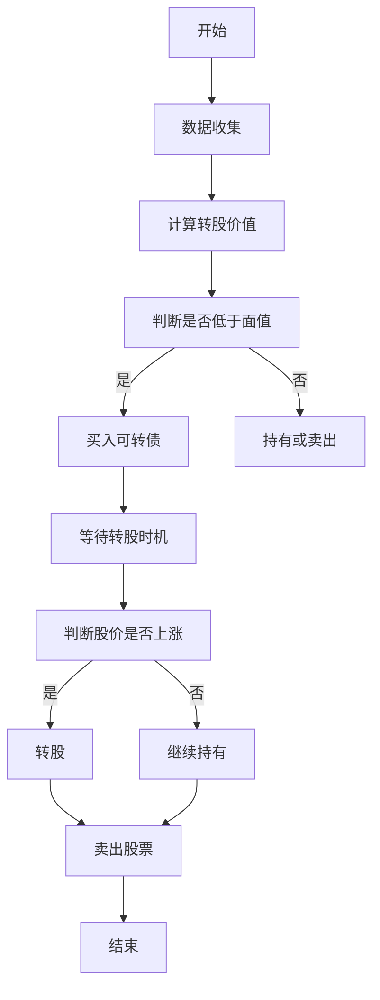
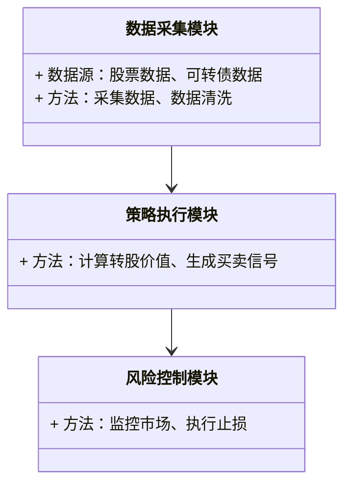
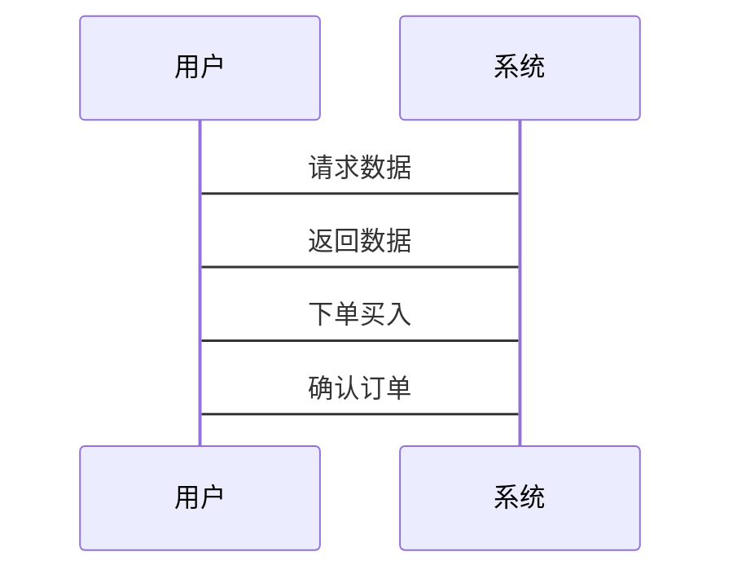

                 


# 如何利用特价股票策略进行可转债投资

## 关键词：特价股票策略、可转债、投资策略、算法、系统设计

## 摘要：本文详细探讨如何利用特价股票策略优化可转债投资。通过分析市场环境、策略实施步骤、算法设计及系统架构，结合实际案例，为投资者提供实用指导。

---

## 第1章：背景与概念

### 1.1 特价股票策略与可转债概述

#### 1.1.1 特价股票策略的核心概念
- **定义**：特价股票策略是指在低价时买入股票，在高价时卖出，以获取利润的策略。
- **特点**：高波动性、高风险、高回报。
- **与可转债的关系**：可转债允许投资者在特定条件下将其转换为股票，从而利用股票价格波动获利。

#### 1.1.2 可转债的基本概念与特性
- **定义**：可转债是一种债券，允许持有者在特定条件下将其转换为公司股票。
- **特点**：兼具债券和股票特性，风险较低，收益潜力大。

#### 1.1.3 特价股票策略与可转债的关系
- **套利机会**：利用股票低价买入，高价卖出，结合可转债的特性，优化投资组合。
- **风险管理**：可转债的债券特性为投资提供了保护，降低了纯股票投资的风险。

---

## 第2章：特价股票策略的实施步骤

### 2.1 确定投资目标

#### 2.1.1 确定可转债的投资目标
- **选择可转债品种**：根据公司基本面、行业前景等因素，选择具有增长潜力的公司发行的可转债。
- **评估转股价值**：计算可转债的转股价值，判断其是否被市场低估或高估。

#### 2.1.2 选择适合的股票品种
- **行业分析**：选择具有成长潜力的行业，如科技、医疗等。
- **技术分析**：使用技术指标如K线、均线等，判断股票的买卖点。

#### 2.1.3 制定投资计划
- **资金分配**：根据风险承受能力，合理分配资金，避免过度集中。
- **时间规划**：设定投资时间框架，短期、中期、长期相结合。

---

## 第3章：可转债的基本原理

### 3.1 可转债的结构与定价模型

#### 3.1.1 可转债的基本结构
- **债券部分**：包括面值、票面利率、期限。
- **转股权部分**：包括转股价格、转股期限、转股比例。

#### 3.1.2 可转债的定价模型
- **债券价值**：根据市场利率计算债券的现值。
- **转股价值**：根据股票价格计算转股的价值。
- **期权价值**：将转股权视为期权，计算其价值。

### 3.2 影响可转债价格的因素

#### 3.2.1 债券收益率
- **市场利率变化**：市场利率上升，债券价格下降；反之亦然。

#### 3.2.2 股票价格波动
- **股票价格上涨**：转股价值增加，可转债价格上涨。
- **股票价格下跌**：转股价值减少，可转债价格受债券部分支撑。

#### 3.2.3 转股价格调整
- **向下修正**：当股票价格大幅下跌时，转股价格可能下调，增加可转债的价值。

---

## 第4章：特价股票策略与可转债的结合

### 4.1 策略实施中的套利机会

#### 4.1.1 价差套利
- **买入低价股票，卖出高价**：通过可转债的转股权，捕捉股票价格波动带来的收益。

#### 4.1.2 转股时机选择
- **低价买入可转债，高价转股**：利用股票价格波动，选择最佳转股时机。

### 4.2 风险管理与控制

#### 4.2.1 风险来源
- **市场风险**：股票价格波动对可转债价值的影响。
- **流动性风险**：可转债市场的流动性不足，可能导致买卖价差较大。

#### 4.2.2 风险控制措施
- **分散投资**：选择不同行业的可转债，降低行业风险。
- **止损策略**：设定止损点，避免重大损失。

---

## 第5章：算法设计与实现

### 5.1 算法流程图



### 5.2 Python代码实现

```python
import pandas as pd
import numpy as np

def calculate_convert_value(convert_price, stock_price):
    return max(convert_price, stock_price * 1.05)

def decision_rule(convert_value, bond_price):
    if convert_value > bond_price * 1.02:
        return "买入"
    elif bond_price < calculate_convert_value(convert_price, stock_price) * 0.95:
        return "卖出"
    else:
        return "持有"

# 示例数据
convert_price = 100
stock_price = 95
bond_price = 98

decision = decision_rule(convert_price, bond_price)
print(f"决策：{decision}")
```

### 5.3 算法数学模型

- **转股价值计算**：$$convert\_value = max(convert\_price, stock\_price \times 1.05)$$
- **决策规则**：$$
    \begin{cases}
        买入 & \text{if } convert\_value > bond\_price \times 1.02 \\
        卖出 & \text{if } bond\_price < convert\_value \times 0.95 \\
        持有 & \text{otherwise}
    \end{cases}
$$

---

## 第6章：系统分析与架构设计

### 6.1 系统功能设计

#### 6.1.1 功能模块
- 数据采集模块：收集股票和可转债的市场数据。
- 策略执行模块：根据算法生成买卖信号。
- 风险控制模块：监控市场变化，执行止损策略。

#### 6.1.2 系统架构



### 6.2 接口与交互设计

#### 6.2.1 数据接口

- API接口：提供REST API，供其他系统调用数据。

#### 6.2.2 用户交互



---

## 第7章：项目实战

### 7.1 环境安装与配置

- **工具安装**：安装Python、Pandas、NumPy等工具。
- **数据源获取**：通过API获取股票和可转债数据。

### 7.2 核心代码实现

```python
import pandas as pd
import requests

# 获取数据
response = requests.get("https://api.example.com/stock_data")
data = response.json()
df = pd.DataFrame(data)

# 计算转股价值
df['convert_value'] = df.apply(lambda x: max(x['convert_price'], x['stock_price'] * 1.05), axis=1)

# 生成决策信号
df['decision'] = df.apply(lambda x: "买入" if x['convert_value'] > x['bond_price'] * 1.02 else "卖出", axis=1)

print(df.head())
```

### 7.3 实际案例分析

- **案例选择**：选择某公司发行的可转债，分析其转股价值和市场走势。
- **策略执行**：根据算法生成买卖信号，模拟交易过程。

### 7.4 项目总结

- **收益评估**：计算投资回报率。
- **策略优化**：根据实际效果调整算法参数。

---

## 第8章：最佳实践与注意事项

### 8.1 投资者注意事项

- **风险管理**：设置止损点，避免重大损失。
- **市场监控**：密切关注市场变化，及时调整策略。
- **心理因素**：避免贪婪和恐惧，保持理性决策。

### 8.2 小结

- 特价股票策略结合可转债投资，可以有效利用市场波动，优化投资组合。
- 算法和系统的应用，提高了策略的科学性和可操作性。

### 8.3 拓展阅读

- 推荐书籍：《投资学基础》、《算法交易入门》。
- 在线资源：相关投资论坛、数据分析博客。

---

## 作者：AI天才研究院 & 禅与计算机程序设计艺术

---

通过以上内容，您可以系统地学习如何利用特价股票策略进行可转债投资。从理论到实践，从策略到系统，全面掌握这一投资方法。

