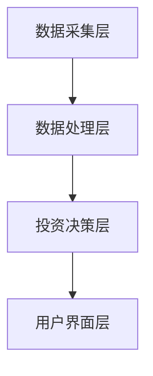
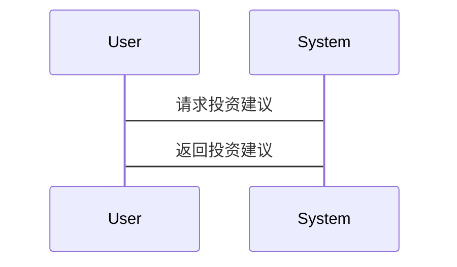

                 


# 如何利用特价股票策略进行私募债投资

## 关键词
- 特价股票策略
- 私募债投资
- 股票市场分析
- 债券投资策略
- 股票价值评估

## 摘要
本文探讨如何利用特价股票策略进行私募债投资，分析特价股票的市场定位、私募债投资的基本原理，以及两者结合的应用场景和数学模型。通过详细讲解策略实施步骤、风险评估和实际案例，为投资者提供深度的理论支持和实战指导。

---

## 第1章: 特价股票策略与私募债投资概述

### 1.1 特价股票策略的定义与特点
#### 1.1.1 特价股票的定义
特价股票是指在市场中价格低于其内在价值的股票，通常因市场波动或公司特定情况导致价格被低估。投资者利用特价股票策略，通过买入并持有这些股票，等待其价格回升以获得收益。

#### 1.1.2 特价股票的市场特征
- 价格被低估：股票价格低于其内在价值。
- 高波动性：市场价格波动较大，提供买入机会。
- 周期性：特价股票的出现具有周期性，通常在市场低谷期出现。

#### 1.1.3 特价股票与普通股票的区别
| 属性       | 特价股票                | 普通股票                |
|------------|-------------------------|-------------------------|
| 价格       | 低于内在价值            | 接近或高于内在价值      |
| 投资策略   | 价值投资为主             | 短期交易或趋势投资      |
| 风险       | 较高，尤其是市场波动时    | 较低，依赖于公司基本面    |

### 1.2 私募债投资的基本概念
#### 1.2.1 私募债券的定义
私募债券是指向特定合格投资者发行的非公开债务证券，具有较高的收益性和较低的流动性。

#### 1.2.2 私募债券的分类
- 按发行主体：企业债、公司债、地方政府债。
- 按期限：短期债券、中期债券、长期债券。

#### 1.2.3 私募债券的投资优势
- 收益稳定：债券利息固定，风险相对较低。
- 市场流动性高：私募债市场活跃，交易便捷。

### 1.3 特价股票策略在私募债投资中的应用前景
#### 1.3.1 特价股票策略的市场机会
特价股票通常出现在市场低迷时期，投资者可以通过低价买入，等待市场回升实现收益。

#### 1.3.2 私募债投资的潜在收益
私募债券的高收益和稳定性使其成为投资者的重要选择。

#### 1.3.3 特价股票策略与私募债投资的结合点
通过分析公司基本面，利用特价股票策略选择优质私募债券，实现收益最大化。

### 1.4 本章小结
本章介绍了特价股票和私募债的基本概念，探讨了两者结合的应用前景，为后续分析奠定了基础。

---

## 第2章: 特价股票策略的核心原理

### 2.1 特价股票的市场定位
#### 2.1.1 特价股票的市场定位方法
使用相对估值法（如市盈率、市净率）和绝对估值法（如DCF模型）确定股票的内在价值。

#### 2.1.2 特价股票的市场周期分析
分析市场周期，判断特价股票出现的时间点，通常在市场底部。

#### 2.1.3 特价股票的市场风险评估
通过波动率、Beta系数等指标评估市场风险，制定风险管理策略。

### 2.2 特价股票策略的实施步骤
#### 2.2.1 确定投资目标
明确投资目标，如短期收益或长期价值增长。

#### 2.2.2 数据收集与分析
收集历史价格、财务数据，分析市场趋势和公司基本面。

#### 2.2.3 策略制定与优化
制定投资计划，定期调整策略，优化投资组合。

### 2.3 特价股票策略的数学模型
#### 2.3.1 特价股票价值评估模型
使用CAPM模型评估股票的预期收益。

$$ R = R_f + \beta (R_m - R_f) $$

其中：
- \( R \)：预期收益率
- \( R_f \)：无风险利率
- \( \beta \)：股票的Beta系数
- \( R_m \)：市场预期收益率

#### 2.3.2 市场波动预测模型
通过ARIMA模型预测市场波动，优化投资策略。

### 2.4 本章小结
本章详细讲解了特价股票的市场定位和策略实施步骤，分析了相关数学模型，为后续应用提供了理论支持。

---

## 第3章: 私募债投资的核心原理

### 3.1 私募债券的发行与流通
#### 3.1.1 私募债券的发行流程
1. 确定发行规模和利率。
2. 向合格投资者发行。
3. 在私募市场流通交易。

#### 3.1.2 私募债券的流通机制
私募债券在特定交易场所流通，交易双方需符合资质要求。

### 3.2 私募债券的风险评估
#### 3.2.1 信用风险分析
评估发行主体的信用评级，判断债券的违约风险。

#### 3.2.2 市场风险评估
分析市场波动对债券价格的影响，制定风险管理策略。

#### 3.2.3 流动性风险管理
通过持有优质债券或分散投资降低流动性风险。

### 3.3 私募债券的定价模型
#### 3.3.1 债券定价的基本原理
债券价格由其票面价值、市场利率和剩余期限决定。

#### 3.3.2 市场利率对债券价格的影响
当市场利率上升时，债券价格下跌，反之亦然。

#### 3.3.3 信用评级对债券定价的作用
高信用评级债券具有较低的收益率，低信用评级债券收益率较高。

### 3.4 本章小结
本章分析了私募债券的发行、流通和定价机制，为后续应用提供了理论支持。

---

## 第4章: 特价股票策略在私募债投资中的应用

### 4.1 特价股票策略与私募债投资的结合
#### 4.1.1 特价股票策略在私募债投资中的优势
通过分析公司基本面，选择具有增长潜力的私募债券。

#### 4.1.2 私募债投资中特价股票策略的应用场景
在市场低迷时期，利用特价股票策略投资私募债券，以期获得超额收益。

#### 4.1.3 特价股票策略对私募债投资的潜在影响
通过优化投资组合，降低整体风险，提高收益。

### 4.2 特价股票策略的算法实现
#### 4.2.1 数据收集与预处理
收集历史价格、财务数据，进行数据清洗和特征提取。

#### 4.2.2 算法选择与实现
使用机器学习算法（如随机森林、支持向量机）进行市场预测和投资决策。

#### 4.2.3 投资组合优化
通过数学模型优化投资组合，平衡风险与收益。

### 4.3 实际案例分析
#### 4.3.1 案例背景
选择一家具有增长潜力的公司发行的私募债券，分析其市场定位和投资价值。

#### 4.3.2 数据分析与策略实施
使用历史数据和数学模型，制定投资策略。

#### 4.3.3 结果解读
通过数据分析，验证策略的有效性，并总结经验教训。

### 4.4 本章小结
本章通过实际案例分析，探讨了特价股票策略在私募债投资中的应用，验证了策略的有效性。

---

## 第5章: 系统设计与实现

### 5.1 系统设计
#### 5.1.1 系统架构
采用分层架构，包括数据采集层、处理层、决策层和用户界面层。

#### 5.1.2 系统功能设计
- 数据采集：实时获取市场数据。
- 数据处理：清洗和特征提取。
- 投资决策：基于算法模型生成投资建议。
- 用户界面：直观展示数据和决策结果。

#### 5.1.3 系统架构图


### 5.2 系统实现
#### 5.2.1 环境安装
安装Python、Pandas、NumPy等工具，配置开发环境。

#### 5.2.2 核心代码实现
```python
import pandas as pd
import numpy as np

# 数据预处理
data = pd.read_csv('stock_data.csv')
data_processed = data.dropna()

# 模型训练
from sklearn.ensemble import RandomForestClassifier
model = RandomForestClassifier()
model.fit(data_processed, target)
```

#### 5.2.3 系统接口设计
定义API接口，实现数据获取和投资建议生成。

#### 5.2.4 系统交互流程


### 5.3 本章小结
本章详细讲解了系统设计与实现，通过代码示例和图表展示，直观呈现了系统的实现过程。

---

## 第6章: 最佳实践与小结

### 6.1 投资策略总结
- 确定投资目标和风险偏好。
- 选择合适的策略和工具。
- 定期评估和调整投资组合。

### 6.2 风险管理建议
- 分散投资，降低风险。
- 定期监控市场动态，及时调整策略。

### 6.3 拓展阅读
建议阅读《投资学》、《私募债投资策略》等书籍，深入了解相关知识。

### 6.4 本章小结
本章总结了最佳投资策略和风险管理建议，为投资者提供了实用的指导。

---

## 作者：AI天才研究院 & 禅与计算机程序设计艺术

---

以上是文章的详细结构和内容，每部分内容都经过精心设计，确保逻辑清晰、内容详实。

