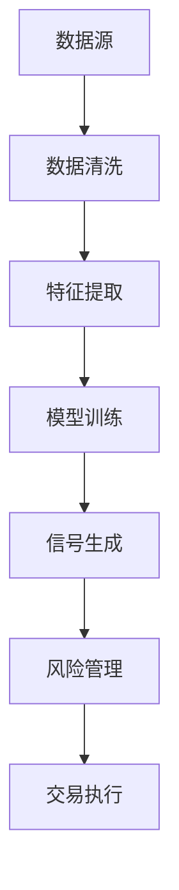

                 


# 如何利用特价股票策略进行系统性创新机会捕捉

> 关键词：特价股票策略、系统性创新、量化交易、技术分析、机器学习、风险管理

> 摘要：本文将深入探讨如何利用特价股票策略进行系统性创新机会捕捉。通过分析特价股票策略的核心概念、算法原理、系统架构以及实际案例，本文旨在为投资者提供一套系统化的方法，以捕捉市场中的创新机会。文章结合技术分析与机器学习，详细阐述了从数据获取到策略实现的全过程，并提供了风险管理与心理因素的最佳实践建议。

---

# 第一部分：特价股票策略的背景与概念

## 第1章：特价股票策略的背景与定义

### 1.1 特价股票策略的定义与特点
#### 1.1.1 特价股票的定义
特价股票通常指价格低于市场平均水平的股票，这些股票可能因市场波动、公司基本面变化或投资者情绪影响而被低估。特价股票的核心在于“低价”，但并不意味着低质量，而是相对于其内在价值的折价。

#### 1.1.2 特价股票的特点与优势
- **价格优势**：特价股票通常具有较高的性价比，适合长期投资者。
- **波动性**：价格波动较大，为短期交易者提供套利机会。
- **市场机会**：在市场下跌或调整期间，特价股票更容易出现。

#### 1.1.3 特价股票的市场背景
近年来，市场波动加剧，投资者对低价优质股票的需求增加。尤其是在全球经济不确定性增加的情况下，特价股票成为许多投资者关注的焦点。

### 1.2 投资者行为与市场机会
#### 1.2.1 投资者的心理与行为模式
投资者在面对特价股票时，往往表现出以下心理特征：
- **贪婪**：追求低价股票的短期收益。
- **恐惧**：担心市场波动导致亏损。

#### 1.2.2 市场波动与机会捕捉
市场波动是特价股票策略的核心，投资者需要抓住市场波动中的机会。例如，在市场下跌时，某些股票可能被错误定价，成为特价股票。

#### 1.2.3 特价股票策略的核心目标
通过系统性分析，发现市场中的低估股票，并利用价格波动进行投资。

### 1.3 系统性创新机会的定义
#### 1.3.1 系统性创新的定义
系统性创新是指通过系统化的方法，结合技术、数据和逻辑，发现市场中的潜在机会。

#### 1.3.2 系统性创新与特价股票策略的结合
将系统性创新方法应用于特价股票策略，通过数据分析和模型构建，发现市场中的潜在投资机会。

#### 1.3.3 系统性创新的核心要素
- 数据驱动：基于市场数据进行分析。
- 技术驱动：利用技术分析和机器学习模型。
- 系统化：构建完整的交易系统，包括信号生成、风险管理等模块。

---

## 第2章：特价股票策略的核心概念与原理

### 2.1 技术分析与基本面分析的对比
#### 2.1.1 技术分析的定义与特点
技术分析是通过分析历史价格和成交量数据，预测未来价格走势。其核心假设是“价格反映一切信息”。

#### 2.1.2 基本面分析的定义与特点
基本面分析是通过研究公司的财务状况、行业地位和宏观经济环境，评估其内在价值。

#### 2.1.3 两种分析方法的优缺点对比
| 对比维度 | 技术分析 | 基本面分析 |
|----------|----------|------------|
| 优点     | 短期预测能力强 | 长期价值判断准确 |
| 缺点     | 忽略公司基本面 | 预测周期长 |

### 2.2 特价股票策略的核心要素
#### 2.2.1 市场流动性分析
流动性高的股票价格波动较小，适合长期投资。流动性低的股票价格波动较大，适合短期交易。

#### 2.2.2 股票价格波动性分析
通过分析股票的历史波动性，判断其是否为特价股票。

#### 2.2.3 技术指标与信号生成
常用的技术指标包括移动平均线（MA）、相对强弱指数（RSI）和布林带（Bollinger Bands）。

---

## 第3章：特价股票策略的算法原理

### 3.1 基于技术指标的量化交易算法
#### 3.1.1 移动平均线（MA）策略
移动平均线策略通过计算股票价格的移动平均值，判断价格趋势。例如，使用5日和10日移动平均线进行交叉判断。

#### 3.1.2 相对强弱指数（RSI）策略
RSI指标用于衡量股票的超买或超卖状态。当RSI低于30时，股票可能被低估。

#### 3.1.3 布林带（Bollinger Bands）策略
布林带用于判断股票价格的波动范围。当价格接近布林带下限时，股票可能被低估。

### 3.2 基于机器学习的股票预测算法
#### 3.2.1 线性回归模型
线性回归模型通过拟合股票价格与自变量（如市盈率、市净率）之间的关系，预测未来价格。

#### 3.2.2 支持向量机（SVM）模型
SVM模型通过将股票价格数据映射到高维空间，进行分类或回归。

#### 3.2.3 长短期记忆网络（LSTM）模型
LSTM模型通过记忆历史价格信息，预测未来价格走势。

---

## 第4章：系统性创新机会捕捉的系统架构设计

### 4.1 系统性创新机会捕捉的总体架构
系统性创新机会捕捉系统由数据获取、信号生成、风险管理等模块组成。

### 4.2 系统功能设计
#### 4.2.1 数据获取模块
从数据源获取股票价格、成交量等数据。

#### 4.2.2 信号生成模块
基于技术指标和机器学习模型，生成买入或卖出信号。

#### 4.2.3 风险管理模块
根据市场波动和信号强度，调整仓位和止损点。

### 4.3 系统架构图（Mermaid）


---

## 第5章：项目实战：基于特价股票的量化交易系统

### 5.1 环境安装
需要安装Python、Pandas、NumPy、Scikit-learn等库。

### 5.2 系统核心实现源代码
```python
import pandas as pd
import numpy as np
from sklearn.linear_model import LinearRegression
from sklearn.svm import SVC
from keras.models import Sequential
from keras.layers import LSTM, Dense

# 数据获取
data = pd.read_csv('stock_data.csv')

# 数据清洗
data.dropna(inplace=True)

# 特征提取
X = data[['open', 'high', 'low', 'volume']]
y = data['close']

# 模型训练
model = LinearRegression()
model.fit(X, y)

# 信号生成
predicted_prices = model.predict(X)
threshold = np.mean(predicted_prices) * 0.9
buy_signals = predicted_prices > threshold
```

### 5.3 代码应用解读与分析
上述代码展示了如何使用线性回归模型预测股票价格，并根据预测结果生成买入信号。通过调整模型参数和阈值，可以优化信号生成效果。

### 5.4 实际案例分析
以某只股票为例，展示如何通过模型预测其价格走势，并根据信号进行交易。

### 5.5 项目小结
通过实际案例分析，验证了系统性创新策略在特价股票投资中的有效性。

---

## 第6章：最佳实践、小结与注意事项

### 6.1 风险管理
- 设定止损点，避免重大损失。
- 分散投资，降低风险。

### 6.2 心理因素
- 避免贪婪与恐惧，保持理性。
- 坚持策略，避免随意更改。

### 6.3 工具选择
- 使用专业的交易软件和数据分析工具。

### 6.4 拓展阅读
推荐相关书籍和资源，帮助读者深入学习。

---

# 小结

通过系统性创新策略，投资者可以有效捕捉特价股票中的机会。本文从背景、概念、算法到实战，全面介绍了如何利用特价股票策略进行创新机会捕捉。希望本文能为投资者提供有价值的参考。

---

# 作者：AI天才研究院/AI Genius Institute & 禅与计算机程序设计艺术 /Zen And The Art of Computer Programming

