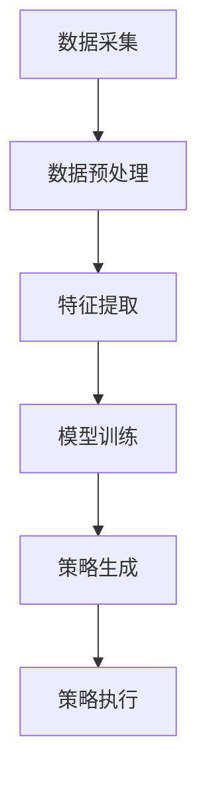
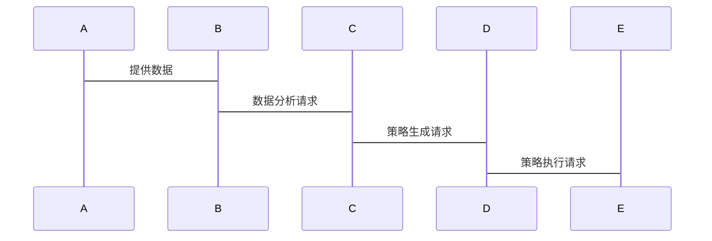

                 


```markdown
# 如何利用特价股票策略进行系统性数字创新溢出效应捕捉

> 关键词：特价股票策略，数字创新溢出效应，股票市场分析，投资策略，系统性创新

> 摘要：本文将深入探讨如何利用特价股票策略来捕捉数字创新溢出效应，分析其在股票市场中的应用，结合算法原理、数学模型和系统架构，提供从理论到实践的详细指导。

---

## 第1章: 特价股票策略的背景与意义

### 1.1 特价股票策略的定义与背景

#### 1.1.1 特价股票的定义与特点
- 特价股票的定义
- 市场中的特点：低价、高潜力
- 投资者关注点：价值回归的可能性

#### 1.1.2 特价股票策略的市场背景
- 股票市场的波动性
- 经济周期与股票价格的关系
- 特价股票策略的适用场景

#### 1.1.3 特价股票策略的应用价值
- 投资者收益：低风险高回报
- 市场效率：利用市场非理性定价的机会

### 1.2 数字创新溢出效应的概念

#### 1.2.1 数字创新的定义与特征
- 数字创新的定义
- 数字技术对企业的影响
- 创新扩散的特征

#### 1.2.2 溢出效应的经济学解释
- 溢出效应的定义
- 经济学中的溢出效应类型
- 数字创新溢出效应的特殊性

#### 1.2.3 数字创新溢出效应的市场表现
- 市场反应：股价波动
- 投资机会：创新带来的超额收益

### 1.3 特价股票策略与数字创新溢出效应的关系

#### 1.3.1 特价股票策略如何捕捉数字创新机会
- 低价股票中的创新企业
- 数字创新带来的潜在价值增长

#### 1.3.2 数字创新溢出效应如何影响股票市场
- 创新扩散对股价的影响
- 市场参与者行为变化

#### 1.3.3 两者的结合对企业投资的启示
- 投资策略的优化
- 风险管理的重要性

---

## 第2章: 特价股票策略的核心概念与分析框架

### 2.1 特价股票策略的核心要素

#### 2.1.1 市场周期分析
- 股票市场的周期性
- 特价股票在不同周期的表现

#### 2.1.2 股价波动规律
- 技术分析与基本面分析
- 影响股价波动的因素

#### 2.1.3 投资者行为分析
- 群体心理对股价的影响
- 投资者行为与市场效率

### 2.2 数字创新溢出效应的分析模型

#### 2.2.1 数字创新的扩散路径
- 技术创新的传播过程
- 数字创新对行业的影响

#### 2.2.2 溢出效应的量化指标
- 市场渗透率
- 创新扩散速度

#### 2.2.3 数字创新与股价关系的数学模型
- 回归分析模型
- 时间序列分析模型

### 2.3 特价股票策略与数字创新溢出效应的系统性分析

#### 2.3.1 系统性投资策略的定义
- 系统性与非系统性风险
- 系统性策略的优势

#### 2.3.2 数字创新溢出效应的系统性捕捉方法
- 数据驱动的分析方法
- 量化模型的应用

#### 2.3.3 系统性策略的优势与挑战
- 优势：降低风险，提高收益稳定性
- 挑战：模型的有效性和可扩展性

---

## 第3章: 特价股票策略的算法与数学模型

### 3.1 数据采集与预处理

#### 3.1.1 数据来源与采集方法
- 股票数据来源：交易所、数据库
- 数据清洗：去除噪声数据

#### 3.1.2 数据特征提取
- 技术指标：移动平均线、RSI
- 市场情绪指标：波动率、交易量

#### 3.1.3 数据存储与管理
- 数据库设计：关系型与非关系型数据库
- 数据存储策略：归档与实时存储

### 3.2 算法实现

#### 3.2.1 基于机器学习的股票预测算法
- 线性回归模型
- 支持向量机（SVM）
- 神经网络模型（RNN, LSTM）

#### 3.2.2 时间序列分析模型
- ARIMA模型
- GARCH模型
- Prophet模型

#### 3.2.3 群策群算法在股票策略中的应用
- 群策群算法简介
- 群策群算法在股票策略中的实现
- 群策群算法的优缺点分析

### 3.3 算法流程图



### 3.4 数学模型与公式

#### 3.4.1 回归分析模型
$$ y = \beta_0 + \beta_1 x + \epsilon $$

#### 3.4.2 时间序列模型
$$ ARIMA(p, d, q) $$

#### 3.4.3 群策群算法模型
$$ f(x) = \frac{1}{n}\sum_{i=1}^{n}f_i(x) $$

---

## 第4章: 系统分析与架构设计方案

### 4.1 项目背景与需求分析

#### 4.1.1 项目背景
- 数字创新的快速发展
- 股票市场的复杂性

#### 4.1.2 项目目标
- 捕捉数字创新溢出效应
- 利用特价股票策略进行投资

### 4.2 系统功能设计

#### 4.2.1 数据采集模块
- 数据来源：API接口、数据库
- 数据类型：股价、交易量、市场情绪

#### 4.2.2 数据分析模块
- 数据清洗与特征提取
- 模型训练与策略生成

#### 4.2.3 策略执行模块
- 策略选择：基于模型的推荐
- 策略执行：自动化交易系统

### 4.3 系统架构设计

#### 4.3.1 系统架构图


#### 4.3.2 数据流与交互



---

## 第5章: 项目实战与案例分析

### 5.1 环境安装与配置

#### 5.1.1 系统环境
- 操作系统：Linux/Windows/MacOS
- 开发工具：PyCharm、VS Code

#### 5.1.2 依赖安装
- Python包：numpy、pandas、sklearn
- 数据库：MySQL、MongoDB

### 5.2 核心代码实现

#### 5.2.1 数据采集与预处理代码

```python
import pandas as pd
import numpy as np

# 数据采集
data = pd.read_csv('stock_data.csv')

# 数据清洗
data.dropna(inplace=True)
data['date'] = pd.to_datetime(data['date'])
```

#### 5.2.2 算法实现代码

```python
from sklearn.linear_model import LinearRegression

# 训练模型
model = LinearRegression()
model.fit(X_train, y_train)

# 预测股价
y_pred = model.predict(X_test)
```

### 5.3 案例分析与解读

#### 5.3.1 案例选择
- 特价股票选择：低PE、低PB的公司
- 数字创新溢出效应分析：技术创新带来的股价波动

#### 5.3.2 案例分析
- 数据分析：股价变化趋势
- 模型预测：未来股价走势
- 策略执行：买入时机与卖出时机

### 5.4 项目总结与优化

#### 5.4.1 项目总结
- 成功经验：模型的有效性
- 改进空间：数据来源的多样性

#### 5.4.2 优化建议
- 数据源扩展：引入更多市场数据
- 模型优化：尝试更复杂的算法
- 系统优化：提高数据处理效率

---

## 第6章: 最佳实践与注意事项

### 6.1 最佳实践

#### 6.1.1 数据来源的可靠性
- 数据来源的多样性和可靠性
- 数据清洗的重要性

#### 6.1.2 模型的选择与优化
- 根据市场情况选择模型
- 模型的持续优化

#### 6.1.3 系统的稳定性与可扩展性
- 系统架构的合理性
- 系统维护的周期性

### 6.2 小结

### 6.3 注意事项

#### 6.3.1 风险管理
- 风险控制的重要性
- 投资组合的分散化

#### 6.3.2 市场变化的应对
- 灵活调整策略
- 及时关注市场动态

#### 6.3.3 系统安全
- 数据安全保护
- 系统运行稳定性

### 6.4 拓展阅读

#### 6.4.1 相关书籍
- 《算法交易：实现一个系统并将其投入生产》
- 《金融时间序列分析》

#### 6.4.2 在线资源
- 量化交易平台：Interactive Brokers、MetaTrader
- 开发文档：PyTorch、TensorFlow

---

## 作者：AI天才研究院/AI Genius Institute & 禅与计算机程序设计艺术 /Zen And The Art of Computer Programming
```

