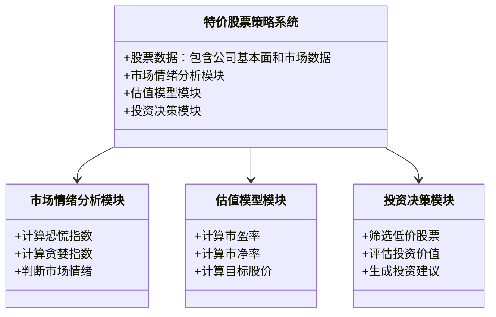

                 


# 如何利用特价股票策略进行逆向思维投资

## 关键词：特价股票策略，逆向思维投资，市场情绪分析，估值模型，投资算法

## 摘要

本文详细探讨了如何利用特价股票策略进行逆向思维投资。通过分析市场情绪、公司基本面和估值指标，结合算法优化，帮助投资者在市场低谷中识别被低估的股票，制定有效的投资策略。文章从理论到实践，系统地讲解了特价股票策略的核心概念、算法原理、系统架构以及实际案例，为投资者提供了科学的决策支持。

---

## 第一部分：特价股票策略与逆向思维投资背景

### 第1章：特价股票策略的定义与特点

#### 1.1 特价股票策略的定义与特点

- **1.1.1 特价股票的定义**
  特价股票是指市场价格低于其内在价值的股票，通常出现在市场恐慌或公司短期问题时，为投资者提供了以低价买入优质资产的机会。

- **1.1.2 特价股票的特点**
  - **低估性**：市场价格低于公允价值。
  - **周期性**：常见于市场周期的低谷期。
  - **风险性**：伴随高波动性和潜在风险。

- **1.1.3 特价股票与价值投资的区别**
  - 特价股票关注短期价格波动，价值投资关注长期价值。
  - 特价股票策略强调市场情绪，价值投资注重基本面分析。

#### 1.2 逆向思维投资的背景与意义

- **1.2.1 逆向思维投资的定义**
  逆向思维投资是指在市场恐慌时买入，在市场乐观时卖出，利用市场情绪的非理性波动获得超额收益。

- **1.2.2 逆向思维投资的核心理念**
  - 市场情绪与价格的关系：市场情绪波动导致价格偏离价值。
  - 逆向思维的优势：在市场恐慌时发现机会，在乐观时规避风险。

- **1.2.3 逆向思维投资在股票市场中的应用**
  - 在市场低谷期寻找特价股票。
  - 在市场高峰期规避风险。

#### 1.3 市场周期与特价股票机会

- **1.3.1 股票市场的周期性分析**
  股票市场通常经历周期性波动，包括繁荣期、衰退期、复苏期和稳定期。

- **1.3.2 特价股票在市场低谷期的出现**
  在市场衰退期，许多优质股票因市场恐慌被低估，成为特价股票。

- **1.3.3 市场周期与逆向思维投资的关系**
  逆向思维投资在市场低谷期更具优势，投资者可以利用特价股票策略捕获超额收益。

#### 1.4 投资者心态与特价股票策略

- **1.4.1 投资者常见心态分析**
  - 过度乐观：市场繁荣时贪婪。
  - 过度悲观：市场衰退时恐慌。

- **1.4.2 逆向思维对投资者心态的挑战**
  需要克服市场恐慌和贪婪，保持理性判断。

- **1.4.3 如何克服市场恐慌与贪婪**
  - 建立长期投资目标。
  - 通过基本面分析验证投资标的的价值。

---

## 第二部分：特价股票策略的核心概念与联系

### 第2章：特价股票策略的原理

#### 2.1 特价股票策略的原理

- **市场情绪与股票价格的关系**
  市场情绪影响股票价格，但价格回归价值是长期趋势。

- **特价股票的内在价值评估**
  通过基本面分析，评估股票的内在价值，判断其是否被低估。

- **特价股票策略的逻辑框架**
  1. 筛选低价股票。
  2. 分析公司基本面。
  3. 判断市场情绪。
  4. 评估投资价值。

#### 2.2 逆向思维与特价股票策略的结合

- **逆向思维在股票选择中的应用**
  在市场恐慌时买入，市场乐观时卖出。

- **特价股票策略的逆向思维逻辑**
  利用市场情绪的非理性，寻找价格与价值的错配机会。

- **逆向思维与价值投资的结合**
  价值投资提供基本面分析，逆向思维提供市场情绪判断，两者结合提升投资效果。

#### 2.3 特价股票策略的核心要素

- **股票的估值指标**
  - 市盈率（P/E）：股价与每股收益的比率。
  - 市净率（P/B）：股价与每股净资产的比率。
  - 市销率（P/S）：股价与每股销售额的比率。

- **市场情绪指标**
  - 市场波动率。
  - 投资者情绪指数（如恐慌指数VIX）。

- **公司基本面分析**
  - 盈利能力（净利润率、ROE）。
  - 财务状况（资产负债率、现金流）。
  - 行业地位（市场份额）。

---

### 第3章：特价股票策略的算法原理

#### 3.1 市场情绪分析算法

- **市场情绪分析的实现方法**
  1. 数据收集：获取市场指数、交易量、波动率等数据。
  2. 数据处理：标准化处理，去除异常值。
  3. 情绪指标计算：计算恐慌指数、贪婪指数。
  4. 情绪分类：将市场情绪分为恐慌、中性、贪婪等状态。

- **市场情绪分析的优缺点**
  - 优点：量化市场情绪，辅助决策。
  - 缺点：市场情绪受多种因素影响，难以准确预测。

#### 3.2 估值模型与算法

- **常见估值模型**
  - 市盈率模型。
  - 市净率模型。
  - 现金流量贴现模型（DCF）。

- **估值模型的实现步骤**
  1. 收集公司财务数据。
  2. 选择合适的估值模型。
  3. 计算目标股价。
  4. 比较市场价格与目标股价，判断是否低估。

- **估值模型的优缺点**
  - 优点：提供客观的估值参考。
  - 缺点：假设条件可能影响结果。

#### 3.3 投资决策算法

- **投资决策算法的步骤**
  1. 筛选低价股票。
  2. 分析公司基本面。
  3. 判断市场情绪。
  4. 综合评估，决定是否投资。

- **投资决策算法的数学模型**
  $$ 投资价值 = \text{内在价值} \times (1 - \text{市场情绪修正系数}) $$

---

## 第三部分：系统分析与架构设计

### 第4章：系统功能设计

- **领域模型（Mermaid 类图）**



---

### 第5章：系统架构设计

- **系统架构图（Mermaid 架构图）**


---

## 第四部分：项目实战

### 第6章：环境安装与代码实现

- **环境安装**
  - Python 3.8及以上
  - 数据分析库：pandas, numpy
  - 可视化库：matplotlib, seaborn
  - 量化分析库：pymongo, requests

- **核心代码实现**

```python
import pandas as pd
import numpy as np

# 数据收集
def collect_data(tickers):
    data = {}
    for ticker in tickers:
        # 获取市场数据
        data[ticker] = get_market_data(ticker)
    return data

# 市场情绪分析
def calculate_market_mood(data):
    volatility = calculate_volatility(data)
    volume = calculate_volume(data)
    mood = (volatility < 20) and (volume > 500000)
    return "恐慌" if mood else "中性"

# 估值模型
def calculate_intrinsic_value(ticker):
    eps = get_eps(ticker)
    pe_ratio = get_pe_ratio(ticker)
    iv = eps * (pe_ratio - 2)
    return iv

# 投资决策
def decide_investment(ticker):
    current_price = get_current_price(ticker)
    iv = calculate_intrinsic_value(ticker)
    mood = calculate_market_mood(ticker_data)
    if current_price < iv * 0.9 and mood == "恐慌":
        return "买入"
    else:
        return "观望"
```

---

### 第7章：案例分析与结果解读

- **实际案例**
  分析某公司股票，计算其市盈率、市净率，结合市场情绪，判断是否为特价股票。

- **结果解读**
  - 市盈率低于行业平均，市净率低于历史平均水平，市场情绪处于恐慌状态，判断为特价股票，建议买入。

---

## 第五部分：最佳实践与注意事项

### 第8章：最佳实践 tips

- **定期复盘**：定期检查投资组合，评估策略效果。
- **分散投资**：避免过度集中，降低风险。
- **持续学习**：关注市场动态，更新策略模型。

### 第9章：小结

逆向思维投资结合特价股票策略，能够在市场低谷期发现机会，实现超额收益。通过系统化的分析和算法优化，投资者可以更科学地做出决策。

### 第10章：注意事项

- **风险提示**：市场波动大，投资需谨慎。
- **数据质量**：确保数据来源可靠，分析准确。
- **模型优化**：根据市场变化，不断优化算法。

### 第11章：拓展阅读

- 推荐书籍：《逆向思维投资》、《股票作手回忆录》。
- 推荐课程：量化投资、算法交易。

---

## 结语

通过本文的详细讲解，读者可以系统地了解如何利用特价股票策略进行逆向思维投资。从理论分析到实际操作，从系统设计到项目实战，为投资者提供了全面的指导。希望本文能帮助您在投资道路上更进一步。

---

## 作者：AI天才研究院 & 禅与计算机程序设计艺术

---

希望这篇博客文章能够为您提供有价值的信息和启发，祝您投资成功！

