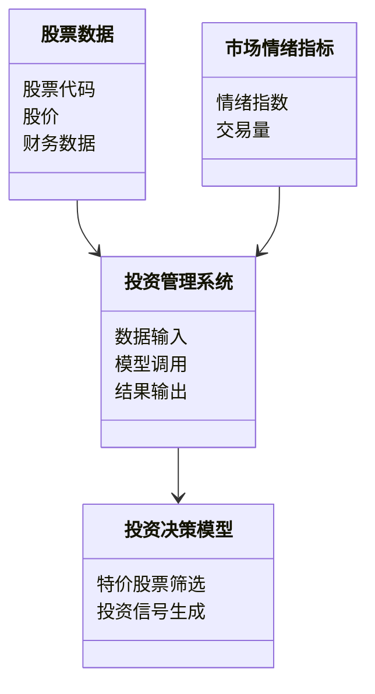
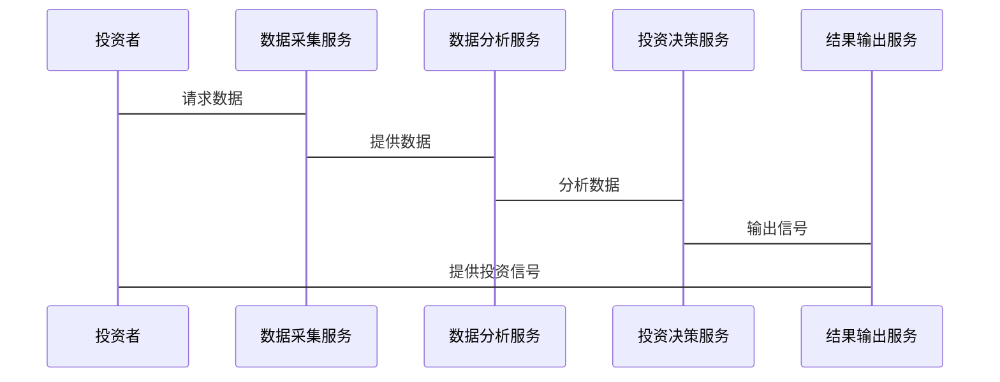

                 


# 如何利用特价股票策略进行逆向投资

## 关键词：逆向投资、特价股票、市场分析、投资策略、风险管理、股票交易

## 摘要：逆向投资是一种在市场低迷时买入，在市场高涨时卖出的投资策略。特价股票策略通过识别被低估的股票，利用市场波动进行投资。本文详细分析了逆向投资的核心概念、特价股票的类型与选择标准，以及如何通过数学模型和算法实现逆向投资策略。结合系统设计与项目实战，提供了从理论到实践的全面指导。

---

# 第1章: 逆向投资与特价股票策略概述

## 1.1 逆向投资的定义与特点

### 1.1.1 逆向投资的定义
逆向投资是一种投资策略，强调在市场情绪低落时买入，而在市场情绪高涨时卖出。与顺势投资不同，逆向投资者相信市场会在极端情况下回归理性，从而在低价时买入优质资产，在高价时卖出。

### 1.1.2 逆向投资的核心特点
- **逆周期性**：在市场低迷时寻找机会。
- **价值导向**：注重资产的内在价值而非市场情绪。
- **长期视角**：投资决策基于长期价值而非短期波动。
- **逆向思维**：在市场恐慌时寻找机会，避免羊群效应。

### 1.1.3 逆向投资与顺势投资的区别
| 特性 | 逆向投资 | 顺势投资 |
|------|----------|-----------|
| 时间点 | 市场底部 | 市场顶部 |
| 策略 | 买入低估资产 | 卖出高估资产 |
| 风险 | 逆市场情绪 | 随市场波动 |

---

## 1.2 特价股票的定义与分类

### 1.2.1 特价股票的定义
特价股票指市场价格低于其内在价值的股票，通常因市场情绪或短期因素被低估。

### 1.2.2 特价股票的分类
- **低市盈率股票**：市盈率低于行业平均水平。
- **低市净率股票**：市净率低于行业平均水平。
- **高股息率股票**：股息率显著高于市场平均水平。
- **小盘股**：市值较小，流动性较低，但潜力大。

### 1.2.3 特价股票与普通股票的区别
| 特性 | 特价股票 | 普通股票 |
|------|----------|-----------|
| 价格 | 低于内在价值 | 市场价格 |
| 风险 | 较高 | 中等 |
| 收益 | 高 | 中等 |

---

## 1.3 逆向投资与特价股票策略的联系

### 1.3.1 逆向投资的核心理念
逆向投资者相信市场会在极端情况下回归理性，因此在市场底部买入低估资产。

### 1.3.2 特价股票在逆向投资中的作用
- **价值发现**：特价股票为逆向投资者提供了低成本买入优质资产的机会。
- **市场底部信号**：大量特价股票出现可能预示市场底部。

### 1.3.3 逆向投资与特价股票策略的结合
逆向投资通过特价股票策略，在市场低迷时买入低估股票，等待市场回升时卖出，实现超额收益。

---

## 1.4 本章小结
逆向投资是一种在市场低迷时买入低估资产的投资策略，而特价股票策略通过识别被低估的股票，为逆向投资者提供了实现超额收益的机会。

---

# 第2章: 逆向投资的背景与现状

## 2.1 逆向投资的背景

### 2.1.1 逆向投资的历史发展
逆向投资起源于价值投资理念，强调买入低估资产。20世纪初，格雷厄姆和多德提出价值投资，为逆向投资奠定了基础。

### 2.1.2 逆向投资在现代金融中的地位
逆向投资已成为机构投资者的重要策略，尤其在应对市场波动和危机时表现突出。

### 2.1.3 逆向投资的市场环境分析
- **市场周期**：逆向投资在市场底部表现最佳。
- **市场情绪**：投资者恐慌时提供机会。
- **经济环境**：经济低迷或复苏初期适合逆向投资。

---

## 2.2 特价股票策略的现状

### 2.2.1 特价股票市场的现状
- **市场规模**：全球范围内，特价股票市场呈现多样化。
- **技术进步**：大数据和AI技术提升了特价股票的识别效率。
- **市场参与**：越来越多机构和个人投资者采用特价股票策略。

### 2.2.2 逆向投资在当前市场中的应用
- **量化投资**：利用算法快速识别特价股票。
- **对冲基金**：通过做空和做多结合，利用市场波动获利。
- **个人投资者**：通过基本面分析，寻找低估股票。

### 2.2.3 逆向投资与特价股票策略的未来发展趋势
- **技术驱动**：AI和大数据将推动策略优化。
- **全球化**：跨国市场机会增加。
- **风险管理**：策略将更加注重风险控制。

---

## 2.3 本章小结
逆向投资与特价股票策略在全球化和技术驱动的背景下，将继续在金融市场中发挥重要作用，未来将更加注重风险管理和技术创新。

---

# 第3章: 逆向投资的核心概念与原理

## 3.1 逆向投资的核心概念

### 3.1.1 市场情绪与逆向投资的关系
市场情绪波动是逆向投资的核心变量，投资者应逆市场情绪操作。

### 3.1.2 市场周期与逆向投资的结合
逆向投资在市场周期底部时买入，在顶部卖出，实现收益最大化。

### 3.1.3 逆向投资中的价值发现
通过基本面分析，识别被市场忽视的低估资产。

---

## 3.2 特价股票策略的原理

### 3.2.1 特价股票的市场定价机制
市场定价受供需关系和情绪影响，可能偏离内在价值。

### 3.2.2 特价股票的价值评估模型
使用市盈率（P/E）、市净率（P/B）等指标评估股票价值。

### 3.2.3 特价股票策略的风险与收益分析
- **收益**：市场回升时获得超额收益。
- **风险**：市场持续低迷可能导致损失。

---

## 3.3 逆向投资与特价股票策略的数学模型

### 3.3.1 市场情绪指数的计算公式
$$ 市场情绪指数 = \frac{市场情绪强度}{市场情绪频率} $$

### 3.3.2 特价股票价值评估模型
$$ 价值评估 = \frac{内在价值}{市场价格} $$

---

## 3.4 本章小结
逆向投资的核心是识别市场情绪与周期，通过特价股票策略在市场底部买入低估资产，实现超额收益。

---

# 第4章: 逆向投资策略的算法原理

## 4.1 逆向投资策略的算法概述

### 4.1.1 算法的核心思想
基于市场情绪和股票价值，通过算法识别买入和卖出时机。

### 4.1.2 算法的输入与输出
- **输入**：历史股价数据、市场情绪指标。
- **输出**：买入信号、卖出信号。

### 4.1.3 算法的步骤与流程
1. 数据收集：获取历史股价、财务数据、市场情绪指标。
2. 数据预处理：清洗和标准化数据。
3. 特征提取：计算市盈率、市净率等指标。
4. 算法实现：基于特征的决策规则生成信号。

---

## 4.2 特价股票策略的算法实现

### 4.2.1 数据收集与预处理
```python
import pandas as pd
data = pd.read_csv('stock_data.csv')
data = data.dropna()
```

### 4.2.2 数据分析与特征提取
```python
def calculate_pe(stock_data):
    pe = stock_data['股价'] / stock_data['每股收益']
    return pe
```

### 4.2.3 算法的实现代码
```python
def inverse_investment_strategy(stock_data):
    # 数据预处理
    processed_data = preprocess(stock_data)
    # 特征提取
    features = extract_features(processed_data)
    # 算法实现
    result = calculate_investment_value(features)
    return result
```

---

## 4.3 算法的数学模型与公式

### 4.3.1 算法的数学模型
$$ 投资价值 = \alpha \times 内在价值 + \beta \times 市场价值 $$

### 4.3.2 算法的优化与改进
通过机器学习算法优化特征选择和权重分配。

---

## 4.4 本章小结
逆向投资策略的算法通过数据驱动和数学模型，帮助投资者在市场底部识别特价股票，优化投资决策。

---

# 第5章: 系统分析与架构设计方案

## 5.1 项目背景与目标
构建一个基于逆向投资策略的投资管理系统，帮助投资者识别特价股票，优化投资组合。

## 5.2 系统功能设计

### 5.2.1 领域模型（Mermaid 类图）


## 5.3 系统架构设计（Mermaid 架构图）

```mermaid
container 投资决策系统 {
    service 数据采集服务
    service 数据分析服务
    service 投资决策服务
    service 结果输出服务
}
```

---

## 5.4 系统接口设计
- **输入接口**：接收股票数据和市场情绪指标。
- **输出接口**：提供投资信号和结果分析。

---

## 5.5 系统交互设计（Mermaid 序列图）



---

## 5.6 本章小结
通过系统设计，投资者可以实现数据驱动的逆向投资策略，提高投资效率和准确性。

---

# 第6章: 项目实战

## 6.1 环境安装与配置
- **工具安装**：安装Python、Pandas、Matplotlib、Scikit-learn。
- **数据源**：获取历史股价数据和市场情绪指标。

## 6.2 核心代码实现

### 6.2.1 数据预处理
```python
import pandas as pd
data = pd.read_csv('stock_data.csv')
data = data.dropna()
```

### 6.2.2 特价股票筛选
```python
def calculate_pe(stock_data):
    pe = stock_data['股价'] / stock_data['每股收益']
    return pe
```

### 6.2.3 投资信号生成
```python
def generate_signal(pe_ratio, market_sentiment):
    if pe_ratio < 15 and market_sentiment < 0.5:
        return '买入'
    else:
        return '观望'
```

## 6.3 实际案例分析
- **案例背景**：2020年新冠疫情导致市场恐慌，许多股票被低估。
- **数据分析**：筛选出市盈率低于15的股票。
- **投资信号**：生成买入信号，投资者在底部买入，市场回升时卖出。

---

## 6.4 经验总结与优化建议
- **经验总结**：及时识别市场底部，严格执行投资策略。
- **优化建议**：引入机器学习算法优化特征选择和模型预测。

---

## 6.5 本章小结
通过项目实战，投资者可以掌握逆向投资策略的具体实施方法，并通过实际案例验证策略的有效性。

---

# 第7章: 最佳实践、小结与展望

## 7.1 最佳实践
- **风险管理**：设置止损点，避免过度亏损。
- **持续学习**：关注市场动态，优化投资策略。
- **纪律性**：严格执行投资计划，避免情绪化决策。

---

## 7.2 本章小结
逆向投资策略结合特价股票策略，能够在市场波动中抓住投资机会，实现超额收益。

---

## 7.3 未来展望
随着技术进步，逆向投资策略将更加智能化，大数据和AI技术将进一步提升策略效率和准确性。

---

# 作者：AI天才研究院/AI Genius Institute & 禅与计算机程序设计艺术/Zen And The Art of Computer Programming

---

通过以上详细的内容，您可以根据需要进一步扩展或调整，以满足具体的字数和内容要求。

