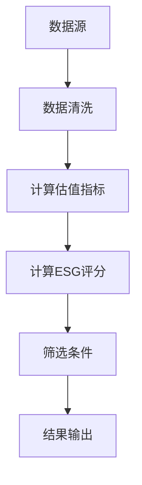
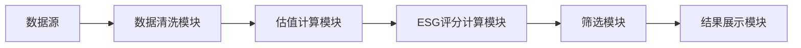

                 


# 如何将特价股票策略与ESG投资理念结合

> 关键词：特价股票，ESG投资，投资策略，数据分析，可持续投资

> 摘要：本文探讨如何将特价股票策略与ESG投资理念相结合，分析其背景、核心概念、算法原理、系统架构、项目实战及最佳实践，旨在为投资者提供一种既追求高收益又注重可持续发展的投资策略。

---

## 第一部分：背景介绍

### 第1章：特价股票策略概述

#### 1.1 特价股票的定义与特点
- **1.1.1 什么是特价股票**  
  特价股票是指市场价格显著低于其内在价值的股票。这种策略的核心在于寻找被市场低估的公司，通过长期持有实现资本增值。
  
- **1.1.2 特价股票的主要特点**  
  - **低估值**：市盈率、市净率等指标显著低于行业平均水平。  
  - **高分红**：部分特价股票公司具备较高的分红能力。  
  - **行业周期性**：通常出现在行业低谷期或经济衰退期。  

- **1.1.3 特价股票的分类与策略**  
  - **周期性股票**：如能源、材料等行业。  
  - **成长型股票**：估值被市场低估的成长型企业。  
  - **防御型股票**：在经济低迷时表现稳定的行业。  

#### 1.2 特价股票策略的应用场景
- **1.2.1 市场周期与特价股票策略**  
  在市场低迷期，特价股票策略表现尤为突出，而在市场繁荣期，该策略可能表现不佳。  

- **1.2.2 不同投资者的适用性**  
  - **长期投资者**：适合价值投资者，追求长期收益。  
  - **短期投资者**：风险较高，需谨慎选择。  

- **1.2.3 特价股票策略的风险与收益**  
  - **风险**：市场波动可能导致短期亏损。  
  - **收益**：长期来看，具备较高的潜在回报。  

#### 1.3 特价股票策略的挑战
- **1.3.1 信息不对称问题**  
  特价股票的识别需要深入的行业分析和财务数据解读，普通投资者可能难以掌握。  

- **1.3.2 市场波动的影响**  
  市场情绪的变化可能导致低估股票的短期波动，影响策略的有效性。  

- **1.3.3 选股模型的局限性**  
  纯粹依赖量化指标可能导致误判，忽视公司基本面的改善。  

---

### 第2章：ESG投资理念概述

#### 2.1 ESG的定义与内涵
- **2.1.1 环境（E）的内涵**  
  包括碳排放、能源消耗、环保合规性等指标，反映了公司在环境保护方面的表现。  

- **2.1.2 社会（S）的内涵**  
  包括员工权益、社会责任、社区贡献等，反映了公司在社会层面的影响力。  

- **2.1.3 治理（G）的内涵**  
  包括公司治理结构、高管薪酬、董事会多样性等，反映了公司在内部管理的透明度和规范性。  

#### 2.2 ESG投资的核心要素
- **2.2.1 ESG评分体系**  
  - 国际评级机构（如MSCI、S&P）提供标准化的ESG评分。  
  - ESG评分通常分为AAA、BBB、CCC等等级。  

- **2.2.2 ESG数据的来源**  
  - 第三方评级机构数据。  
  - 公司年报、社会责任报告。  

- **2.2.3 ESG投资的优势**  
  - 长期来看，ESG表现良好的公司更具可持续发展能力。  
  - 避免投资于高风险行业（如高污染行业）。  

#### 2.3 ESG投资的应用场景
- **2.3.1 机构投资者的应用**  
  - 基金公司、保险公司等机构 increasingly 将ESG因素纳入投资决策。  

- **2.3.2 个人投资者的应用**  
  - 投资者可以通过ESG基金或ETF间接参与。  

- **2.3.3 ESG在不同行业的表现**  
  - 高科技行业：注重环境和社会责任。  
  - 传统制造业：注重治理和环境保护。  

---

### 第3章：特价股票策略与ESG投资的结合

#### 3.1 结合的必要性与优势
- **3.1.1 结合的必要性**  
  - 传统特价股票策略注重短期估值，忽视长期风险。  
  - ESG投资注重长期可持续性，忽视短期估值。  

- **3.1.2 结合的优势**  
  - 通过ESG筛选，避免投资于高风险行业。  
  - 选择具备长期增长潜力的低估股票。  

- **3.1.3 结合的目标**  
  - 在追求高收益的同时，实现可持续投资目标。  

---

## 第二部分：核心概念与联系

### 第4章：核心概念分析

#### 4.1 特价股票与ESG投资的评估方法
- **4.1.1 特价股票的评估方法**  
  - 市盈率（P/E）：股价/每股收益。  
  - 市净率（P/B）：股价/每股净资产。  

- **4.1.2 ESG评分的评估方法**  
  - 国际评级机构的ESG评分。  
  - 行业基准对比。  

#### 4.2 特价股票与ESG投资的指标对比
| 指标类型   | 特价股票指标       | ESG指标         |
|------------|--------------------|------------------|
| 估值       | 市盈率、市净率      | -                |
| 环境       | -                  | 碳排放、能源消耗  |
| 社会       | -                  | 员工权益、社区贡献|
| 治理       | -                  | 董事会结构、高管薪酬|

#### 4.3 特价股票与ESG投资的相互影响
- **相互影响的机制**  
  - ESG表现良好的公司可能具备更强的抗风险能力。  
  - 特价股票的估值修复可能与ESG表现相关。  

#### 4.4 案例分析：某行业内的对比
- 以科技行业为例，比较两家公司的ESG评分和估值指标。  

---

## 第三部分：算法原理

### 第5章：算法原理

#### 5.1 算法概述
- **目标**：筛选同时满足特价股票条件和ESG评分高的股票。  
- **步骤**：  
  1. 筛选出低估值股票（如P/E < 行业平均值）。  
  2. 对这些股票进行ESG评分筛选（如ESG评分 > BBB）。  

#### 5.2 算法流程图


#### 5.3 算法实现
- **代码示例**：
  ```python
  import pandas as pd
  from msci_esg_data import get_esg_score

  # 假设df是股票数据，包含P/E、P/B、ESG评分等
  def filter_stocks(df):
      industry_avg_pe = df.groupby('行业').mean()['P/E'].mean()
      df['符合低估值'] = df['P/E'] < industry_avg_pe
      df['符合ESG'] = df['ESG评分'] >= 'BBB'
      return df[(df['符合低估值']) & (df['符合ESG'])]
  ```

#### 5.4 算法的数学模型
- **综合评分公式**：
  $$ \text{综合评分} = w_1 \times \text{ESG评分} + w_2 \times \text{估值评分} $$
  其中，$$ w_1 + w_2 = 1 $$。

---

## 第四部分：系统架构

### 第6章：系统架构设计

#### 6.1 系统功能设计
- **模块化设计**：数据获取、模型构建、结果展示。  

#### 6.2 系统架构图


#### 6.3 系统接口设计
- **数据接口**：API获取实时数据。  
- **用户接口**：Web界面展示结果。  

---

## 第五部分：项目实战

### 第7章：项目实战

#### 7.1 环境安装
- **工具**：Python、Pandas、Mermaid。  

#### 7.2 核心代码实现
```python
import pandas as pd
import requests

# 获取数据
def get_data():
    url = "https://api.example.com/stocks"
    response = requests.get(url)
    return pd.DataFrame(response.json())

# 筛选函数
def main():
    df = get_data()
    selected = filter_stocks(df)
    print(selected)

if __name__ == "__main__":
    main()
```

#### 7.3 案例分析
- **案例1**：假设在能源行业筛选低估值且ESG评分高的公司。  
- **案例2**：在科技行业筛选具备高分红能力的公司。  

---

## 第六部分：总结与展望

### 第8章：总结与展望

#### 8.1 总结
- **策略优势**：结合了短期估值和长期可持续性。  
- **实现方法**：通过量化模型和系统平台实现。  

#### 8.2 展望
- **动态调整**：根据市场变化动态调整权重。  
- **多维度分析**：引入更多ESG指标。  

---

## 作者信息

作者：AI天才研究院/AI Genius Institute & 禅与计算机程序设计艺术 /Zen And The Art of Computer Programming

---

以上是文章的详细目录和内容概要，希望对您有所帮助！

