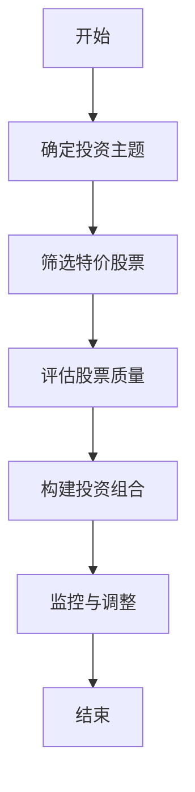
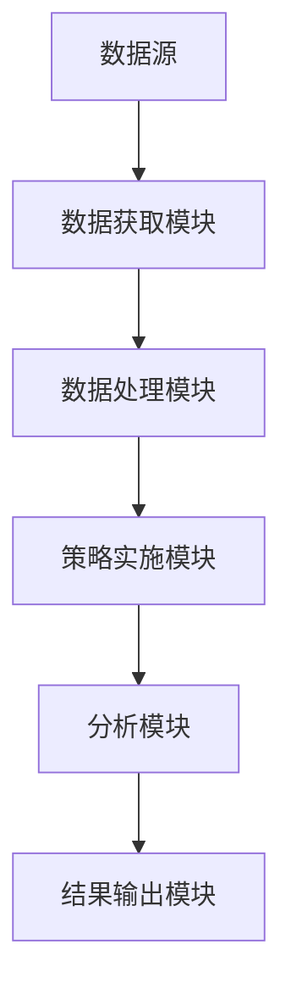
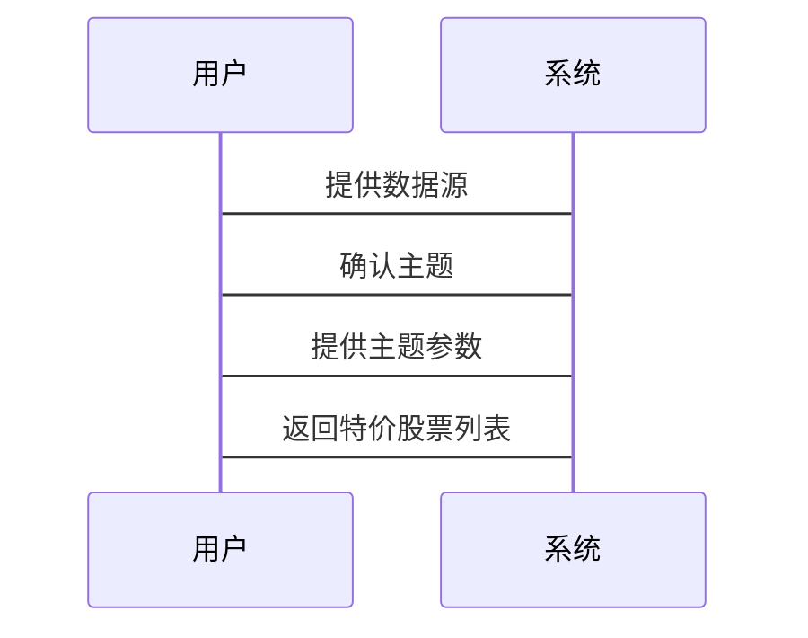

                 


# 如何将特价股票策略与主题投资相结合

## 关键词：特价股票策略, 主题投资, 算法, 系统架构, 项目实战

## 摘要：本文详细探讨了如何将特价股票策略与主题投资相结合，通过算法和系统架构设计，提供实际案例分析和项目实战指导，帮助投资者在特定主题下识别特价股票，优化投资组合，提升收益。

---

## 第一部分：背景介绍

### 第1章：特价股票策略与主题投资概述

#### 1.1 特价股票策略的基本概念

- **1.1.1 特价股票的定义与特点**
  - 特价股票是指价格低于其内在价值的股票，通常具有较高的折扣率。
  - 特点包括高波动性、高风险和高潜在回报。

- **1.1.2 特价股票的常见类型**
  - 周期性股票：如能源和制造业股票，在市场低谷时可能出现特价。
  - 价值型股票：市盈率和市净率低于行业平均水平。

- **1.1.3 特价股票的市场环境分析**
  - 经济衰退或市场低迷时，特价股票更容易出现。
  - 市场流动性低或投资者情绪低落时，股票价格可能被低估。

#### 1.2 主题投资的核心概念

- **1.2.1 主题的定义与特征**
  - 主题是指具有特定概念、行业趋势或社会现象的股票组合。
  - 特征包括行业集中、主题驱动和趋势性。

- **1.2.2 主题投资的分类与应用场景**
  - 分类：技术主题、消费主题、绿色能源主题等。
  - 应用场景：长期投资、风险分散和市场趋势捕捉。

- **1.2.3 主题投资的市场趋势分析**
  - 技术进步推动的主题，如人工智能和大数据。
  - 社会趋势推动的主题，如健康医疗和环保。

#### 1.3 特价股票策略与主题投资的结合

- **1.3.1 结合的必要性与优势**
  - 必要性：在特定主题下找到低估股票，提升投资回报。
  - 优势：结合了价值投资和趋势投资，兼顾安全性和成长性。

- **1.3.2 结合的实现方式与流程**
  - 确定投资主题 → 筛选特价股票 → 组合构建与优化。

- **1.3.3 结合的实际案例分析**
  - 案例：在科技主题下，寻找市盈率低于行业平均水平的股票。

---

## 第二部分：核心概念与联系

### 第2章：特价股票策略的核心原理

#### 2.1 特价股票的筛选标准

- **2.1.1 市盈率（P/E）分析**
  - 公式：P/E = 市场价 / 每股收益。
  - 低P/E值可能意味着低估。

- **2.1.2 市净率（P/B）分析**
  - 公式：P/B = 市场价 / 每股净资产。
  - 低P/B值可能意味着资产被低估。

- **2.1.3 股息率与股息率分析**
  - 股息率 = 每股股息 / 市场价。
  - 高股息率可能意味着收益稳定。

#### 2.2 特价股票的市场时机选择

- **2.2.1 市场周期分析**
  - 经济周期影响股票价格，衰退期可能提供更多特价股票。

- **2.2.2 市场情绪分析**
  - 使用投资者情绪指标，如恐慌指数，判断市场低估区域。

- **2.2.3 市场波动性分析**
  - 高波动性可能带来更多的低价股票机会。

#### 2.3 特价股票的风险管理

- **2.3.1 风险评估方法**
  - 使用VaR模型评估潜在损失。

- **2.3.2 风险分散策略**
  - 投资多个行业和公司的特价股票，降低集中风险。

- **2.3.3 风险对冲机制**
  - 使用期货或期权对冲价格波动风险。

### 第3章：主题投资的核心原理

#### 3.1 主题的识别与选择

- **3.1.1 主题的定义与分类**
  - 宏观主题：经济、政治、社会趋势。
  - 微观主题：行业技术进步、消费习惯变化。

- **3.1.2 主题的识别方法**
  - 市场调研、数据分析、专家意见。

- **3.1.3 主题的市场前景分析**
  - 行业增长潜力、政策支持、技术可行性。

#### 3.2 主题投资的策略制定

- **3.2.1 长期投资策略**
  - 长期持有，等待主题兑现。

- **3.2.2 短期投资策略**
  - 短期波动获利，适合高波动主题。

- **3.2.3 组合投资策略**
  - 分散投资多个相关股票，降低风险。

---

## 第三部分：算法原理讲解

### 第3章：算法原理

#### 3.1 算法流程图



#### 3.2 Python代码实现

```python
import pandas as pd
import numpy as np

# 数据获取
data = pd.read_csv('stock_data.csv')

# 筛选特价股票
def is_discount_stock(row, discount_threshold=0.2):
    return row['price'] < row['intrinsic_value'] * (1 - discount_threshold)

discounted_stocks = data[data.apply(is_discount_stock, axis=1)]

# 主题匹配
themes = ['科技', '消费', '绿色能源']
for theme in themes:
    theme_stocks = discounted_stocks[discounted_stocks['theme'] == theme]
    if not theme_stocks.empty:
        print(f"主题{theme}下的特价股票：{theme_stocks}")
```

#### 3.3 数学模型与公式

- **收益计算公式**
  $$ \text{收益} = \text{投资金额} \times \text{折扣率} \times \text{主题收益比率} $$

- **风险评估公式**
  $$ \text{VaR} = \text{投资金额} \times \text{损失概率} \times \text{损失幅度} $$

---

## 第四部分：系统架构设计

### 第4章：系统分析与架构设计方案

#### 4.1 项目背景介绍

- 数据获取：从可靠数据源获取股票数据。
- 项目目标：构建一个自动化的特价股票筛选系统。

#### 4.2 系统功能设计

- 数据处理模块：清洗和转换数据。
- 策略实施模块：筛选特价股票和主题匹配。
- 分析模块：评估股票质量和优化组合。

#### 4.3 系统架构设计图



#### 4.4 系统接口设计

- 输入接口：接收股票数据和主题参数。
- 输出接口：返回符合条件的股票列表和投资建议。

#### 4.5 系统交互序列图



---

## 第五部分：项目实战

### 第5章：项目实战

#### 5.1 环境安装

- 安装Python和必要的库：pandas、numpy、scikit-learn。

#### 5.2 核心代码实现

```python
import pandas as pd

# 数据处理
def preprocess_data(data):
    # 删除缺失值
    data = data.dropna()
    # 标准化处理
    return data

# 策略实施
def apply_strategy(data, theme):
    # 筛选特价股票
    discounted = data[data['price'] < data['intrinsic_value']]
    # 主题匹配
    return discounted[discounted['theme'] == theme]

# 应用示例
data = pd.read_csv('stock_data.csv')
processed_data = preprocess_data(data)
result = apply_strategy(processed_data, '科技')
print(result)
```

#### 5.3 案例分析与解读

- **案例分析：科技主题下的特价股票**
  - 筛选出市盈率低于行业平均的科技股。
  - 结合行业前景和公司基本面，构建投资组合。

#### 5.4 项目小结

- 项目实现了将特价股票策略与主题投资相结合，提供了实际操作的指导。

---

## 第六部分：最佳实践与总结

### 第6章：最佳实践与总结

#### 6.1 投资策略建议

- 定期评估市场主题，及时调整投资组合。
- 结合技术分析和基本面分析，提高决策准确性。

#### 6.2 小结

- 特价股票策略与主题投资的结合为投资者提供了新的思路，通过算法和系统设计，优化投资流程，提升收益。

#### 6.3 注意事项

- 注意市场波动和数据质量，避免因错误数据导致的投资损失。
- 定期审查和调整投资组合，适应市场变化。

#### 6.4 拓展阅读

- 建议阅读相关书籍和文献，深入了解价值投资和主题投资的理论基础。

---

## 作者：AI天才研究院 & 禅与计算机程序设计艺术

---

以上是文章的详细大纲，涵盖从背景介绍到项目实战的各个方面，确保读者能够全面理解并实际应用特价股票策略与主题投资相结合的策略。

