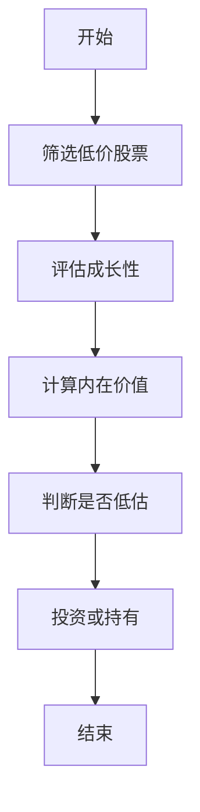
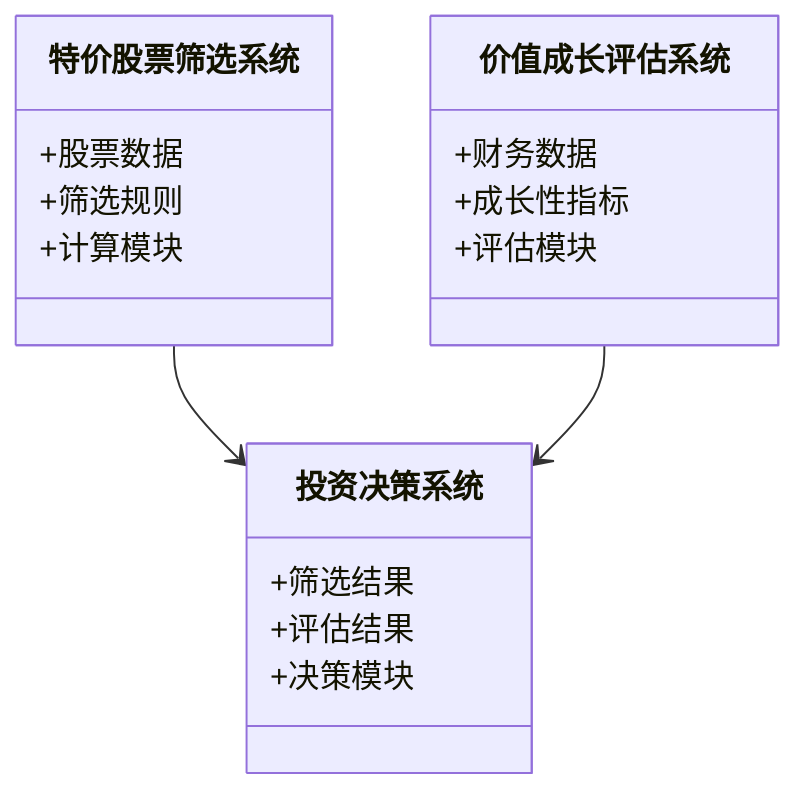
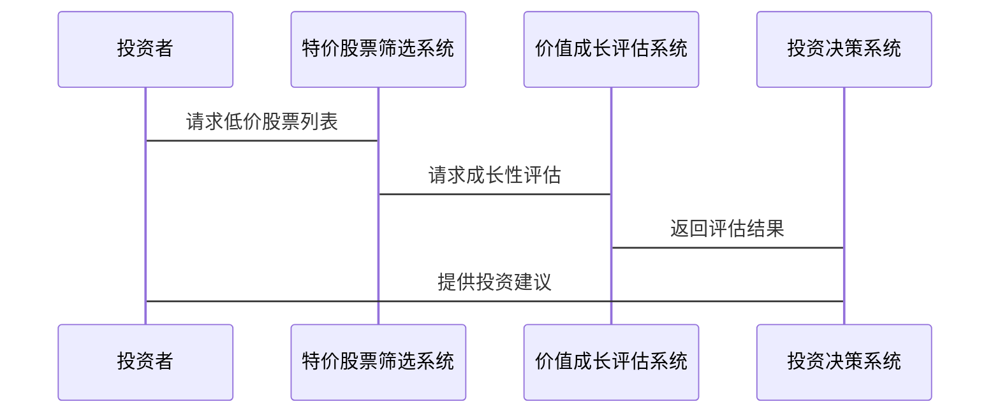

                 


# 如何将特价股票策略与价值成长投资相结合

> 关键词：特价股票策略，价值成长投资，投资策略，股票分析，风险管理

> 摘要：本文详细探讨了如何将特价股票策略与价值成长投资相结合，分析了两者的结合优势，并通过系统架构、算法原理、项目实战等多维度进行深入讲解，最终得出一套有效的投资策略。

---

## 正文

### 第一章：特价股票策略的背景与核心概念

#### 1.1 特价股票策略的定义与背景
- **特价股票的定义与特点**：特价股票指的是市场价格低于其内在价值的股票，通常具有较高的安全边际。其特点包括低市盈率、低市净率、高股息率等。
- **特价股票策略的历史与发展**：从本杰明·格雷厄姆的廉价买入理念到现代量化分析，特价股票策略经历了从基本面分析到量化交易的演变。
- **特价股票策略的核心目标与应用场景**：核心目标是通过低估值买入，等待市场回归实现收益。应用场景包括熊市、市场恐慌等时期。

#### 1.2 价值成长投资的定义与背景
- **价值投资的核心理念**：以低于内在价值的价格买入优质股票，长期持有，分享企业成长的成果。
- **成长投资的核心理念**：投资于具有高速成长潜力的企业，即使当前价格较高，但未来增长预期强烈。
- **价值与成长投资的对比**：价值投资注重安全边际，成长投资注重未来潜力。

#### 1.3 特价股票策略与价值成长投资的结合
- **结合的必要性与优势**：通过结合两者，可以在低价买入的同时，确保企业具有成长性，降低投资风险。
- **结合的边界与外延**：适用于具有明确成长性但当前估值较低的企业，避免陷入低估值陷阱。
- **结合的可行性与挑战**：需要在估值和成长性之间找到平衡点，对投资者的能力要求较高。

### 第二章：价值成长投资的背景与核心概念

#### 2.1 价值投资的核心理念
- **核心理念**：寻找市场低估的优质企业，长期持有，获得超额收益。
- **成功案例**：巴菲特的投资策略。
- **挑战**：需要对企业基本面有深刻理解，且需要长期耐心。

#### 2.2 成长投资的核心理念
- **核心理念**：投资于具有高速成长潜力的企业，即使当前估值较高，但未来增长预期强烈。
- **成功案例**：科技股、新兴行业龙头股。
- **挑战**：成长型企业存在高波动性和高风险。

#### 2.3 价值与成长投资的结合
- **结合的必要性**：通过结合价值与成长，可以在控制风险的同时，捕捉成长机会。
- **结合的优势**：降低投资风险，提高投资收益。
- **结合的具体方式**：寻找具有成长性但估值合理的标的。

### 第三章：特价股票策略与价值成长投资的核心概念与联系

#### 3.1 核心概念的对比分析
- **属性对比表格**：
| 属性         | 特价股票策略         | 价值成长投资         |
|--------------|----------------------|----------------------|
| 核心目标     | 低价买入，等待回归   | 买入优质成长股       |
| 估值标准     | 市盈率、市净率等     | 内在价值、成长性     |
| 风险偏好     | 低风险偏好           | 中高风险偏好         |

#### 3.2 实体关系图（ER图）
```mermaid
erd
  entity 特价股票策略 {
    key: 特价股票
    <<属性>> 市盈率, 市净率, 股息率
  }
  entity 价值成长投资 {
    key: 价值成长股
    <<属性>> 内在价值, 成长性
  }
  relationship 结合关系 {
    特价股票策略 -[结合]-> 价值成长投资
  }
```

### 第四章：算法原理与数学模型

#### 4.1 算法原理


#### 4.2 Python实现代码
```python
import pandas as pd

def calculate_intrinsic_value(stock_data):
    # 示例：使用市盈率和市净率计算内在价值
    stock_data['intrinsic_value'] = (stock_data['市盈率'] * stock_data['净利润'] +
                                      stock_data['市净率'] * stock_data['净资产']) / 2
    return stock_data

# 示例数据
data = {
    '股票代码': ['A', 'B', 'C'],
    '市盈率': [10, 15, 20],
    '市净率': [2, 3, 4],
    '净利润': [100, 150, 200],
    '净资产': [500, 600, 700]
}

df = pd.DataFrame(data)
result = calculate_intrinsic_value(df)
print(result)
```

#### 4.3 数学模型
- **CAPM模型**：
  $$ E(R_i) = R_f + \beta_i (R_m - R_f) $$
  其中，$R_f$是无风险利率，$R_m$是市场预期收益率，$\beta_i$是股票的贝塔系数。

### 第五章：系统架构与实现方案

#### 5.1 系统功能设计


#### 5.2 系统接口设计
- API接口：
  ```python
  def get_cheap_stocks(api_key):
      # 示例：获取低价股票列表
      pass
  ```

#### 5.3 系统交互流程


### 第六章：项目实战与案例分析

#### 6.1 环境安装
- 安装必要的库：
  ```bash
  pip install pandas numpy matplotlib
  ```

#### 6.2 核心代码实现
```python
import pandas as pd
import numpy as np

# 示例数据
data = {
    '股票': ['A', 'B', 'C'],
    '价格': [10, 20, 30],
    '市盈率': [10, 15, 20],
    '成长性评分': [0.8, 0.6, 0.9]
}

df = pd.DataFrame(data)

# 计算综合评分
def compute_score(row):
    return (row['市盈率'] * 0.5) + (row['成长性评分'] * 0.5)

df['综合评分'] = df.apply(compute_score, axis=1)
print(df)
```

#### 6.3 案例分析
- **案例1**：假设股票A价格为10，市盈率为10，成长性评分为0.8。计算综合评分为8.0，符合投资标准。
- **案例2**：股票C价格为30，市盈率为20，成长性评分为0.9。综合评分为14.5，符合投资标准。

### 第七章：风险管理与优化策略

#### 7.1 风险管理
- **市场风险**：分散投资，避免过度集中。
- **流动性风险**：选择流动性较好的股票。
- **操作风险**：制定严格的交易流程和风险管理措施。

#### 7.2 优化策略
- 定期复盘，调整投资组合。
- 利用大数据和AI技术进行动态调整。

### 结论

通过将特价股票策略与价值成长投资相结合，投资者可以在控制风险的同时，捕捉成长机会。本文通过系统架构、算法原理、项目实战等多维度进行深入讲解，最终得出一套有效的投资策略。未来，随着技术的发展，这一策略将更加精准和高效。

---

**作者：AI天才研究院/AI Genius Institute & 禅与计算机程序设计艺术/Zen And The Art of Computer Programming**

