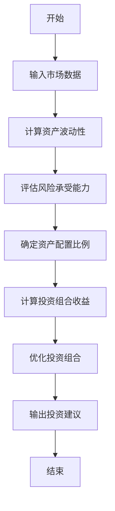
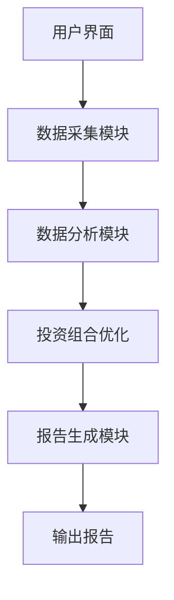

                 


# 如何将特价股票策略与另类投资结合

> 关键词：特价股票策略，另类投资，量化分析，投资组合优化，风险管理

> 摘要：本文将详细介绍如何将特价股票策略与另类投资结合，分析其核心概念、算法原理、系统架构，并通过实际案例展示如何在项目中应用这些策略，帮助投资者实现收益与风险的平衡。

---

## 正文

### 第一部分：背景介绍

#### 第1章：特价股票策略概述

##### 1.1 特价股票策略的基本概念
- **定义**：特价股票策略是一种通过识别市场中的价格波动、折扣或促销活动，以低于市场价买入股票的投资策略。这种策略通常依赖于市场信息的不对称性和短期价格变化。
- **市场背景**：在股票市场中，特价股票通常出现在市场下跌、公司业绩不佳或特定事件（如并购、重组）发生时。投资者通过识别这些机会，可以在低价时买入，高价时卖出，获取收益。
- **核心要素**：包括市场分析、价格敏感性、交易时机和风险控制。

##### 1.2 特价股票策略的优缺点
- **优点**：高收益潜力，特别是在市场波动较大时，特价股票策略可以捕捉到短期价格回升的机会。
- **缺点**：高风险和不确定性，市场波动可能迅速变化，导致亏损。

#### 第2章：另类投资概述

##### 2.1 另类投资的基本概念
- **定义**：另类投资是指传统股票、债券之外的其他资产类别，包括房地产、私募股权、对冲基金、商品期货等。这类投资通常具有较高的风险和收益潜力。
- **主要类型**：房地产投资、私募股权、对冲基金、商品期货、艺术品和收藏品等。
- **特点**：分散风险、追求超额收益、流动性较低。

##### 2.2 另类投资的优缺点
- **优点**：分散投资风险，追求高于传统资产的收益。
- **缺点**：流动性差，进入门槛高，信息透明度低。

#### 第3章：特价股票策略与另类投资的结合

##### 3.1 结合的背景与意义
- **背景**：随着市场环境的复杂化和投资者需求的变化，单纯依赖传统股票投资的风险和收益平衡问题日益突出。结合特价股票策略与另类投资，可以利用两者的互补性，实现更优的投资组合。
- **意义**：通过结合特价股票的高流动性与另类投资的多样性，投资者可以在不同市场环境下灵活调整资产配置，优化风险与收益。

### 第二部分：核心概念与联系

#### 第4章：特价股票策略与另类投资的核心概念

##### 4.1 核心概念原理
- **特价股票策略**：依赖于短期价格波动和市场机会，注重交易时机和价格敏感性。
- **另类投资**：注重资产多样性、风险分散和长期收益潜力。

##### 4.2 核心概念属性特征对比表

| 特性               | 特价股票策略                     | 另类投资                       |
|--------------------|----------------------------------|-------------------------------|
| 投资期限           | 短期                             | 长期                           |
| 资产流动性           | 高                              | 低                             |
| 风险水平             | 中高                             | 高                              |
| 收益潜力             | 高（短期）                       | 高（长期）                     |
| 交易成本             | 低                              | 高                              |

##### 4.3 实体关系图（ER图）

```mermaid
erDiagram
    customer[投资者] {
        <属性>
        姓名
        投资金额
        风险偏好
    }
    stock[特价股票] {
        <属性>
        股票代码
        当前价格
        历史价格
        事件类型
    }
    alternative_investment[另类投资] {
        <属性>
        资产类型
        投资金额
        期限
    }
    transaction[交易] {
        <属性>
        交易日期
        交易金额
        交易类型
    }
    customer --> stock : 买卖特价股票
    customer --> alternative_investment : 投资另类资产
    stock --> transaction : 产生交易记录
    alternative_investment --> transaction : 产生交易记录
```

### 第三部分：算法原理讲解

#### 第5章：特价股票策略与另类投资的算法原理

##### 5.1 算法原理概述
- **目标**：通过量化分析，优化投资组合，平衡风险与收益。
- **输入**：市场数据（股票价格、市场指数）、资产配置比例、投资者风险偏好。
- **输出**：最优投资组合建议，包括特价股票和另类投资的配置比例。

##### 5.2 算法步骤



##### 5.3 数学模型和公式

- **现代投资组合理论（MPT）**：
  $$ E(R_p) = w_1E(R_1) + w_2E(R_2) $$
  其中，\( E(R_p) \) 是投资组合的期望收益，\( w_1 \) 和 \( w_2 \) 分别是特价股票和另类投资的权重，\( E(R_1) \) 和 \( E(R_2) \) 是各自的期望收益。

- **风险分散公式**：
  $$ \text{总风险} = \sqrt{w_1^2\sigma_1^2 + w_2^2\sigma_2^2 + 2w_1w_2\text{协方差}} $$
  其中，\( \sigma_1 \) 和 \( \sigma_2 \) 分别是特价股票和另类投资的风险，协方差衡量两者之间的相关性。

### 第四部分：系统分析与架构设计

#### 第6章：系统分析与架构设计

##### 6.1 项目介绍
- **项目名称**：特价股票与另类投资结合的量化分析系统。
- **目标**：开发一个实时监控和分析系统，帮助投资者优化资产配置。

##### 6.2 系统功能设计
- **功能模块**：
  - 数据采集模块：实时采集股票价格、市场指数等数据。
  - 数据分析模块：应用量化模型进行投资组合优化。
  - 报告生成模块：生成投资建议和风险评估报告。

##### 6.3 系统架构设计



##### 6.4 系统接口设计
- **输入接口**：市场数据API，用户风险偏好输入。
- **输出接口**：优化后的投资组合建议，风险评估报告。

### 第五部分：项目实战

#### 第7章：项目实战

##### 7.1 环境安装
- **工具**：Python、Pandas、NumPy、Matplotlib、Scikit-learn。
- **安装命令**：
  ```bash
  pip install pandas numpy matplotlib scikit-learn
  ```

##### 7.2 核心代码实现

```python
import numpy as np
import pandas as pd
from sklearn.covariance import MinCovarianceDetCovarianceEstimator

# 示例数据：假设我们有两个资产，特价股票和另类投资
returns_stock = np.array([0.1, -0.05, 0.08, 0.02])
returns_alt = np.array([0.15, 0.05, -0.1, 0.07])

# 计算协方差矩阵
cov_matrix = np.cov(returns_stock, returns_alt)

# 计算最优权重
def optimal_weights(r1, r2, cov, risk_free_rate=0):
    numerator = (r2 - r1) * cov
    denominator = (r2 - r1)**2 + (cov)**2
    w2 = numerator / denominator
    w1 = 1 - w2
    return w1, w2

w1, w2 = optimal_weights(returns_stock.mean(), returns_alt.mean(), cov_matrix[0,1])
print(f"最优权重：特价股票 {w1:.2f}，另类投资 {w2:.2f}")
```

##### 7.3 案例分析
- **案例背景**：假设投资者有100万元资金，风险偏好为中等。
- **分析结果**：通过量化模型计算，建议将60%资金投资于特价股票，40%投资于另类投资，以平衡风险和收益。

### 第六部分：最佳实践

#### 第8章：最佳实践、小结、注意事项

##### 8.1 最佳实践
- **定期重新评估**：市场环境和投资者需求会变化，定期调整投资组合。
- **分散投资**：避免过度集中于某一种资产，降低风险。
- **技术与人工结合**：利用量化工具辅助决策，同时结合市场专家意见。

##### 8.2 小结
本文详细介绍了如何将特价股票策略与另类投资结合，通过量化分析优化投资组合，平衡风险与收益。通过实际案例展示了如何在项目中应用这些策略，并提供了实用的建议。

##### 8.3 注意事项
- **风险控制**：在实施策略前，充分评估市场风险。
- **数据质量**：确保数据的准确性和及时性，影响分析结果。
- **合规性**：遵守相关法律法规，避免违规操作。

---

**作者：AI天才研究院/AI Genius Institute & 禅与计算机程序设计艺术 /Zen And The Art of Computer Programming**

---

这篇文章通过详细的背景介绍、核心概念分析、算法原理、系统设计和实际案例，帮助投资者理解如何将特价股票策略与另类投资结合，优化投资组合，实现收益与风险的平衡。

