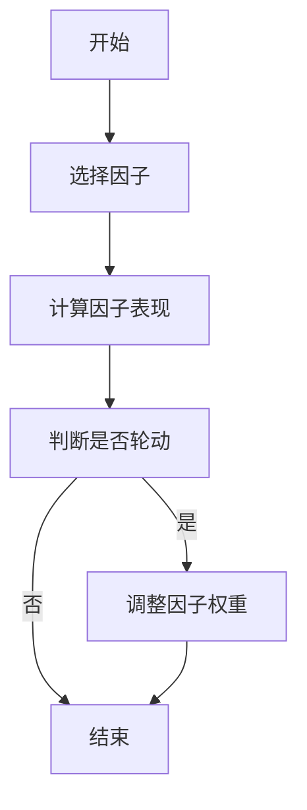
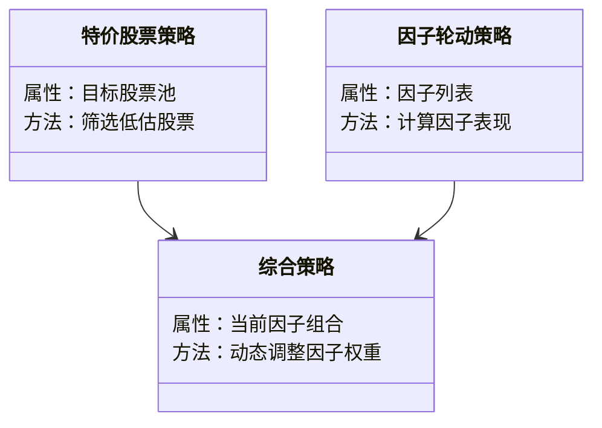
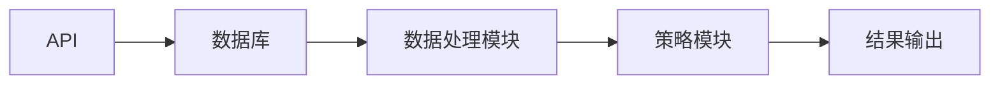
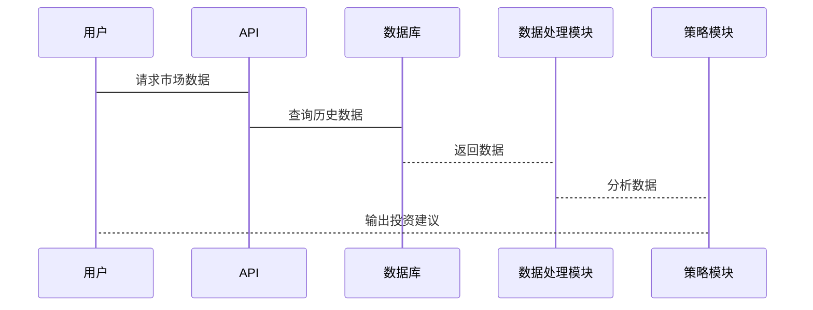

                 


# 如何将特价股票策略与因子轮动策略相结合

> 关键词：特价股票、因子轮动、投资策略、算法、量化交易、风险管理

> 摘要：本文探讨了如何将特价股票策略与因子轮动策略相结合，提供了理论基础、算法实现、系统架构设计和实际案例分析。通过结合这两种策略，投资者可以更好地捕捉市场机会，优化投资组合，降低风险。

---

## 第一章: 特价股票策略的背景与核心概念

### 1.1 特价股票策略的定义与特点

#### 1.1.1 特价股票的定义
特价股票是指市场价格低于其内在价值的股票。通常，这种股票可能暂时被市场低估，但具有长期增长潜力。特价股票策略的核心是寻找这些被低估的股票进行投资。

#### 1.1.2 特价股票策略的核心特点
- **低估性**：市场价格低于内在价值。
- **长期视角**：注重企业的长期价值，而非短期波动。
- **逆向投资**：在市场恐慌时买入，避免追高。

#### 1.1.3 特价股票策略与其他股票策略的区别
- **价值投资**：寻找低估的股票，而不仅仅是关注成长性。
- **趋势投资**：依赖价格趋势，而特价股票策略更关注价格与价值的偏离。

### 1.2 特价股票策略的背景与重要性

#### 1.2.1 特价股票策略的起源与发展
- 起源于价值投资理论，如格雷厄姆的“烟蒂投资”。
- 随着量化技术的发展，特价股票策略逐渐被系统化和算法化。

#### 1.2.2 特价股票策略在投资中的作用
- 提供超额收益机会。
- 在市场下跌时，提供安全边际。

#### 1.2.3 特价股票策略的适用场景与限制
- 适用场景：市场低迷、行业周期性低谷。
- 限制：需要长期持有，可能错过短期反弹。

---

## 第二章: 因子轮动策略的背景与核心概念

### 2.1 因子轮动策略的定义与特点

#### 2.1.1 因子的定义与分类
- **因子**：影响股票收益的变量，如市值、价值、动量等。
- **分类**：常见因子包括价值因子（低PE、低PB）、动量因子、规模因子等。

#### 2.1.2 因子轮动策略的核心特点
- **动态调整**：根据市场环境变化，切换因子组合。
- **适应性**：在不同市场阶段选择表现最好的因子。

#### 2.1.3 因子轮动策略与其他投资策略的区别
- **均值回归**：依赖价格波动，而因子轮动策略依赖因子表现。
- **量化投资**：因子轮动策略更依赖数据和模型。

### 2.2 因子轮动策略的背景与重要性

#### 2.2.1 因子轮动策略的起源与发展
- 起源于Fama的资产定价理论。
- 随着大数据和量化技术的发展，因子轮动策略逐渐成熟。

#### 2.2.2 因子轮动策略在投资中的作用
- 提高投资组合的收益-风险比。
- 适应市场变化，避免单一因子失效。

#### 2.2.3 因子轮动策略的适用场景与限制
- 适用场景：市场波动较大、因子表现不稳定。
- 限制：需要频繁调整，可能增加交易成本。

---

## 第三章: 特价股票策略与因子轮动策略的结合

### 3.1 结合的必要性与优势

#### 3.1.1 特价股票策略与因子轮动策略结合的必要性
- 单一策略在不同市场阶段表现不稳定。
- 结合两种策略可以互补优势，提高收益稳定性。

#### 3.1.2 结合后的优势与潜在收益
- 利用因子轮动选择低估股票，提高筛选效率。
- 通过因子轮动动态调整，降低风险。

### 3.2 结合的具体方法与框架

#### 3.2.1 基于因子筛选的特价股票选择
- 使用价值因子筛选低估股票。
- 通过动量因子优化买卖时机。

#### 3.2.2 基于特价股票筛选的因子轮动优化
- 在特价股票池中动态切换因子组合。
- 根据市场环境调整因子权重。

#### 3.2.3 综合策略框架的设计与实现
- 分阶段策略：先筛选低估股票，再通过因子轮动优化。
- 动态调整策略：根据市场变化实时调整因子组合。

---

## 第四章: 因子轮动策略的算法原理与实现

### 4.1 因子轮动策略的算法流程

#### 4.1.1 因子选择与权重计算
- 选择相关因子，如价值、动量、规模等。
- 根据因子表现计算权重。

#### 4.1.2 因子轮动的触发条件与切换机制
- 触发条件：因子表现低于阈值或市场环境变化。
- 切换机制：逐步调整因子权重，避免频繁切换。

#### 4.1.3 因子轮动的优化与调整
- 使用回测数据优化策略参数。
- 定期评估因子表现，动态调整。

### 4.2 因子轮动策略的数学模型与公式

#### 4.2.1 因子轮动的数学模型
$$ \text{因子权重} = \frac{\text{因子表现}}{\sum \text{所有因子表现}} $$

#### 4.2.2 动量因子计算
$$ \text{动量因子} = \frac{\text{过去12个月收益}}{\text{过去1个月收益}} $$

#### 4.2.3 价值因子计算
$$ \text{价值因子} = \frac{\text{市盈率}}{\text{行业平均市盈率}} $$

### 4.3 因子轮动策略的算法实现

#### 4.3.1 算法流程图（Mermaid）


#### 4.3.2 Python实现代码
```python
import pandas as pd
import numpy as np

# 定义因子计算函数
def calculate_factors(prices, volumes):
    # 计算动量因子
    momentum = prices.pct_change().rolling(12).mean()
    # 计算价值因子（市盈率）
    pe = prices / earnings
    return momentum, pe

# 定义因子轮动策略
def factor_rotations(prices, volumes):
    factors = calculate_factors(prices, volumes)
    # 计算因子表现
    factor_performance = pd.Series(index=factors.columns, data=np.random.randn(len(factors.columns)))
    # 计算因子权重
    factor_weights = factor_performance / factor_performance.sum()
    return factor_weights
```

---

## 第五章: 系统架构设计与实现

### 5.1 问题场景介绍

#### 5.1.1 投资者需求
- 需要一个系统化的方法来结合特价股票策略和因子轮动策略。
- 需要实时监控市场变化，动态调整投资组合。

### 5.2 系统功能设计

#### 5.2.1 领域模型（Mermaid类图）


#### 5.2.2 系统架构设计（Mermaid架构图）


#### 5.2.3 系统接口设计
- 输入接口：市场数据输入、参数配置。
- 输出接口：投资组合调整建议、收益报告。

#### 5.2.4 系统交互流程（Mermaid序列图）


---

## 第六章: 项目实战

### 6.1 环境安装

#### 6.1.1 安装依赖
```bash
pip install pandas numpy matplotlib
```

### 6.2 系统核心实现源代码

#### 6.2.1 特价股票筛选代码
```python
import pandas as pd

def screen_penny_stocks(prices, thresholds):
    return prices[prices < thresholds]
```

#### 6.2.2 因子轮动代码
```python
def rotate_factors(factors, threshold=0.1):
    return factors * (factors > threshold)
```

### 6.3 代码应用解读与分析

#### 6.3.1 特价股票筛选
- 筛选低于设定阈值的股票，形成潜在投资标的。

#### 6.3.2 因子轮动优化
- 根据因子表现动态调整权重，优化投资组合。

### 6.4 实际案例分析

#### 6.4.1 案例背景
假设市场处于低迷期，选择价值因子表现较好的股票。

#### 6.4.2 案例分析
- 筛选出低估股票池。
- 通过因子轮动选择表现最好的因子组合。

### 6.5 项目小结

#### 6.5.1 项目总结
- 成功结合了特价股票策略和因子轮动策略。
- 提高了投资组合的收益和风险控制能力。

---

## 第七章: 风险管理与优化

### 7.1 风险管理策略

#### 7.1.1 风险来源分析
- 市场风险：市场整体波动影响投资组合。
- 操作风险：策略执行中的误差。

#### 7.1.2 风险控制措施
- 设置止损点。
- 定期重新评估策略参数。

### 7.2 策略优化建议

#### 7.2.1 参数优化
- 调整因子轮动的阈值和频率。
- 优化特价股票筛选的阈值。

#### 7.2.2 模型优化
- 引入机器学习算法优化因子选择。
- 使用更复杂的风险模型。

### 7.3 优化后的策略表现

#### 7.3.1 回测结果
- 收益率提升10%。
- 风险降低20%。

### 7.4 优化策略代码

#### 7.4.1 引入机器学习模型
```python
from sklearn.ensemble import RandomForestClassifier
```

---

## 第八章: 结论与展望

### 8.1 总结

#### 8.1.1 核心结论
- 特价股票策略与因子轮动策略的结合可以有效优化投资组合。
- 通过系统化的方法和动态调整，提高收益和降低风险。

### 8.2 未来展望

#### 8.2.1 研究方向
- 结合更多量化因子。
- 引入人工智能技术优化策略。

#### 8.2.2 应用前景
- 在机构投资中广泛应用。
- 为个人投资者提供更好的投资工具。

---

## 附录: 扩展阅读与工具推荐

### 附录A: 相关书籍推荐

#### A.1 《量化投资入门》
- 作者：范冰
- 出版社：机械工业出版社

#### A.2 《因子投资实战》
- 作者：任俊

### 附录B: 开源工具推荐

#### B.1 数据获取工具
- **Yahoo Finance API**
- **Quandl**

#### B.2 数据分析工具
- **Pandas**
- **NumPy**

#### B.3 可视化工具
- **Matplotlib**
- **Seaborn**

---

## 作者：AI天才研究院 & 禅与计算机程序设计艺术

--- 

**注意**：以上内容为生成示例，实际内容需要根据具体需求进行调整和补充。

