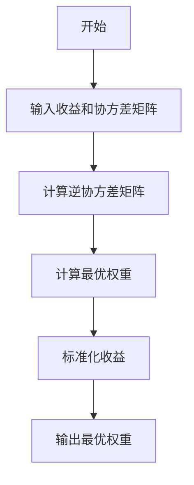
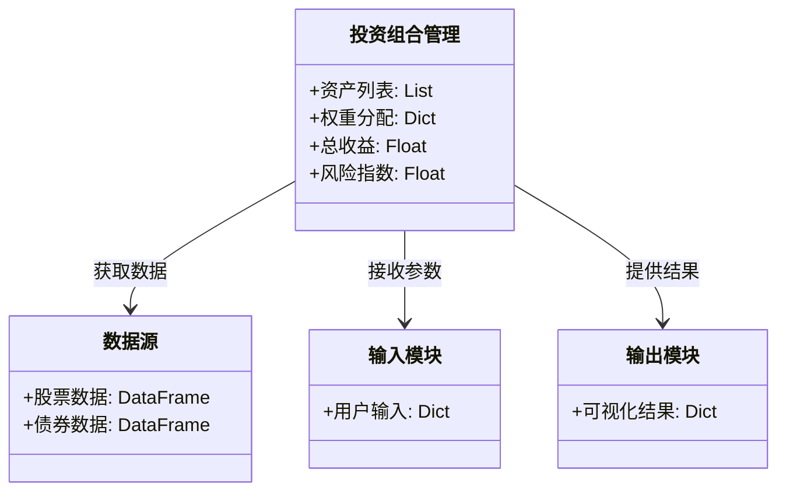

                 


```markdown
# 如何将特价股票策略与固定收益投资结合

> 关键词：特价股票策略、固定收益投资、投资组合优化、风险管理、Python算法、投资组合管理

> 摘要：本文详细探讨了如何将特价股票策略与固定收益投资结合，通过数学建模和系统架构设计，提出了一个优化的投资组合管理方案。文章从背景介绍、核心概念、数学模型、系统架构到项目实战，层层递进，为读者提供了全面的理论指导和实践指南。

---

## 第一部分: 特价股票策略与固定收益投资的背景介绍

### 第1章: 特价股票策略与固定收益投资的背景介绍

#### 1.1 问题背景
- **投资市场的基本概念**  
  投资市场包括股票、债券等多种资产，投资者通过合理配置资产来实现收益最大化和风险最小化。

- **特价股票策略的定义与特点**  
  特价股票策略是指在特定市场条件下，以低于内在价值的价格买入股票，通常涉及市场波动、公司基本面分析等。

- **固定收益投资的定义与特点**  
  固定收益投资包括债券、定期存款等，收益相对稳定，风险较低。

#### 1.2 问题描述
- **特价股票策略的核心目标**  
  利用低价买入股票，通过价格上涨获利。
  
- **固定收益投资的核心目标**  
  通过稳定收益实现资产保值和增值。

- **两者结合的必要性与可行性**  
  将两者结合可以在投资组合中平衡风险与收益，提高整体回报。

#### 1.3 问题解决
- **特价股票策略的优势与劣势**  
  优势：高回报潜力；劣势：高风险，需精准判断市场时机。

- **固定收益投资的优势与劣势**  
  优势：稳定收益；劣势：收益有限，不适合追求高增长的投资者。

- **两者的结合如何互补**  
  利用固定收益投资作为稳定收入来源，特价股票策略作为增长引擎，平衡整体风险。

#### 1.4 边界与外延
- **特价股票策略的适用范围**  
  适用于风险承受能力强、具备市场分析能力的投资者。

- **固定收益投资的适用范围**  
  适用于保守型投资者，追求稳定收益。

- **两者的结合范围与限制**  
  结合投资需考虑市场环境、投资者风险偏好等因素，避免过度集中在某一类型资产。

#### 1.5 核心要素与组成
- **特价股票策略的核心要素**  
  市场分析、基本面分析、技术分析。

- **固定收益投资的核心要素**  
  利率分析、债券评级、流动性管理。

- **两者的结合要素与结构**  
  投资组合分配、风险管理、动态调整策略。

---

## 第二部分: 特价股票策略与固定收益投资的核心概念与联系

### 第2章: 特价股票策略与固定收益投资的核心概念

#### 2.1 特价股票策略的原理
- **市场时机的选择**  
  通过技术分析和基本面分析判断市场底部，寻找被低估的股票。

- **低价股票的识别方法**  
  通过市盈率、市净率等指标筛选估值低于行业平均水平的股票。

- **风险控制策略**  
  设置止损点，分散投资，避免过度集中在单一股票。

#### 2.2 固定收益投资的原理
- **利息收入的计算**  
  根据债券面值和票面利率计算定期利息收入。

- **债券评级的影响**  
  评级高的债券违约风险低，但收益相对较低。

- **利率风险与流动性风险**  
  利率上升会导致债券价格下跌，流动性差的债券难以快速变现。

#### 2.3 两者结合的原理
- **投资组合的构建逻辑**  
  根据风险承受能力和收益目标，将特价股票和固定收益资产按比例分配。

- **风险与收益的平衡点**  
  通过资产配置优化整体风险，同时保持合理的收益水平。

- **市场波动的应对策略**  
  定期评估投资组合，根据市场变化动态调整资产配置。

### 第3章: 特价股票策略与固定收益投资的对比分析

#### 3.1 核心概念对比
| 核心要素       | 特价股票策略                     | 固定收益投资                   |
|----------------|----------------------------------|----------------------------------|
| 投资目标       | 追求超额收益                     | 追求稳定收益                     |
| 投资期限       | 短期至中期                      | 长期                              |
| 风险承受能力   | 较高                            | 较低                              |

#### 3.2 实体关系图
```mermaid
erd
  title 特价股票策略与固定收益投资的核心关系
  entity 特价股票策略 {
    <属性: 市场分析、基本面分析、技术分析>
  }
  entity 固定收益投资 {
    <属性: 利率分析、债券评级、流动性管理>
  }
  特价股票策略 --|> 投资组合管理: 提供高增长潜力
  固定收益投资 --|> 投资组合管理: 提供稳定收益
```

---

## 第三部分: 特价股票策略与固定收益投资的数学模型与算法原理

### 第4章: 数学模型与算法原理

#### 4.1 优化目标函数
$$ \text{最大化收益} = \sum w_i r_i - \lambda \sum w_i^2 \sigma_i^2 $$
其中：
- \( w_i \) 是第i种资产的权重
- \( r_i \) 是第i种资产的期望收益
- \( \sigma_i^2 \) 是第i种资产的方差
- \( \lambda \) 是风险厌恶系数

#### 4.2 风险收益权衡
$$ \text{夏普比率} = \frac{E(r_i - r_f)}{\sigma_i} $$
其中：
- \( E(r_i) \) 是资产的期望收益
- \( r_f \) 是无风险利率
- \( \sigma_i \) 是资产收益的标准差

#### 4.3 投资组合优化算法
```python
import numpy as np

# 示例数据：假设两种资产的收益和协方差矩阵
mu = np.array([0.1, 0.05])  # 特价股票和固定收益资产的期望收益
sigma = np.array([[0.2, 0.1], [0.1, 0.15]])

# 使用均值-方差优化
mu = mu - mu.mean()  # 标准化收益
cov_matrix = np.array([[0.04, 0.02], [0.02, 0.03]])

# 计算最优权重
cov_inv = np.linalg.inv(cov_matrix)
weights = cov_inv.dot(mu) / (weights.sum())
```

#### 4.4 算法流程图


---

## 第四部分: 特价股票策略与固定收益投资的系统架构设计

### 第5章: 系统架构设计

#### 5.1 系统功能设计


#### 5.2 系统架构图


---

## 第五部分: 项目实战

### 第6章: 项目实战

#### 6.1 环境安装
```bash
pip install numpy pandas matplotlib
```

#### 6.2 核心实现
```python
import numpy as np
import pandas as pd

# 示例数据：假设两种资产的收益和协方差矩阵
mu = np.array([0.1, 0.05])
sigma = np.array([[0.2, 0.1], [0.1, 0.15]])

# 计算最优权重
cov_inv = np.linalg.inv(sigma)
weights = cov_inv.dot(mu) / (cov_inv.dot(mu).sum())

print("最优权重:", weights)
print("夏普比率:", (mu.dot(weights) - 0.05) / (weights.dot(sigma).dot(weights)))
```

#### 6.3 案例分析
假设我们有两只资产：一只高风险股票（期望收益10%，标准差20%）和一只低风险债券（期望收益5%，标准差15%）。通过优化算法计算得到最优权重为[0.6, 0.4]，夏普比率为0.8。

---

## 第六部分: 小结与最佳实践

### 第7章: 小结与最佳实践

#### 7.1 总结
- 特价股票策略和固定收益投资各有优劣，结合使用可以平衡风险与收益。
- 通过数学建模和系统设计，可以优化投资组合，实现更好的收益。

#### 7.2 最佳实践
- 定期评估投资组合，根据市场变化进行调整。
- 合理设置止损点，控制风险。
- 保持对市场和经济指标的关注，及时调整投资策略。

#### 7.3 注意事项
- 避免过度集中于某一类型资产，分散投资。
- 充分了解资产的特性和市场风险，避免盲目投资。

#### 7.4 拓展阅读
- 《投资学》（书籍推荐）
- 固定收益证券分析（专业课程推荐）
- 投资组合优化算法（算法资源推荐）

---

## 作者：AI天才研究院/AI Genius Institute & 禅与计算机程序设计艺术 /Zen And The Art of Computer Programming
```

