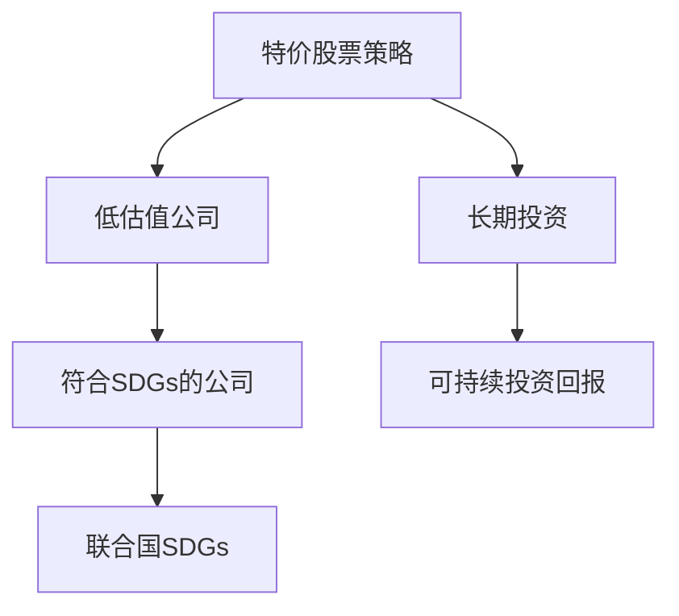
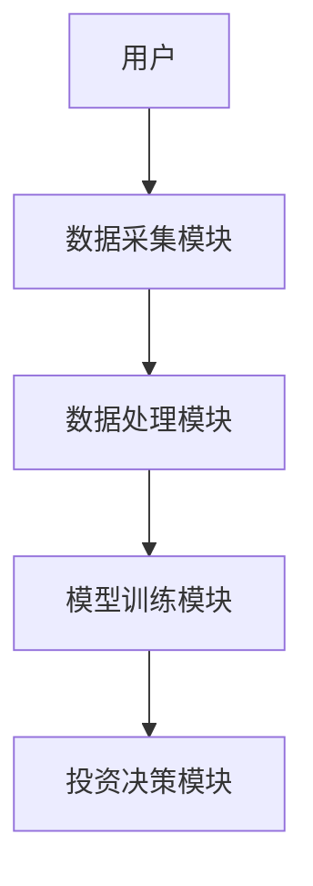

                 


# 如何将特价股票策略与联合国可持续发展目标对接

> 关键词：特价股票策略，联合国可持续发展目标，投资策略，ESG因素，算法优化

> 摘要：本文探讨如何将特价股票策略与联合国可持续发展目标对接，分析其背景、机制和实现方法，通过实例展示其应用。

---

# 第一部分：背景与概念

## 第1章：特价股票策略概述

### 1.1 特价股票策略的定义与特点

#### 1.1.1 特价股票的定义
特价股票是指在特定市场条件下，价格低于其内在价值的股票。这些股票通常被低估，具有较大的上涨潜力。

#### 1.1.2 特价股票策略的核心特点
- 低估值：市盈率、市净率等指标低于行业平均水平。
- 市场波动：利用市场波动低价买入，高价卖出。
- 长期投资：注重公司基本面，长期持有。

#### 1.1.3 特价股票策略的应用场景
- 经济衰退：企业估值被压低，提供低价买入机会。
- 市场恐慌：投资者恐慌性抛售，导致股价低于实际价值。
- 特定行业：如周期性行业在低谷期时的股票。

### 1.2 联合国可持续发展目标概述

#### 1.2.1 可持续发展目标的定义
联合国可持续发展目标（SDGs）是2015年通过的17个目标，旨在消除贫困、保护地球、促进繁荣。

#### 1.2.2 可持续发展目标的核心领域
- 贫困消除
- 零饥饿
- 健康与福祉
- 教育
- 气候行动
- 海洋保护
- 陆地生态
- 和平、公正与强大机构

#### 1.2.3 可持续发展目标与投资的关系
投资应支持实现SDGs，如投资可再生能源、教育、医疗等领域。

### 1.3 特价股票策略与可持续发展目标的联系

#### 1.3.1 可持续发展目标对投资策略的影响
- 投资决策需考虑环境、社会和治理（ESG）因素。
- 选择符合SDGs的公司，避免高污染、高碳排放企业。

#### 1.3.2 特价股票策略在可持续发展中的作用
- 识别低估值且符合SDGs的公司，实现投资回报与社会责任的双赢。

---

## 第2章：核心概念与联系

### 2.1 特价股票策略与可持续发展目标的属性对比

| 属性 | 特价股票策略 | 可持续发展目标 |
|------|--------------|----------------|
| 核心目标 | 获取超额收益 | 改善全球问题 |
| 投资标准 | 低估值、高潜力 | ESG表现 |
| 风险因素 | 市场波动、流动性 | 环境风险、治理风险 |

### 2.2 实体关系图



---

# 第二部分：对接机制与方法

## 第3章：对接机制的实现

### 3.1 数据收集与分析

#### 3.1.1 数据来源
- 公司财务数据
- ESG评级
- 行业基准

#### 3.1.2 数据分析
- 计算股票估值指标（市盈率、市净率）
- 评估公司ESG表现

### 3.2 模型构建与优化

#### 3.2.1 模型选择
- 使用多元回归模型预测股票收益
- 结合ESG因子优化模型

#### 3.2.2 模型优化
- 确保模型考虑ESG因子
- 验证模型的稳定性和收益性

---

## 第4章：对接方法与策略

### 4.1 数据驱动的投资策略

#### 4.1.1 数据收集
- 财务数据、ESG评级、行业趋势

#### 4.1.2 数据分析
- 识别符合SDGs的低估值公司

### 4.2 策略优化

#### 4.2.1 算法优化
- 使用遗传算法优化投资组合
- 平衡风险与收益

---

# 第三部分：算法与模型

## 第5章：算法原理与数学模型

### 5.1 强化学习算法

#### 5.1.1 强化学习简介
- 通过奖励机制优化决策

#### 5.1.2 算法流程
1. 状态识别
2. 动作选择
3. 奖励反馈
4. 模型更新

### 5.2 投资组合优化模型

#### 5.2.1 数学模型
$$ \text{最大化} \quad \sum_{i=1}^{n} w_i r_i $$
$$ \text{约束} \quad \sum_{i=1}^{n} w_i = 1 $$
$$ \text{其中} \quad w_i \text{为权重，} r_i \text{为收益} $$

---

## 第6章：算法实现与代码示例

### 6.1 Python代码示例

#### 6.1.1 数据加载与预处理
```python
import pandas as pd
data = pd.read_csv('stocks.csv')
data = data[['price', 'pe_ratio', 'esg_score']]
```

#### 6.1.2 模型训练
```python
from sklearn.linear_model import LinearRegression
model = LinearRegression()
model.fit(data[['pe_ratio', 'esg_score']], data['price'])
```

#### 6.1.3 预测与评估
```python
predictions = model.predict(data[['pe_ratio', 'esg_score']])
print('预测价格:', predictions)
```

---

# 第四部分：系统架构与项目实战

## 第7章：系统架构设计

### 7.1 系统功能设计

#### 7.1.1 功能模块
- 数据采集
- 模型训练
- 投资决策

### 7.1.2 系统架构


## 第8章：项目实战

### 8.1 环境安装

#### 8.1.1 安装依赖
```bash
pip install pandas sklearn matplotlib
```

### 8.2 核心实现

#### 8.2.1 数据处理
```python
import pandas as pd
data = pd.read_csv('stocks.csv')
```

#### 8.2.2 模型训练
```python
from sklearn.linear_model import LinearRegression
model = LinearRegression()
model.fit(data[['pe_ratio', 'esg_score']], data['price'])
```

---

# 第五部分：总结与展望

## 第9章：总结与最佳实践

### 9.1 总结
本文详细探讨了如何将特价股票策略与联合国可持续发展目标对接，通过数据分析、模型构建和算法优化，实现投资回报与社会责任的双重目标。

### 9.2 最佳实践

#### 9.2.1 数据收集
- 确保数据的全面性和准确性

#### 9.2.2 模型优化
- 定期更新模型，适应市场变化

#### 9.2.3 风险管理
- 设置止损点，控制投资风险

## 第10章：未来展望

### 10.1 未来方向

#### 10.1.1 智能化投资
- 利用AI技术进一步优化投资策略

#### 10.1.2 数据共享
- 推动数据共享，提升模型准确性

---

# 作者

作者：AI天才研究院/AI Genius Institute & 禅与计算机程序设计艺术 /Zen And The Art of Computer Programming

