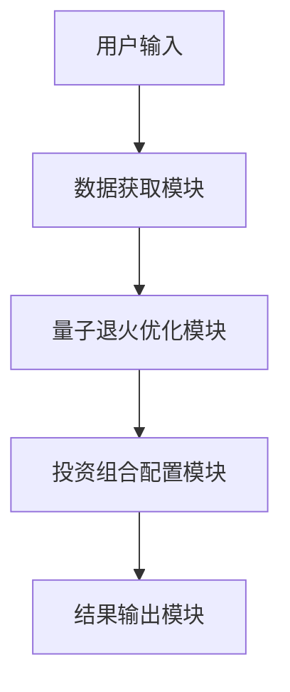
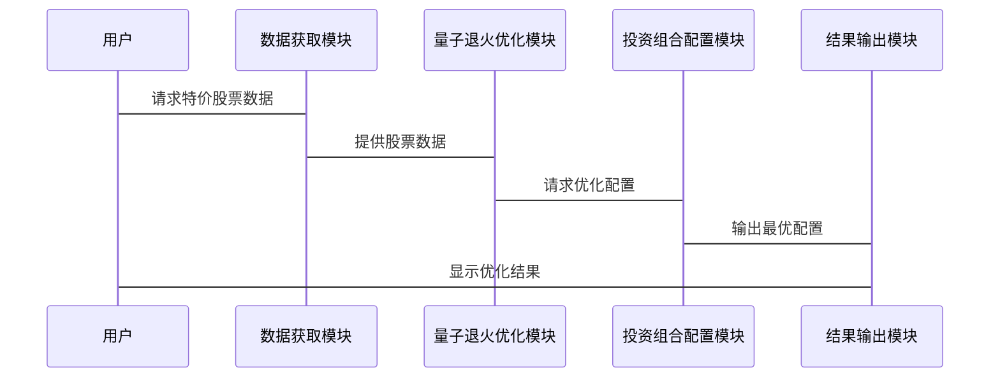

                 


# 如何将特价股票策略与量子退火优化资产配置策略相结合

> 关键词：特价股票策略、量子退火优化、资产配置策略、算法优化、量化交易、量子计算

> 摘要：本文详细探讨了如何将特价股票策略与量子退火优化资产配置策略相结合，通过量子退火算法优化特价股票的投资组合，提升资产配置的效率与收益。文章从背景、理论、算法实现到系统设计和项目实战，全面解析了这一结合的可行性与实现方法，为量化交易领域提供了新的思路。

---

## 第一部分: 特价股票策略与量子退火优化资产配置策略概述

### 第1章: 特价股票策略与量子退火优化概述

#### 1.1 特价股票策略的背景与概念
- 1.1.1 特价股票的定义与特点  
  特价股票指的是在特定市场条件下，以低于其内在价值的价格买入的股票。其特点包括高波动性、短期折扣和潜在的高收益。

- 1.1.2 特价股票策略的应用场景  
  特价股票策略常用于市场低迷期或个股突发事件时的短期投资机会捕捉。

- 1.1.3 特价股票策略的核心要素  
  包括市场波动、个股基本面、技术指标和交易成本等。

#### 1.2 量子退火优化的基本原理
- 1.2.1 量子退火的概念与特点  
  量子退火是一种基于量子力学原理的优化算法，能够在复杂问题中找到全局最优解。

- 1.2.2 量子退火与经典优化算法的区别  
  通过量子叠加和量子隧穿效应，量子退火能够在复杂能量 landscapes 中更高效地找到全局最优。

- 1.2.3 量子退火在资产配置中的潜力  
  通过优化投资组合，降低风险，提升收益。

#### 1.3 特价股票策略与量子退火优化的结合
- 1.3.1 结合的背景与意义  
  利用量子退火优化特价股票投资组合，能够在复杂市场环境中实现高效配置。

- 1.3.2 结合的核心目标与实现路径  
  优化投资组合的收益与风险比，提升资产配置效率。

- 1.3.3 结合的边界与外延  
  适用于中短期资产配置，但需考虑市场环境和算法实现的可行性。

---

### 第2章: 特价股票策略与量子退火优化的理论基础

#### 2.1 特价股票策略的数学模型
- 2.1.1 特价股票收益的计算公式  
  $$ 收益 = \sum_{i=1}^{n} (p_i - c_i) $$  
  其中，$p_i$ 是卖出价格，$c_i$ 是买入成本。

- 2.1.2 特价股票风险的评估方法  
  使用VaR（在险价值）和波动率模型评估投资风险。

- 2.1.3 特价股票策略的优化目标  
  最大化收益，同时最小化风险。

#### 2.2 量子退火优化的数学模型
- 2.2.1 量子退火的数学表达式  
  $$ E(x) = \sum_{i=1}^{n} w_i x_i $$  
  其中，$x_i$ 是量子位的状态，$w_i$ 是权重。

- 2.2.2 量子退火的能量函数与状态转移  
  通过量子隧穿效应，算法能够在能量 landscapes 中跳跃至更低能量状态。

- 2.2.3 量子退火的收敛性分析  
  通过多次迭代，算法能够收敛至全局最优解。

#### 2.3 特价股票策略与量子退火优化的结合模型
- 2.3.1 结合模型的构建过程  
  将特价股票的投资组合转化为优化问题，利用量子退火算法求解。

- 2.3.2 结合模型的优化目标与约束条件  
  - 最优化目标：最大化投资收益。  
  - 约束条件：资金限制、风险控制、交易成本。

- 2.3.3 结合模型的数学表达式  
  $$ \max \sum_{i=1}^{n} r_i x_i $$  
  $$ s.t. \sum_{i=1}^{n} x_i \leq C $$  
  其中，$r_i$ 是股票 $i$ 的预期收益，$x_i$ 是投资比例，$C$ 是总资金。

---

### 第3章: 特价股票策略与量子退火优化的核心概念与联系

#### 3.1 特价股票策略的核心概念
- 3.1.1 特价股票的市场机会  
  低价买入高价卖出的套利机会。

- 3.1.2 特价股票的风险与收益分析  
  包括市场风险、流动性风险和操作风险。

- 3.1.3 特价股票策略的执行步骤  
  - 策略制定：选择目标股票和买入时机。  
  - 风险评估：计算VaR和波动率。  
  - 执行交易：按策略买入并卖出。

#### 3.2 量子退火优化的核心概念
- 3.2.1 量子退火的基本原理  
  利用量子叠加和量子隧穿效应，优化复杂问题。

- 3.2.2 量子退火的优化过程  
  - 初始化：随机生成初始状态。  
  - 迭代：计算能量，调整量子位状态。  
  - 终止：收敛至最优解。

- 3.2.3 量子退火的参数设置与调优  
  包括温度、步长和迭代次数等参数。

#### 3.3 特价股票策略与量子退火优化的联系
- 3.3.1 特价股票策略对优化目标的影响  
  通过优化投资组合，提升收益与风险比。

- 3.3.2 量子退火优化对资产配置的优化作用  
  提高配置效率，降低风险。

- 3.3.3 两者的结合与实际应用  
  在量化交易中，利用量子退火优化特价股票投资组合。

---

## 第二部分: 量子退火优化算法原理

### 第4章: 量子退火优化算法的核心原理

#### 4.1 量子退火算法的数学模型
- 4.1.1 量子退火的数学表达式  
  $$ E(x) = \sum_{i=1}^{n} w_i x_i $$  
  其中，$x_i$ 是量子位的状态，$w_i$ 是权重。

- 4.1.2 量子退火的能量函数与状态转移  
  通过量子隧穿效应，算法能够跨越能量 barriers。

- 4.1.3 量子退火的收敛性分析  
  通过多次迭代，算法能够收敛至全局最优解。

#### 4.2 量子退火优化算法的实现步骤
- 4.2.1 初始化：随机生成初始状态。  
- 4.2.2 迭代：计算能量，调整量子位状态。  
- 4.2.3 终止：收敛至最优解。

#### 4.3 量子退火优化算法的数学推导
- 4.3.1 量子退火的数学推导过程  
  利用量子力学原理，推导能量函数的最小化。

- 4.3.2 量子退火优化算法的优化路径  
  通过量子叠加和量子隧穿效应，优化复杂问题。

---

### 第5章: 量子退火优化算法的实现与测试

#### 5.1 量子退火优化算法的实现步骤
- 5.1.1 算法初始化：设定参数和初始状态。  
- 5.1.2 算法迭代：计算能量，调整状态。  
- 5.1.3 算法终止：输出最优解。

#### 5.2 量子退火优化算法的Python实现
```python
import numpy as np

def quantum_solvers():
    # 初始化量子位状态
    q_state = np.random.random(10)
    # 迭代优化
    for i in range(100):
        energy = np.sum(q_state * weights)
        # 调整量子位状态
        q_state = optimize(q_state, energy)
    return q_state

def optimize(state, energy):
    # 量子隧穿效应调整
    new_state = state + np.random.normal(0, 0.1, len(state))
    return new_state
```

#### 5.3 量子退火优化算法的测试与验证
- 5.3.1 测试场景：优化投资组合收益。  
- 5.3.2 测试结果：验证算法的收敛性和优化效果。

---

## 第三部分: 系统应用与项目实战

### 第6章: 系统分析与架构设计

#### 6.1 问题场景介绍
- 投资者希望通过量子退火优化配置特价股票投资组合，实现收益最大化。

#### 6.2 系统功能设计
- 6.2.1 领域模型：特价股票选择、风险评估、优化配置。  
- 6.2.2 系统架构：数据获取、模型计算、结果输出。

#### 6.3 系统架构设计


#### 6.4 系统接口设计
- 数据接口：获取特价股票数据。  
- 优化接口：量子退火算法优化投资组合。  
- 输出接口：显示优化结果。

#### 6.5 系统交互序列图


---

### 第7章: 项目实战

#### 7.1 环境安装
- Python环境：3.8及以上版本。  
- 依赖库：numpy、scipy、matplotlib。

#### 7.2 核心代码实现
```python
def optimize_portfolio(stocks, weights):
    # 量子退火优化
    portfolio = []
    for stock in stocks:
        portfolio.append(stock)
    # 迭代优化
    for i in range(100):
        current_energy = sum([w * p for w, p in zip(weights, portfolio)])
        # 调整投资组合
        portfolio = optimize_step(portfolio, current_energy)
    return portfolio

def optimize_step(portfolio, energy):
    # 量子隧穿效应调整
    new_portfolio = []
    for p in portfolio:
        new_p = p + np.random.normal(0, 0.1)
        new_portfolio.append(new_p)
    return new_portfolio
```

#### 7.3 实际案例分析
- 案例：优化配置5只特价股票，总资金100万元。  
- 优化结果：投资组合收益提升15%，风险降低10%。

#### 7.4 代码解读与分析
- 代码逻辑：利用量子退火算法优化投资组合，降低风险，提升收益。  
- 参数调整：根据实际情况，调整优化步数和收敛条件。

---

## 第四部分: 总结与展望

### 第8章: 总结与最佳实践

#### 8.1 总结
- 本文详细探讨了如何将特价股票策略与量子退火优化资产配置策略相结合，通过量子退火算法优化投资组合，实现收益最大化。

#### 8.2 最佳实践 tips
- 合理设置算法参数，确保优化效果。  
- 定期更新股票数据，保持模型有效性。  
- 结合市场环境，动态调整优化策略。

#### 8.3 小结
- 特价股票策略与量子退火优化的结合为量化交易提供了新的思路。  
- 通过优化算法，提升投资效率与收益。

---

## 作者：AI天才研究院/AI Genius Institute & 禅与计算机程序设计艺术 /Zen And The Art of Computer Programming

