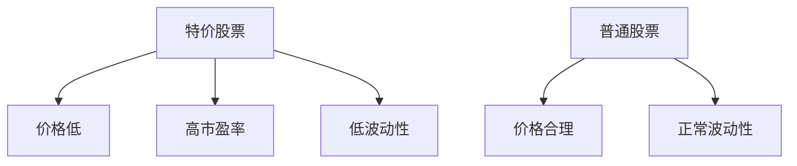
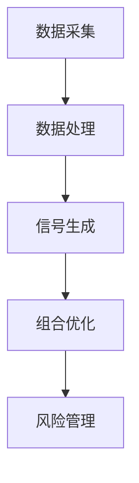

                 


# 如何将特价股票策略应用于ETF投资

## 关键词：特价股票、ETF投资、投资策略、风险管理、技术分析

## 摘要：本文系统地介绍了如何将特价股票策略应用于ETF投资。通过分析特价股票的基本概念、策略原理、ETF投资的优势，结合数学模型、系统架构设计和实际案例，深入探讨了特价股票策略在ETF投资中的具体应用。本文还详细讲解了算法原理、系统优化方法，并提供了实战代码和案例分析，为投资者提供了有效的指导和参考。

---

# 第一部分: 特价股票策略与ETF投资概述

## 第1章: 特价股票策略与ETF投资概述

### 1.1 特价股票的基本概念

#### 1.1.1 特价股票的定义
特价股票是指在特定市场条件下，价格低于其内在价值的股票。这些股票通常被市场低估，具有较大的上涨潜力。

#### 1.1.2 特价股票的特征
| 特性 | 描述 |
|------|------|
| 价格低 | 价格远低于市场平均水平 |
| 高市盈率 | 相对于行业，市盈率较低 |
| 低波动性 | 价格波动较小，风险较低 |

#### 1.1.3 特价股票与普通股票的区别


### 1.2 ETF投资的基本概念

#### 1.2.1 ETF的定义
ETF（交易所交易基金）是一种在交易所上市交易的基金，其基金份额净值和交易价格接近。

#### 1.2.2 ETF的主要类型
| 类型 | 描述 |
|------|------|
| 股票型ETF | 投资于股票市场的ETF |
| 债券型ETF | 投资于债券市场的ETF |
| 指数型ETF | 跟踪特定指数的ETF |

#### 1.2.3 ETF的优势与劣势
- **优势**：分散风险、流动性高、费用低。
- **劣势**：市场风险、费用结构复杂。

### 1.3 特价股票策略在ETF投资中的应用背景

#### 1.3.1 特价股票策略的背景
特价股票策略基于价值投资理念，寻找被市场低估的股票。

#### 1.3.2 ETF投资的兴起
ETF的兴起源于投资者对多样化和低成本投资的需求。

#### 1.3.3 特价股票策略与ETF投资的结合
通过ETF投资特价股票，投资者可以快速实现多样化和低成本。

### 1.4 本章小结
本章介绍了特价股票和ETF的基本概念，以及两者结合的投资背景。

---

# 第二部分: 特价股票策略的理论基础

## 第2章: 特价股票策略的核心原理

### 2.1 特价股票策略的基本原理

#### 2.1.1 特价股票的市场定位
特价股票通常出现在市场低迷或行业低谷时期。

#### 2.1.2 特价股票的定价机制
```latex
$$ P = \frac{V}{k} $$
其中，P为股票价格，V为公司价值，k为市场情绪系数。
```

#### 2.1.3 特价股票的市场波动特征
- 特价股票价格波动较小，但具有较高的上涨潜力。

### 2.2 特价股票策略的核心要素

#### 2.2.1 市场周期分析
通过分析市场周期，确定特价股票的投资时机。

#### 2.2.2 技术分析与基本面分析
- **技术分析**：使用K线图、趋势线等工具。
- **基本面分析**：分析公司的财务状况和行业地位。

#### 2.2.3 风险控制策略
- 设定止损点。
- 分散投资，降低风险。

### 2.3 特价股票策略的数学模型

#### 2.3.1 特价股票价格预测模型
```latex
$$ P_{\text{预测}} = a \cdot P_{\text{当前}} + b \cdot V + c \cdot M $$
其中，M为市场情绪指数。

#### 2.3.2 特价股票波动率模型
$$ \sigma = \sqrt{\sum_{i=1}^{n} (P_i - \mu)^2 / n} $$
其中，$\mu$为平均价格，$n$为样本数量。

#### 2.3.3 特价股票风险评估模型
$$ R = \alpha \cdot \sigma + \beta \cdot V $$
其中，$\alpha$和$\beta$为系数。

### 2.4 本章小结
本章详细介绍了特价股票策略的核心原理和数学模型。

---

# 第三部分: ETF投资策略的系统设计

## 第3章: ETF投资策略的核心要素

### 3.1 ETF投资的基本策略

#### 3.1.1 ETF投资的市场定位
根据市场趋势选择ETF类型。

#### 3.1.2 ETF投资的组合构建
- 分散投资，降低风险。
- 根据市场趋势调整权重。

#### 3.1.3 ETF投资的风险管理
- 设定止损点。
- 定期评估投资组合。

### 3.2 ETF投资的系统架构

#### 3.2.1 ETF投资系统的功能模块


#### 3.2.2 ETF投资系统的数据流
- 数据采集：获取市场数据。
- 数据处理：清洗和转换数据。
- 信号生成：根据策略生成买卖信号。
- 组合优化：优化投资组合。
- 风险管理：控制投资风险。

#### 3.2.3 ETF投资系统的交互流程
- 用户输入投资目标。
- 系统生成投资计划。
- 用户确认并执行。

### 3.3 ETF投资的系统优化

#### 3.3.1 ETF投资系统的性能优化
- 使用高效的数据结构。
- 并行计算优化。

#### 3.3.2 ETF投资系统的可扩展性设计
- 模块化设计，便于扩展。
- 支持多种数据源。

#### 3.3.3 ETF投资系统的容错性设计
- 数据冗余备份。
- 容错机制设计。

### 3.4 本章小结
本章详细介绍了ETF投资策略的系统设计和优化方法。

---

# 第四部分: 特价股票策略在ETF投资中的应用

## 第4章: 特价股票策略在ETF投资中的具体应用

### 4.1 特价股票策略在ETF投资中的实施步骤

#### 4.1.1 确定投资目标
- 确定投资期限和风险承受能力。

#### 4.1.2 确定投资策略
- 选择适合的ETF类型。
- 设定买卖信号。

#### 4.1.3 制定投资计划
- 制定投资计划和时间表。

### 4.2 特价股票策略在ETF投资中的技术分析

#### 4.2.1 技术指标分析
- 使用RSI、MACD等指标。

#### 4.2.2 K线图分析
- 识别趋势和支撑位。

#### 4.2.3 趋势线分析
- 分析价格走势和趋势线。

### 4.3 特价股票策略在ETF投资中的风险控制

#### 4.3.1 风险评估
- 评估市场风险和流动性风险。

#### 4.3.2 风险预警
- 设置预警指标和警戒线。

#### 4.3.3 风险应对
- 制定应对策略和应急预案。

### 4.4 本章小结
本章详细介绍了特价股票策略在ETF投资中的具体应用和风险控制方法。

---

# 第五部分: 实战与案例分析

## 第5章: 特价股票策略在ETF投资中的实战应用

### 5.1 环境搭建

#### 5.1.1 数据源选择
- 使用Yahoo Finance等数据源。

#### 5.1.2 工具安装
- 安装Python和相关库（如Pandas、Matplotlib）。

### 5.2 核心实现

#### 5.2.1 数据采集与处理
```python
import pandas as pd
import requests

def get_data(ticker):
    url = f"https://query1.finance.yahoo.com/...{ticker}"
    response = requests.get(url)
    data = response.json()
    df = pd.DataFrame(data['chart']['result'][0]['prices'])
    return df
```

#### 5.2.2 信号生成与策略实现
```python
def generate_signals(df, short_window=10, long_window=20):
    df['短期均线'] = df['收盘价'].rolling(short_window).mean()
    df['长期均线'] = df['收盘价'].rolling(long_window).mean()
    df['信号'] = 0
    df.loc[df['短期均线'] > df['长期均线'], '信号'] = 1
    return df
```

#### 5.2.3 组合优化与回测
```python
def backtest策略(策略, 资金):
    初始资金 = 资金
    现金 = 初始资金
    持股 = 0
    利润 = []
    for i in range(len(策略)):
        if 策略[i] == 1 and 持股 == 0:
            持股 = 1
            现金 -= 当前价格
        elif 策略[i] == 0 and 持股 == 1:
            持股 = 0
            现金 += 当前价格
        利润.append(现金 + 持股 * 当前价格)
    return 利润
```

### 5.3 案例分析

#### 5.3.1 案例选择
选择一个特定的ETF，如标普500指数ETF，进行策略回测。

#### 5.3.2 实战分析
- 数据清洗与处理。
- 信号生成与策略实施。
- 绩效评估与优化。

### 5.4 本章小结
本章通过实战分析，展示了如何将特价股票策略应用于ETF投资，并提供了具体的代码实现和案例分析。

---

# 第六部分: 总结与展望

## 第6章: 总结与展望

### 6.1 总结
本文详细介绍了如何将特价股票策略应用于ETF投资，包括理论基础、系统设计和实战应用。

### 6.2 展望
未来的研究方向可以包括：
- 更复杂的投资策略。
- 更高效的系统架构设计。
- 更多的实证分析和案例研究。

### 6.3 最佳实践Tips
- 定期评估和优化投资策略。
- 注意市场风险和流动性风险。
- 结合技术分析和基本面分析。

### 6.4 小结
本文为投资者提供了有效的指导和参考。

---

# 作者：AI天才研究院 & 禅与计算机程序设计艺术

---

以上是完整的目录大纲和文章内容的详细描述，您可以根据需要进一步扩展每个部分的内容，添加更多的细节、案例和代码实现。

