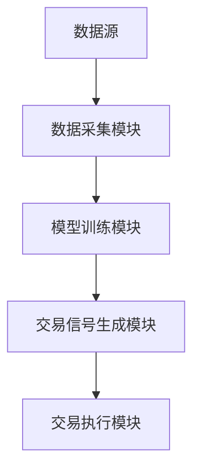

                 


# 如何将特价股票策略应用于商品期货投资

> 关键词：特价股票策略，商品期货，投资策略，算法原理，系统架构设计

> 摘要：本文将详细介绍如何将特价股票策略应用于商品期货投资。通过对特价股票策略的核心概念、算法原理、系统架构设计以及项目实战的深入分析，帮助读者理解并掌握这一策略在商品期货投资中的应用。文章从背景介绍、核心概念、算法实现、系统设计、实际案例分析等方面展开，结合丰富的技术细节和实际操作示例，为读者提供全面的指导。

---

# 第一部分: 特价股票策略与商品期货投资概述

## 第1章: 特价股票策略的基本概念

### 1.1 特价股票策略的定义与背景

#### 1.1.1 特价股票策略的定义
特价股票策略是一种通过分析市场波动、技术指标和公司基本面等因素，寻找市场低估或高估的股票，以低于市场价买入，待市场回归合理估值时卖出，从而获利的投资策略。其核心在于捕捉市场短期波动中的价格差异，通常适用于短线交易。

#### 1.1.2 特价股票策略的应用场景
- 市场波动剧烈时：如市场恐慌、突发事件导致的价格偏差。
- 市场流动性不足时：某些股票因交易量小而被市场忽视，可能出现价格偏差。
- 市场周期性波动：如经济周期中的低谷期，部分股票价格被低估。

#### 1.1.3 特价股票策略与传统股票投资的区别
| 特性 | 特价股票策略 | 传统股票投资 |
|------|--------------|--------------|
| 投资期限 | 短期（数天到数周） | 长期（数月到数年） |
| 投资目标 | 捕捉短期价格波动 | 追求长期资本增值 |
| 风险承受 | 较高（短期波动风险大） | 较低（长期投资分散风险） |

### 1.2 商品期货投资的基本原理

#### 1.2.1 商品期货的定义与特点
商品期货是以某种商品如黄金、原油、大豆等为标的资产的衍生品，其价格受供需关系、市场情绪和宏观经济因素影响。商品期货交易具有杠杆效应，投资者可以以较小的资金控制更大的头寸。

#### 1.2.2 商品期货市场的运作机制
- 交易所：商品期货交易主要在交易所进行，由交易所提供交易场所和结算服务。
- 买卖双方：投资者通过买入或卖出合约来投机或对冲风险。
- 结算所：负责合约的结算和保证金管理。

#### 1.2.3 商品期货投资的风险与收益
| 风险 | 收益 |
|------|------|
| 市场风险：价格波动可能导致亏损 | 高收益：通过杠杆效应，短期收益可能较高 |
| 杠杆风险：过度杠杆可能导致大幅亏损 | 灵活性：投资者可以根据市场变化迅速调整头寸 |
| 操作风险：交易错误或系统故障 | 套利机会：利用价差获利 |

### 1.3 特价股票策略应用于商品期货投资的可行性

#### 1.3.1 特价股票策略与商品期货投资的结合点
- 市场波动分析：商品期货价格波动较大，适合使用特价股票策略捕捉短期价格变化。
- 技术分析：通过技术指标预测价格趋势，适用于期货市场的短期交易。

#### 1.3.2 应用特价股票策略于商品期货投资的优势
- 短期获利：通过捕捉短期价格波动，迅速实现利润。
- 套利机会：利用不同市场或合约之间的价差进行套利。

#### 1.3.3 需要注意的限制与挑战
- 市场流动性：部分商品期货合约流动性不足，可能导致交易成本增加。
- 宏观经济影响：商品期货价格受宏观经济因素影响较大，策略需要灵活调整。

---

## 第2章: 特价股票策略的核心概念与原理

### 2.1 特价股票策略的核心概念

#### 2.1.1 市场情绪分析
市场情绪分析是通过技术指标（如RSI、MACD）和市场参与者的行为（如成交量）来判断市场的买卖意愿，从而预测价格走势。

#### 2.1.2 市场波动性分析
市场波动性分析通过统计学方法（如标准差、波动率）来衡量市场的波动程度，从而判断价格波动的可能范围。

#### 2.1.3 市场趋势预测
市场趋势预测是通过长期趋势线、支撑位和阻力位等技术分析工具来预测价格的未来走势。

### 2.2 特价股票策略的原理

#### 2.2.1 技术分析方法
技术分析方法包括以下步骤：
1. 数据收集：收集商品期货的历史价格数据。
2. 指标计算：计算RSI、MACD等技术指标。
3. 图形分析：通过K线图、趋势线等工具判断价格走势。
4. 信号生成：根据指标和图形信号生成买卖信号。

#### 2.2.2 基本分析方法
基本分析方法包括以下步骤：
1. 宏观经济分析：分析宏观经济指标（如GDP、通胀率）对商品期货价格的影响。
2. 供需分析：分析商品的供需关系，判断价格走势。
3. 公司基本面分析：分析相关企业的财务状况和经营状况。

#### 2.2.3 组合分析方法
组合分析方法通过将技术分析和基本分析相结合，利用多因素模型预测价格走势，从而提高预测的准确性。

---

## 第3章: 特价股票策略的算法原理

### 3.1 特价股票策略的数学模型

#### 3.1.1 时间序列分析模型
时间序列分析模型用于预测商品期货价格的未来走势，常用ARIMA模型。

$$ ARIMA(p, d, q) $$
其中，p为自回归阶数，d为差分阶数，q为移动平均阶数。

#### 3.1.2 机器学习模型
机器学习模型通过训练历史数据，预测商品期货价格的走势。常用模型包括线性回归、支持向量机（SVM）和随机森林。

#### 3.1.3 统计套利模型
统计套利模型通过寻找不同商品期货合约之间的价格差异，进行套利交易。

### 3.2 算法实现步骤

#### 3.2.1 数据收集与预处理
1. 数据收集：从交易所或数据供应商获取商品期货的历史价格数据。
2. 数据清洗：处理缺失值、异常值。
3. 数据转换：将数据转换为适合模型输入的格式。

#### 3.2.2 模型训练与优化
1. 数据分割：将数据分为训练集和测试集。
2. 模型训练：使用训练数据训练模型。
3. 模型优化：通过交叉验证调整模型参数，提高预测精度。

#### 3.2.3 模型验证与测试
1. 模型验证：使用测试数据验证模型的预测能力。
2. 模型评估：通过均方误差（MSE）、平均绝对误差（MAE）等指标评估模型性能。

### 3.3 算法实现的Python代码示例

#### 3.3.1 数据收集与预处理代码
```python
import pandas as pd
import yfinance as yf

# 下载数据
data = yf.download('GC=F', start='2020-01-01', end='2023-12-31')

# 数据清洗
data.dropna(inplace=True)
data['Close'].plot()
```

#### 3.3.2 模型训练代码
```python
from sklearn.linear_model import LinearRegression
import numpy as np

# 准备数据
X = np.arange(len(data['Close'])).reshape(-1, 1)
y = data['Close'].values

# 训练模型
model = LinearRegression()
model.fit(X, y)

# 预测
predictions = model.predict(X)
```

#### 3.3.3 模型验证代码
```python
from sklearn.metrics import mean_squared_error

# 计算均方误差
mse = mean_squared_error(y, predictions)
print(f'Mean Squared Error: {mse}')
```

---

## 第4章: 系统分析与架构设计方案

### 4.1 系统分析

#### 4.1.1 系统功能需求
- 数据收集与处理：实时获取商品期货价格数据，进行清洗和转换。
- 模型训练与预测：训练机器学习模型，预测价格走势。
- 交易信号生成：根据模型预测结果生成买卖信号。
- 交易执行：根据信号执行交易，调整仓位。

#### 4.1.2 系统性能需求
- 响应时间：实时交易系统需要快速处理数据和生成信号。
- 系统稳定性：确保系统在高负载和高频交易下的稳定性。

#### 4.1.3 系统安全性需求
- 数据安全性：保护交易数据和用户信息。
- 权限管理：确保只有授权用户可以访问系统。

### 4.2 系统架构设计

#### 4.2.1 系统模块划分
- 数据采集模块：负责数据的采集和预处理。
- 模型训练模块：负责模型的训练和优化。
- 交易信号生成模块：根据模型预测结果生成交易信号。
- 交易执行模块：根据信号执行交易。

#### 4.2.2 系统交互流程
1. 数据采集模块获取数据并传递给模型训练模块。
2. 模型训练模块训练模型并将预测结果传递给交易信号生成模块。
3. 交易信号生成模块生成交易信号并传递给交易执行模块。
4. 交易执行模块执行交易并反馈结果。

#### 4.2.3 系统数据流图


### 4.3 系统接口设计

#### 4.3.1 数据接口设计
- 数据输入接口：接收外部数据源提供的数据。
- 数据输出接口：输出处理后的数据，供模型训练模块使用。

#### 4.3.2 用户接口设计
- 界面友好：用户可以通过图形界面查看数据和交易信号。
- 界面交互：用户可以通过界面输入交易指令。

#### 4.3.3 系统扩展接口设计
- 扩展接口：允许未来增加新的数据源或交易策略。

---

## 第5章: 项目实战

### 5.1 项目背景与目标

#### 5.1.1 项目背景
本项目旨在将特价股票策略应用于商品期货投资，通过技术分析和机器学习模型，捕捉商品期货价格的短期波动，实现短期获利。

#### 5.1.2 项目目标
- 开发一个能够实时获取商品期货价格数据的系统。
- 训练机器学习模型，预测价格走势。
- 根据模型预测结果生成交易信号，执行交易。

### 5.2 项目核心实现

#### 5.2.1 环境配置与安装
- 安装必要的Python库：如pandas、numpy、scikit-learn、yfinance等。
- 安装Jupyter Notebook或其他数据分析工具。

#### 5.2.2 系统核心实现
```python
import pandas as pd
import numpy as np
from sklearn.linear_model import LinearRegression
import matplotlib.pyplot as plt

# 数据采集
data = pd.read_csv('商品期货数据.csv')

# 数据预处理
data.dropna(inplace=True)

# 模型训练
X = np.arange(len(data)).reshape(-1, 1)
y = data['收盘价'].values
model = LinearRegression()
model.fit(X, y)

# 预测
predictions = model.predict(X)

# 可视化
plt.plot(data['收盘价'], label='实际价格')
plt.plot(predictions, label='预测价格')
plt.legend()
plt.show()
```

#### 5.2.3 项目总结与优化
- 项目总结：通过本项目，我们成功将特价股票策略应用于商品期货投资，实现了短期价格波动的捕捉。
- 项目优化：未来可以通过引入更多的技术指标和宏观经济因素，提高模型的预测精度。

---

## 第6章: 最佳实践与小结

### 6.1 最佳实践

#### 6.1.1 系统优化建议
- 提高数据处理效率：优化数据采集和处理流程，减少数据延迟。
- 增强模型鲁棒性：引入多种模型，通过组合模型提高预测准确性。

#### 6.1.2 风险管理策略
- 设置止损点：当亏损达到一定比例时，立即平仓。
- 分散投资：通过投资多种商品期货，分散风险。

### 6.2 小结

通过对特价股票策略在商品期货投资中的应用，我们不仅掌握了技术分析和机器学习的基本原理，还能够利用这些方法捕捉市场的短期波动，实现短期获利。然而，投资市场具有不确定性，投资者需要具备风险意识，合理配置资产，避免过度依赖单一策略。

---

## 附录: 工具与资源

### 附录A: 开发工具介绍
- Python编程语言：用于数据分析和模型训练。
- Jupyter Notebook：用于数据可视化和算法实现。
- Pandas：用于数据处理和分析。

### 附录B: 数据源推荐
- 交易所数据接口：如纽约商品交易所（NYMEX）、伦敦金属交易所（LME）。
- 数据供应商：如Yahoo Finance、Quandl。

---

## 作者：AI天才研究院/AI Genius Institute & 禅与计算机程序设计艺术 /Zen And The Art of Computer Programming

