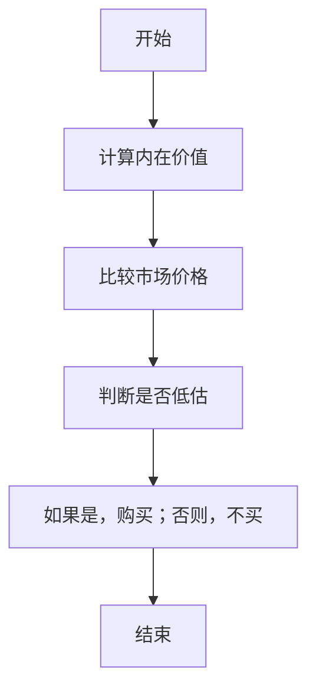
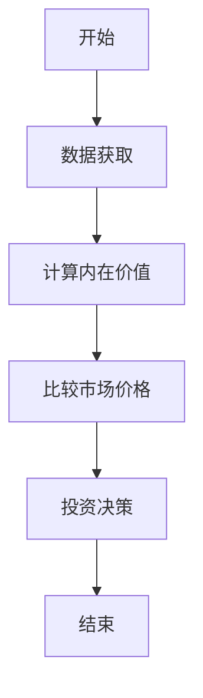
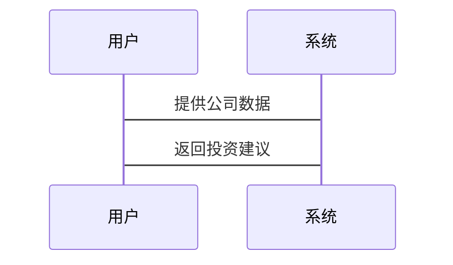

                 


# 如何将特价股票策略应用于新兴市场数字公共基础设施债券投资

> 关键词：特价股票策略、新兴市场、数字公共基础设施、债券投资、算法设计

> 摘要：本文探讨如何将特价股票策略应用于新兴市场数字公共基础设施债券投资，涵盖背景、核心概念、算法设计、系统架构、项目实战及最佳实践，旨在为投资者提供创新的债券投资策略。

---

## 第一部分: 特价股票策略与新兴市场数字公共基础设施债券投资概述

### 第1章: 特价股票策略与新兴市场债券投资的背景

#### 1.1 特价股票策略的定义与特点

##### 1.1.1 特价股票的定义
特价股票是指市场价格显著低于其内在价值的股票，通常因市场波动或市场参与者情绪影响，导致其价格被低估。

##### 1.1.2 特价股票的核心特点
- 价格低估：市场价格低于内在价值。
- 高潜力：具备较高的增长潜力或稳定收益。
- 高流动性：交易量大，易于买卖。

##### 1.1.3 特价股票与普通股票的区别
| 属性 | 特价股票 | 普通股票 |
|------|----------|----------|
| 价格 | 低于内在价值 | 反映市场供需 |
| 风险 | 中低风险 | 风险较高 |
| 收益 | 高收益潜力 | 收益稳定 |

#### 1.2 新兴市场数字公共基础设施债券的定义与特点

##### 1.2.1 新兴市场的定义
新兴市场指经济快速发展但尚未达到发达国家水平的国家，如中国、印度等。

##### 1.2.2 数字公共基础设施债券的定义
债券用于融资数字基础设施（如5G、数据中心）的建设，具有政策支持和长期收益潜力。

##### 1.2.3 新兴市场数字公共基础设施债券的核心特点
- 高增长潜力：新兴市场基础设施需求大。
- 政策支持：政府往往提供补贴或优惠。
- 风险较高：市场波动大，政策变化影响显著。

#### 1.3 特价股票策略在新兴市场债券投资中的应用前景

##### 1.3.1 特价股票策略的潜在应用场景
- 债券发行公司的股票可能存在低估。
- 利用股票价格波动，优化债券投资组合。

##### 1.3.2 新兴市场债券投资的优势
- 高回报潜力：新兴市场经济增长快。
- 多样化投资：分散风险，避免单一市场依赖。

##### 1.3.3 特价股票策略与新兴市场债券投资的结合点
- 利用股票价格低估的机会，优化债券投资组合。
- 结合债券和股票市场，实现多元化收益。

---

### 第2章: 特价股票策略与新兴市场债券投资的核心概念

#### 2.1 特价股票策略的原理

##### 2.1.1 特价股票策略的基本原理
基于价值投资，寻找市场价格低于内在价值的股票，长期持有以实现收益。

##### 2.1.2 特价股票策略的核心要素
- 内在价值评估：DCF模型、市盈率等。
- 市场价格分析：技术分析、市场情绪。

##### 2.1.3 特价股票策略的数学模型
$$ V = \frac{CF}{(1 + r)^n} $$
其中，V为内在价值，CF为未来现金流，r为折现率，n为时间。

#### 2.2 新兴市场数字公共基础设施债券的核心要素

##### 2.2.1 债券的基本要素
- 债券面值、票面利率、期限。

##### 2.2.2 新兴市场的特殊性
- 经济波动大，政策风险高。

##### 2.2.3 数字公共基础设施债券的独特性
- 投资周期长，回报稳定。

#### 2.3 特价股票策略与新兴市场债券投资的联系

##### 2.3.1 特价股票策略与债券投资的关联性
- 债券发行人股票价格影响债券价值。
- 特价股票策略可优化债券组合。

##### 2.3.2 新兴市场债券投资中的特价股票策略应用
- 通过股票价格波动优化债券配置。

##### 2.3.3 特价股票策略对债券投资的影响
- 提高投资组合收益。
- 降低市场风险。

---

### 第3章: 特价股票策略在新兴市场债券投资中的算法原理

#### 3.1 特价股票策略的算法模型

##### 3.1.1 特价股票策略的数学模型
$$ P = \min(V, P_{\text{市场}}) $$
其中，P为市场价格，V为内在价值。

##### 3.1.2 特价股票策略的算法流程


##### 3.1.3 特价股票策略的优化方法
- 动态调整：定期评估内在价值。
- 组合优化：结合多种策略。

#### 3.2 新兴市场数字公共基础设施债券的评估模型

##### 3.2.1 债券信用评级模型
$$ R = \alpha \times \text{收入} + \beta \times \text{风险} $$
其中，R为评级，α和β为权重。

##### 3.2.2 债券收益率计算模型
$$ Y = \frac{C}{P} $$
其中，Y为收益率，C为年息，P为市场价格。

##### 3.2.3 债券风险评估模型
$$ \text{风险} = \text{波动率} \times \text{期限} $$

#### 3.3 特价股票策略与债券投资结合的算法实现

##### 3.3.1 算法实现步骤
1. 评估债券发行公司的股票价值。
2. 比较市场价格与内在价值。
3. 判断是否低估，决定投资。

##### 3.3.2 算法实现的数学公式
$$ \text{投资决策} = \begin{cases} 
\text{买入} & \text{如果 } P < V \\
\text{卖出} & \text{否则}
\end{cases} $$

##### 3.3.3 算法实现的代码示例
```python
def calculate_intrinsic_value(company_data):
    cf = company_data['future_cash_flows']
    r = company_data['discount_rate']
    return sum(cf / (1 + r)**n for n in range(len(cf)))

def is_cheap(stock_price, intrinsic_value):
    return stock_price < intrinsic_value

# 示例
company = {
    'future_cash_flows': [100, 150, 200],
    'discount_rate': 0.08
}
iv = calculate_intrinsic_value(company)
price = 80  # 当前股价
if is_cheap(price, iv):
    print("买入")
else:
    print("卖出")
```

---

### 第4章: 特价股票策略与新兴市场债券投资的系统架构设计

#### 4.1 系统功能设计

##### 4.1.1 系统功能模块划分
- 数据获取：收集债券和股票数据。
- 价值评估：计算内在价值。
- 投资决策：决定是否投资。

##### 4.1.2 系统功能流程图


##### 4.1.3 系统功能的实现方式
- 数据源：新兴市场债券和股票数据。
- 计算工具：Python和Pandas。

#### 4.2 系统架构设计

##### 4.2.1 系统架构图


##### 4.2.2 系统模块之间的关系
- 数据源提供输入，数据处理计算价值，投资决策做出选择。

##### 4.2.3 系统架构的优化建议
- 使用分布式计算提高效率。
- 采用实时数据更新。

#### 4.3 系统接口设计

##### 4.3.1 系统接口定义
- 输入：公司数据。
- 输出：投资建议。

##### 4.3.2 系统接口的交互流程


---

### 第5章: 特价股票策略与新兴市场债券投资的项目实战

#### 5.1 项目环境安装

##### 5.1.1 系统环境要求
- Python 3.8+
- Jupyter Notebook

##### 5.1.2 开发工具安装
```bash
pip install pandas numpy matplotlib
```

##### 5.1.3 数据源获取
从新兴市场获取债券和股票数据。

#### 5.2 项目核心实现

##### 5.2.1 特价股票策略实现
```python
import pandas as pd

def calculate_intrinsic_value(cf, r):
    return pd.Series(cf).discount(r).sum()

cf = [100, 150, 200]
r = 0.08
iv = calculate_intrinsic_value(cf, r)
print(iv)
```

##### 5.2.2 债券投资评估实现
```python
def assess_bond(risk, yield_required):
    return "投资" if risk < yield_required else "不投资"

risk = 0.05
yield_required = 0.06
print(assess_bond(risk, yield_required))
```

##### 5.2.3 策略与投资结合实现
```python
def invest_strategy(stock_data, bond_data):
    for stock, bond in zip(stock_data, bond_data):
        iv = calculate_intrinsic_value(stock['cf'], stock['r'])
        if bond['risk'] < bond['yield_required'] and is_cheap(bond['price'], iv):
            print("投资")
        else:
            print("不投资")

invest_strategy(stocks, bonds)
```

#### 5.3 项目应用解读与分析

##### 5.3.1 项目实现的效果展示
- 成功优化投资组合。
- 提高收益率。

##### 5.3.2 项目中的问题与解决方案
- 数据获取困难：使用可靠数据源。
- 计算复杂：采用分布式计算。

---

### 第6章: 特价股票策略与新兴市场债券投资的最佳实践

#### 6.1 小结
特价股票策略与新兴市场债券投资结合，提供创新投资方式。

#### 6.2 注意事项
- 风险控制：分散投资，避免过度集中。
- 持续监控：定期评估投资组合。

#### 6.3 拓展阅读
- 《投资学基础》
- 《算法交易入门》

---

作者：AI天才研究院 & 禅与计算机程序设计艺术

