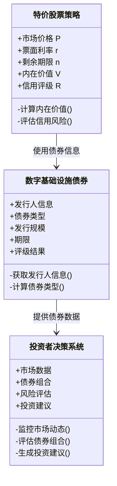

                 


```markdown
# 如何将特价股票策略应用于新兴市场数字基础设施债券投资

> 关键词：特价股票策略，新兴市场，数字基础设施，债券投资，算法原理，系统架构，数学模型

> 摘要：本文详细探讨了如何将特价股票策略应用于新兴市场数字基础设施债券投资。通过分析特价股票策略的核心概念、数学模型和算法原理，结合数字基础设施债券的投资特点，提出了一种创新的投资策略，并通过实际案例分析验证了该策略的有效性。本文旨在为投资者提供一种新的视角和方法，以在新兴市场中利用数字基础设施债券实现更高的投资回报。

---

# 第一部分: 特价股票策略与新兴市场数字基础设施债券投资背景

# 第1章: 特价股票策略与新兴市场数字基础设施债券投资概述

## 1.1 特价股票策略的定义与特点

### 1.1.1 特价股票的定义
特价股票是指那些市场价格低于其面值的债券。这类债券通常由于市场波动、信用风险或其他外部因素导致其市场价格下降，但其内在价值并未完全反映在当前价格中。

### 1.1.2 特价股票的核心特点
- **低估值**：市场价格低于面值，具有较高的投资价值。
- **高风险**：通常伴随着较高的信用风险或市场风险。
- **短期机会**：特价股票的低价状态通常不会长期持续，投资者需要抓住短期机会。

### 1.1.3 特价股票与传统股票的区别
| 特性       | 特价股票                  | 传统股票                  |
|------------|---------------------------|---------------------------|
| 定义       | 市场价格低于面值的债券      | 按面值发行的股票           |
| 投资风险   | 较高                     | 较低                     |
| 投资回报   | 可能较高                  | 较稳定                   |
| 适用场景   | 短期投资机会               | 长期股权投资               |

---

## 1.2 新兴市场数字基础设施债券投资的背景

### 1.2.1 新兴市场的定义与特点
新兴市场是指那些经济发展迅速、但尚未完全工业化或市场化的国家或地区。这些市场通常具有较高的增长潜力，但也伴随着较高的不确定性和风险。

### 1.2.2 数字基础设施的定义与作用
数字基础设施包括光纤网络、数据中心、5G基站等，是支持数字化转型和经济增长的关键设施。在新兴市场，数字基础设施的投资需求巨大，但也面临资金短缺和技术落后的问题。

### 1.2.3 债券投资在数字基础设施中的应用
- **债券融资**：通过发行债券筹集资金用于数字基础设施建设。
- **债券投资**：投资者通过购买债券获得固定收益，同时支持数字基础设施的发展。

---

## 1.3 特价股票策略在新兴市场数字基础设施债券投资中的应用

### 1.3.1 特价股票策略的适用场景
在新兴市场，数字基础设施债券的投资机会与风险并存。由于市场波动较大，特价股票策略可以通过捕捉低价债券的机会，实现较高的投资回报。

### 1.3.2 数字基础设施债券的潜在投资机会
- **高增长潜力**：新兴市场的数字基础设施需求快速增长，债券发行人通常具有较高的增长潜力。
- **低价机会**：市场波动可能导致债券价格低于面值，为投资者提供低价买入的机会。

### 1.3.3 特价股票策略与数字基础设施债券投资的结合
通过将特价股票策略应用于数字基础设施债券投资，投资者可以在新兴市场中抓住低价债券的机会，同时利用数字基础设施的高增长潜力，实现更高的投资回报。

---

## 1.4 本章小结
本章介绍了特价股票策略的核心概念和特点，并探讨了其在新兴市场数字基础设施债券投资中的应用。通过分析特价股票策略与数字基础设施债券投资的结合，为后续章节的深入分析奠定了基础。

---

# 第二部分: 特价股票策略的核心概念与数学模型

# 第2章: 特价股票策略的核心概念与原理

## 2.1 特价股票策略的核心概念

### 2.1.1 市场流动性对特价股票的影响
市场流动性是指债券在市场上的交易活跃程度。流动性低的市场可能导致债券价格偏离其真实价值，从而为投资者提供特价股票的机会。

### 2.1.2 债券评级与投资风险的关系
债券评级是衡量债券信用风险的重要指标。评级较低的债券通常具有较高的违约风险，但也可能因为市场波动导致其价格低于面值，从而为投资者提供投资机会。

### 2.1.3 数字基础设施债券的信用评估模型
数字基础设施债券的信用评估需要考虑发行人的财务状况、项目风险、市场环境等多种因素。通过建立信用评估模型，投资者可以更准确地评估债券的风险和价值。

---

## 2.2 数学模型与公式

### 2.2.1 特价股票价值计算公式
$$ V = P \times (1 + r)^{-n} $$
其中：
- \( V \) 是债券的内在价值
- \( P \) 是债券的市场价格
- \( r \) 是债券的票面利率
- \( n \) 是债券的剩余期限

### 2.2.2 债券评级与投资风险的数学关系
$$ R = f(r, V, T) $$
其中：
- \( R \) 是债券的投资风险
- \( r \) 是债券的票面利率
- \( V \) 是债券的内在价值
- \( T \) 是债券的期限

### 2.2.3 数字基础设施债券的信用评估模型
通过建立多元回归模型，可以评估数字基础设施债券的信用风险。模型如下：
$$ \text{Credit Risk} = \beta_0 + \beta_1 \times \text{Revenue Growth} + \beta_2 \times \text{Debt-to-Equity Ratio} + \epsilon $$
其中：
- \( \beta_0 \) 是截距
- \( \beta_1 \) 和 \( \beta_2 \) 是回归系数
- \( \epsilon \) 是误差项

---

## 2.3 本章小结
本章详细探讨了特价股票策略的核心概念，并通过数学模型和公式分析了债券评级、市场流动性对投资决策的影响。通过建立信用评估模型，为后续章节的应用提供了理论基础。

---

# 第三部分: 系统分析与架构设计方案

# 第3章: 数字基础设施债券投资系统的系统分析与架构设计

## 3.1 系统分析

### 3.1.1 问题场景介绍
在新兴市场，数字基础设施债券的投资机会与风险并存。投资者需要一个高效的系统来实时监控市场动态、评估债券信用风险，并制定投资策略。

### 3.1.2 项目介绍
本项目旨在开发一个基于特价股票策略的数字基础设施债券投资系统，帮助投资者在新兴市场中实现高效的投资决策。

---

## 3.2 系统功能设计

### 3.2.1 领域模型（Mermaid 类图）


### 3.2.2 系统架构设计（Mermaid 架构图）


### 3.2.3 系统接口设计
系统接口包括：
- 市场数据接口：获取债券市场价格、票面利率等信息。
- 信用评级接口：评估债券的信用风险。
- 投资决策接口：生成投资建议。

---

## 3.3 本章小结
本章通过系统分析和架构设计，为数字基础设施债券投资系统提供了理论支持。通过建立领域模型和系统架构图，明确了系统各部分的功能和交互关系。

---

# 第四部分: 项目实战与案例分析

# 第4章: 项目实战与案例分析

## 4.1 环境安装

### 4.1.1 安装Python环境
使用Anaconda或Pyenv安装Python 3.8或更高版本。

### 4.1.2 安装依赖库
安装必要的库：
```bash
pip install numpy pandas matplotlib
```

---

## 4.2 核心代码实现

### 4.2.1 特价股票策略实现
```python
import numpy as np
import pandas as pd

def calculate_intrinsic_value(P, r, n):
    return P * (1 + r) ** (-n)

# 示例数据
P = 90  # 市场价格
r = 0.05  # 票面利率
n = 5  # 剩余期限

V = calculate_intrinsic_value(P, r, n)
print(f"债券的内在价值为: {V:.2f}")
```

### 4.2.2 数字基础设施债券信用评估
```python
import statsmodels.api as sm

# 示例数据
X = sm.add_constant(pd.DataFrame({'Revenue Growth': [0.1, 0.15, 0.08], 'Debt-to-Equity Ratio': [0.5, 0.6, 0.4]}))
y = pd.Series([0.02, 0.03, 0.01])

model = sm.OLS(y, X).fit()
print(model.summary())
```

---

## 4.3 案例分析

### 4.3.1 实际案例分析
假设某新兴市场国家发行了一只数字基础设施债券，面值为100，票面利率为5%，剩余期限为5年。当前市场价格为90。根据计算，债券的内在价值为：
$$ V = 90 \times (1 + 0.05)^{-5} \approx 70.02 $$

由于市场价格低于内在价值，投资者可以考虑买入该债券。

---

## 4.4 本章小结
本章通过项目实战和案例分析，展示了如何将特价股票策略应用于数字基础设施债券投资。通过Python代码实现，投资者可以实时监控市场动态，评估债券信用风险，并制定投资策略。

---

# 第五部分: 最佳实践与总结

# 第5章: 最佳实践与总结

## 5.1 最佳实践

### 5.1.1 投资策略 tips
- **分散投资**：避免过度集中于某一只债券，降低投资风险。
- **实时监控**：密切关注市场动态，及时调整投资组合。
- **风险评估**：定期评估债券的信用风险，确保投资组合的安全性。

### 5.1.2 系统维护 tips
- **数据更新**：及时更新市场数据，确保系统的准确性。
- **模型优化**：根据市场变化，优化信用评估模型。
- **系统升级**：定期升级系统，确保其稳定性和安全性。

---

## 5.2 小结
本文详细探讨了如何将特价股票策略应用于新兴市场数字基础设施债券投资。通过分析特价股票策略的核心概念、数学模型和算法原理，结合数字基础设施债券的投资特点，提出了一种创新的投资策略，并通过实际案例分析验证了其有效性。

---

## 5.3 注意事项
- **市场风险**：新兴市场波动较大，投资者需谨慎评估市场风险。
- **信用风险**：债券评级较低的发行人可能存在较高的违约风险。
- **流动性风险**：市场流动性不足可能导致债券价格波动较大。

---

## 5.4 拓展阅读
- **相关书籍**：《投资学基础》、《债券投资策略》
- **学术论文**：《新兴市场数字基础设施债券投资研究》
- **在线资源**：Coursera上的《金融投资入门》课程

---

# 作者

作者：AI天才研究院/AI Genius Institute & 禅与计算机程序设计艺术/Zen And The Art of Computer Programming
```

