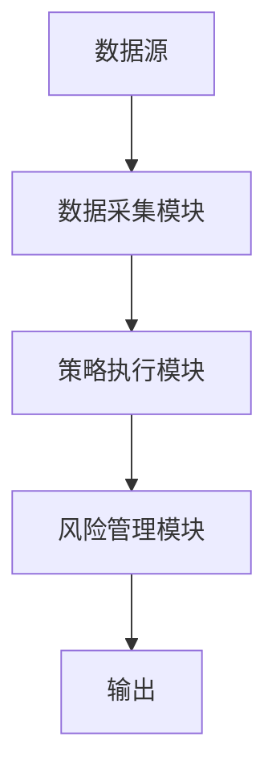
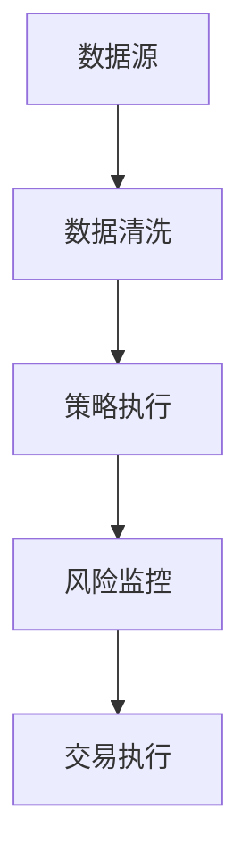

                 


# 如何将特价股票策略融入多元化数字资产对冲组合

> 关键词：特价股票、数字资产对冲、风险管理、投资策略、量化交易、组合优化

> 摘要：本文将详细探讨如何将特价股票策略融入多元化数字资产对冲组合中，通过数学建模、算法设计和系统架构优化，构建一个高效的风险可控的投资组合。文章将从背景介绍、数学模型、系统架构到项目实战，全面解析如何将特价股票策略与数字资产对冲相结合，帮助投资者在复杂多变的市场中实现收益与风险的最优平衡。

---

# 正文

## 第一部分：特价股票策略与数字资产对冲概述

### 第1章：特价股票策略的背景与意义

#### 1.1 特价股票策略的概念与特点

##### 1.1.1 特价股票的定义
特价股票是指在特定时间点以低于市场价出售的股票，通常由于市场波动、公司公告或投资者行为导致价格临时性下跌。特价股票的核心在于“低价”和“短期机会”，投资者希望通过快速买卖获取超额收益。

##### 1.1.2 特价股票策略的核心特点
- **短期性**：特价股票通常只在特定时间窗口内出现，机会稍纵即逝。
- **高波动性**：价格波动大，容易出现快速上涨或下跌。
- **高风险**：由于价格波动剧烈，投资风险较高，需要严格的风险控制。

##### 1.1.3 特价股票策略的优势与劣势
- **优势**：
  - 投资成本低，有机会在低价位介入优质股票。
  - 短期内可能获得超额收益。
- **劣势**：
  - 风险高，容易受到市场情绪影响。
  - 需要高频交易能力，对交易系统要求较高。

#### 1.2 数字资产对冲的基本原理

##### 1.2.1 数字资产对冲的定义
数字资产对冲是指通过投资多种数字资产（如比特币、以太坊等）来降低整体投资组合的风险。对冲的核心在于通过资产之间的负相关性，抵消单一资产的价格波动风险。

##### 1.2.2 数字资产对冲的机制与工具
- **机制**：
  - 通过资产配置分散风险。
  - 利用对冲工具（如期货、期权）对冲价格波动。
- **工具**：
  - 数字资产交易平台（如Coinbase、Binance）。
  - 投资组合优化工具（如Python的quantlib库）。

##### 1.2.3 数字资产对冲的风险与收益
- **风险**：
  - 数字资产价格波动大，容易受到市场操纵影响。
  - 操作风险（如交易系统故障）。
- **收益**：
  - 通过多样化投资降低风险，同时捕捉市场上涨趋势。

#### 1.3 特价股票策略与数字资产对冲的结合

##### 1.3.1 结合的必要性
- 特价股票策略需要高频交易能力，而数字资产对冲提供了多样化的投资工具，可以有效分散风险。
- 数字资产市场的高波动性为特价股票策略提供了更多机会。

##### 1.3.2 结合的可行性
- 技术可行性：通过量化交易系统实现两者结合。
- 市场可行性：数字资产市场发展迅速，提供丰富的交易机会。

##### 1.3.3 结合的潜在风险与机会
- **风险**：
  - 数字资产市场的波动性可能放大特价股票策略的风险。
  - 两者结合需要复杂的交易系统，存在技术风险。
- **机会**：
  - 通过多样化投资降低风险，同时捕捉市场上涨趋势。
  - 结合数字资产和传统股票市场，实现真正的多元化投资。

## 第二部分：特价股票策略的数学模型与算法

### 第2章：特价股票策略的数学模型

#### 2.1 特价股票策略的数学模型概述

##### 2.1.1 基本假设
- 市场存在短期价格波动。
- 投资者可以在特定时间窗口内以低价买入股票。
- 交易成本忽略不计（或已考虑在模型中）。

##### 2.1.2 模型的输入变量
- 股票价格序列。
- 时间窗口长度。
- 风险偏好系数。

##### 2.1.3 模型的输出结果
- 预期收益。
- 风险评估。
- 交易信号（买入/卖出）。

#### 2.2 数学公式与模型推导

##### 2.2.1 特价股票收益计算公式
$$
\text{收益} = \text{价格} \times \text{数量} - \text{成本}
$$

##### 2.2.2 风险评估公式
$$
\text{风险} = \sigma \times \text{收益}
$$
其中，$\sigma$为标准差，表示收益的波动性。

#### 2.3 模型的验证与优化

##### 2.3.1 模型的验证方法
- 回测分析：通过历史数据验证模型的有效性。
- 置信区间检验：验证模型的统计显著性。

##### 2.3.2 模型的优化策略
- 参数优化：调整时间窗口长度和风险偏好系数。
- 模型组合：将多个模型组合使用，提高鲁棒性。

##### 2.3.3 模型的适用性分析
- 适用于短期价格波动较大的市场。
- 对于长期投资者，需要结合其他策略。

## 第三部分：数字资产对冲组合的系统架构

### 第3章：数字资产对冲组合的系统架构设计

#### 3.1 系统架构概述

##### 3.1.1 系统架构的目标
- 实现数字资产对冲组合的自动化交易。
- 提供实时风险监控和调整功能。

##### 3.1.2 系统架构的组成部分
- 数据采集模块：收集股票和数字资产的实时数据。
- 策略执行模块：根据模型生成交易信号。
- 风险管理模块：实时监控风险并进行调整。

#### 3.2 系统功能设计

##### 3.2.1 数据采集模块
- 功能：实时采集股票和数字资产的价格数据。
- 输入：市场数据接口。
- 输出：清洗后的数据流。

##### 3.2.2 策略执行模块
- 功能：根据模型生成交易信号。
- 输入：清洗后的数据流。
- 输出：买入/卖出信号。

##### 3.2.3 风险管理模块
- 功能：实时监控风险并进行调整。
- 输入：交易信号和市场数据。
- 输出：风险调整信号。

#### 3.3 系统架构的实现

##### 3.3.1 数据流设计


##### 3.3.2 功能流程图


##### 3.3.3 模块间的交互设计
- 数据采集模块与策略执行模块通过API交互。
- 策略执行模块与风险管理模块通过消息队列交互。

## 第四部分：算法实现与项目实战

### 第4章：算法实现与项目实战

#### 4.1 项目实战

##### 4.1.1 环境搭建
- 安装Python环境（如Anaconda）。
- 安装必要的库（如pandas、numpy、backtrader）。

##### 4.1.2 核心代码实现

```python
import pandas as pd
import numpy as np

def compute_profit(prices, window):
    # 计算收益
    returns = prices.pct_change().dropna()
    mean_return = returns.mean()
    std_return = returns.std()
    sharpe_ratio = mean_return / std_return
    return sharpe_ratio

# 示例数据
prices = pd.Series([100, 98, 97, 102, 105])
window = 5

# 计算收益
profit = compute_profit(prices, window)
print(f"预期收益：{profit}")
```

##### 4.1.3 实际案例分析

- 案例：某科技公司股票在特定时间窗口内出现价格波动，投资者通过特价股票策略买入，同时通过数字资产对冲降低风险。

##### 4.1.4 结果分析与解读
- 计算模型的收益和风险，验证模型的有效性。
- 对比不同策略的收益与风险，选择最优组合。

#### 4.2 算法优化与策略调整

##### 4.2.1 算法优化
- 调整时间窗口长度，优化收益与风险的平衡。
- 引入机器学习算法，提高预测准确性。

##### 4.2.2 策略调整
- 根据市场变化动态调整对冲比例。
- 定期回顾和优化投资组合。

#### 4.3 项目小结

##### 4.3.1 成果总结
- 成功构建了将特价股票策略融入数字资产对冲组合的系统。
- 通过数学建模和算法优化，提高了投资组合的收益与风险比。

##### 4.3.2 经验分享
- 风险管理是成功的关键。
- 持续优化和调整策略，适应市场变化。

---

# 作者信息

作者：AI天才研究院/AI Genius Institute & 禅与计算机程序设计艺术 /Zen And The Art of Computer Programming

---

以上是文章的详细内容，涵盖了从理论到实践的各个方面，帮助读者全面理解如何将特价股票策略融入数字资产对冲组合中。通过系统的分析和详细的代码示例，读者可以掌握如何在实际操作中应用这些策略。

