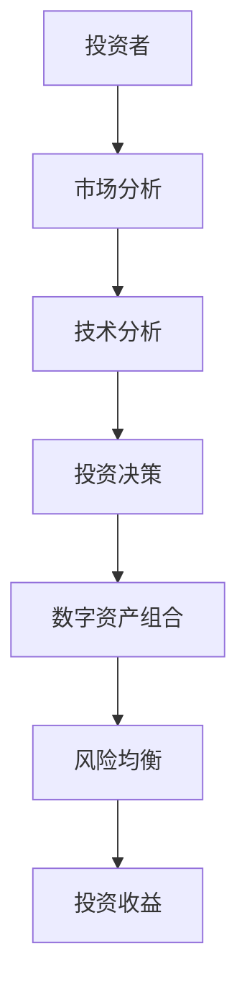
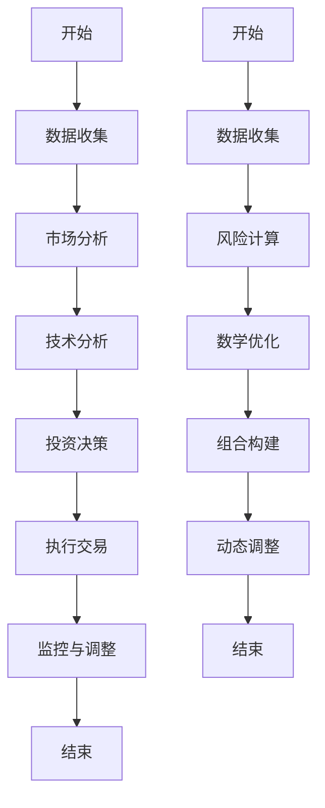
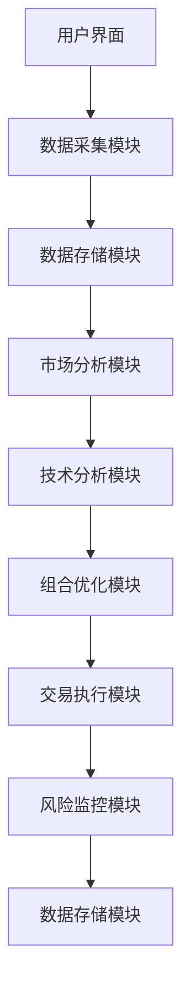
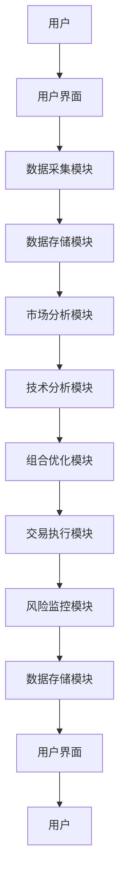

                 


# 如何将特价股票策略融入多元化数字资产风险均衡组合

> 关键词：特价股票策略，数字资产，风险均衡，投资组合，资产配置

> 摘要：本文详细探讨了如何将特价股票策略与数字资产投资相结合，构建一个风险均衡的投资组合。文章从背景介绍、核心概念、算法原理、数学模型、系统架构到项目实战，全面分析了如何优化数字资产投资组合的风险和收益。通过理论与实践的结合，本文为投资者提供了一套科学的策略框架，帮助他们在复杂多变的市场中实现稳健投资。

---

## 目录

1. [背景与核心概念](#背景与核心概念)
   1.1 [问题背景与描述](#问题背景与描述)
   1.2 [风险均衡组合的必要性](#风险均衡组合的必要性)
   1.3 [特价股票策略与数字资产的结合](#特价股票策略与数字资产的结合)
   1.4 [本章小结](#本章小结)

2. [核心概念与原理](#核心概念与原理)
   2.1 [特价股票策略的核心原理](#特价股票策略的核心原理)
   2.2 [数字资产风险均衡组合的核心原理](#数字资产风险均衡组合的核心原理)
   2.3 [核心概念对比表](#核心概念对比表)
   2.4 [实体关系图](#实体关系图)
   2.5 [本章小结](#本章小结)

3. [算法原理与数学模型](#算法原理与数学模型)
   3.1 [特价股票策略的算法实现](#特价股票策略的算法实现)
   3.2 [风险均衡组合的算法实现](#风险均衡组合的算法实现)
   3.3 [算法流程图](#算法流程图)
   3.4 [数学模型](#数学模型)
   3.5 [本章小结](#本章小结)

4. [系统分析与架构设计](#系统分析与架构设计)
   4.1 [项目背景](#项目背景)
   4.2 [系统功能设计](#系统功能设计)
   4.3 [系统架构设计](#系统架构设计)
   4.4 [系统接口设计](#系统接口设计)
   4.5 [系统交互流程图](#系统交互流程图)
   4.6 [本章小结](#本章小结)

5. [项目实战](#项目实战)
   5.1 [环境安装](#环境安装)
   5.2 [系统核心实现](#系统核心实现)
   5.3 [代码应用解读](#代码应用解读)
   5.4 [实际案例分析](#实际案例分析)
   5.5 [项目总结](#项目总结)

6. [最佳实践与总结](#最佳实践与总结)
   6.1 [小结](#小结)
   6.2 [注意事项](#注意事项)
   6.3 [拓展阅读](#拓展阅读)

---

## 正文

### 1. 背景与核心概念

#### 1.1 问题背景与描述
在当前金融市场中，投资者面临的主要挑战是如何在不确定性和波动性中实现稳健的投资回报。特价股票策略作为一种短期投资策略，旨在通过低价买入高价卖出的方式获得超额收益。然而，单一的特价股票策略往往伴随着高风险，尤其是在市场波动剧烈的情况下。因此，将特价股票策略融入多元化数字资产组合中，可以通过风险分散来降低整体投资组合的波动性。

#### 1.2 风险均衡组合的必要性
数字资产（如比特币、以太坊等）的波动性较高，传统的投资组合管理方法需要进行调整以适应其特性。通过构建一个多元化数字资产组合，投资者可以在不同的资产之间分散风险，从而降低整体组合的波动性。风险均衡组合的目标是使每种资产的风险贡献相等，从而在不同市场条件下实现更稳定的收益。

#### 1.3 特价股票策略与数字资产的结合
特价股票策略的核心在于捕捉市场波动中的短期机会，而数字资产的高波动性和去中心化特性为投资者提供了多样化的选择。将两者结合，可以通过数字资产的多元化配置来降低特价股票策略的市场风险，同时利用数字资产的高波动性捕捉更多的市场机会。

#### 1.4 本章小结
本章从背景介绍、风险均衡组合的必要性以及特价股票策略与数字资产的结合三个方面进行了阐述，为后续的分析奠定了基础。

---

### 2. 核心概念与原理

#### 2.1 特价股票策略的核心原理
特价股票策略的核心在于通过市场分析和技术分析来识别短期价格波动中的买卖机会。以下是其主要原理：

- **市场分析**：通过宏观经济指标和行业趋势分析，识别潜在的投资机会。
- **技术分析**：利用价格图表和指标（如RSI、MACD等）判断买入和卖出的时机。
- **风险管理**：通过设置止损和止盈点来控制投资风险。

#### 2.2 数字资产风险均衡组合的核心原理
数字资产风险均衡组合的核心在于通过数学优化方法，使每种资产的风险贡献相等。以下是其主要原理：

- **风险贡献**：每种资产对整体组合风险的贡献度。
- **波动性调整**：通过调整资产的权重，使每种资产的波动性对整体组合的影响相等。
- **动态优化**：根据市场变化动态调整组合权重，以保持风险均衡。

#### 2.3 核心概念对比表
以下是对特价股票策略和数字资产风险均衡组合的核心概念进行对比：

| **属性**       | **特价股票策略**             | **数字资产风险均衡组合**       |
|----------------|------------------------------|------------------------------|
| 投资目标       | 短期价格波动中的收益最大化   | 整体风险最小化                 |
| 投资期限       | 短期（几天到几周）            | 长期（数月到数年）              |
| 风险控制       | 通过止损和止盈点控制风险     | 通过多元化配置降低风险         |
| 适用市场       | 传统股票市场                 | 数字资产市场                   |

#### 2.4 实体关系图
以下是特价股票策略与数字资产风险均衡组合之间的实体关系图：



#### 2.5 本章小结
本章详细介绍了特价股票策略和数字资产风险均衡组合的核心原理，并通过对比表和实体关系图帮助读者理解两者之间的联系。

---

### 3. 算法原理与数学模型

#### 3.1 特价股票策略的算法实现
以下是特价股票策略的算法实现步骤：

1. 数据收集：收集目标股票的历史价格数据。
2. 市场分析：分析宏观经济指标和行业趋势。
3. 技术分析：使用技术指标（如RSI、MACD）判断买入和卖出时机。
4. 风险控制：设置止损和止盈点。
5. 执行交易：根据策略信号执行买入或卖出操作。
6. 监控与调整：持续监控市场变化，调整策略参数。

#### 3.2 风险均衡组合的算法实现
以下是风险均衡组合的算法实现步骤：

1. 数据收集：收集多种数字资产的历史价格数据。
2. 风险计算：计算每种资产的波动性和相关性。
3. 数学优化：通过优化算法调整资产权重，使每种资产的风险贡献相等。
4. 组合构建：根据优化后的权重构建投资组合。
5. 动态调整：定期重新优化组合权重，以适应市场变化。

#### 3.3 算法流程图
以下是特价股票策略和风险均衡组合的算法流程图：



#### 3.4 数学模型
以下是风险均衡组合的数学模型：

$$
\text{目标函数：} \min \sum_{i=1}^{n} w_i^2 \cdot \sigma_i^2
$$

$$
\text{约束条件：} \sum_{i=1}^{n} w_i = 1
$$

其中，\( w_i \) 是第 \( i \) 种资产的权重，\( \sigma_i \) 是第 \( i \) 种资产的波动率。

---

### 4. 系统分析与架构设计

#### 4.1 项目背景
本项目旨在通过将特价股票策略与数字资产风险均衡组合相结合，为投资者提供一个高效的投资工具。系统将利用大数据分析和机器学习算法，帮助投资者在复杂市场中实现稳健投资。

#### 4.2 系统功能设计
以下是系统的功能模块设计：

- **数据采集模块**：实时采集股票和数字资产的价格数据。
- **市场分析模块**：分析宏观经济指标和行业趋势。
- **技术分析模块**：计算技术指标并生成交易信号。
- **组合优化模块**：根据风险均衡原则优化投资组合。
- **交易执行模块**：根据策略信号执行交易操作。
- **风险监控模块**：实时监控市场风险并进行动态调整。

#### 4.3 系统架构设计
以下是系统的架构设计：



#### 4.4 系统接口设计
以下是系统的接口设计：

- 数据接口：与数据源（如API）连接，获取实时数据。
- 用户接口：提供友好的用户界面，供投资者进行操作。
- 交易接口：与交易所连接，执行交易操作。

#### 4.5 系统交互流程图
以下是系统的交互流程图：



---

### 5. 项目实战

#### 5.1 环境安装
以下是项目所需的环境安装步骤：

1. 安装Python：`pip install python`
2. 安装相关库：`pip install pandas numpy matplotlib`

#### 5.2 系统核心实现
以下是系统核心实现的代码示例：

```python
import pandas as pd
import numpy as np
import matplotlib.pyplot as plt

# 数据采集模块
def get_data(tickers):
    # 获取数据
    pass

# 市场分析模块
def market_analysis(data):
    # 进行市场分析
    pass

# 技术分析模块
def technical_analysis(data):
    # 计算技术指标
    pass

# 组合优化模块
def optimize_portfolio(data):
    # 优化投资组合
    pass

# 交易执行模块
def execute_trading(data):
    # 执行交易
    pass

# 风险监控模块
def risk_monitoring(data):
    # 监控风险
    pass
```

#### 5.3 代码应用解读
以下是代码的详细解读：

1. **数据采集模块**：从数据源获取实时数据。
2. **市场分析模块**：分析宏观经济指标和行业趋势。
3. **技术分析模块**：计算技术指标并生成交易信号。
4. **组合优化模块**：根据风险均衡原则优化投资组合。
5. **交易执行模块**：根据策略信号执行交易操作。
6. **风险监控模块**：实时监控市场风险并进行动态调整。

#### 5.4 实际案例分析
以下是实际案例分析：

假设我们有两只股票A和B，它们的波动率分别为10%和15%。我们希望构建一个风险均衡的投资组合，权重分别为：

$$
w_A = \frac{1/\sigma_A^2}{1/\sigma_A^2 + 1/\sigma_B^2} = \frac{1/0.1^2}{1/0.1^2 + 1/0.15^2} = 0.4444
$$

$$
w_B = \frac{1/\sigma_B^2}{1/\sigma_A^2 + 1/\sigma_B^2} = 0.5556
$$

#### 5.5 项目总结
本章通过实际案例分析，展示了如何将特价股票策略与数字资产风险均衡组合相结合，帮助投资者在复杂市场中实现稳健投资。

---

### 6. 最佳实践与总结

#### 6.1 小结
本文详细探讨了如何将特价股票策略与数字资产风险均衡组合相结合，构建一个优化的投资组合。通过理论与实践的结合，本文为投资者提供了一套科学的策略框架。

#### 6.2 注意事项
- 投资者应根据自身的风险承受能力调整投资组合。
- 市场环境的变化可能会影响策略的有效性，需要定期进行调整。
- 交易执行前应进行充分的市场分析和技术分析。

#### 6.3 拓展阅读
- 《投资学》：了解更多关于投资组合优化的知识。
- 《数字资产投资策略》：深入学习数字资产投资的相关内容。

---

## 作者

作者：AI天才研究院/AI Genius Institute & 禅与计算机程序设计艺术/Zen And The Art of Computer Programming

