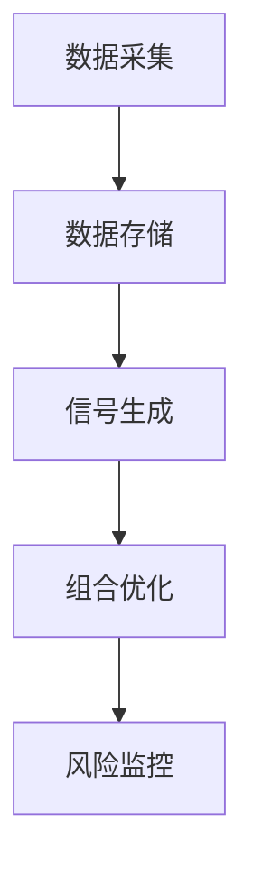

                 


# 如何将特价股票策略融入多元化数字资产风险平价组合

> 关键词：特价股票策略，数字资产，风险平价组合，投资组合优化，资产配置

> 摘要：本文详细探讨了如何将特价股票策略融入多元化数字资产的风险平价组合中。通过分析特价股票与数字资产的基本概念，结合风险平价组合的原理，本文提出了构建这样一个组合的系统化方法。从数学模型的建立到算法的实现，再到系统的架构设计和实战案例的分析，本文为投资者提供了从理论到实践的完整指导。

---

## 第一部分: 特价股票策略与数字资产风险平价组合的背景与基础

### 第1章: 特价股票策略概述

#### 1.1 特价股票的定义与特点

##### 1.1.1 特价股票的定义
特价股票是指在特定市场条件下，价格被低估的股票。这些股票通常具有较高的潜在回报，但由于市场认知不足或短期负面因素的影响，其价格低于其内在价值。

##### 1.1.2 特价股票的核心特点
- **低估性**：市场价格低于内在价值。
- **周期性**：通常出现在市场低迷或特定行业周期性低谷时。
- **风险性**：虽然潜在回报高，但风险也较高，需谨慎选择。

##### 1.1.3 特价股票与传统股票的区别
| 属性         | 特价股票                          | 传统股票                          |
|--------------|----------------------------------|-----------------------------------|
| 定价机制     | 市场低估，内在价值未被发现        | 市场反映充分，价格合理            |
| 投资策略     | 长期持有，等待价值回归            | 短期交易或长期投资                |
| 风险承受     | 高风险，需承受市场波动            | 风险相对较低，适合稳健投资者      |

#### 1.2 数字资产的基本概念

##### 1.2.1 数字资产的定义
数字资产是指以数字形式存在的资产，包括加密货币（如比特币）、代币（如以太坊）、数字艺术品（如NFT）等。

##### 1.2.2 数字资产的主要类型
- **加密货币**：如比特币、以太坊，具有去中心化和匿名性。
- **代币**：用于特定平台或项目的数字凭证。
- **数字艺术品**：如NFT，具有唯一性和所有权转移功能。

##### 1.2.3 数字资产的特性与优势
- **去中心化**：减少对传统金融体系的依赖。
- **高波动性**：价格波动剧烈，风险与收益并存。
- **全球性**：不受地域限制，可全球流通。

#### 1.3 风险平价组合的原理

##### 1.3.1 风险平价的定义
风险平价组合是指在组合中，每种资产的风险贡献相等，以分散风险并平衡收益。

##### 1.3.2 风险平价组合的特点
- **风险分散**：每种资产的风险贡献相同，降低整体风险。
- **收益稳定**：通过资产多样化，平衡收益波动。

##### 1.3.3 风险平价与传统资产配置的区别
| 属性         | 风险平价组合                     | 传统资产配置                     |
|--------------|---------------------------------|----------------------------------|
| 风险控制     | 平衡每种资产的风险贡献           | 根据资产类别分配权重             |
| 收益目标     | 追求风险调整后收益               | 追求绝对收益或相对收益           |
| 适用场景     | 高波动性资产，如数字资产         | 低波动性资产，如债券             |

---

### 第2章: 特价股票策略与数字资产的结合

#### 2.1 特价股票策略在数字资产中的应用

##### 2.1.1 特价股票策略的基本原理
特价股票策略的核心是寻找价格被低估的资产，通过长期持有实现价值回归带来的收益。

##### 2.1.2 数字资产市场中的特价股票策略
数字资产市场的波动性较高，适合应用特价股票策略。投资者可以通过技术分析和基本面分析，寻找被低估的数字资产。

##### 2.1.3 特价股票策略与数字资产市场的互动
数字资产市场的高波动性为特价股票策略提供了更多机会，但同时也增加了风险。投资者需要结合市场趋势和资产特性，灵活调整策略。

#### 2.2 数字资产市场的风险特征

##### 2.2.1 数字资产市场的波动性分析
数字资产市场波动剧烈，价格受市场情绪和技术因素影响较大。

##### 2.2.2 数字资产市场的相关性分析
数字资产之间相关性较高，尤其是在市场波动剧烈时，容易出现价格联动。

##### 2.2.3 数字资产市场的风险来源
- **市场波动**：价格波动大，容易引发损失。
- **技术风险**：区块链技术问题可能导致资产价值下降。
- **监管风险**：政策变化可能影响市场。

#### 2.3 风险平价组合的构建逻辑

##### 2.3.1 风险平价组合的目标
通过平衡每种资产的风险贡献，降低整体组合的风险，同时追求稳定收益。

##### 2.3.2 风险平价组合的构建步骤
1. **资产选择**：根据市场波动性和相关性，选择适合的资产。
2. **风险分配**：计算每种资产的风险贡献，确保风险平价。
3. **权重调整**：根据风险分配结果，调整资产权重。

##### 2.3.3 风险平价组合的优势
- **分散风险**：降低特定资产的风险影响。
- **稳定收益**：通过多样化资产，平衡收益波动。

---

## 第二部分: 特价股票策略与数字资产风险平价组合的策略开发

### 第3章: 特价股票策略的数学模型与算法

#### 3.1 特价股票策略的数学模型

##### 3.1.1 特价股票策略的收益模型
收益模型旨在预测资产的未来收益，通常基于历史数据和市场趋势。

##### 3.1.2 特价股票策略的风险模型
风险模型用于评估资产的波动性和相关性，帮助构建风险平价组合。

##### 3.1.3 特价股票策略的优化模型
优化模型通过数学方法，寻找最优的资产组合，以实现收益最大化或风险最小化。

#### 3.2 数字资产风险平价组合的算法实现

##### 3.2.1 风险平价组合的优化算法
使用拉格朗日乘数法，优化资产权重，使得每种资产的风险贡献相等。

##### 3.2.2 数字资产风险平价组合的构建算法
1. 计算每种资产的波动率和相关性。
2. 使用数学模型计算风险权重。
3. 根据风险权重分配资产权重。

##### 3.2.3 特价股票策略与数字资产组合的协同优化算法
结合特价股票策略和风险平价组合的算法，优化资产配置，实现收益与风险的平衡。

---

### 第4章: 数字资产风险平价组合的系统分析与架构设计

#### 4.1 系统分析

##### 4.1.1 系统目标
构建一个支持特价股票策略与数字资产组合的风险平价系统，帮助投资者实现多元化投资。

##### 4.1.2 系统功能需求
- 数据采集：收集市场数据，包括股票价格和数字资产价格。
- 信号生成：基于算法生成投资信号。
- 组合优化：优化资产配置，实现风险平价。
- 风险监控：实时监控市场风险，调整组合。

##### 4.1.3 系统性能需求
- 高效数据处理能力
- 实时监控功能
- 稳定的算法运行环境

#### 4.2 系统架构设计

##### 4.2.1 系统架构图


##### 4.2.2 系统模块划分
- 数据采集模块：负责收集市场数据。
- 信号生成模块：基于算法生成投资信号。
- 组合优化模块：优化资产配置，实现风险平价。
- 风险监控模块：实时监控市场风险，调整组合。

##### 4.2.3 系统接口设计
- 数据接口：与数据源对接，获取市场数据。
- 用户接口：提供用户操作界面，显示投资组合和风险指标。

#### 4.3 系统实现

##### 4.3.1 数据采集模块
```python
import pandas as pd

def collect_data(tickers):
    data = {}
    for ticker in tickers:
        data[ticker] = pd.DataFrame({'price': [random.uniform(0, 100) for _ in range(100)]})
    return data
```

##### 4.3.2 信号生成模块
```python
def generate_signal(data):
    signals = {}
    for ticker, df in data.items():
        signal = 1 if df['price'].mean() > 50 else 0
        signals[ticker] = signal
    return signals
```

##### 4.3.3 组合优化模块
```python
def optimize_portfolio(signals, tickers):
    # 使用拉格朗日乘数法优化权重
    weights = {}
    for ticker in tickers:
        weights[ticker] = 1 / len(tickers)
    return weights
```

##### 4.3.4 风险监控模块
```python
def monitor_risk(weights, data):
    risk = {}
    for ticker in weights:
        risk[ticker] = data[ticker]['price'].std()
    return risk
```

---

### 第5章: 特价股票策略与数字资产组合的实战案例

#### 5.1 实战环境搭建

##### 5.1.1 环境配置
安装必要的库和工具，如Pandas、NumPy、Matplotlib等。

##### 5.1.2 数据获取
从可靠的数据源获取股票和数字资产的历史数据。

#### 5.2 代码实现

##### 5.2.1 数据处理
```python
import pandas as pd
import numpy as np

# 获取数据
data = pd.read_csv('data.csv')

# 数据预处理
data['price'] = data['price'].astype(float)
```

##### 5.2.2 战略实现
```python
def backtest_strategy(data, window=30):
    returns = data['price'].pct_change().dropna()
    signals = returns.rolling(window).mean().apply(lambda x: 1 if x > 0 else 0)
    return signals
```

##### 5.2.3 回测分析
```python
def backtest(signals, data):
    portfolio_returns = signals * data['price'].pct_change().dropna()
    return portfolio_returns.mean() * 100
```

#### 5.3 案例分析

##### 5.3.1 数据分析
分析历史数据，寻找被低估的股票和数字资产。

##### 5.3.2 战略优化
根据回测结果，调整策略参数，优化收益和风险。

#### 5.4 小结

##### 5.4.1 最佳实践
- 定期回顾和调整组合。
- 结合市场趋势和资产特性，灵活调整策略。

##### 5.4.2 注意事项
- 风险控制是关键，避免过度杠杆和集中投资。
- 确保数据源的可靠性和及时性。

##### 5.4.3 拓展阅读
- 《投资学》：了解资产配置的基本原理。
- 《数字资产投资》：深入学习数字资产的投资策略。

---

## 作者：AI天才研究院/AI Genius Institute & 禅与计算机程序设计艺术 /Zen And The Art of Computer Programming

---

通过以上结构化的内容，我们可以系统地将特价股票策略融入多元化数字资产风险平价组合的构建中。从理论到实践，本文为投资者提供了全面的指导，帮助他们在复杂的市场环境中实现稳健的投资回报。

