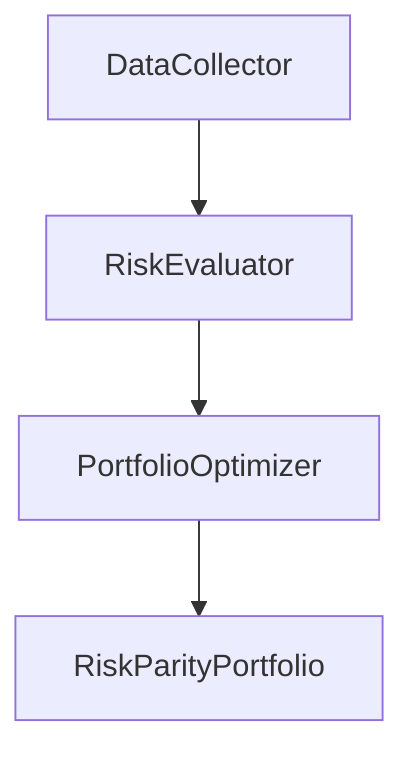
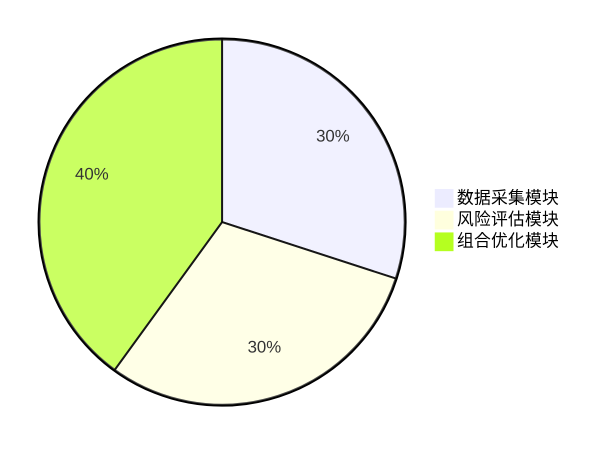
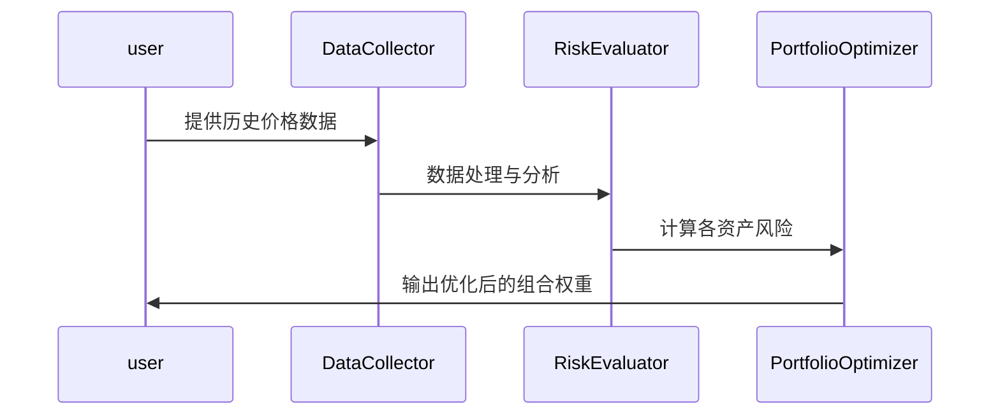
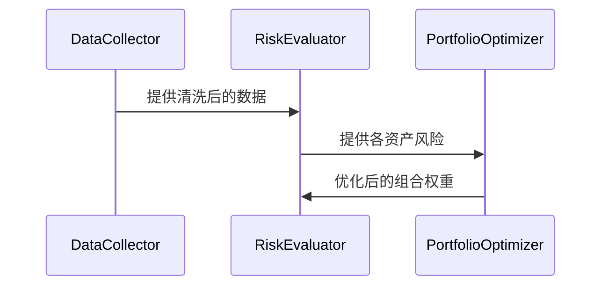

                 


# 如何将特价股票策略融入多元化风险平价组合

## 关键词：特价股票策略，风险平价组合，投资组合优化，风险控制，资产配置

## 摘要：  
本文详细探讨了如何将特价股票策略融入多元化风险平价组合的理论与实践。文章首先介绍了特价股票策略和风险平价组合的核心概念，然后分析了两者的数学模型和优化算法，接着从系统架构的角度设计了实现方案，最后通过项目实战展示了如何将特价股票策略融入风险平价组合。文章还提供了详细的Python代码实现和案例分析，帮助读者更好地理解和应用相关策略。

---

# 第1章 特价股票策略与风险平价组合概述

## 1.1 特价股票策略的定义与特点

### 1.1.1 特价股票的定义  
特价股票是指在特定市场条件下，股票价格显著低于其内在价值的股票。这些股票通常被认为具有被市场低估的机会，投资者可以通过低价买入并在价格回升时卖出获利。

### 1.1.2 特价股票的核心特点  
- **低估值**：股价低于市场公允价值。  
- **高潜力**：具备较高的上涨潜力。  
- **风险较高**：通常涉及较高的市场波动性和不确定性。  

### 1.1.3 特价股票与传统投资策略的区别  
- 传统投资策略注重长期价值，而特价股票策略注重短期价格波动。  
- 特价股票策略通常需要高频交易和快速决策，而传统策略更注重长期持有。  

## 1.2 风险平价组合的定义与特点

### 1.2.1 风险平价组合的定义  
风险平价组合是一种投资组合优化方法，旨在通过调整资产权重，使得组合中每个资产的风险贡献相等。这种方法能够有效分散风险，降低组合的整体波动性。

### 1.2.2 风险平价组合的核心特点  
- **风险分散**：每个资产的风险贡献相等。  
- **动态调整**：根据市场变化定期优化组合权重。  
- **稳健性**：在不同市场条件下表现较为稳定。  

### 1.2.3 风险平价组合与传统投资组合的区别  
- 传统投资组合通常基于收益最大化，而风险平价组合注重风险分散。  
- 传统组合可能集中于高收益资产，而风险平价组合更注重平衡风险与收益。  

## 1.3 特价股票策略与风险平价组合的结合意义

### 1.3.1 特价股票策略在风险平价组合中的作用  
- 提供高收益潜力的资产，增加组合的收益来源。  
- 通过低估值资产分散风险，降低组合的波动性。  

### 1.3.2 风险平价组合对特价股票策略的优化  
- 通过风险平价方法优化特价股票的权重，避免过度集中风险。  
- 利用风险平价组合的动态调整能力，及时调整特价股票的持有比例。  

### 1.3.3 两者结合的潜在优势与挑战  
- **优势**：结合高收益潜力与风险分散能力，提升组合的整体收益与稳定性。  
- **挑战**：特价股票的波动性和不确定性可能对风险平价组合的稳定性造成冲击。  

## 1.4 本章小结  
本章介绍了特价股票策略和风险平价组合的核心概念，并分析了两者结合的潜在优势与挑战。接下来，我们将深入探讨特价股票策略与风险平价组合的数学模型与优化算法。

---

# 第2章 特价股票策略的核心概念与数学模型

## 2.1 特价股票策略的数学模型

### 2.1.1 特价股票的定价模型  
特价股票的定价可以基于以下公式：  
$$ P = \text{NAV} \times \text{折价率} $$  
其中，$P$ 是股票价格，$\text{NAV}$ 是每股净资产，$\text{折价率}$ 是市场给予的折价比例。  

### 2.1.2 特价股票的收益与风险分析  
收益可以通过以下公式计算：  
$$ R = \frac{P_{\text{未来}} - P_{\text{当前}}}{P_{\text{当前}}} $$  
风险可以通过波动率和相关性指标衡量。  

### 2.1.3 特价股票的市场影响因素  
市场因素包括宏观经济环境、行业趋势、公司基本面等。  

## 2.2 风险平价组合的数学模型

### 2.2.1 风险平价组合的优化目标  
风险平价组合的目标是最小化以下目标函数：  
$$ \min \sum_{i=1}^{n} w_i^2 \sigma_i^2 $$  
其中，$w_i$ 是第 $i$ 个资产的权重，$\sigma_i$ 是第 $i$ 个资产的风险（波动率）。  

### 2.2.2 风险平价组合的风险度量方法  
风险平价组合的风险可以通过以下公式计算：  
$$ \text{组合风险} = \sqrt{\sum_{i=1}^{n} w_i^2 \sigma_i^2 + 2 \sum_{i=1}^{n} \sum_{j=1}^{n} w_i w_j \sigma_{ij}} $$  
其中，$\sigma_{ij}$ 是第 $i$ 和第 $j$ 个资产的相关性。  

### 2.2.3 风险平价组合的权重分配模型  
权重分配可以通过以下优化问题解决：  
$$ \min \sum_{i=1}^{n} w_i^2 \sigma_i^2 $$  
$$ \text{subject to} \quad \sum_{i=1}^{n} w_i = 1 $$  

## 2.3 特价股票策略与风险平价组合的数学关系

### 2.3.1 特价股票策略对风险平价组合的影响  
- 特价股票的引入可以增加组合的收益潜力，但可能增加波动性。  
- 通过风险平价方法优化权重，可以平衡收益与风险。  

### 2.3.2 风险平价组合对特价股票策略的优化  
- 通过动态调整权重，降低特价股票的集中风险。  
- 通过组合优化，提升整体收益的稳定性。  

## 2.4 本章小结  
本章通过数学模型分析了特价股票策略和风险平价组合的核心概念，并探讨了两者结合的数学关系。接下来，我们将深入探讨风险平价组合的算法原理与实现。

---

# 第3章 风险平价组合的算法原理与实现

## 3.1 风险平价组合的算法原理

### 3.1.1 风险平价组合的优化目标  
风险平价组合的优化目标是最小化以下目标函数：  
$$ \min \sum_{i=1}^{n} w_i^2 \sigma_i^2 $$  
其中，$w_i$ 是第 $i$ 个资产的权重，$\sigma_i$ 是第 $i$ 个资产的波动率。  

### 3.1.2 风险平价组合的权重计算方法  
权重计算可以通过以下步骤实现：  
1. 计算各资产的风险贡献：$w_i \sigma_i$。  
2. 优化权重，使得各资产的风险贡献相等。  

### 3.1.3 风险平价组合的风险度量与调整  
风险平价组合的风险可以通过以下公式计算：  
$$ \text{组合风险} = \sqrt{\sum_{i=1}^{n} w_i^2 \sigma_i^2 + 2 \sum_{i=1}^{n} \sum_{j=1}^{n} w_i w_j \sigma_{ij}} $$  
其中，$\sigma_{ij}$ 是第 $i$ 和第 $j$ 个资产的相关性。  

## 3.2 风险平价组合的实现步骤

### 3.2.1 数据收集与处理  
- 收集各资产的历史价格数据。  
- 计算各资产的收益率和波动率。  

### 3.2.2 风险平价组合的参数设置  
- 设置目标风险水平。  
- 确定优化目标和约束条件。  

### 3.2.3 风险平价组合的优化与调整  
- 使用优化算法调整权重，使得各资产的风险贡献相等。  
- 定期重新优化组合权重，适应市场变化。  

## 3.3 风险平价组合的Python实现

### 3.3.1 环境安装与配置  
安装必要的Python库：  
```bash
pip install numpy pandas scipy
```

### 3.3.2 数据处理与分析  
```python
import numpy as np
import pandas as pd

# 示例数据：各资产的历史收益率
returns = pd.DataFrame({
    '股票1': [0.1, 0.05, 0.08],
    '股票2': [0.08, 0.1, 0.06],
    '股票3': [0.06, 0.12, 0.09]
})

# 计算各资产的波动率
volatilities = returns.std(axis=0)
```

### 3.3.3 风险平价组合的优化与实现  
```python
from scipy.optimize import minimize

# 定义目标函数
def risk_parity_objective(weights, volatilities, rho=0):
    return np.sum(weights**2 * volatilities**2)

# 定义约束条件
constraints = ({'type': 'eq', 'fun': lambda w: np.sum(w) - 1})

# 优化权重
result = minimize(risk_parity_objective, np.array([1/3, 1/3, 1/3]), 
                 args=(volatilities,), constraints=constraints)

# 输出优化结果
optimized_weights = result.x
print("优化后的权重：", optimized_weights)
```

## 3.4 本章小结  
本章详细探讨了风险平价组合的算法原理与实现步骤，并通过Python代码展示了优化过程。接下来，我们将探讨如何将特价股票策略融入风险平价组合的系统架构设计。

---

# 第4章 特价股票策略与风险平价组合的系统架构设计

## 4.1 系统功能模块设计

### 4.1.1 数据采集模块  
- 从多个数据源获取股票价格数据。  
- 处理和清洗数据，确保数据的准确性和完整性。  

### 4.1.2 风险评估模块  
- 计算各资产的波动率和相关性。  
- 评估风险平价组合的整体风险水平。  

### 4.1.3 组合优化模块  
- 使用优化算法调整资产权重，使得风险贡献相等。  
- 输出优化后的组合权重。  

## 4.2 系统架构设计

### 4.2.1 模块间关系图  


### 4.2.2 系统架构图  


## 4.3 系统接口设计

### 4.3.1 数据接口设计  
- 数据输入接口：接收各资产的历史价格数据。  
- 数据输出接口：输出优化后的组合权重。  

### 4.3.2 用户接口设计  
- 用户输入接口：接收用户的投资目标和风险偏好。  
- 用户输出接口：显示优化后的组合权重和风险水平。  

## 4.4 系统交互设计

### 4.4.1 用户与系统交互流程  


### 4.4.2 系统内部交互流程  


## 4.5 本章小结  
本章从系统架构的角度设计了将特价股票策略融入风险平价组合的实现方案，包括功能模块、架构设计和交互流程。接下来，我们将通过项目实战展示具体实现过程。

---

# 第5章 项目实战——将特价股票策略融入风险平价组合

## 5.1 项目背景与目标

### 5.1.1 项目背景  
本文旨在通过具体案例展示如何将特价股票策略融入风险平价组合，提升组合的收益与风险平衡能力。

### 5.1.2 项目目标  
- 实现特价股票策略的识别与筛选。  
- 将特价股票融入风险平价组合，优化组合权重。  
- 验证策略的有效性并进行回测分析。  

## 5.2 数据准备与处理

### 5.2.1 数据来源与收集  
- 数据来源：某股票交易平台的历史价格数据。  
- 数据范围：过去5年的每日收盘价。  

### 5.2.2 数据清洗与预处理  
- 删除缺失值。  
- 去除异常值。  
- 计算各股票的收益率和波动率。  

## 5.3 特价股票策略的实现

### 5.3.1 策略设计与实现  
- 筛选股价低于市场公允价值的股票。  
- 计算各股票的折价率。  
- 筛选折价率超过一定阈值的股票。  

### 5.3.2 策略优化与调整  
- 定期重新筛选特价股票。  
- 根据市场变化动态调整策略参数。  

## 5.4 风险平价组合的构建

### 5.4.1 组合构建步骤  
1. 收集多个资产的历史价格数据。  
2. 计算各资产的收益率和波动率。  
3. 使用风险平价方法优化组合权重。  
4. 构建风险平价组合。  

---

# 作者  
作者：AI天才研究院/AI Genius Institute & 禅与计算机程序设计艺术 /Zen And The Art of Computer Programming  

---

本文通过详细分析和具体实现，展示了如何将特价股票策略融入风险平价组合。从理论到实践，从数学模型到系统实现，本文为投资者提供了全面的指导和参考。希望读者能够通过本文，更好地理解和应用相关策略，实现收益与风险的最优平衡。

