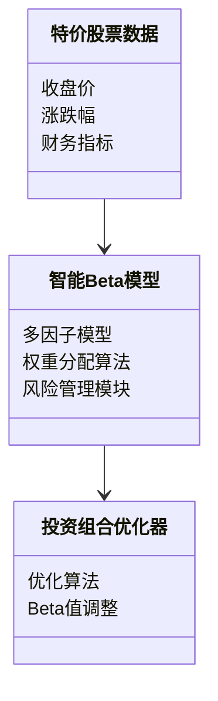
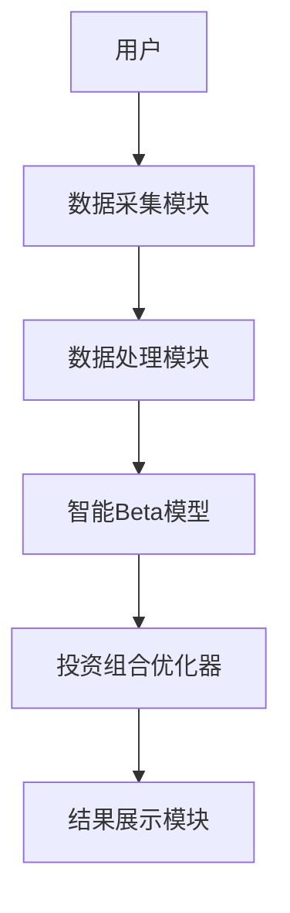
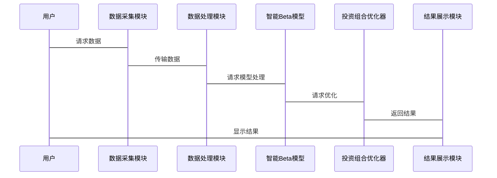

                 


# 如何将特价股票策略融入智能Beta投资

> 关键词：智能Beta投资，特价股票策略，多因子模型，投资组合优化，风险管理

> 摘要：本文详细探讨了如何将特价股票策略融入智能Beta投资中。通过分析特价股票的特征和智能Beta投资的机制，提出了基于多因子模型的投资策略，并结合实际案例展示了如何实现这一策略。文章从理论基础、策略构建、系统架构到项目实战，全面阐述了如何将特价股票策略与智能Beta投资相结合，为投资者提供了科学的投资方法。

---

# 第一部分: 特价股票策略与智能Beta投资的背景介绍

## 第1章: 特价股票策略概述

### 1.1 特价股票的基本概念

#### 1.1.1 什么是特价股票
特价股票是指市场价格低于其内在价值的股票。这种股票通常被市场低估，具有较高的投资潜力。特价股票的核心在于识别市场中的估值偏差，通过分析财务指标（如市盈率、市净率等）来判断其潜在价值。

#### 1.1.2 特价股票的特征与分类
特价股票的特征包括低估值、高分红率、稳定的财务状况等。根据股票的市场周期和行业特性，可以将特价股票分为周期性股票、成长型股票和价值型股票。

#### 1.1.3 特价股票的投资价值
特价股票的投资价值体现在其潜在的上涨空间和较高的安全边际。通过长期持有或适当的交易策略，投资者可以在市场回调或价值重估时获得收益。

### 1.2 智能Beta投资的定义与特点

#### 1.2.1 什么是智能Beta投资
智能Beta投资是一种基于量化模型的投资策略，通过优化投资组合的Beta值（系统性风险）来实现超额收益。与传统Beta投资不同，智能Beta投资结合了主动管理和被动投资的优势，具有灵活性和适应性。

#### 1.2.2 智能Beta投资与传统Beta投资的区别
智能Beta投资的核心在于动态调整投资组合的Beta值，通过多因子模型和算法优化来实现收益最大化。而传统Beta投资通常采用固定权重的指数基金，缺乏灵活性和个性化。

#### 1.2.3 智能Beta投资的优势与应用场景
智能Beta投资的优势在于其灵活性、多样性和高效性。它适用于多种市场环境，尤其在市场波动较大时，可以通过调整Beta值来降低风险。

---

## 第2章: 特价股票策略与智能Beta投资的结合

### 2.1 特价股票策略的核心要素

#### 2.1.1 特价股票的筛选标准
特价股票的筛选标准包括低市盈率、低市净率、高股息率等。通过多因子模型，可以综合评估股票的内在价值和市场表现。

#### 2.1.2 特价股票的市场周期分析
市场周期对特价股票的投资策略有重要影响。在熊市或震荡市中，特价股票通常具有较高的投资价值，而在牛市中，可能需要调整策略以避免过度集中。

#### 2.1.3 特价股票的风险评估
特价股票的风险主要来自市场波动和公司基本面变化。通过构建风险模型，可以评估和管理投资组合的整体风险。

### 2.2 智能Beta投资的机制

#### 2.2.1 智能Beta投资的多因子模型
多因子模型是智能Beta投资的核心工具，通过多个因子（如市值、价值、动量等）来优化投资组合的收益和风险。

#### 2.2.2 智能Beta投资的权重分配策略
智能Beta投资通过动态调整股票权重，实现Beta值的优化。权重分配策略通常基于因子得分和风险偏好。

#### 2.2.3 智能Beta投资的动态调整机制
智能Beta投资通过实时监控市场变化，动态调整投资组合的Beta值，以适应市场环境的变化。

---

# 第二部分: 智能Beta投资的理论基础

## 第4章: 现代投资组合理论与智能Beta投资

### 4.1 现代投资组合理论概述

#### 4.1.1 投资组合理论的基本假设
现代投资组合理论假设投资者是理性的，市场是有效的，可以通过分散投资降低非系统性风险。

#### 4.1.2 投资组合的风险与收益
投资组合的收益与风险是相关的，通过优化投资组合的收益-风险比，可以实现最大收益。

#### 4.1.3 投资组合的优化方法
现代投资组合理论提供了多种优化方法，如均值-方差优化和风险调整后的收益优化。

### 4.2 智能Beta投资的理论基础

#### 4.2.1 智能Beta投资的数学模型
智能Beta投资基于多因子模型，通过优化投资组合的Beta值来实现超额收益。

#### 4.2.2 智能Beta投资的风险调整收益
通过调整投资组合的Beta值，可以降低系统性风险，提高风险调整后的收益。

#### 4.2.3 智能Beta投资的优化算法
智能Beta投资采用多种优化算法，如遗传算法和模拟退火，以实现投资组合的最优配置。

---

# 第三部分: 特价股票策略与智能Beta投资的结合模型

## 第5章: 结合模型的核心原理

### 5.1 结合模型的核心原理

#### 5.1.1 多因子模型在特价股票策略中的应用
通过多因子模型，可以综合评估股票的内在价值和市场表现，选择具有超额收益潜力的股票。

#### 5.1.2 智能Beta投资的优化算法
智能Beta投资采用优化算法，动态调整投资组合的Beta值，以适应市场变化。

#### 5.1.3 结合模型的数学公式
结合模型的数学公式如下：
$$
\text{收益} = \sum_{i=1}^{n} w_i \times r_i
$$
其中，\( w_i \) 是第 \( i \) 只股票的权重，\( r_i \) 是第 \( i \) 只股票的预期收益。

---

## 第6章: 模型的实现步骤

### 6.1 数据收集与预处理

#### 6.1.1 数据来源
数据来源包括股票价格、财务指标、市场指数等。

#### 6.1.2 数据清洗
通过数据清洗，去除异常值和缺失值，确保数据的完整性。

#### 6.1.3 数据标准化
通过标准化处理，确保不同因子的可比性。

### 6.2 模型构建与训练

#### 6.2.1 特价股票的筛选
通过多因子模型，筛选具有超额收益潜力的股票。

#### 6.2.2 智能Beta投资的权重分配
通过优化算法，动态调整投资组合的权重。

#### 6.2.3 模型验证与优化
通过回测和风险分析，验证模型的可行性和优化投资组合的Beta值。

---

# 第四部分: 系统分析与架构设计方案

## 第7章: 系统架构设计

### 7.1 系统功能设计

#### 7.1.1 问题场景介绍
通过分析市场环境和投资者需求，设计系统的功能模块。

#### 7.1.2 系统功能模块
系统功能模块包括数据采集、模型构建、权重分配、风险管理和收益分析。

#### 7.1.3 领域模型Mermaid类图


---

## 第8章: 系统架构设计

### 8.1 系统架构设计

#### 8.1.1 系统架构图


#### 8.1.2 系统接口设计
系统接口包括数据接口、模型接口和优化器接口。

#### 8.1.3 系统交互序列图


---

# 第五部分: 项目实战

## 第9章: 项目实战

### 9.1 环境安装

#### 9.1.1 安装Python
安装Python 3.x版本，确保环境支持量化交易。

#### 9.1.2 安装依赖库
安装Pandas、NumPy、Scipy等依赖库。

### 9.2 核心实现

#### 9.2.1 数据采集与预处理
```python
import pandas as pd
import numpy as np

# 数据采集
data = pd.read_csv('stock_data.csv')
# 数据清洗
data.dropna(inplace=True)
# 数据标准化
data = (data - data.mean()) / data.std()
```

#### 9.2.2 模型构建与训练
```python
from sklearn.linear_model import LinearRegression
model = LinearRegression()
model.fit(X_train, y_train)
```

#### 9.2.3 模型验证与优化
```python
from backtrader import Strategy, indicators
class MyStrategy(Strategy):
    def __init__(self):
        self.add_indicator(indicators.SMA)
    def next(self):
        if self.indicators.SMA > self.data.close:
            self.buy()
        else:
            self.sell()
```

---

## 第10章: 结果分析与优化

### 10.1 回测结果分析

#### 10.1.1 回测收益分析
通过回测结果，分析投资组合的收益和风险。

#### 10.1.2 风险管理优化
通过调整权重分配和风险模型，优化投资组合的风险和收益比。

---

# 第六部分: 最佳实践与总结

## 第11章: 最佳实践与总结

### 11.1 最佳实践

#### 11.1.1 理解市场周期
根据市场周期调整投资策略，避免过度集中。

#### 11.1.2 灵活调整权重
通过动态调整权重，优化投资组合的Beta值。

### 11.2 小结

#### 11.2.1 策略的核心要点
特价股票策略与智能Beta投资的结合可以通过多因子模型和优化算法实现超额收益。

#### 11.2.2 实际应用中的注意事项
投资者需要根据市场环境和自身需求调整策略，同时注意风险管理。

### 11.3 注意事项

#### 11.3.1 风险提示
投资有风险，需谨慎操作。

#### 11.3.2 市场变化
市场环境的变化可能影响策略的有效性，需及时调整。

### 11.4 拓展阅读

#### 11.4.1 推荐书籍
《投资学》、《量化交易入门》。

#### 11.4.2 推荐博客
推荐相关技术博客和投资论坛。

---

作者：AI天才研究院/AI Genius Institute & 禅与计算机程序设计艺术/Zen And The Art of Computer Programming

