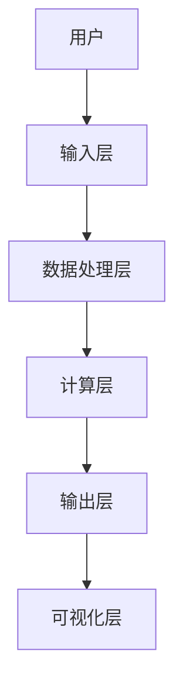

                 


# 如何计算一家公司的内在价值

> 关键词：内在价值、现金流贴现法、贴现率、永续增长率、自由现金流

> 摘要：本文将详细介绍如何计算一家公司的内在价值。通过现金流贴现法（DCF模型），我们将从基础概念到实际应用，逐步分析公司内在价值的计算过程。文章内容涵盖自由现金流的计算、贴现率的确定、永续增长率的假设，以及系统架构设计和项目实战等部分，帮助读者掌握公司内在价值的核心计算方法。

---

# 第1章 内在价值的核心概念与背景介绍

## 1.1 问题背景与问题描述

### 1.1.1 什么是公司内在价值
公司内在价值是指一家公司在其持续经营条件下，基于其未来现金流的现值计算出的价值。它是公司未来产生的所有现金流，按照适当的贴现率折现到当前的价值总和。

### 1.1.2 内在价值与市场价值的区别
- **内在价值**：公司的真实价值，与市场波动无关。
- **市场价值**：市场交易价格，受市场情绪和流动性影响。

### 1.1.3 内在价值计算的重要性
- 帮助投资者识别低估或高估的公司。
- 为投资决策提供依据。

---

## 1.2 内在价值的核心要素与概念结构

### 1.2.1 自由现金流的定义与属性
- **自由现金流（FCF）**：公司在扣除所有支出后剩余的现金流量。
- 属性：自由现金流是内在价值计算的核心。

### 1.2.2 贴现率的计算与影响因素
- **贴现率**：将未来现金流折现到现值的利率。
- 影响因素：无风险利率、市场风险溢价、特定公司风险。

### 1.2.3 永续增长率的假设与验证
- **永续增长率**：假设公司未来现金流增长率趋于稳定。

---

## 1.3 内在价值计算的边界与外延

### 1.3.1 内在价值计算的适用场景
- 稳定增长的企业。
- 股权投资者。

### 1.3.2 内在价值计算的局限性
- 假设未来现金流增长率稳定。
- 依赖于准确的财务数据。

### 1.3.3 内在价值与投资决策的关系
- 内在价值是投资决策的基准。

---

# 第2章 内在价值计算的核心概念与联系

## 2.1 核心概念原理

### 2.1.1 自由现金流的计算公式
$$ FCFF = EBIT(1 - t) + Depreciation - Capital Expenditure $$

### 2.1.2 贴现率的计算方法
$$ WACC = \frac{E}{E+D} \times r_e + \frac{D}{E+D} \times r_d \times (1 - t) $$

### 2.1.3 永续增长率的假设与调整
$$ g = \frac{ROE \times (1 - 股利支付率)}{资本回报率} $$

---

## 2.2 核心概念对比分析

### 2.2.1 自由现金流与净利润的对比分析

| 比较维度 | 自由现金流 | 净利润 |
|----------|------------|--------|
| 计算基础 | 现金为基础 | 净收入 |
| 时间价值 | 已考虑贴现 | 未考虑 |

---

# 第3章 内在价值计算的算法原理

## 3.1 现金流贴现法（DCF模型）的算法流程

### 3.1.1 企业自由现金流模型
1. 计算未来自由现金流。
2. 使用加权平均资本成本（WACC）进行贴现。
3. 计算终值。
4. 总和得到企业整体价值。

### 3.1.2 股权自由现金流模型
1. 计算股权自由现金流。
2. 使用股权资本成本进行贴现。
3. 计算终值。
4. 总和得到股权价值。

---

## 3.2 算法的数学模型与公式

### 3.2.1 DCF模型的数学表达式
$$ V = \sum_{t=1}^{n} \frac{CF_t}{(1 + r)^t} + \frac{TV}{(1 + r)^n} $$

---

## 3.3 算法实现的Python代码示例

```python
import pandas as pd
import numpy as np

# 示例数据
data = {
    '现金流(万元)': [100, 120, 130, 140],
    '贴现率': 0.10
}

df = pd.DataFrame(data)

# 计算现值
PV = df['现金流(万元)'].sum() / (1 + df['贴现率'].values[0]) ** len(df['现金流(万元)'])

print("现值:", PV)
```

---

# 第4章 系统分析与架构设计方案

## 4.1 问题场景介绍

### 4.1.1 系统需求
- 计算公司内在价值。
- 提供可视化结果。

---

## 4.2 系统架构设计

### 4.2.1 系统架构图


---

## 4.3 系统功能设计

### 4.3.1 系统功能模块
- 数据输入模块。
- 计算模块。
- 结果展示模块。

---

## 4.4 系统接口设计

### 4.4.1 接口描述
- 输入接口：财务数据。
- 输出接口：内在价值。

---

## 4.5 系统交互设计

### 4.5.1 交互流程
1. 用户输入数据。
2. 系统处理数据。
3. 系统计算内在价值。
4. 系统展示结果。

---

# 第5章 项目实战

## 5.1 环境安装

### 5.1.1 安装必要的库
- `pandas` 和 `numpy`。

---

## 5.2 系统核心实现源代码

### 5.2.1 Python代码实现
```python
import pandas as pd
import numpy as np

def calculate_intrinsic_value(fcf, wacc, perpetuity_growth=0):
    # 计算现值
    pv = 0
    for t in range(len(fcf)):
        pv += fcf[t] / (1 + wacc)**(t+1)
    # 计算终值
    tv = fcf[-1] * (1 + perpetuity_growth) / (wacc - perpetuity_growth)
    total_value = pv + tv
    return total_value

# 示例数据
fcf = [100, 120, 130, 140]
wacc = 0.10
iv = calculate_intrinsic_value(fcf, wacc)
print("公司内在价值:", iv)
```

---

## 5.3 案例分析与详细解读

### 5.3.1 案例分析
以某公司为例，计算其内在价值。

### 5.3.2 详细解读
分析每一步的计算过程，并解释结果的含义。

---

## 5.4 项目小结

### 5.4.1 项目总结
- 成功实现了公司内在价值的计算。
- 代码实现了现金流贴现法的核心逻辑。

---

# 第6章 最佳实践与小结

## 6.1 最佳实践 tips

### 6.1.1 数据的准确性
确保财务数据的准确性。

### 6.1.2 模型的适用性
选择合适的模型。

### 6.1.3 结果的解释
正确解释计算结果。

---

## 6.2 小结

### 6.2.1 内在价值计算的核心逻辑
现金流贴现法是计算公司内在价值的核心方法。

### 6.2.2 未来趋势
随着技术进步，内在价值计算将更加精准。

---

## 6.3 注意事项

### 6.3.1 数据收集的困难性
财务数据的获取可能困难。

### 6.3.2 模型的局限性
假设条件的限制。

---

## 6.4 拓展阅读

### 6.4.1 推荐书籍
- 《投资学》。
- 《公司财务》。

### 6.4.2 推荐工具
- Excel。
- Python的`pandas`和`numpy`库。

---

# 第7章 结语

## 7.1 内在价值计算的意义

### 7.1.1 内在价值计算的核心作用
- 帮助投资者识别低估或高估的公司。
- 为投资决策提供依据。

### 7.1.2 未来发展方向
结合人工智能技术优化内在价值计算模型。

---

作者：AI天才研究院/AI Genius Institute & 禅与计算机程序设计艺术 /Zen And The Art of Computer Programming

