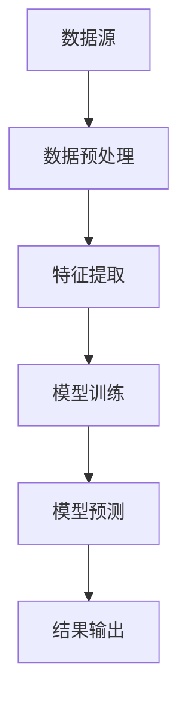
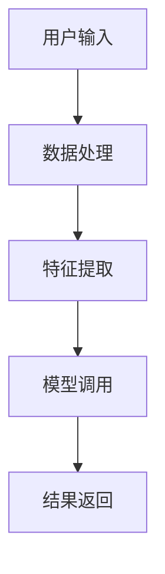

                 


# 如何识别潜在的特价股票机会

> 关键词：特价股票、股票分析、技术分析、基本面分析、机器学习、大数据分析

> 摘要：本文将深入探讨如何识别潜在的特价股票机会。通过技术分析、基本面分析、大数据分析和机器学习等方法，系统地介绍如何识别和评估特价股票，帮助投资者制定有效的投资策略。

---

# 第一部分: 特价股票识别基础

## 第1章: 特价股票概述

### 1.1 特价股票的定义与特点

#### 1.1.1 什么是特价股票
特价股票是指那些价格被市场低估，但具有潜在上涨空间的股票。这些股票通常具有较高的投资回报潜力，吸引了很多投资者的关注。

#### 1.1.2 特价股票的特点
- **低估值**：市盈率、市净率等指标远低于行业平均水平。
- **高增长潜力**：公司未来盈利增长预期较高。
- **低波动性**：股价波动较小，风险相对较低。
- **市场关注度低**：暂时被市场忽视的股票。

#### 1.1.3 特价股票的分类
- **价值型股票**：主要关注低估值和高分红的股票。
- **成长型股票**：关注高增长潜力的公司。
- **周期性股票**：受经济周期影响较大的股票。

### 1.2 特价股票的市场背景

#### 1.2.1 股票市场的基本运作
股票市场是投资者通过买卖公司股份来实现资产增值的场所。市场的波动受到多种因素的影响，包括经济状况、政策变化、公司业绩等。

#### 1.2.2 特价股票的市场机会
在市场低迷时期，许多优质股票会被低估，此时正是寻找特价股票的好时机。此外，行业整合、公司重组等事件也可能导致某些股票价格被低估。

#### 1.2.3 特价股票与投资者的关系
投资者通过识别特价股票，可以在市场中获得超额收益。然而，识别特价股票需要深入的分析和研究，投资者需要具备一定的市场知识和分析能力。

### 1.3 特价股票的识别标准

#### 1.3.1 市盈率分析
市盈率（P/E Ratio）是股票价格与每股收益的比率，用于衡量股票的估值水平。通常，市盈率低于行业平均水平的股票可能被低估。

$$ P/E = \frac{\text{股价}}{\text{每股收益}} $$

#### 1.3.2 市净率分析
市净率（P/B Ratio）是股票价格与每股净资产的比率，用于衡量股票的估值水平。市净率低于1的股票通常被视为低估。

$$ P/B = \frac{\text{股价}}{\text{每股净资产}} $$

#### 1.3.3 股息率分析
股息率是每股股息与股价的比率，用于衡量股票的分红能力。高股息率的股票通常被视为稳定的投资选择。

$$ \text{股息率} = \frac{\text{每股股息}}{\text{股价}} \times 100\% $$

## 第2章: 特价股票的分析方法

### 2.1 技术分析法

#### 2.1.1 K线图分析
K线图通过记录股票的价格波动，帮助投资者分析市场的买卖力量。常见的K线形态包括反转形态和持续形态。

#### 2.1.2 移动平均线（MA）分析
移动平均线是将一段时间内的股票价格平均值连接起来的曲线，用于判断价格趋势。

$$ MA_{n} = \frac{1}{n} \sum_{i=1}^{n} P_i $$

其中，\( P_i \) 是第 \( i \) 天的价格，\( n \) 是天数。

#### 2.1.3 布林带（Bollinger Bands）分析
布林带由三条曲线组成，分别是中间线（MA）、上限（MA + 标准差）和下限（MA - 标准差），用于判断价格的波动范围。

### 2.2 基本面分析法

#### 2.2.1 公司财务指标分析
- **收入与利润**：分析公司的收入和利润增长情况。
- **资产负债表**：分析公司的资产、负债和所有者权益结构。
- **现金流**：分析公司的现金流健康状况。

#### 2.2.2 行业分析与比较
通过对比同一行业内的其他公司，评估目标公司的竞争力和市场地位。

#### 2.2.3 管理层分析
分析公司的管理层背景和战略决策能力，评估公司未来的发展潜力。

### 2.3 综合分析法

#### 2.3.1 技术分析与基本面分析的结合
将技术分析和基本面分析结合起来，综合判断股票的投资价值。

#### 2.3.2 市场情绪分析
通过分析市场的整体情绪，判断市场的买卖力量，辅助投资决策。

#### 2.3.3 行业周期分析
分析行业所处的周期阶段，判断行业的未来发展趋势。

---

# 第二部分: 特价股票识别的高级方法

## 第3章: 大数据分析与机器学习在股票分析中的应用

### 3.1 大数据分析在股票市场中的应用

#### 3.1.1 数据收集与清洗
从多种数据源收集股票数据，并进行数据清洗和预处理。

#### 3.1.2 数据特征提取
从原始数据中提取有用的特征，例如价格、成交量、技术指标等。

#### 3.1.3 数据可视化
通过可视化工具，分析数据的分布和趋势，发现潜在的规律。

### 3.2 机器学习算法在股票预测中的应用

#### 3.2.1 线性回归模型
线性回归模型用于预测股票价格的趋势。

$$ y = \beta_0 + \beta_1 x + \epsilon $$

其中，\( y \) 是目标变量，\( x \) 是自变量，\( \epsilon \) 是误差项。

#### 3.2.2 支持向量机（SVM）模型
SVM模型用于分类和回归分析，常用于股票价格的涨跌预测。

#### 3.2.3 随机森林（Random Forest）模型
随机森林模型是一种基于决策树的集成学习方法，常用于股票价格预测。

### 3.3 机器学习算法实现股票预测的流程

#### 3.3.1 数据预处理
- **数据清洗**：处理缺失值、异常值。
- **特征工程**：提取特征，进行标准化或归一化处理。

#### 3.3.2 模型训练
- **训练集**：用于训练模型。
- **验证集**：用于调参和评估模型性能。
- **测试集**：用于最终测试模型的泛化能力。

#### 3.3.3 模型评估与优化
- **评估指标**：准确率、召回率、F1分数等。
- **超参数调优**：使用网格搜索或随机搜索优化模型性能。

### 3.4 基于机器学习的特价股票识别系统

#### 3.4.1 系统架构设计



#### 3.4.2 系统实现步骤

```python
import pandas as pd
import numpy as np
from sklearn.model_selection import train_test_split
from sklearn.ensemble import RandomForestClassifier

# 数据加载
data = pd.read_csv('stock_data.csv')

# 数据预处理
data = data.dropna()
data = (data - data.mean()) / data.std()

# 特征提取
features = data.drop('target', axis=1)
target = data['target']

# 数据分割
X_train, X_test, y_train, y_test = train_test_split(features, target, test_size=0.2)

# 模型训练
model = RandomForestClassifier()
model.fit(X_train, y_train)

# 模型预测
y_pred = model.predict(X_test)
print("预测结果:", y_pred)
```

---

## 第4章: 特价股票识别的算法实现

### 4.1 特价股票识别的算法原理

#### 4.1.1 算法选择与优化
选择合适的算法，并通过参数调优提高模型性能。

#### 4.1.2 算法实现步骤
- **数据准备**：收集和处理数据。
- **模型训练**：使用训练数据训练模型。
- **模型预测**：使用测试数据预测结果。
- **结果分析**：分析预测结果，评估模型性能。

### 4.2 基于机器学习的特价股票识别系统

#### 4.2.1 系统架构设计



#### 4.2.2 系统实现步骤

```python
import pandas as pd
from sklearn.svm import SVC

# 数据加载
data = pd.read_csv('stock_data.csv')

# 数据预处理
data = data.dropna()
data = (data - data.mean()) / data.std()

# 特征提取
features = data.drop('target', axis=1)
target = data['target']

# 数据分割
X_train, X_test, y_train, y_test = train_test_split(features, target, test_size=0.2)

# 模型训练
model = SVC()
model.fit(X_train, y_train)

# 模型预测
y_pred = model.predict(X_test)
print("预测结果:", y_pred)
```

---

## 第5章: 特价股票识别的实战案例

### 5.1 数据准备

```python
import pandas as pd
import numpy as np

# 创建示例数据
data = {
    '日期': ['2023-01-01', '2023-01-02', '2023-01-03', '2023-01-04', '2023-01-05'],
    '收盘价': [100, 102, 98, 105, 101],
    '成交量': [1000, 1200, 900, 1500, 1100],
    '市盈率': [15, 16, 14, 17, 15],
    '市净率': [2, 2.5, 1.8, 3, 2.2]
}
df = pd.DataFrame(data)
print(df)
```

### 5.2 数据分析与可视化

```python
import matplotlib.pyplot as plt

# 绘制收盘价走势图
plt.figure(figsize=(10, 5))
plt.plot(df['日期'], df['收盘价'])
plt.title('股票收盘价走势图')
plt.xlabel('日期')
plt.ylabel('收盘价')
plt.show()
```

### 5.3 机器学习模型实现

```python
from sklearn.tree import DecisionTreeClassifier

# 数据准备
X = df[['市盈率', '市净率', '成交量']]
y = df['收盘价'] > 100

# 数据分割
X_train, X_test, y_train, y_test = train_test_split(X, y, test_size=0.2)

# 模型训练
model = DecisionTreeClassifier()
model.fit(X_train, y_train)

# 模型预测
y_pred = model.predict(X_test)
print("预测结果:", y_pred)
```

### 5.4 模型评估

```python
from sklearn.metrics import accuracy_score

print("准确率:", accuracy_score(y_test, y_pred))
```

---

## 第6章: 特价股票识别的最佳实践与注意事项

### 6.1 最佳实践

- **持续学习**：市场变化快，投资者需要不断学习新的知识和技巧。
- **风险管理**：合理控制仓位，设置止损点，避免重大损失。
- **多策略结合**：将技术分析、基本面分析和大数据分析结合起来，提高判断的准确性。

### 6.2 小结

通过本文的介绍，读者可以系统地了解如何识别潜在的特价股票机会。从基础的技术分析和基本面分析，到高级的大数据分析和机器学习方法，投资者可以结合多种方法进行综合判断，提高投资决策的科学性和准确性。

### 6.3 注意事项

- **市场风险**：股票市场存在不确定性，投资者需谨慎操作。
- **数据质量**：确保数据的准确性和完整性，避免因数据问题导致分析错误。
- **模型局限性**：机器学习模型有一定的局限性，需结合其他方法进行验证。

### 6.4 拓展阅读

- 《股票投资实战技巧》
- 《机器学习在金融中的应用》
- 《大数据分析与股票投资》

---

作者：AI天才研究院/AI Genius Institute & 禅与计算机程序设计艺术 /Zen And The Art of Computer Programming

