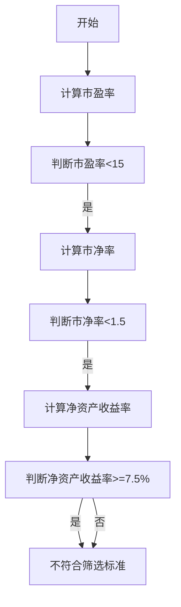

                 

# 如何识别被低估的股票：格雷厄姆的筛选方法

## 关键词：低估股票，格雷厄姆，价值投资，市盈率，市净率，内在价值

## 摘要：
本文将详细介绍如何使用格雷厄姆的价值投资方法来识别被低估的股票。通过分析股票的财务指标，如市盈率、市净率和净资产收益率，结合内在价值的评估，读者将学会系统地筛选出具有投资价值的股票。文章从基础概念到实际操作，结合案例分析，全面解析格雷厄姆的筛选方法，帮助投资者在股市中找到低估的投资机会。

---

# 第一部分: 价值投资与低估股票的基础

## 第1章: 投资的基础概念

### 1.1 什么是价值投资
#### 1.1.1 投资的定义与分类
投资是指将资金投入到能够产生收益的资产中，常见的投资类型包括股票、债券、房地产等。股票投资是最常见的形式之一，它代表了对一家公司的所有权。

#### 1.1.2 价值投资的核心理念
价值投资是一种长期投资策略，强调以低于资产内在价值的价格买入股票。其核心理念是寻找市场中的“烟屁股”——即被市场忽视或低估的股票。

#### 1.1.3 价值投资与投机的区别
- **价值投资**：基于对企业基本面的深入分析，寻找具有长期竞争优势和稳定收益的公司。
- **投机**：基于市场短期波动，试图通过价格波动获利，风险较高。

### 1.2 股票市场的基本运作
#### 1.2.1 股票市场的定义与功能
股票市场是投资者买卖股票的场所，其功能包括资本融通、价格发现和风险分散。

#### 1.2.2 股票价格的波动原因
股票价格受多种因素影响，包括公司业绩、宏观经济环境、市场情绪等。短期价格波动往往由市场情绪驱动，而长期价格走势则取决于公司的基本面。

#### 1.2.3 市场有效性的讨论
有效市场假说认为，股票价格已经反映了所有可获取的信息，因此很难通过技术分析或基本面分析找到被低估的股票。然而，市场并非总是有效，尤其是在市场情绪低落或公司基本面突然变化时，会出现暂时性的低估或高估。

### 1.3 为什么寻找被低估的股票
#### 1.3.1 低估股票的定义
低估股票是指市场价格低于其内在价值的股票。这种股票通常具有较高的安全边际，即市场价格与内在价值之间的差距越大，投资风险越小，潜在回报越高。

#### 1.3.2 低估股票的投资价值
低估股票的核心价值在于其潜在的上涨空间。当市场价格回归其内在价值时，投资者可以获得超额收益。

#### 1.3.3 市场中的常见低估股票类型
- **周期性低估股票**：在经济周期低谷时被低估，随着经济复苏而回升。
- **成长性低估股票**：公司具有较高的成长潜力，但市场尚未发现其价值。
- **价值型低估股票**：公司具有稳定的收益和较低的估值倍数。

---

# 第二部分: 格雷厄姆的价值投资理论

## 第2章: 格雷厄姆的生平与贡献

### 2.1 格雷厄姆的生平简介
本杰明·格雷厄姆（Benjamin Graham）是20世纪著名的投资学家，被誉为“价值投资之父”。他通过研究和实践，发展出一套系统化的价值投资方法。

### 2.2 格雷厄姆对价值投资的贡献
格雷厄姆提出了防御性投资策略，强调通过严格筛选股票，降低投资风险，追求稳定的投资回报。

### 2.3 格雷厄姆的经典著作
格雷厄姆的著作《 Intelligent Investor》是价值投资领域的经典读物，书中详细阐述了价值投资的理念和方法。

---

## 第3章: 格雷厄姆的防御性投资策略

### 3.1 防御性投资的核心原则
格雷厄姆的防御性投资策略强调以下几点：
- 严格筛选股票，确保投资标的具有足够的安全边际。
- 避免投机性交易，专注于长期价值。
- 分散投资，降低单一股票的风险。

### 3.2 防御性投资的风险控制
格雷厄姆认为，投资的风险可以通过严格筛选股票和分散投资来控制。他建议投资者只投资于那些具有稳定收益和较低估值的公司。

---

## 第4章: 格雷厄姆的筛选方法概述

### 4.1 格雷厄姆的十二条筛选标准
格雷厄姆提出了十二条筛选标准，用于识别具有投资价值的股票。以下是其中的关键标准：

#### 4.1.1 市盈率低于15倍
市盈率（P/E）是衡量股票估值的重要指标，公式为：
$$ P/E = \frac{\text{股价}}{\text{每股净利润}} $$
格雷厄姆建议只选择市盈率低于15倍的股票。

#### 4.1.2 市净率低于1.5倍
市净率（P/B）是股价与每股净资产的比率，公式为：
$$ P/B = \frac{\text{股价}}{\text{每股净资产}} $$
格雷厄姆建议选择市净率低于1.5倍的股票。

#### 4.1.3 净资产收益率不低于7.5%
净资产收益率（ROE）是衡量公司盈利能力的重要指标，公式为：
$$ ROE = \frac{\text{净利润}}{\text{净资产}} $$
格雷厄姆建议选择净资产收益率不低于7.5%的公司。

### 4.2 格雷厄姆筛选方法的数学模型
以下是格雷厄姆筛选方法的流程图：

---

# 第三部分: 实际操作指南

## 第5章: 如何应用格雷厄姆的筛选方法

### 5.1 数据收集与初步筛选
投资者需要收集目标公司的财务数据，包括收入、利润、资产等，然后计算各项指标。

### 5.2 格雷厄姆筛选方法的实现步骤
1. 计算市盈率：使用公式 $$ P/E = \frac{\text{股价}}{\text{每股净利润}} $$
2. 判断市盈率是否低于15倍。
3. 计算市净率：使用公式 $$ P/B = \frac{\text{股价}}{\text{每股净资产}} $$
4. 判断市净率是否低于1.5倍。
5. 计算净资产收益率：使用公式 $$ ROE = \frac{\text{净利润}}{\text{净资产}} $$
6. 判断净资产收益率是否不低于7.5%。

### 5.3 投资组合的构建与管理
投资者需要根据筛选结果，构建 diversified 投资组合，并定期监控和调整。

---

# 第四部分: 案例分析

## 第6章: 格雷厄姆筛选方法的案例分析

### 6.1 案例背景
以某公司为例，计算其市盈率、市净率和净资产收益率。

### 6.2 数据计算
- 市盈率：10倍
- 市净率：1.2倍
- 净资产收益率：8%

### 6.3 筛选结果
该公司符合格雷厄姆的筛选标准，具有投资价值。

---

# 第五部分: 总结与展望

## 第7章: 格雷厄姆筛选方法的总结

### 7.1 格雷厄姆方法的优势
- 系统化：通过严格筛选标准，降低投资风险。
- 简单易懂：筛选标准清晰，易于操作。
- 长期有效性：历史数据表明，格雷厄姆方法在长期投资中表现优异。

### 7.2 格雷厄姆方法的局限性
- 无法捕捉成长性股票：格雷厄姆方法更适合寻找稳定型股票，可能错过具有高成长性的公司。
- 忽略市场情绪：市场情绪可能影响股票价格，导致低估股票在短期内继续被低估。

### 7.3 进阶策略
- 结合技术分析：在基本面分析的基础上，结合技术分析，寻找买卖时机。
- 多策略结合：根据市场环境调整筛选标准，灵活应对市场变化。

---

## 附录: 格雷厄姆筛选工具

### 附录1: 常用工具与资源
- 财务数据查询工具：Yahoo Finance、Morningstar。
- 股票筛选工具：ScreeningTools、Finviz。

### 附录2: 常见问题解答
- 如何处理财务数据的缺失或异常？
- 如何应对市场波动对筛选结果的影响？

---

# 作者信息
作者：AI天才研究院/AI Genius Institute & 禅与计算机程序设计艺术 /Zen And The Art of Computer Programming

---

通过以上结构，文章详细介绍了格雷厄姆的筛选方法，并结合实际案例进行了分析，帮助读者系统地识别被低估的股票。

