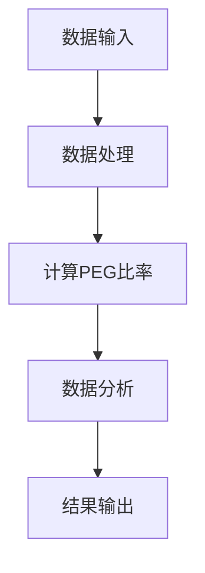

                 


# 如何运用彼得林奇的PEG比率选股

> 关键词：彼得林奇，PEG比率，选股策略，投资分析，价值投资

> 摘要：本文将详细讲解如何运用彼得·林奇的PEG比率进行选股，从理论基础到实际应用，结合技术分析和数学模型，帮助投资者更好地理解和应用这一选股方法。文章内容涵盖PEG比率的定义、计算方法、系统架构设计、项目实战案例以及最佳实践建议。

---

## 第1章: 彼得·林奇与PEG比率概述

### 1.1 彼得·林奇与他的投资理念

彼得·林奇（Peter Lynch）是全球最著名的基金经理之一，他的投资理念以“价值投资”为核心，强调通过深入分析公司的基本面来选择具有成长潜力的股票。他管理的麦哲伦基金在任职期间取得了惊人的年均29%的回报率，这主要得益于他对公司基本面的深刻理解和对成长股的精准筛选。

#### 1.1.1 彼得·林奇的生平简介

- 彼得·林奇出生于1942年，毕业于波士顿学院。
- 1971年加入富达投资集团，开始管理麦哲伦基金。
- 1985年至1990年期间，麦哲伦基金的年回报率高达29%。
- 1999年退休后，彼得·林奇专注于写作和演讲，分享他的投资理念。

#### 1.1.2 彼得·林奇的投资哲学

- **长期投资**：林奇主张长期持有优质股票，避免频繁交易。
- **基本面分析**：他强调通过分析公司的财务数据和行业地位来评估股票的价值。
- **成长与价值的结合**：林奇认为，成长股和价值股都有其独特的投资价值，关键在于找到那些被市场低估的成长股。

#### 1.1.3 彼得·林奇对价值投资的贡献

- **PEG比率**：林奇提出了一种新的估值方法——PEG比率，将市盈率与净利润增长率相结合，帮助投资者更准确地评估股票的价值。
- **行业研究**：他强调对行业趋势和公司竞争地位的研究，提出了“哑铃型”投资策略，即同时投资于防守型和进攻型行业。

---

### 1.2 PEG比率的定义与意义

PEG比率（Price/Earnings to Growth ratio）是彼得·林奇提出的一种选股工具，用于衡量股票的估值是否合理。与传统的市盈率（P/E）不同，PEG比率将公司的净利润增长率（E）纳入考量，从而更全面地评估股票的价值。

#### 1.2.1 PEG比率的基本定义

PEG比率的公式为：

$$ PEG = \frac{P/E}{E} $$

其中：
- $P/E$ 是市盈率。
- $E$ 是净利润增长率。

PEG比率反映了股票的市盈率相对于其净利润增长率的高低。一般来说，PEG比率小于1的股票被认为具有较高的投资价值，因为它们的市盈率相对较低，而增长率较高。

#### 1.2.2 PEG比率与市盈率（P/E）的区别

| 指标 | 定义 | 用途 |
|------|------|------|
| P/E | 市盈率 = 股价 / 每股净利润 | 衡量股票的估值是否合理 |
| PEG | PEG比率 = (P/E) / 净利润增长率 | 衡量股票的估值是否合理，同时考虑了公司的增长率 |

#### 1.2.3 PEG比率在选股中的作用

- **筛选低估股票**：通过比较PEG比率，投资者可以找到那些市盈率相对较低但净利润增长率较高的股票。
- **评估成长潜力**：PEG比率可以帮助投资者识别具有高成长潜力的公司，尤其是那些PEG比率小于1的股票。

---

## 第2章: PEG比率的数学模型与公式

### 2.1 PEG比率的公式推导

PEG比率的核心公式为：

$$ PEG = \frac{P/E}{E} $$

其中，$P/E$ 是市盈率，计算公式为：

$$ P/E = \frac{\text{股价}}{\text{每股净利润}} $$

净利润增长率（E）的计算公式为：

$$ E = \frac{\text{本期净利润} - \text{上期净利润}}{\text{上期净利润}} \times 100\% $$

将这些公式结合起来，我们可以得到PEG比率的综合公式：

$$ PEG = \frac{\frac{\text{股价}}{\text{每股净利润}}}{\frac{\text{本期净利润} - \text{上期净利润}}{\text{上期净利润}} \times 100\%} $$

---

### 2.2 PEG比率的属性特征对比

| 指标 | 定义 | 优点 | 局限性 |
|------|------|------|--------|
| P/E | 市盈率 | 简单易懂 | 忽略了公司的增长率 |
| PEG | PEG比率 | 综合考虑市盈率和增长率 | 计算复杂，需要准确的财务数据 |
| 市净率 | 市净率 = 股价 / 每股净资产 | 适用于评估资产密集型公司 | 不适合评估成长型公司 |

---

## 第3章: PEG比率的实体关系架构

### 3.1 实体关系图（ER图）

以下是一个简化的ER图，展示了PEG比率选股涉及的主要实体及其关系：

```mermaid
erDiagram
    管理人:Investor
    股票:Stock
    财务指标:FinancialMetrics
    投资决策:InvestmentDecision

    Investor -> Stock: 管理
    Stock -> FinancialMetrics: 包含
    FinancialMetrics -> InvestmentDecision: 用于
```

### 3.2 PEG比率的流程图

以下是一个PEG比率的流程图，展示了从数据输入到结果输出的整个流程：



---

## 第4章: PEG比率的系统分析与架构设计

### 4.1 系统功能设计

#### 4.1.1 数据采集模块

- 数据接口：从股票数据库中获取股票的基本数据，包括股价、净利润等。
- 数据清洗：对获取的数据进行预处理，确保数据的准确性和完整性。

#### 4.1.2 数据计算模块

- 计算市盈率（P/E）。
- 计算净利润增长率（E）。
- 计算PEG比率。

#### 4.1.3 数据分析模块

- 对PEG比率进行分类（如PEG < 1、1 < PEG < 2等）。
- 生成投资建议（如买入、持有、卖出）。

### 4.2 系统架构设计

以下是一个基于PEG比率选股的系统架构图：


---

## 第5章: PEG比率的项目实战

### 5.1 环境安装与配置

- **Python环境**：安装Python 3.8或更高版本。
- **数据分析库**：安装pandas、numpy、matplotlib等库。
- **数据接口**：使用Yahoo Finance API获取股票数据。

### 5.2 核心代码实现

以下是一个使用Python实现PEG比率计算的示例代码：

```python
import pandas as pd
import numpy as np

# 获取股票数据
def get_stock_data(ticker):
    # 假设使用Yahoo Finance API获取数据
    data = pd.DataFrame({
        '股价': [100, 110, 120],
        '净利润': [10, 12, 15]
    })
    return data

# 计算PEG比率
def calculate_pe_ratio(data):
    pe = data['股价'] / data['净利润'].shift(1)
    return pe

def calculate_growth_rate(data):
    growth = (data['净利润'] - data['净利润'].shift(1)) / data['净利润'].shift(1) * 100
    return growth

def calculate_peg_ratio(pe, growth):
    peg = pe / growth
    return peg

# 示例运行
stock_data = get_stock_data('AAPL')
pe = calculate_pe_ratio(st

