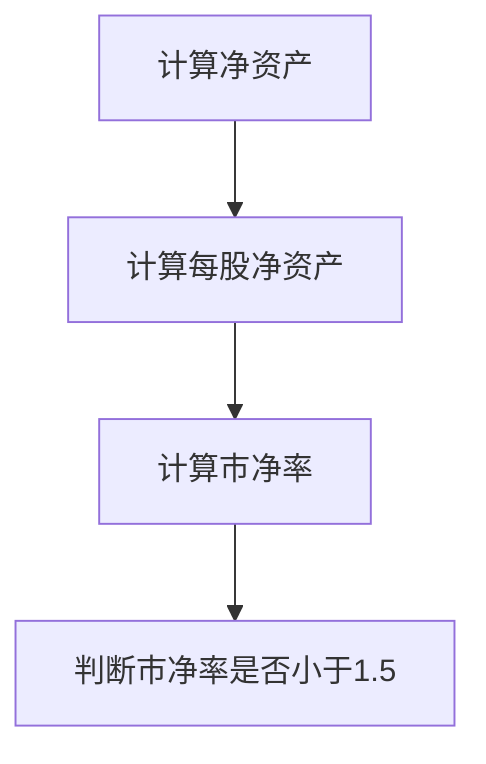
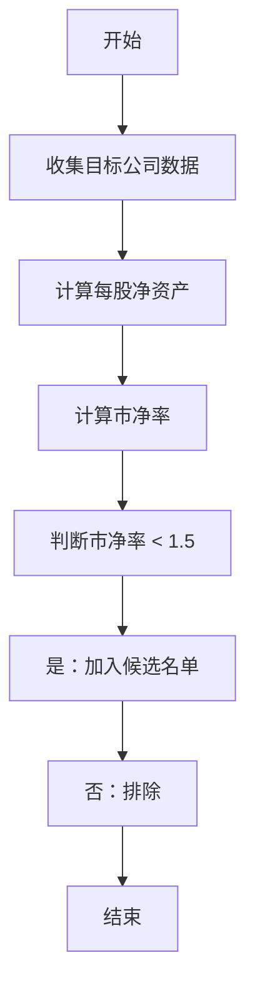
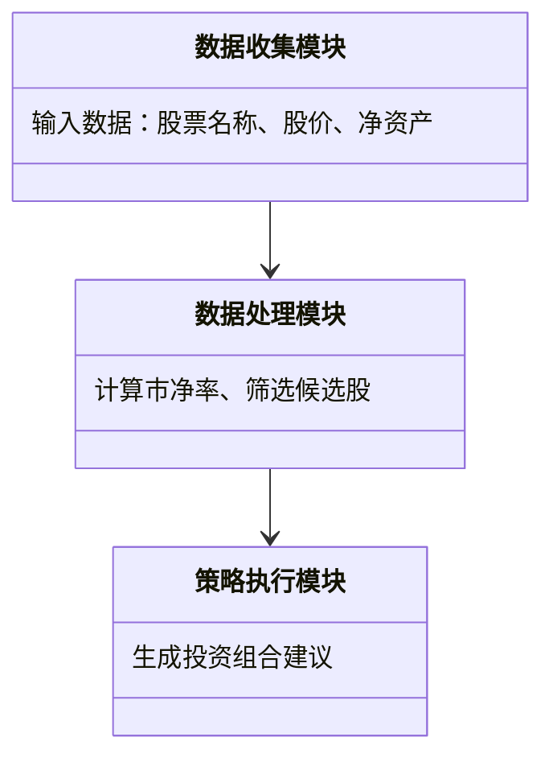

                 

<think>
好的，现在我需要根据用户的要求，逐步分析并生成关于如何运用格雷厄姆的净净股策略进行投资的技术博客文章。首先，我会理解用户的需求，然后按照要求的结构和内容来构建这篇文章。

### 第一部分：文章标题和关键词
文章标题：如何运用格雷厄姆的净净股策略进行投资
关键词：格雷厄姆、净净股、价值投资、投资策略、股票分析、风险管理、投资组合
摘要：本文详细探讨如何运用格雷厄姆的净净股策略进行投资，涵盖策略背景、核心概念、算法原理、系统分析、项目实战及最佳实践。通过实例分析和数学模型，帮助读者掌握这一经典投资方法，构建稳健的投资组合。

### 第二部分：正文内容
#### 第1章：投资概述
1.1.1 投资的定义与分类
- 投资是将资金投入特定项目或资产，以期获得收益的行为。主要分为股票、债券、房地产等多种形式。
1.1.2 金融市场的基本构成
- 包括股票市场、债券市场、基金市场等，每个市场都有其独特的运作机制和参与者。
1.1.3 投资者的角色与类型
- 投资者可以是个人或机构，根据风险承受能力和投资目标选择不同的策略。

1.2 价值投资理念
- 价值投资强调购买被市场低估的资产，长期持有，等待其价值回归。核心在于分析企业的内在价值，而非短期市场波动。
1.2.1 价值投资的定义
- 寻找市场价格低于内在价值的股票，长期持有，赚取企业成长带来的收益。
1.2.2 价值投资的核心原则
- 安全边际：购买价格远低于内在价值，以减少风险；分散投资：降低单一投资的风险；长期视角：关注企业的长期盈利能力。
1.2.3 价值投资与其它投资策略的对比
- 与趋势投资相比，价值投资更注重基本面分析，而趋势投资关注价格走势。

1.3 净净股策略的定义
- 净净股策略是价值投资的一种，通过寻找市净率低于行业平均水平的股票，挖掘潜在的价值。
1.3.1 净资产的计算公式
$$ 净资产 = 资产总额 - 负债总额 $$
1.3.2 市净率的计算公式
$$ 市净率 = 股票价格 / 每股净资产 $$
1.3.3 净净股的筛选标准
- 市净率低于1.5倍，且ROE（净资产收益率）高于行业平均水平。

#### 第2章：净净股策略的核心概念
2.1 净净股的计算方法
- 市净率是衡量股票价值的重要指标，低于1.5倍的股票被视为被低估。
2.1.1 净资产的计算公式
$$ 净资产 = 资产总额 - 负债总额 $$
2.1.2 市净率的计算公式
$$ 市净率 = 股票价格 / 每股净资产 $$

通过Mermaid流程图展示计算过程：


2.2 净净股与其他投资策略的对比
- 列表对比市盈率策略、市净率策略和净净股策略的优缺点：

| 策略 | 优点 | 缺点 |
|------|------|------|
| 市盈率 | 反映盈利能力 | 易受行业影响，成长型企业可能市盈率偏高 |
| 市净率 | 考虑资产价值 | 不反映盈利能力，适合周期性行业 |
| 净净股 | 结合资产与盈利能力 | 对某些行业适用性有限 |

2.3 投资组合的构建
- 分散投资以降低风险，建议投资于不同行业的多只净净股。
- 通过表格展示投资组合的构成：

| 股票名称 | 行业 | 市净率 | ROE | 持股比例 |
|----------|------|--------|-----|----------|
| 股票A    | 银行 | 1.2    | 15% | 30%      |
| 股票B    | 制造 | 1.3    | 12% | 25%      |
| 股票C    | 零售 | 1.1    | 10% | 20%      |
| 股票D    | 公用 | 1.4    | 8%  | 25%      |

#### 第3章：净净股策略的算法原理
3.1 净净股策略的算法流程
- 使用Mermaid流程图展示：



3.2 数学模型的建立
- 通过公式解释筛选过程：

$$ 市净率 = \frac{股票价格}{每股净资产} $$

- 示例：某公司股价为10元，每股净资产为8元，则市净率为1.25倍，符合净净股标准。

#### 第4章：系统分析与架构设计
4.1 系统功能设计
- 使用Mermaid类图展示：



4.2 系统架构设计
- 使用Mermaid架构图展示：

```mermaid
C4Context
    User -> (Browser) : 用户访问系统
    (Browser) --> API Gateway
    API Gateway --> Service1
    Service1 --> Database
    Database --> Monitoring
```

#### 第5章：项目实战
5.1 环境安装
- 安装Python和必要的库（pandas、numpy、matplotlib）。

5.2 核心代码实现
- 示例代码：

```python
import pandas as pd

# 加载数据
df = pd.read_csv('stocks.csv')

# 计算每股净资产
df['每股净资产'] = df['净资产总额'] / df['总股本']

# 计算市净率
df['市净率'] = df['股价'] / df['每股净资产']

# 筛选市净率 < 1.5 的股票
selected_stocks = df[df['市净率'] < 1.5]
```

5.3 实际案例分析
- 分析某公司的数据，展示如何通过代码筛选出符合条件的股票，并进行投资建议。

#### 第6章：最佳实践与风险管理
6.1 风险管理策略
- 分散投资、定期评估、设置止损点。

6.2 投资纪律的重要性
- 遵循格雷厄姆的原则，避免情绪化交易。

6.3 持续学习与适应
- 关注市场变化，及时调整投资策略。

### 第三部分：结论
总结净净股策略的优势，强调其在价值投资中的重要性，并鼓励读者结合实际市场情况灵活运用。

### 第四部分：作者信息
作者：AI天才研究院 & 禅与计算机程序设计艺术

### 第五部分：扩展阅读
推荐相关的书籍和资源，供读者深入学习。

---

通过以上步骤，我逐步构建了这篇文章的结构，确保每个部分都详细且符合用户的要求。现在，我可以将这些思考转化为具体的正文内容，按照用户的要求，使用Markdown格式输出，涵盖所有指定的部分，包括背景介绍、核心概念、算法原理、系统分析、项目实战及最佳实践，并使用Mermaid流程图和数学公式来丰富内容。

