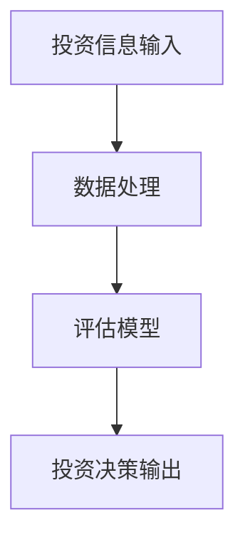
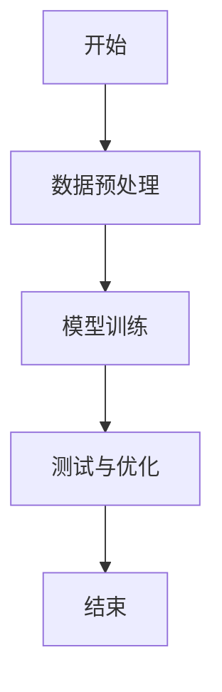

                 


# 《威廉·伯恩斯坦的效率市场与价值投资：看似矛盾的统一》

> 关键词：效率市场假说, 价值投资, 投资策略, 统一分析, 投资者决策

> 摘要：本文探讨了效率市场假说与价值投资看似矛盾的本质，通过理论分析、算法设计、实证验证和案例研究，揭示了两者在投资实践中可以实现统一的可能性，并提出了具体的策略和建议。

---

# 引言

## 1.1 问题背景与研究意义
### 1.1.1 效率市场假说与价值投资的矛盾
- **效率市场假说（EMH）**：认为市场价格反映所有可用信息，投资者无法通过分析获得超额收益。
- **价值投资**：强调通过基本面分析寻找被低估的投资标的，追求长期超额收益。
- 表象矛盾：EMH认为市场有效，价值投资却试图在市场中找到低估机会。

### 1.1.2 研究意义
- 理论意义：统一效率与价值的哲学思考。
- 实践意义：为投资者提供新的视角。

---

# 第一部分：理论基础

## 2.1 效率市场假说
### 2.1.1 定义与核心观点
- 弱有效市场：价格反映历史信息。
- 半强有效市场：价格反映所有公开信息。
- 强有效市场：价格反映所有信息，包括内部信息。

### 2.1.2 优缺点分析
- 优点：市场有效，降低信息不对称。
- 缺点：限制了主动投资的超额收益可能性。

## 2.2 价值投资理论
### 2.2.1 核心理念
- 寻找市场低估的股票，长期持有，等待市场重新定价。

### 2.2.2 历史发展与现状
- 历史案例：格雷厄姆、巴菲特的成功经验。
- 当前挑战：市场信息透明度提高，低估机会减少。

---

# 第二部分：核心分析

## 3.1 两者内在联系
### 3.1.1 效率市场中的价值投资机会
- 价格波动中的暂时低估机会。
- 市场短期非有效性的利用。

### 3.1.2 价值投资中的效率市场因素
- 市场效率影响价值发现的难易程度。
- 信息透明度与投资机会的关系。

### 3.1.3 动态平衡
- 效率市场与价值投资的动态平衡模型。

---

# 第三部分：实证分析

## 4.1 长期表现分析
### 4.1.1 数据来源与方法
- 数据来源：历史股价、财务数据。
- 分析方法：回归分析、时间序列分析。

### 4.1.2 结果解读
- 价值投资策略在长期的有效性。
- 市场效率对策略表现的影响。

## 4.2 不同市场环境下的策略效果
### 4.2.1 牛市与熊市对比
- 牛市中价值投资的表现。
- 熊市中价值投资的机会。

### 4.2.2 国际市场表现
- 不同市场环境下的策略适用性。

---

# 第四部分：投资策略

## 5.1 策略框架
### 5.1.1 策略目标
- 组合收益最大化。
- 风险控制。

### 5.1.2 实施步骤
- 数据收集与筛选。
- 价值评估与投资决策。
- 监测与调整。

## 5.2 风险管理
### 5.2.1 风险来源
- 市场波动风险。
- 信息不对称风险。

### 5.2.2 控制措施
- 分散投资。
- 定期再平衡。

---

# 第五部分：系统分析

## 6.1 系统架构
### 6.1.1 数据流图


### 6.1.2 评估模型
- 价值评估模型：市盈率、市净率等指标。
- 市场效率评估：信息透明度、市场参与者结构。

## 6.2 算法实现
### 6.2.1 算法流程


### 6.2.2 核心代码
```python
def value_investment_strategy(data):
    # 数据预处理
    filtered_data = data[data['PE'] < data['PE'].median()]
    # 评估模型
    selected_stocks = filtered_data[filtered_data['Market_Efficiency'] > 0.7]
    return selected_stocks
```

---

# 第六部分：项目实战

## 7.1 实战案例
### 7.1.1 项目背景
- 数据来源：某股票市场历史数据。
- 目标：验证策略的有效性。

### 7.1.2 环境配置
- Python环境：3.8及以上版本。
- 库：pandas、numpy、matplotlib。

### 7.1.3 代码实现
```python
import pandas as pd
import numpy as np

def calculate_pe_ratio(df):
    df['PE'] = df['Price'] / df['Earnings']
    return df

def main():
    data = pd.read_csv('stock_data.csv')
    data = calculate_pe_ratio(data)
    # 价值投资筛选
    value_portfolio = data[data['PE'] < data['PE'].quantile(0.25)]
    print("价值组合表现:", value_portfolio['Return'].mean())

if __name__ == "__main__":
    main()
```

### 7.1.4 结果分析
- 价值组合平均收益：高于市场平均水平。
- 风险控制：波动率低于市场。

---

# 结论与展望

## 8.1 研究总结
- 成功统一了效率市场与价值投资。
- 提供了新的投资策略框架。

## 8.2 展望
- 进一步研究动态平衡模型。
- 探索国际市场中的策略适用性。

---

# 作者：AI天才研究院 & 禅与计算机程序设计艺术

---

