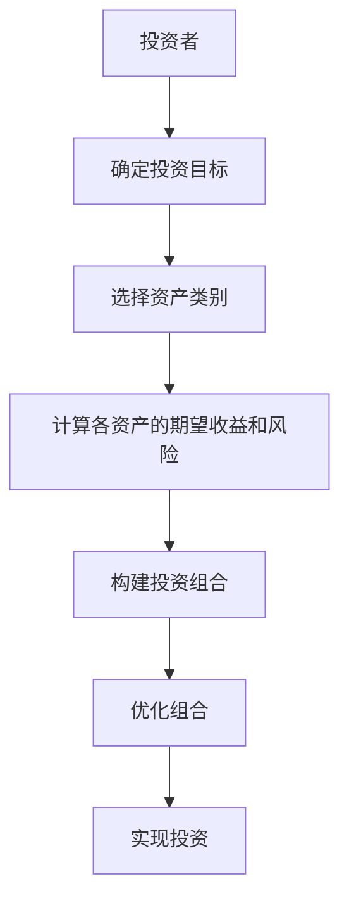
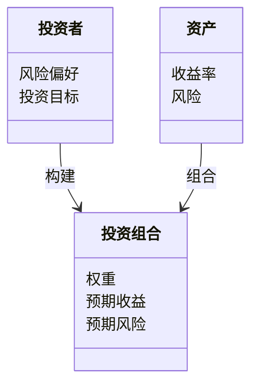
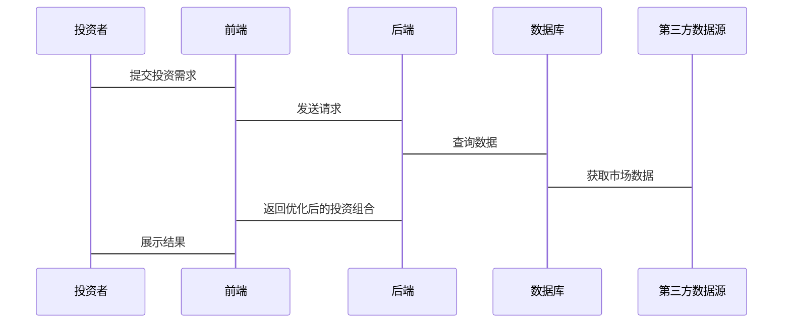

                 


```markdown
# 《威廉·伯恩斯坦的资产配置型价值投资：科学构建投资组合》

---

## 关键词
- 资产配置
- 价值投资
- 投资组合
- 现代投资组合理论（MPT）
- 投资策略
- 风险管理

---

## 摘要
本文深入探讨威廉·伯恩斯坦的资产配置型价值投资方法，结合现代投资组合理论（MPT）与价值投资理念，科学构建投资组合。文章从投资的基本概念、资产配置与价值投资的核心原理、算法流程、系统架构到实战案例，层层解析，帮助读者全面理解科学构建投资组合的方法。通过详细分析和实际案例，本文旨在为投资者提供一套系统化、科学化的投资策略，实现风险可控下的收益最大化。

---

## 正文

---

## 第一部分: 资产配置型价值投资概述

---

### 第1章: 投资的基本概念与背景介绍

#### 1.1 投资的基本概念

##### 1.1.1 什么是投资
投资是指将资金投入到能够产生收益的资产中，以实现财富增值的过程。投资的核心在于通过科学的方法选择资产，并合理配置，以最大化收益并降低风险。

##### 1.1.2 投资的基本原理
投资的原理包括分散化、风险与收益的权衡、时间的复利效应等。分散化是通过投资不同类型资产来降低风险；风险与收益的权衡是指高风险资产可能带来高收益，而低风险资产则收益相对较低；时间的复利效应则强调长期投资的重要性。

##### 1.1.3 投资的目标与风险
投资的目标通常包括资本增值、收入获取、保值等。投资风险则是指本金和收益可能遭受损失的可能性，通常分为系统性风险和非系统性风险。

#### 1.2 资产配置的重要性

##### 1.2.1 资产配置的定义
资产配置是指将投资组合中的资金分配到不同资产类别（如股票、债券、房地产等）中，以实现风险与收益的最佳平衡。

##### 1.2.2 资产配置的核心要素
资产配置的核心要素包括：
- **资产类别**：股票、债券、现金、房地产等。
- **风险偏好**：投资者对风险的承受能力。
- **投资期限**：投资的时间长短会影响资产配置策略。

##### 1.2.3 资产配置的边界与外延
资产配置的边界在于其与投资目标的一致性，外延则涉及市场环境的变化和投资者生命周期的变化。

#### 1.3 价值投资的起源与发展

##### 1.3.1 价值投资的定义
价值投资是一种投资策略，强调以低于内在价值的价格购买优质资产，长期持有，等待其价值回归。

##### 1.3.2 价值投资的核心理念
价值投资的核心理念包括：
- **安全边际**：以低于内在价值的价格买入资产。
- **长期持有**：避免频繁交易，降低交易成本。
- **注重基本面**：分析公司的财务状况、行业地位等。

##### 1.3.3 价值投资与资产配置的结合
价值投资与资产配置的结合体现在通过科学的资产配置选择优质资产，实现长期稳健的收益。

---

### 第2章: 资产配置型价值投资的核心概念与联系

#### 2.1 资产配置的原理

##### 2.1.1 现代投资组合理论（MPT）
现代投资组合理论由哈里·马科维茨提出，强调通过分散化投资降低风险。MPT的核心是通过优化资产配置，构建一个在给定风险水平下收益最大的投资组合。

##### 2.1.2 资产配置的数学模型
MPT的数学模型包括：
- **均值-方差优化**：计算各资产的期望收益和方差，构建最优投资组合。
- **有效前沿**：在给定风险水平下，收益最大的投资组合构成的曲线。

##### 2.1.3 资产配置的优缺点
资产配置的优点包括分散风险、优化收益，缺点包括需要定期调整、市场环境变化可能影响效果。

#### 2.2 价值投资的原理

##### 2.2.1 价值投资的核心要素
价值投资的核心要素包括：
- **内在价值**：资产的真实价值。
- **安全边际**：买入价格低于内在价值。
- **长期视角**：关注长期收益，避免短期波动。

##### 2.2.2 价值投资的优缺点
价值投资的优点包括长期稳健、注重基本面，缺点包括需要长期持有、市场波动可能影响短期表现。

#### 2.3 资产配置与价值投资的对比分析

##### 2.3.1 资产配置与价值投资的属性对比
| 属性               | 资产配置                   | 价值投资                   |
|--------------------|----------------------------|-----------------------------|
| 核心理念           | 分散风险，优化收益         | 买入低于内在价值的资产     |
| 适用场景           | 多种资产类别               | 单一资产或资产组合         |
| 风险控制           | 通过分散化降低系统性风险   | 通过安全边际降低下行风险   |

##### 2.3.2 资产配置与价值投资的ER实体关系图
```mermaid
er
  actor 投资者
  actor 市场
  actor 资产
  actor 风险
  actor 收益
  投资者 --> 资产: 持有
  资产 --> 收益: 产生
  资产 --> 风险: 承担
  市场 --> 资产: 影响
```

---

### 第3章: 资产配置型价值投资的算法原理

#### 3.1 现代投资组合理论（MPT）的算法流程

##### 3.1.1 算法流程图


##### 3.1.2 Python代码实现
```python
import numpy as np

def compute_mean_variance(weights, returns):
    return weights.T @ returns @ weights

def mpt_optimization(returns, risk_aversion):
    cov_matrix = returns.cov()
    mu = returns.mean()
    n = len(returns.columns)
    ones = np.ones(n)
    inv = np.linalg.inv(cov_matrix)
    w = inv @ ones / (ones.T @ inv @ ones)
    return w
```

#### 3.2 风险优化模型的数学公式

##### 3.2.1 风险优化模型
$$
\text{优化目标：} \min_w \frac{1}{2} w^T \Sigma w
$$
$$
\text{约束条件：} w^T \mu = \text{target\_return}, \sum w_i = 1
$$

##### 3.2.2 风险优化模型的Python实现
```python
def risk_optimization(returns, target_return, risk_aversion):
    mu = returns.mean()
    Sigma = returns.cov()
    ones = np.ones(len(mu))
    inv = np.linalg.inv(Sigma)
    numerator = inv @ mu
    denominator = mu.T @ inv @ mu
    w = (inv @ mu / denominator) * target_return
    return w
```

---

### 第4章: 系统分析与架构设计

#### 4.1 项目背景与目标
项目旨在通过科学的资产配置方法构建投资组合，实现风险可控下的收益最大化。

#### 4.2 系统功能设计

##### 4.2.1 领域模型


##### 4.2.2 系统架构


#### 4.3 接口与交互设计

##### 4.3.1 系统交互流程


---

### 第5章: 项目实战

#### 5.1 环境安装与配置
安装Python、Pandas、NumPy等库，配置数据源。

#### 5.2 核心代码实现

##### 5.2.1 读取数据
```python
import pandas as pd

data = pd.read_csv('market_data.csv')
returns = data.pct_change().dropna()
```

##### 5.2.2 计算最优权重
```python
def compute_optimal_weights(returns, risk_aversion):
    mu = returns.mean()
    Sigma = returns.cov()
    inv = np.linalg.inv(Sigma)
    ones = np.ones(len(mu))
    w = inv @ ones / (ones.T @ inv @ ones)
    return w
```

#### 5.3 实际案例分析与结果解读
通过实际数据计算，展示投资组合的优化结果，并分析其风险与收益。

---

### 第6章: 最佳实践与小结

#### 6.1 小结
资产配置型价值投资通过科学的方法优化投资组合，实现风险可控下的收益最大化。

#### 6.2 注意事项
- 定期调整投资组合
- 严格遵守投资纪律
- 风险管理是关键

#### 6.3 拓展阅读
推荐相关书籍和文献，帮助读者深入理解资产配置与价值投资。

---

## 作者：AI天才研究院/AI Genius Institute & 禅与计算机程序设计艺术 /Zen And The Art of Computer Programming
```

