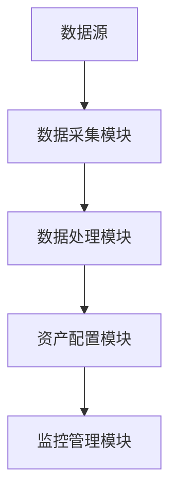
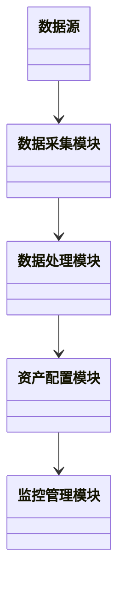

                 


# 《威廉·伯恩斯坦的跨资产价值投资：多元化的重要性》

## 关键词：威廉·伯恩斯坦，跨资产价值投资，多元化，投资策略，风险管理

## 摘要：本文深入探讨了威廉·伯恩斯坦的跨资产价值投资理论，重点分析了多元化配置的重要性。通过详细阐述其投资哲学、资产配置模型以及风险管理策略，结合实际案例和系统设计，为投资者提供科学的投资指导。

---

# 第1章：跨资产价值投资的背景与基础

## 1.1 投资的基本概念

### 1.1.1 投资的定义与分类
投资是指将资金投入到特定资产中，以期获得收益的行为。根据资产类型，投资可分为股票、债券、房地产、商品等类别。

### 1.1.2 跨资产投资的定义与特点
跨资产投资是指将资金分散投资于不同资产类别，以降低风险并提高收益。其特点包括分散性、多样性和互补性。

### 1.1.3 跨资产投资的背景与现状
随着全球市场的波动性增加，跨资产投资逐渐成为主流策略，投资者通过多元化配置来应对市场不确定性。

## 1.2 价值投资的理论基础

### 1.2.1 价值投资的核心理念
价值投资强调以低于市场价值的价格买入优质资产，长期持有以实现收益。

### 1.2.2 費林法则与价值投资的联系
费林法则指出，价格波动是机会，而非风险。伯恩斯坦将此应用于跨资产投资，寻找各资产类别的低估机会。

### 1.2.3 价值投资在跨资产中的应用
伯恩斯坦建议投资者在不同资产类别中寻找低估资产，构建多元化投资组合。

## 1.3 多元化投资的重要性

### 1.3.1 多元化投资的基本原理
通过投资不同资产，降低特定资产的风险，提高整体组合的稳定性。

### 1.3.2 跨资产多元化的优势与劣势
优势包括风险分散、收益互补，劣势在于复杂性和交易成本增加。

### 1.3.3 多元化与风险控制的关系
合理配置资产可以有效降低系统性风险，但无法完全消除非系统性风险。

---

# 第2章：威廉·伯恩斯坦的价值投资理论

## 2.1 伯恩斯坦的投資哲学

### 2.1.1 伯恩斯坦的投資理念
伯恩斯坦主张长期持有，注重资产配置，避免频繁交易。

### 2.1.2 伯恩斯坦对市場的有效性看法
他认为市场无效，存在套利机会，跨资产配置可利用这种无效性获利。

### 2.1.3 伯恩斯坦的投資策略
强调分散投资，平衡股票、债券、房地产等多种资产，降低风险。

## 2.2 伯恩斯坦的跨资产配置模型

### 2.2.1 跨资产配置的基本框架
模型基于现代投资组合理论，结合资产的风险收益比，优化配置。

### 2.2.2 不同资产类别在配置中的作用
股票提供增长，债券提供稳定收益，房地产平衡风险。

### 2.2.3 伯恩斯坦模型的优缺点
优点是风险分散，缺点是需要定期调整配置。

## 2.3 伯恩斯坦对风险的理解与管理

### 2.3.1 风险的定义与分类
风险指资产收益的不确定性，分为系统性风险和非系统性风险。

### 2.3.2 跨资产配置中的风险分散
通过投资不同资产，降低特定风险。

### 2.3.3 伯恩斯坦的风险管理策略
定期审视资产配置，根据市场变化进行调整。

---

# 第3章：跨资产价值投资的核心概念与联系

## 3.1 核心概念原理

### 3.1.1 跨资产价值投资的原理
通过分析各资产类别的内在价值，分散投资以优化风险收益比。

### 3.1.2 資產類別的特性与相互作用
不同资产在不同市场周期中的表现不同，合理配置可平衡风险。

### 3.1.3 跨资产配置的数学模型
使用现代投资组合理论，优化资产权重，最大化收益。

## 3.2 核心概念属性特征对比表

| 资产类别 | 风险 | 收益 | 相关性 |
|----------|------|------|--------|
| 股票     | 高   | 高   | 中     |
| 债券     | 中   | 中   | 负     |
| 房地产   | 中   | 高   | 中     |

## 3.3 ER实体关系图架构

```mermaid
erd
    资产
    系统
    用户
    资产-系统: 配置
    用户-系统: 操作
    资产-用户: 投资
```

---

# 第4章：跨资产价值投资的算法原理

## 4.1 算法原理概述

### 4.1.1 跨资产配置的基本算法
基于现代投资组合理论，优化资产权重，实现收益最大化。

### 4.1.2 现代投资组合理論（MPT）的應用
MPT通过均值-方差优化，确定最优资产配置。

### 4.1.3 伯恩斯坦模型的算法框架
结合MPT和价值投资，优化配置，分散风险。

## 4.2 算法实现

```python
import numpy as np
import pandas as pd

# 假设数据为各资产的预期收益和协方差矩阵
def portfolio_optimization(expected_returns, covariance_matrix):
    n = len(expected_returns)
    # 确定优化目标：最大收益
    objective = {'type': 'max', 'expression': 'sum(expected_returns * weights)'}
    # 约束条件：权重和为1
    constraints = [{'type': 'eq', 'expression': 'sum(weights) - 1'}]
    # 使用scipy优化
    from scipy.optimize import minimize
    def objective_func(weights):
        return -sum(expected_returns * weights)
    result = minimize(objective_func, np.ones(n)/n, method='SLSQP', constraints=constraints)
    return result.x
```

---

# 第5章：系统分析与架构设计

## 5.1 投资管理系统介绍

### 5.1.1 系統功能模块
- 数据采集：获取各资产数据
- 风险评估：分析资产风险
- 资产配置：优化配置方案
- 监控管理：实时跟踪

### 5.1.2 系统架构图


## 5.2 系统架构设计

### 5.2.1 系統功能设计
- 数据处理模块：清洗和转换数据
- 资产配置模块：应用算法优化配置

### 5.2.2 系统架构图


---

# 第6章：项目实战

## 6.1 环境安装

### 6.1.1 安装Python和相关库
安装Python 3.8以上版本，安装pandas、numpy、scipy等库。

## 6.2 核心实现

```python
# 数据获取与处理
import pandas as pd
import numpy as np
from scipy.optimize import minimize

# 示例数据
assets = ['股票', '债券', '房地产']
expected_returns = [0.1, 0.05, 0.15]
covariance_matrix = np.array([
    [0.16, 0.05, 0.08],
    [0.05, 0.25, 0.03],
    [0.08, 0.03, 0.16]
])

# 调用优化函数
weights = portfolio_optimization(expected_returns, covariance_matrix)
print("最优权重：", weights)
```

## 6.3 案例分析

### 6.3.1 环境搭建与数据获取
使用Python获取股票、债券等数据，清洗后处理。

### 6.3.2 代码实现
应用优化算法，计算各资产的最优权重。

### 6.3.3 分析与解读
根据结果调整配置，分散风险，优化收益。

---

# 第7章：总结与展望

## 7.1 最佳实践与小结

### 7.1.1 最佳实践
定期审视配置，根据市场变化调整。

### 7.1.2 小结
伯恩斯坦的跨资产价值投资强调多元化配置，合理分散风险，实现长期收益。

## 7.2 注意事项

### 7.2.1 风险提示
跨资产投资需谨慎，市场波动可能导致损失。

### 7.2.2 操作建议
根据自身风险承受能力调整配置，避免过度集中。

## 7.3 拓展阅读

### 7.3.1 推荐书籍
《The Intelligent Investor》

### 7.3.2 相关文章
《现代投资组合理论与实践》

---

# 作者：AI天才研究院 & 禅与计算机程序设计艺术

