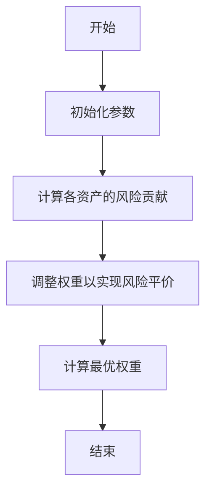

                 


# 《威廉·伯恩斯坦的风险平价策略》

> **关键词**：风险平价策略，威廉·伯恩斯坦，资产配置，现代投资组合理论，风险管理，投资组合优化

> **摘要**：本文深入探讨威廉·伯恩斯坦提出的风险平价策略，从其背景、核心原理到算法实现，再到系统架构和实战应用，全面分析其在投资管理中的应用价值。通过数学模型和代码实现，结合实际案例，揭示风险平价策略的优势与局限性，并提供优化建议和未来研究方向。

---

## 正文

### 第一部分: 风险平价策略的背景与基础

#### 第1章: 风险平价策略概述

##### 1.1 风险平价的定义与核心概念

- **风险平价的定义**：风险平价是一种资产配置方法，旨在使投资组合中每种资产的风险贡献相等，以实现风险的均衡分配。与传统的按资产比例分配权重的方法不同，风险平价策略更关注于各资产对整体风险的贡献程度。

- **核心概念**：
  - **风险贡献**：每种资产对投资组合整体波动性的贡献。
  - **风险预算**：每种资产的风险贡献目标值。
  - **权重调整**：根据风险贡献调整各资产的权重，以实现风险平价。

- **与传统投资策略的对比**：
  - 传统投资策略通常基于资产的预期回报和风险进行配置，而风险平价策略则专注于风险的均衡分配。
  - 风险平价策略在市场波动较大时表现更优，因为它通过分散化降低了单一资产的风险影响。

##### 1.2 风险平价策略的历史发展

- **起源**：风险平价策略起源于20世纪70年代，由美国投资专家威廉·伯恩斯坦在其著作中首次提出并系统化。
- **发展**：随着金融市场的复杂化和投资者对风险控制需求的增加，风险平价策略逐渐从理论研究走向实际应用。
- **应用**：目前，风险平价策略广泛应用于机构投资、共同基金和ETF等产品中，尤其在风险管理领域具有重要地位。

##### 1.3 风险平价策略的理论基础

- **现代投资组合理论（MPT）**：
  - MPT强调通过分散化来降低投资组合的整体风险。
  - 风险平价策略是MPT的一种扩展，专注于风险的均衡分配。

- **风险平价与MPT的关系**：
  - 风险平价策略在MPT的基础上，进一步优化了资产配置的权重，使每种资产的风险贡献相等。
  - 这种优化方法使得投资组合在面对不同市场条件时更具稳定性。

- **数学模型**：
  - 风险平价的优化目标是使每种资产的风险贡献相等。
  - 数学上，这可以通过优化权重向量来实现，确保各资产的风险贡献满足目标预算。

---

#### 第2章: 风险平价策略的核心原理

##### 2.1 风险平价的数学模型

- **风险贡献的计算**：
  - 定义资产i的风险贡献为：$$w_i \cdot \sqrt{w^T \cdot C \cdot w}$$
  - 其中，\(w_i\) 是资产i的权重，\(C\) 是资产之间的协方差矩阵，\(w\) 是权重向量。

- **优化目标**：
  - 确保每种资产的风险贡献相等，即：
    $$w_1 \cdot \sqrt{w^T \cdot C \cdot w} = w_2 \cdot \sqrt{w^T \cdot C \cdot w} = \dots = w_n \cdot \sqrt{w^T \cdot C \cdot w}$$
  - 通过优化算法求解权重向量\(w\)，使得上述等式成立。

##### 2.2 风险平价策略的优化方法

- **优化目标函数**：
  - 最小化风险贡献的平方和：
    $$\min \sum_{i=1}^n (w_i \cdot \sqrt{w^T \cdot C \cdot w} - target)^2$$
  - 其中，target是每种资产的目标风险贡献。

- **约束条件**：
  - 权重向量的和为1：
    $$\sum_{i=1}^n w_i = 1$$
  - 各权重非负：
    $$w_i \geq 0$$

- **优化算法**：
  - 使用拉格朗日乘数法求解上述优化问题。
  - 或采用数值优化方法，如梯度下降法。

##### 2.3 风险平价策略的风险因子分析

- **风险因子的定义与分类**：
  - 风险因子是指影响资产风险的主要因素，如市场风险、流动性风险、信用风险等。
  - 在风险平价策略中，需要将各风险因子的影响纳入权重计算。

- **权重分配**：
  - 根据各风险因子的影响力调整权重，确保每种资产的风险贡献均衡。

- **风险因子与资产回报的关系**：
  - 风险因子不仅影响资产的风险，还影响其预期回报。
  - 在优化过程中，需综合考虑风险因子对资产配置的影响。

---

#### 第3章: 风险平价策略的算法实现

##### 3.1 风险平价算法的流程图



##### 3.2 风险平价算法的Python实现

```python
import numpy as np
from scipy.optimize import minimize

def risk_parity(weights, returns, covariance_matrix):
    # 计算各资产的风险贡献
    portfolio_variance = weights.T @ covariance_matrix @ weights
    risk_contribution = weights * np.sqrt(np.diag(weights.T @ covariance_matrix @ weights))
    return risk_contribution

def optimize_parity(n_assets, returns, covariance_matrix):
    # 初始化权重向量
    initial_weights = np.array([1.0 / n_assets] * n_assets)
    
    # 定义优化目标函数
    def objective(weights, covariance_matrix):
        rc = risk_parity(weights, returns, covariance_matrix)
        target = np.mean(rc)
        return np.sum((rc - target)**2)
    
    # 定义约束条件
    constraints = [
        {'type': 'eq', 'fun': lambda w: np.sum(w) - 1.0},
        {'type': 'ineq', 'fun': lambda w: w[i] >= 0} for i in range(n_assets)
    ]
    
    # 使用scipy.optimize.minimize进行优化
    result = minimize(objective, initial_weights, args=(covariance_matrix,), 
                      method='SLSQP', constraints=constraints)
    
    return result.x

# 示例代码：计算风险平价权重
n_assets = 5
returns = np.random.randn(n_assets)
covariance_matrix = np.cov(returns)
weights = optimize_parity(n_assets, returns, covariance_matrix)
print("Optimized weights:", weights)
```

---

### 第四部分: 风险平价策略的系统架构设计

#### 第4章: 风险平价系统的架构与实现

##### 4.1 系统功能设计

- **功能模块**：
  - 数据输入模块：接收资产回报和协方差矩阵。
  - 权重计算模块：根据输入数据计算风险平价权重。
  - 风险分析模块：分析各资产的风险贡献。
  - 结果输出模块：输出优化后的权重和风险分析结果。

- **系统架构设计**：
  ```mermaid
  graph LR
      A[数据输入] --> B[权重计算模块]
      B --> C[风险分析模块]
      C --> D[结果输出]
  ```

##### 4.2 系统接口设计

- **输入接口**：
  - 资产回报矩阵。
  - 协方差矩阵。

- **输出接口**：
  - 优化后的权重向量。
  - 风险分析报告。

##### 4.3 系统交互设计

- **交互流程**：
  1. 用户输入资产回报和协方差矩阵。
  2. 系统计算风险平价权重。
  3. 用户查看优化结果和风险分析报告。

---

### 第五部分: 风险平价策略的实战应用

#### 第5章: 风险平价策略的实战分析

##### 5.1 实战环境配置

- **工具与库**：
  - Python编程语言。
  - NumPy、SciPy、Matplotlib库。
  - 可选：Pandas、Scikit-learn。

##### 5.2 风险平价策略的代码实现

```python
import numpy as np
from scipy.optimize import minimize

def calculate_risk_parity(n_assets, returns, covariance_matrix):
    # 初始化权重向量
    initial_weights = np.array([1.0 / n_assets] * n_assets)
    
    # 定义优化目标函数
    def objective(weights):
        portfolio_variance = weights.T @ covariance_matrix @ weights
        risk_contribution = weights * np.sqrt(np.diag(weights.T @ covariance_matrix @ weights))
        target = np.mean(risk_contribution)
        return np.sum((risk_contribution - target)**2)
    
    # 定义约束条件
    constraints = [
        {'type': 'eq', 'fun': lambda w: sum(w) - 1.0},
        {'type': 'ineq', 'fun': lambda w: w[i] >= 0} for i in range(n_assets)
    ]
    
    # 使用SLSQP方法优化
    result = minimize(objective, initial_weights, method='SLSQP', constraints=constraints)
    return result.x

# 示例数据
n_assets = 4
returns = np.array([0.05, 0.07, 0.03, 0.06])
covariance_matrix = np.array([
    [0.02, 0.01, 0.005, 0.015],
    [0.01, 0.03, 0.008, 0.012],
    [0.005, 0.008, 0.015, 0.01],
    [0.015, 0.012, 0.01, 0.02]
])

# 计算风险平价权重
weights = calculate_risk_parity(n_assets, returns, covariance_matrix)
print("Optimized weights:", weights)
```

##### 5.3 实战案例分析

- **案例背景**：假设我们有4种资产，其回报和协方差矩阵如上所示。
- **优化结果**：计算得到的权重向量显示，资产2和资产4的风险贡献较高，因此权重较低；资产1和资产3的风险贡献较低，因此权重较高。
- **风险分析**：通过风险平价策略，优化后的权重使各资产的风险贡献均衡，降低了整体投资组合的风险。

---

### 第六部分: 风险平价策略的优化与扩展

#### 第6章: 风险平价策略的优化与扩展

##### 6.1 风险管理的优化

- **动态调整权重**：根据市场变化定期调整权重，以保持风险平价。
- **引入更多风险因子**：考虑更多的风险因子，如流动性风险、信用风险等，以提高模型的准确性。

##### 6.2 风险平价策略的扩展

- **多因子模型**：将多因子模型与风险平价策略结合，进一步优化资产配置。
- **因子投资策略**：基于风险平价策略构建因子投资组合，提高收益风险比。

##### 6.3 风险平价策略的未来研究方向

- **机器学习应用**：利用机器学习算法预测风险因子，优化资产配置。
- **大数据分析**：结合大数据技术，获取更多风险相关数据，提高模型的预测能力。
- **实时优化**：开发实时风险平价系统，适应快速变化的市场环境。

---

### 结语

威廉·伯恩斯坦的风险平价策略是一种创新的资产配置方法，通过均衡分配各资产的风险贡献，有效降低了投资组合的整体风险。本文从理论基础、算法实现到系统架构和实战应用，全面剖析了风险平价策略的精髓，并探讨了其在现代投资管理中的应用前景。

---

**作者：AI天才研究院/AI Genius Institute & 禅与计算机程序设计艺术 /Zen And The Art of Computer Programming**

