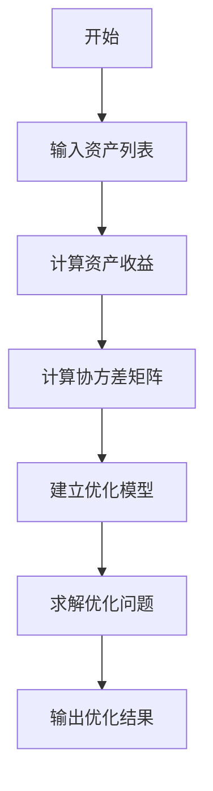
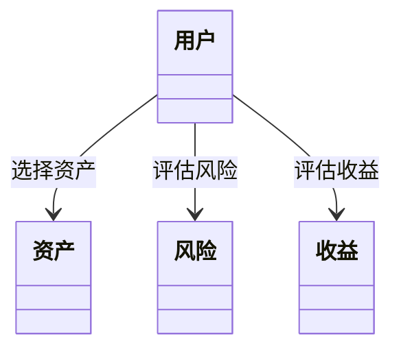
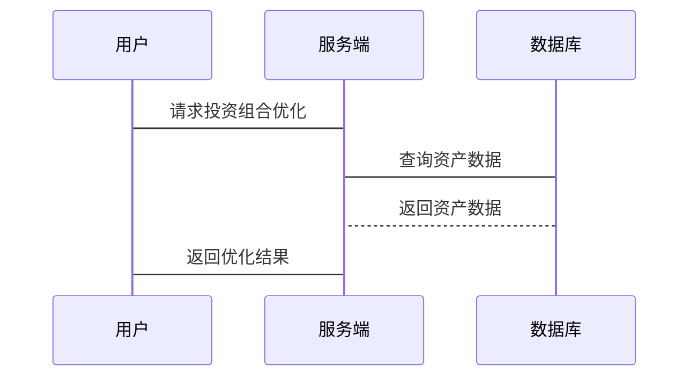

                 


# 威廉·夏普的价值投资组合理论：科学配置资产

**关键词：** 投资组合理论，威廉·夏普，CAPM，夏普比率，资产配置，投资组合优化

**摘要：** 本文深入探讨了威廉·夏普的价值投资组合理论，重点分析了其背后的科学原理和实际应用。通过详细阐述资本资产定价模型（CAPM）和投资组合优化算法，结合实际案例，展示了如何科学配置资产以实现最优收益。

---

## 第1章 价值投资组合理论的背景介绍

### 1.1 价值投资的基本概念

#### 1.1.1 投资的基本概念
投资是指将资金分配到不同的资产类别中，以实现财富增值的过程。资产可以是股票、债券、房地产、黄金等。投资的核心在于通过科学的配置和管理，最大化收益并最小化风险。

#### 1.1.2 价值投资的定义与特点
价值投资是一种投资策略，强调以低于市场价值的价格购买优质资产。其特点包括：
- 长期视角：关注企业的内在价值，而非短期市场波动。
- 选股标准：寻找低估的股票，具有安全边际。
- 风险控制：注重企业的财务健康和管理层质量。

#### 1.1.3 价值投资的核心要素
- 资产质量：企业具有持续盈利能力和竞争优势。
- 估值：市场价格低于内在价值。
- 安全边际：买入价格与内在价值的差距提供保护。

### 1.2 投资组合理论的起源与发展

#### 1.2.1 投资组合理论的起源
投资组合理论起源于20世纪50年代，由哈里·马科维茨首次提出现代投资组合理论（MPT）。该理论认为，通过合理配置资产可以有效降低风险。

#### 1.2.2 价值投资组合理论的发展历程
- 20世纪60年代：威廉·夏普提出了资本资产定价模型（CAPM），为投资组合理论提供了数学基础。
- 20世纪70年代至今：投资组合理论不断发展，结合实际市场情况，形成了多种优化模型和策略。

#### 1.2.3 威廉·夏普的贡献
威廉·夏普因其在CAPM模型上的贡献，获得了1990年诺贝尔经济学奖。CAPM模型为资产定价和投资组合优化提供了科学依据。

### 1.3 价值投资组合理论的科学性

#### 1.3.1 投资组合理论的科学基础
- 现代投资组合理论（MPT）：通过优化资产配置降低风险。
- 资本资产定价模型（CAPM）：量化资产的预期收益与风险。

#### 1.3.2 价值投资与现代金融理论的结合
价值投资强调基本面分析，而现代金融理论提供数学模型支持。两者的结合使投资决策更加科学和系统。

#### 1.3.3 投资组合理论的实际应用
投资组合理论广泛应用于机构投资和个人理财，帮助投资者制定科学的资产配置策略。

---

## 第2章 投资组合理论的核心概念与联系

### 2.1 投资组合理论的核心原理

#### 2.1.1 投资组合的定义与构成
投资组合是指投资者持有的多种资产的集合。构成投资组合的资产应具有不同的风险和收益特征，以分散风险。

#### 2.1.2 风险与收益的关系
- 风险是收益的函数：高风险可能带来高收益，但也可能带来重大损失。
- 风险调整后的收益：考虑风险后的实际收益，是投资决策的关键因素。

#### 2.1.3 投资组合的有效前沿
有效前沿是指在给定风险下，能够提供最高收益的所有投资组合的集合。它是投资组合优化的重要概念。

### 2.2 核心概念之间的联系

#### 2.2.1 资产配置与投资组合的关系
资产配置是投资组合的核心，决定组合的风险和收益。通过合理配置资产，可以实现收益最大化和风险最小化。

#### 2.2.2 风险调整后的收益
夏普比率衡量了投资组合的超额收益与承担的风险之比。公式为：
$$ \text{夏普比率} = \frac{E(r_p) - r_f}{\sigma_p} $$
其中，$E(r_p)$ 是投资组合的预期收益，$r_f$ 是无风险利率，$\sigma_p$ 是投资组合的波动率。

#### 2.2.3 投资组合的分散化效应
分散化是指通过持有不同类型的资产来降低风险。当资产之间相关性较低时，分散化效果更好。

### 2.3 夏普比率的计算与应用

#### 2.3.1 夏普比率的定义
夏普比率衡量了投资组合在承担额外风险时的超额收益。

#### 2.3.2 夏普比率的计算公式
$$ \text{夏普比率} = \frac{E(r_p) - r_f}{\sigma_p} $$

#### 2.3.3 夏普比率的实际应用
- 评估投资组合的绩效。
- 比较不同投资组合的风险调整后收益。

---

## 第3章 投资组合理论的数学模型与算法原理

### 3.1 资本资产定价模型（CAPM）的数学推导

#### 3.1.1 CAPM的基本假设
- 市场是有效的，价格反映所有相关信息。
- 投资者可以无限制地以无风险利率借入或贷出资金。
- 资产按风险调整收益。

#### 3.1.2 CAPM的数学公式
$$ E(r_i) = r_f + \beta_i (E(r_m) - r_f) $$
其中，$E(r_i)$ 是资产i的预期收益，$r_f$ 是无风险利率，$\beta_i$ 是资产i的贝塔系数，$E(r_m)$ 是市场组合的预期收益。

#### 3.1.3 CAPM的应用实例
假设市场预期收益为10%，无风险利率为2%。一只股票的贝塔系数为1.5，其预期收益为：
$$ E(r_i) = 2\% + 1.5 \times (10\% - 2\%) = 14\% $$

### 3.2 投资组合优化的算法原理

#### 3.2.1 均值-方差优化的原理
目标是最小化投资组合的风险（方差）或最大化收益（均值）。

#### 3.2.2 现实中的优化算法
- 使用拉格朗日乘数法求解优化问题。
- 考虑交易成本和税收等现实因素。

#### 3.2.3 算法的优缺点分析
优点：科学合理，数学基础扎实。缺点：假设市场有效，实际可能不符。

### 3.3 投资组合优化的mermaid流程图



---

## 第4章 投资组合管理系统的设计与实现

### 4.1 系统功能设计

#### 4.1.1 领域模型mermaid类图


#### 4.1.2 系统架构设计


#### 4.1.3 系统交互序列图


### 4.2 项目实战

#### 4.2.1 环境安装
- Python 3.8+
- Pandas, NumPy, Scipy

#### 4.2.2 核心实现源代码

```python
import numpy as np
import pandas as pd

def portfolio_optimization(returns, risk_free_rate):
    n = len(returns.columns)
    cov_matrix = returns.cov()
    mu = returns.mean().values
    ones = np.ones(n).reshape(-1, 1)
    inv_cov = np.linalg.inv(cov_matrix)
    w = inv_cov @ ones / (ones.T @ inv_cov @ ones)
    return w.round(4)

# 示例数据
data = {'资产1': [0.1, 0.05, 0.08, 0.02],
         '资产2': [0.08, 0.1, 0.05, 0.07],
         '资产3': [0.06, 0.04, 0.09, 0.05]}
returns = pd.DataFrame(data)
risk_free_rate = 0.02

weights = portfolio_optimization(returns, risk_free_rate)
print("最优权重:", weights)
```

#### 4.2.3 数据处理与分析
- 数据清洗：处理缺失值和异常值。
- 计算收益和风险：使用Pandas和NumPy进行数据分析。

#### 4.2.4 实际案例分析
- 数据来源：历史股票数据。
- 优化结果：输出各资产的最优权重。

### 4.3 最佳实践 tips

#### 4.3.1 风险管理
- 定期评估投资组合的风险。
- 重新平衡资产配置。

#### 4.3.2 定期调整
- 根据市场变化和个人财务状况调整投资组合。

#### 4.3.3 持续学习
- 关注市场动态和新的投资理论。

---

## 第5章 总结与展望

### 5.1 总结
威廉·夏普的价值投资组合理论为科学配置资产提供了理论基础和实践指导。通过数学模型和算法，投资者可以更科学地进行资产配置，实现最优收益。

### 5.2 展望
未来，投资组合理论将与人工智能和大数据技术结合，提供更精准的投资决策支持。

---

**作者：AI天才研究院 & 禅与计算机程序设计艺术**

