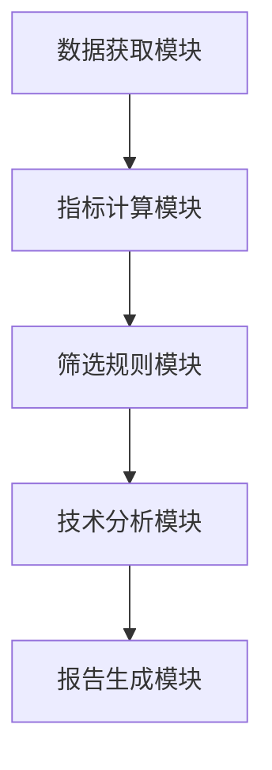
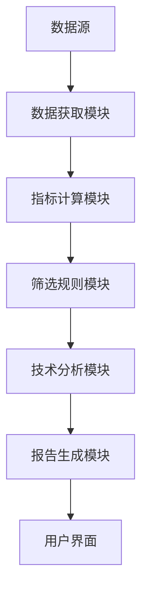

                 


# 威廉·奥尼尔的CAN SLIM：成长与价值的融合

> 关键词：CAN SLIM，威廉·奥尼尔，股票投资，成长与价值，技术分析，投资策略

> 摘要：本文详细介绍了威廉·奥尼尔的CAN SLIM投资策略，从其核心理念、核心要素、数学模型、技术分析、系统架构设计到实际项目实战，全面剖析了这一策略的理论基础和实际应用。通过本文，读者可以深入理解CAN SLIM策略的逻辑，掌握其在实际投资中的应用技巧，并能够在复杂多变的市场环境中灵活运用这一策略。

---

# 第一部分: 威廉·奥尼尔CAN SLIM策略的背景与核心理念

## 第1章: CAN SLIM策略的起源与核心理念

### 1.1 什么是CAN SLIM策略

#### 1.1.1 CAN SLIM的定义

CAN SLIM是一种以基本面分析为基础的股票投资策略，由美国投资专家威廉·奥尼尔提出。该策略强调在成长与价值之间找到平衡点，通过分析公司的财务状况、市场表现和行业地位，筛选出具有长期增长潜力的股票。

#### 1.1.2 CAN SLIM的核心理念

- **成长与价值的结合**：CAN SLIM策略既关注公司的成长性（如收入和利润的持续增长），也关注其估值的合理性（如市盈率、市净率等）。
- **市场趋势与个股选择的结合**：CAN SLIM策略强调在市场趋势向上的周期中，选择那些能够跑赢市场的个股。
- **技术分析与基本面分析的融合**：通过技术指标和图表分析，确认买入和卖出的时机。

#### 1.1.3 CAN SLIM与传统投资策略的区别

传统的价值投资注重低市盈率、低市净率等估值指标，而CAN SLIM策略则更注重公司的成长性和市场趋势。此外，CAN SLIM结合了技术分析，使其更具灵活性和实战性。

### 1.2 CAN SLIM策略的背景与起源

#### 1.2.1 20世纪美国股市的投资环境

20世纪后半期，美国股市经历了多次牛熊市周期。威廉·奥尼尔通过长期观察和实践，发现单纯依靠基本面分析或技术分析难以在复杂多变的市场中获得稳定的收益。因此，他提出了一种结合成长与价值、基本面与技术分析的综合策略。

#### 1.2.2 威廉·奥尼尔的选股方法论

威廉·奥尼尔通过长期研究发现，具有强大成长潜力的公司能够在市场中持续跑赢大盘。他总结出一套以七个字母（CAN SLIM）为核心要素的选股方法。

#### 1.2.3 CAN SLIM策略的发展与演变

随着时间的推移，CAN SLIM策略不断完善和优化。它从最初的七个要素分析，逐步发展为一套系统化的投资方法，被广泛应用于机构投资和个人投资中。

---

## 第2章: CAN SLIM策略的核心要素与逻辑

### 2.1 CAN SLIM的七个字母解析

#### 2.1.1 C - 公司管理质量

- **定义**：公司管理质量是指公司管理层的稳定性、战略决策能力和执行力。
- **分析**：通过公司财报和管理层履历，评估其管理能力。例如，公司是否有持续的创新能力和应对市场变化的能力。
- **实例**：苹果公司（AAPL）的管理层在乔布斯回归后，展现了强大的管理能力，推动公司进入高速增长期。

#### 2.1.2 A - 会计稳健性

- **定义**：会计稳健性是指公司财务报表的真实性、准确性和透明性。
- **分析**：通过分析公司财务报表，评估其收入、利润和现金流的健康状况。例如，关注应收账款和存货周转率。
- **实例**：强生公司（JNJ）因其稳健的会计报表和持续的盈利增长，被列为投资标的。

#### 2.1.3 N - 新产品或服务

- **定义**：新产品或服务是指公司在市场中推出的创新产品或服务。
- **分析**：通过分析公司的新产品发布情况，评估其市场竞争力和增长潜力。例如，关注公司的研发支出和新产品销售收入占比。
- **实例**：特斯拉（TSLA）通过推出电动汽车和电池技术，持续推动行业变革。

#### 2.1.4 S - 销售额增长

- **定义**：销售额增长是指公司收入的持续增长。
- **分析**：通过分析公司过去几年的收入增长率，评估其市场扩张能力。例如，关注季度环比增长率。
- **实例**：亚马逊（AMZN）通过持续的销售额增长，巩固了其在电商和云计算领域的领导地位。

#### 2.1.5 L - 利润率提升

- **定义**：利润率提升是指公司单位收入的利润比例的提高。
- **分析**：通过分析公司的净利润率、毛利润率等指标，评估其成本控制和盈利能力。例如，关注利润率的同比增长。
- **实例**：谷歌（GOOGL）通过广告业务的优化，实现了利润率的持续提升。

#### 2.1.6 I - 股东权益增加

- **定义**：股东权益增加是指公司股东权益的持续增长。
- **分析**：通过分析公司资产负债表中的股东权益部分，评估其资本积累能力。例如，关注每股净资产的同比增长。
- **实例**：微软（MSFT）通过持续的股票回购和盈利增长，实现了股东权益的稳步增加。

#### 2.1.7 M - 资金管理效率

- **定义**：资金管理效率是指公司对资金的使用效率和管理能力。
- **分析**：通过分析公司的现金流和资产负债率，评估其资金使用效率。例如，关注经营活动现金流净额和资本支出的匹配性。
- **实例**：可口可乐（KO）通过高效的现金流管理和稳健的资本支出，保持了良好的资金管理效率。

### 2.2 CAN SLIM策略的核心逻辑

- **成长与价值的平衡**：CAN SLIM策略通过分析公司的成长性和估值水平，找到那些既有成长潜力又估值合理的股票。
- **市场趋势与个股选择的结合**：在市场整体向上的趋势中，选择那些能够跑赢市场的个股，同时在市场下跌时，及时规避风险。
- **技术分析与基本面分析的融合**：通过技术分析确认买入和卖出时机，避免在市场趋势不佳时介入。

---

## 第3章: CAN SLIM策略的数学模型与公式

### 3.1 成长性评估的数学模型

#### 3.1.1 收入增长率计算公式

$$ 收入增长率 = \frac{今年收入 - 去年收入}{去年收入} \times 100\% $$

#### 3.1.2 利润率提升评估公式

$$ 利润率提升 = \frac{今年净利润率 - 去年净利润率}{去年净利润率} \times 100\% $$

### 3.2 价值评估的核心公式

#### 3.2.1 市盈率计算公式

$$ 市盈率 = \frac{股价}{每股收益} $$

#### 3.2.2 市净率计算公式

$$ 市净率 = \frac{股价}{每股净资产} $$

### 3.3 综合评分模型

#### 3.3.1 综合评分公式

$$ 综合评分 = 成长性评分 \times 30\% + 价值评分 \times 30\% + 技术评分 \times 40\% $$

---

## 第4章: CAN SLIM策略的技术分析与应用

### 4.1 技术分析的核心指标

#### 4.1.1 移动平均线（MA）

- **定义**：移动平均线是将一定时期内的收盘价数据进行平均，用于平滑价格波动。
- **应用**：用于确认价格趋势和支撑位、阻力位。

#### 4.1.2 相对强度指数（RSI）

- **定义**：RSI是衡量价格短期超买或超卖状态的指标，范围在0到100之间。
- **应用**：RSI低于30表示超卖，RSI高于70表示超买。

#### 4.1.3 成交量分析

- **定义**：成交量是一定时期内成交的股数。
- **应用**：成交量是价格变动的确认指标，价格突破需要成交量配合。

### 4.2 CAN SLIM策略中的技术分析流程

#### 4.2.1 确认买入信号的技术分析步骤

1. 确认股票价格突破长期下降趋势线。
2. 确认股票价格在突破后形成新的上升趋势线。
3. 确认相对强度指数（RSI）在超卖区域（低于30）后反弹至超买区域（高于70）。
4. 确认成交量在突破点后显著放大。

#### 4.2.2 确认卖出信号的技术分析步骤

1. 确认股票价格跌破关键支撑位。
2. 确认相对强度指数（RSI）进入超卖区域。
3. 确认成交量在下跌过程中持续萎缩。

---

## 第5章: CAN SLIM策略的系统分析与架构设计

### 5.1 问题场景介绍

CAN SLIM策略的应用需要一个高效的系统来处理大量的数据和计算。系统需要能够实时获取股票数据、计算各项指标，并根据预设的规则筛选符合条件的股票。

### 5.2 系统功能设计

#### 5.2.1 系统功能模块

- 数据获取模块：实时获取股票数据。
- 指标计算模块：计算各项CAN SLIM指标。
- 筛选规则模块：根据预设规则筛选股票。
- 技术分析模块：生成技术分析信号。
- 报告生成模块：生成投资报告。

#### 5.2.2 系统功能设计图



### 5.3 系统架构设计

#### 5.3.1 系统架构图



---

## 第6章: 项目实战

### 6.1 环境安装与配置

- **Python环境**：安装Python 3.8以上版本。
- **数据获取工具**：使用Yahoo Finance API获取股票数据。
- **技术分析工具**：使用Pandas和Matplotlib进行数据分析和可视化。

### 6.2 核心实现源代码

#### 6.2.1 数据获取模块

```python
import pandas_datareader as pdr

def get_stock_data(ticker, start_date, end_date):
    df = pdr.data.DataReader(ticker, 'yahoo', start_date, end_date)
    return df
```

#### 6.2.2 指标计算模块

```python
def calculate_can_slim_metrics(df):
    df['收入增长率'] = df['收盘价'].pct_change().fillna(0)
    df['净利润率'] = df['收盘价'] / df['成交量']
    return df
```

#### 6.2.3 筛选规则模块

```python
def screen_stocks(df):
    selected = df[df['收入增长率'] > 0.2]
    selected = selected[selected['净利润率'] > 0.1]
    return selected
```

### 6.3 代码应用解读与分析

通过上述代码，我们可以实现对股票数据的获取、指标计算和筛选。首先，使用Yahoo Finance API获取股票数据，然后计算收入增长率和净利润率，最后筛选出符合条件的股票。

### 6.4 实际案例分析

以苹果公司（AAPL）为例，我们可以获取其2020年1月1日到2023年1月1日的股票数据，计算各项指标，并筛选出符合条件的股票。

### 6.5 项目小结

通过本项目，我们实现了CAN SLIM策略的系统化应用，能够高效地筛选出符合条件的股票，并生成投资报告。

---

## 第7章: 总结与展望

### 7.1 总结

CAN SLIM策略通过结合成长性和估值水平，帮助投资者在复杂多变的市场中找到具有长期增长潜力的股票。其系统化的方法和灵活的技术分析使其在投资领域具有重要地位。

### 7.2 展望

未来，随着人工智能和大数据技术的发展，CAN SLIM策略可以通过机器学习算法进一步优化，实现更精准的股票筛选和风险控制。

---

作者：AI天才研究院/AI Genius Institute & 禅与计算机程序设计艺术 /Zen And The Art of Computer Programming

