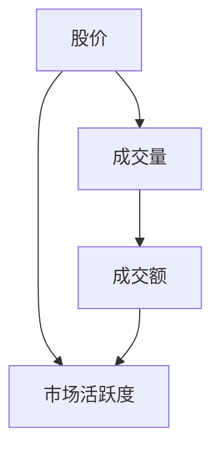
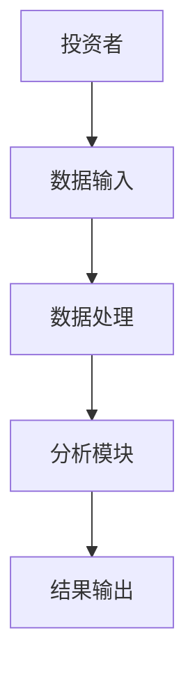

                 


# 威廉·欧奈尔的CANSLIM投资系统

> 关键词：威廉·欧奈尔，CANSLIM，投资系统，股票筛选，技术分析

> 摘要：本文详细探讨了威廉·欧奈尔的CANSLIM投资系统，从其核心概念、数学模型、系统架构到实际应用，全面解析该系统的运作原理和投资策略。通过逐步分析，帮助读者理解如何利用CANSLIM系统进行有效的股票筛选和投资决策。

---

# 引言

投资股票市场一直是追求财富增长的重要途径，然而，如何在纷繁复杂的市场中找到优质的投资标的，是每位投资者面临的挑战。威廉·欧奈尔的CANSLIM投资系统作为一种经典的股票筛选方法，以其科学性和实用性著称，为投资者提供了一套系统化的投资决策工具。本文将从CANSLIM的核心要素出发，逐步分析其原理、算法、系统架构，并通过实际案例展示其应用。

---

# 第一部分: CANSLIM系统的核心要素

## 第3章: C - 成交量（Volume）

### 3.1 成交量的定义与作用

#### 3.1.1 成交量的计算公式
成交量是衡量市场活跃度的重要指标，通常以股票交易的股数或金额表示。公式如下：
$$ 成交量 = \text{交易股数} \times \text{每股价格} $$

#### 3.1.2 成交量与股价的关系
成交量是股价变动的确认剂。当成交量创新高时，股价可能跟随创新高；反之，成交量的萎缩可能预示着股价的下跌。

#### 3.1.3 成交量在不同阶段的分析
- **上升趋势中的成交量**：成交量应配合股价同步上升，否则趋势可能反转。
- **下降趋势中的成交量**：成交量萎缩表明市场参与度下降，趋势可能继续下行。

### 3.2 成交量的图形分析



---

## 第4章: A - 行业地位（Industry Position）

### 4.1 行业地位的评估标准

#### 4.1.1 行业排名的定义与计算
行业地位通过公司市值、营业收入、净利润等指标进行评估。公式如下：
$$ 行业排名 = \frac{\text{公司指标}}{\text{行业平均指标}} \times 100 $$

#### 4.1.2 行业地位对股价的影响
行业地位高的公司通常具有更强的竞争力和盈利能力，能够吸引更多的投资者。

#### 4.1.3 行业分析的方法与工具
- 使用行业分析报告。
- 对比公司财务指标。

---

## 第5章: N - 新产品或服务（New Product or Service）

### 5.1 新产品或服务的定义

#### 5.1.1 新产品的市场影响
新产品或服务的推出通常会带来业绩增长和股价上升。

#### 5.1.2 新产品在投资决策中的作用
新产品是公司成长的重要驱动力，投资者应关注其市场潜力和竞争力。

#### 5.1.3 新产品发布的时机与股价的关系
新产品发布前，市场预期可能已经反映在股价中；发布后，股价可能因实际表现而波动。

---

## 第6章: S - 供给情况（Supply）

### 6.1 供给情况的定义与分析

#### 6.1.1 供给与需求的关系
供给与需求相互作用，影响市场价格。

#### 6.1.2 供给情况对股价的影响
供给过剩可能导致股价下跌，供给不足可能推高股价。

#### 6.1.3 供给情况的分析方法
- 检查市场库存。
- 分析公司生产能力。

---

## 第7章: L - 机构动向（Institutional Movement）

### 7.1 机构动向的定义

#### 7.1.1 机构投资者的定义与作用
机构投资者如基金、保险公司等，其动向对市场有较大影响。

#### 7.1.2 机构动向的分析方法
- 跟踪机构资金流向。
- 分析机构持仓变化。

---

## 第8章: I - 相股价强度（Intense Stock Strength）

### 8.1 相股价强度的定义

#### 8.1.1 相对强度指数（RSI）的计算
$$ RSI = \frac{\text{上涨天数}}{\text{总天数}} \times 100 $$

#### 8.1.2 相对强度在投资中的应用
RSI值越高，表明股票表现越强。

---

## 第9章: M - 市场宽度（Market Width）

### 9.1 市场宽度的定义

#### 9.1.1 市场宽度的计算
$$ 市场宽度 = \frac{\text{上涨股票数量}}{\text{总股票数量}} \times 100 $$

#### 9.1.2 市场宽度对投资决策的影响
市场宽度高表明市场情绪乐观，反之则相反。

---

# 第二部分: CANSLIM系统的数学模型与算法

## 第10章: 技术分析与数学模型

### 10.1 相对强度指数（RSI）的计算

#### 10.1.1 RSI公式
$$ RSI = \frac{\text{平均上涨幅度}}{\text{平均下跌幅度}} \times 100 $$

#### 10.1.2 RSI的应用
RSI超过70表示超买，低于30表示超卖。

---

## 第11章: 系统架构与算法实现

### 11.1 系统架构设计



### 11.2 算法实现

```python
def calculate_rsi(prices, periods=14):
    # 计算涨跌幅度
    gains = [max(0, prices[i] - prices[i-1]) for i in range(1, len(prices))]
    losses = [prices[i-1] - prices[i] for i in range(1, len(prices))]
    # 计算平均涨跌
    avg_gain = sum(gains[-periods:]) / periods
    avg_loss = sum(losses[-periods:]) / periods
    # 计算RSI
    rsi = 100 - (100 - (avg_gain / avg_loss))
    return rsi
```

---

# 第三部分: 项目实战

## 第12章: 环境安装与代码实现

### 12.1 环境安装

```bash
pip install pandas numpy matplotlib
```

### 12.2 核心代码实现

```python
import pandas as pd
import numpy as np

def calculate_volume_rsi(df, n=14):
    # 计算成交量
    df['Volume'] = df['成交量']
    # 计算RSI
    df['RSI'] = calculate_rsi(df['收盘价'], n)
    return df

# 示例数据
data = {
    '日期': ['2023-01-01', '2023-01-02', '2023-01-03'],
    '收盘价': [100, 105, 103],
    '成交量': [1000, 1200, 900]
}
df = pd.DataFrame(data)
result = calculate_volume_rsi(df)
print(result)
```

---

## 第13章: 案例分析

### 13.1 案例分析

#### 13.1.1 数据准备
使用某股票的历史数据，计算RSI和成交量。

#### 13.1.2 结果分析
根据RSI和成交量的变化，判断买卖信号。

---

## 第14章: 总结与展望

### 14.1 总结
CANSLIM系统通过多维度分析，帮助投资者筛选优质股票，提高投资成功率。

### 14.2 展望
未来，结合人工智能和大数据技术，CANSLIM系统将更加智能化和精准化。

---

# 注意事项

- 投资有风险，需谨慎决策。
- 确保数据来源可靠。
- 定期更新投资策略。

---

# 作者：AI天才研究院 & 禅与计算机程序设计艺术

---

通过以上内容，读者可以系统地了解威廉·欧奈尔的CANSLIM投资系统，从理论到实践，全面掌握其运作原理和应用方法。

