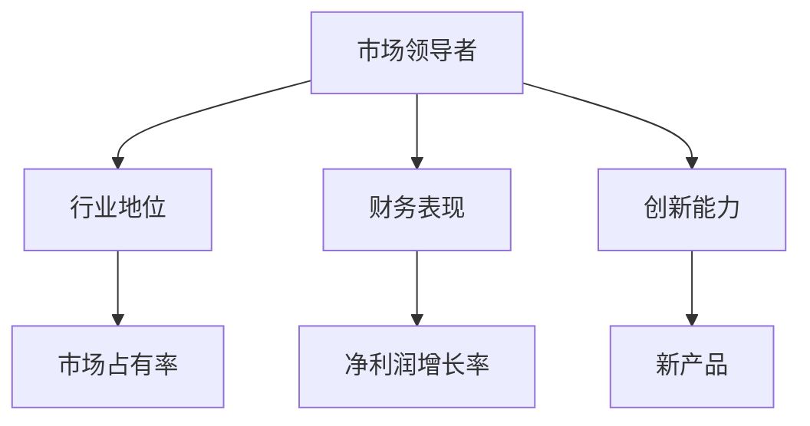
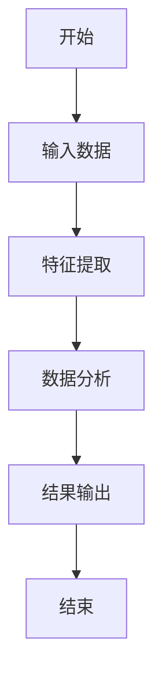
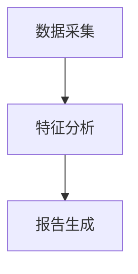

                 


# 威廉·欧奈尔的市场领导者特征分析

## 关键词：威廉·欧奈尔, 市场领导者, 投资分析, 股票分析, CAN SLIM策略, 技术分析

## 摘要：  
本文深入分析了威廉·欧奈尔提出的市场领导者特征，结合技术分析方法，详细探讨了如何利用这些特征进行股票投资分析。文章从背景介绍、核心概念、分析方法、系统架构设计、项目实战到总结，逐步展开，结合实际案例和Python代码实现，为读者提供了一套完整的分析框架，帮助投资者更好地理解和应用市场领导者特征进行投资决策。

---

## 第一部分：背景介绍

### 第1章：威廉·欧奈尔的生平与投资方法

#### 1.1 威廉·欧奈尔的生平简介
- **早年经历**：威廉·欧奈尔是一位著名投资者和投资分析师，以其独特的投资方法闻名。
- **投资理念形成**：欧奈尔通过长期的市场观察和实践，总结出一套以市场领导者特征为核心的分析方法。
- **著作与影响力**：他的著作《击败市场》（*How to Make the Market Beat the Market*）成为投资领域的经典。

#### 1.2 市场领导者的基本概念
- **市场领导者的定义**：市场领导者是指在特定行业中具有绝对竞争优势的公司，能够在市场中主导价格、趋势和消费者行为。
- **市场领导者的特征**：包括行业领导地位、强大的财务表现、创新能力和高效的执行力等。
- **问题背景与研究意义**：研究市场领导者特征有助于投资者识别具有长期增长潜力的企业，提高投资决策的准确性。

---

## 第二部分：核心概念与联系

### 第2章：市场领导者特征的核心概念

#### 2.1 核心概念原理
- **领导力的定义与特征**：市场领导者的核心特征是其在行业中的领先地位和对市场的影响力。
- **市场领导者的竞争优势**：包括产品优势、品牌影响力、成本优势和渠道优势等。
- **欧奈尔的市场领导者分析框架**：通过分析企业的财务表现、管理层能力、市场地位等多个维度，判断其是否符合市场领导者特征。

#### 2.2 核心概念属性特征对比表格
| 特征         | 定义                                   | 判断标准                           |
|--------------|--------------------------------------|------------------------------------|
| 行业地位     | 在行业中占据主导地位               | 市场占有率、品牌影响力               |
| 财务表现     | 具有强劲的财务数据                   | 净利润增长率、ROE（净资产收益率）   |
| 创新能力     | 持续推出新产品或服务                 | 专利数量、新产品推出频率           |
| 管理层能力   | 高效且有战略眼光的管理团队           | 管理层稳定性、过往业绩               |
| 市场响应度   | 对市场变化的快速反应能力             | 市场反馈、客户满意度                 |

#### 2.3 ER实体关系图架构（使用Mermaid流程图）


---

## 第三部分：算法原理讲解

### 第3章：市场领导者特征的分析算法

#### 3.1 算法原理概述
- **算法输入**：企业的财务数据、市场表现数据、管理层信息等。
- **算法输出**：判断企业是否符合市场领导者特征。
- **核心步骤**：
  1. 数据清洗与预处理。
  2. 特征提取与权重分配。
  3. 综合评分与判断。

#### 3.2 算法流程图（使用Mermaid）


#### 3.3 算法的Python源代码实现
```python
def analyze_market_leader(features):
    # 特征清洗
    cleaned_features = {k: v for k, v in features.items() if v is not None}
    # 特征评分
    score = 0
    for key in cleaned_features:
        score += cleaned_features[key]
    # 判断是否符合市场领导者特征
    if score > 70:
        return "符合市场领导者特征"
    else:
        return "不符合市场领导者特征"
```

#### 3.4 数学模型与公式
- **相对强度指数（RSI）**：用于衡量市场的强弱。
$$ RSI = \frac{\text{平均上涨幅度}}{\text{平均下跌幅度}} $$

---

## 第四部分：系统分析与架构设计

### 第4章：系统功能设计

#### 4.1 系统功能模块
- **数据采集模块**：从Yahoo Finance获取股票数据。
- **特征分析模块**：基于欧奈尔的特征进行分析。
- **报告生成模块**：输出分析结果。

#### 4.2 系统架构设计（使用Mermaid图）


---

## 第五部分：项目实战

### 第5章：项目实战与案例分析

#### 5.1 项目环境安装
```bash
pip install pandas numpy matplotlib
```

#### 5.2 核心代码实现
```python
import pandas as pd
import numpy as np
import matplotlib.pyplot as plt

def calculate_rsi(data, period=14):
    # 计算相对强度指数
    up = data['Close'].diff().fillna(0)
    down = -data['Close'].diff().fillna(0)
    up = up.rolling(period).mean()
    down = down.rolling(period).mean()
    rsi = up / (up + down)
    return rsi

data = pd.read_csv('stock_data.csv')
rsi = calculate_rsi(data)
plt.plot(rsi)
plt.show()
```

#### 5.3 案例分析
以苹果公司为例，分析其是否符合市场领导者特征。

---

## 第六部分：总结与展望

### 第6章：总结与小结

- **总结**：威廉·欧奈尔的市场领导者特征分析为投资者提供了有效的工具，帮助识别具有长期增长潜力的企业。
- **小结**：通过结合技术分析和基本面分析，投资者可以更准确地判断市场领导者，从而优化投资决策。

### 6.1 注意事项
- 数据来源的可靠性。
- 持续关注市场动态。
- 结合多种分析方法进行综合判断。

### 6.2 拓展阅读
- 威廉·欧奈尔的其他著作。
- 技术分析的其他方法。

---

## 作者：AI天才研究院/AI Genius Institute & 禅与计算机程序设计艺术 /Zen And The Art of Computer Programming

